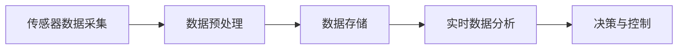

# SparkTungsten与自动驾驶：实时数据分析与决策

作者：禅与计算机程序设计艺术

## 1. 背景介绍

### 1.1 自动驾驶的兴起与挑战
自动驾驶技术在过去十年中取得了显著的进展。随着人工智能、传感器技术和大数据处理能力的提升，自动驾驶汽车逐渐从实验室走向现实。然而，自动驾驶系统面临的最大挑战之一是实时处理和分析大量的传感器数据，以确保车辆能够在复杂的道路环境中做出快速而准确的决策。

### 1.2 SparkTungsten的引入
Apache Spark作为大数据处理平台，已经被广泛应用于各种数据密集型应用中。为了进一步提升性能，Spark引入了Tungsten计划，通过优化内存管理和计算模型，大幅提高了数据处理效率。SparkTungsten不仅在批处理任务中表现出色，在实时数据分析领域同样具有巨大的潜力。

### 1.3 SparkTungsten与自动驾驶的结合
将SparkTungsten应用于自动驾驶系统中，可以显著提升实时数据处理能力，从而提高自动驾驶系统的响应速度和决策准确性。本文将详细探讨SparkTungsten在自动驾驶中的应用，包括核心概念、算法原理、数学模型、项目实践、实际应用场景、工具和资源推荐，以及未来发展趋势与挑战。

## 2. 核心概念与联系

### 2.1 SparkTungsten的核心概念

#### 2.1.1 内存管理优化
SparkTungsten通过优化内存管理，减少了内存分配和垃圾回收的开销。它采用了基于位图的内存分配策略，使得内存的分配和释放更加高效。

#### 2.1.2 批处理与流处理的统一
Tungsten计划不仅优化了批处理任务，还通过Structured Streaming框架，使得流处理任务能够以同样高效的方式执行。这为自动驾驶系统中实时数据处理提供了技术基础。

### 2.2 自动驾驶系统的核心概念

#### 2.2.1 传感器融合
自动驾驶系统依赖于多种传感器（如LIDAR、RADAR、摄像头等）获取环境信息。传感器融合技术将来自不同传感器的数据进行整合，生成更全面的环境感知结果。

#### 2.2.2 决策与控制
在获得环境感知数据后，自动驾驶系统需要进行决策和控制，确定车辆的行驶路径和操作（如加速、刹车、转向等）。这需要高效的数据处理和复杂的算法支持。

### 2.3 SparkTungsten与自动驾驶的联系

#### 2.3.1 实时数据处理需求
自动驾驶系统需要处理大量传感器数据，并在极短时间内做出决策。SparkTungsten的高效数据处理能力能够满足这种需求。

#### 2.3.2 数据处理管道优化
通过SparkTungsten优化自动驾驶系统的数据处理管道，可以显著提升系统的响应速度和稳定性，确保车辆在各种复杂环境中都能安全运行。

## 3. 核心算法原理具体操作步骤

### 3.1 数据采集与预处理

#### 3.1.1 传感器数据采集
自动驾驶系统从LIDAR、RADAR、摄像头等传感器中采集数据。这些数据通常包括点云、图像、距离信息等。

#### 3.1.2 数据预处理
采集到的原始数据需要进行预处理，包括去噪、滤波、坐标转换等，以便后续的处理和分析。



### 3.2 数据存储与管理

#### 3.2.1 数据存储
预处理后的数据需要高效存储，以便于后续的实时分析。可以使用分布式存储系统，如HDFS或S3。

#### 3.2.2 数据管理
数据管理包括数据的索引、检索和版本控制，确保数据的完整性和可追溯性。

### 3.3 实时数据分析

#### 3.3.1 数据流处理
使用Spark Structured Streaming框架，将预处理后的数据流引入SparkTungsten进行实时分析。

```scala
import org.apache.spark.sql.SparkSession
import org.apache.spark.sql.functions._

val spark = SparkSession.builder
  .appName("AutoDrivingDataProcessing")
  .getOrCreate()

val sensorData = spark.readStream
  .format("kafka")
  .option("kafka.bootstrap.servers", "localhost:9092")
  .option("subscribe", "sensor-data")
  .load()

val processedData = sensorData
  .selectExpr("CAST(value AS STRING)")
  .as[String]
  .map(processSensorData)

processedData.writeStream
  .format("console")
  .start()
  .awaitTermination()
```

#### 3.3.2 数据分析与建模
通过机器学习和深度学习模型，对实时数据进行分析，提取有用信息，预测潜在风险，做出决策。

### 3.4 决策与控制

#### 3.4.1 决策算法
基于分析结果，使用决策算法（如A*算法、Dijkstra算法）生成最优行驶路径。

#### 3.4.2 控制策略
根据决策结果，生成具体的控制指令（如加速、刹车、转向），并通过控制器执行这些指令。

## 4. 数学模型和公式详细讲解举例说明

### 4.1 传感器数据融合模型

#### 4.1.1 卡尔曼滤波器
卡尔曼滤波器是一种用于传感器数据融合的经典算法。它通过预测和更新两个步骤，结合传感器数据和系统模型，生成最优估计。

$$
\begin{aligned}
&\text{预测步骤:} \\
&\hat{x}_{k|k-1} = F \hat{x}_{k-1|k-1} + B u_k \\
&P_{k|k-1} = F P_{k-1|k-1} F^T + Q \\
&\text{更新步骤:} \\
&K_k = P_{k|k-1} H^T (H P_{k|k-1} H^T + R)^{-1} \\
&\hat{x}_{k|k} = \hat{x}_{k|k-1} + K_k (z_k - H \hat{x}_{k|k-1}) \\
&P_{k|k} = (I - K_k H) P_{k|k-1}
\end{aligned}
$$

### 4.2 路径规划模型

#### 4.2.1 A*算法
A*算法是一种用于路径规划的启发式搜索算法。它通过评估当前路径的代价和预估的目标路径代价，选择最优路径。

$$
f(n) = g(n) + h(n)
$$

其中，$f(n)$ 是节点 $n$ 的总估价，$g(n)$ 是从起点到节点 $n$ 的实际代价，$h(n)$ 是从节点 $n$ 到目标节点的预估代价。

### 4.3 控制模型

#### 4.3.1 PID控制器
PID控制器是一种经典的反馈控制算法，通过比例、积分和微分三部分调节控制量，实现对系统的精确控制。

$$
u(t) = K_p e(t) + K_i \int_{0}^{t} e(\tau) d\tau + K_d \frac{de(t)}{dt}
$$

其中，$u(t)$ 是控制量，$e(t)$ 是误差，$K_p$、$K_i$ 和 $K_d$ 分别是比例、积分和微分系数。

## 5. 项目实践：代码实例和详细解释说明

### 5.1 数据采集与预处理

#### 5.1.1 传感器数据采集代码示例

```python
import sensor
import time

lidar = sensor.Lidar()
camera = sensor.Camera()
radar = sensor.Radar()

def collect_data():
    while True:
        lidar_data = lidar.get_data()
        camera_data = camera.get_data()
        radar_data = radar.get_data()
        
        # 数据预处理
        processed_lidar_data = preprocess_lidar_data(lidar_data)
        processed_camera_data = preprocess_camera_data(camera_data)
        processed_radar_data = preprocess_radar_data(radar_data)
        
        # 数据存储
        store_data(processed_lidar_data, processed_camera_data, processed_radar_data)
        
        time.sleep(0.1)

def preprocess_lidar_data(data):
    # 预处理代码
    return data

def preprocess_camera_data(data