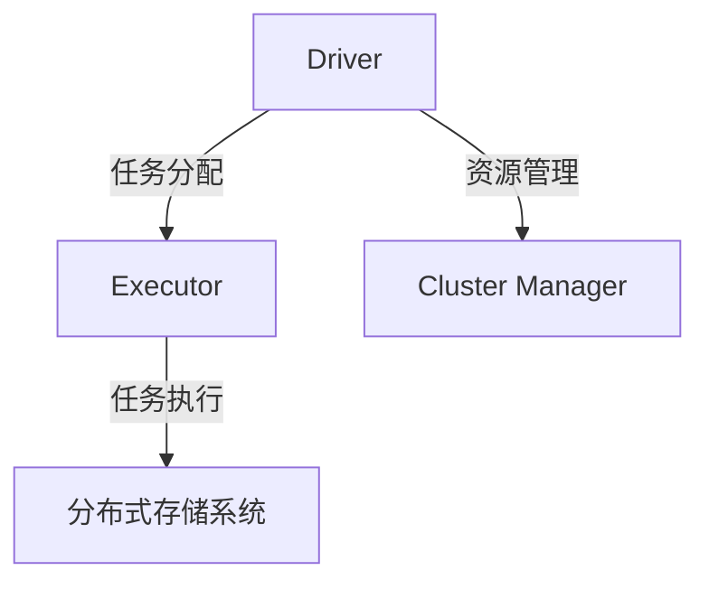
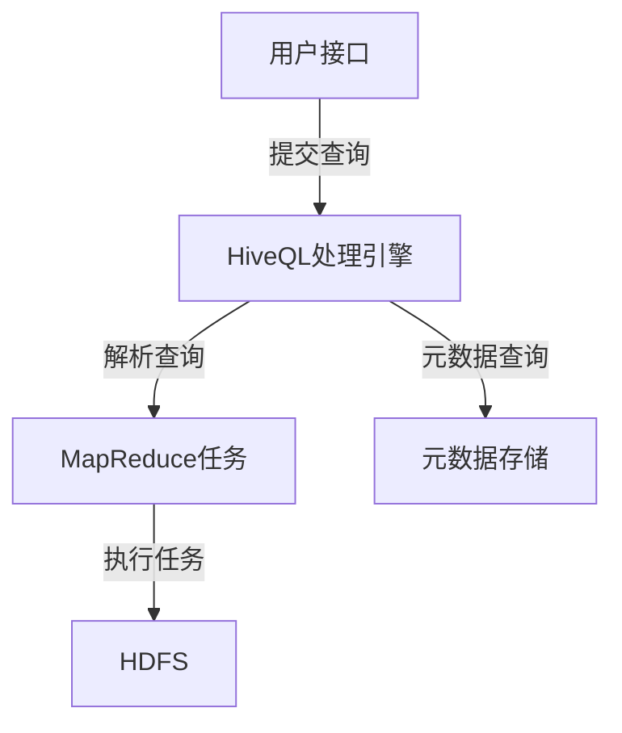

# Spark与Hive在环保数据处理中的应用

作者：禅与计算机程序设计艺术

## 1. 背景介绍

### 1.1 环保数据处理的现状与挑战

随着全球环境问题的日益严峻，环保数据的处理和分析变得尤为重要。环保数据包括空气质量、水质、土壤污染等多种类型，这些数据具有体量大、来源多样、实时性要求高等特点。传统的数据处理方法已经难以应对如此庞大的数据量和复杂的分析需求。

### 1.2 大数据技术在环保数据处理中的重要性

大数据技术的兴起为环保数据处理带来了新的机遇。通过大数据平台，可以高效地存储、处理和分析海量环保数据，从中提取有价值的信息，为环境保护决策提供支持。Spark与Hive作为大数据技术的代表，在环保数据处理中的应用越来越广泛。

### 1.3 Spark与Hive的基本介绍

#### 1.3.1 Spark简介

Apache Spark是一个开源的分布式计算系统，具有高效的内存计算能力和丰富的API，支持多种编程语言（如Java、Scala、Python、R）。Spark的核心组件包括Spark Core、Spark SQL、Spark Streaming、MLlib和GraphX，能够满足不同的计算需求。

#### 1.3.2 Hive简介

Apache Hive是一个基于Hadoop的数据仓库工具，提供了类SQL的查询语言（HiveQL），使用户可以方便地对存储在Hadoop上的大数据进行查询和分析。Hive通过将SQL查询转换为MapReduce任务，简化了大数据的处理流程。

## 2. 核心概念与联系

### 2.1 Spark与Hive的架构

#### 2.1.1 Spark架构

Spark的架构包括Driver、Executor、Cluster Manager和分布式存储系统。Driver负责将应用程序分解为任务，并将任务分配给Executor执行。Executor负责实际的任务执行和数据存储。Cluster Manager负责资源管理和任务调度。



#### 2.1.2 Hive架构

Hive的架构包括用户接口、元数据存储、HiveQL处理引擎和Hadoop分布式文件系统（HDFS）。用户通过HiveQL提交查询，查询被处理引擎解析并转换为MapReduce任务，最终在HDFS上执行。



### 2.2 Spark与Hive的结合

Spark与Hive的结合主要体现在Spark SQL中。Spark SQL可以直接读取Hive的数据，并通过Spark的高效计算引擎进行处理。通过这种方式，既可以利用Hive的存储和管理能力，又可以发挥Spark的计算优势。

## 3. 核心算法原理具体操作步骤

### 3.1 数据预处理

#### 3.1.1 数据清洗

数据清洗是数据预处理的重要步骤，主要包括缺失值处理、异常值检测和数据格式转换。Spark提供了丰富的API，可以高效地进行数据清洗。例如，可以使用Spark DataFrame的`dropna`方法删除包含缺失值的行，使用`fillna`方法填充缺失值。

#### 3.1.2 数据转换

数据转换包括数据类型转换、数据归一化等操作。例如，可以使用Spark DataFrame的`withColumn`方法转换数据类型，使用`StandardScaler`进行数据归一化。

### 3.2 数据存储与管理

#### 3.2.1 Hive表的创建与管理

在Hive中，可以使用HiveQL创建和管理表。例如，可以使用`CREATE TABLE`语句创建表，使用`ALTER TABLE`语句修改表结构，使用`DROP TABLE`语句删除表。

#### 3.2.2 数据导入与导出

可以使用`LOAD DATA`语句将数据导入Hive表，使用`INSERT INTO`语句将数据从一个表导入到另一个表，使用`EXPORT`和`IMPORT`语句导出和导入数据。

### 3.3 数据分析与处理

#### 3.3.1 SQL查询

可以使用Spark SQL或HiveQL对数据进行查询。例如，可以使用`SELECT`语句查询数据，使用`JOIN`语句进行表连接，使用`GROUP BY`语句进行分组聚合。

#### 3.3.2 机器学习

可以使用Spark MLlib进行机器学习。例如，可以使用`LogisticRegression`进行分类，使用`KMeans`进行聚类，使用`ALS`进行推荐。

## 4. 数学模型和公式详细讲解举例说明

### 4.1 数据清洗中的缺失值填充

假设有一个数据集，其中包含缺失值。可以使用均值填充缺失值。设数据集为 $X = \{x_1, x_2, \ldots, x_n\}$，其中 $x_i$ 可能包含缺失值。可以计算均值 $\bar{x}$，并用均值填充缺失值：

$$
\bar{x} = \frac{1}{n} \sum_{i=1}^{n} x_i
$$

### 4.2 数据归一化

数据归一化是将数据转换为相同的尺度。常用的方法是最小-最大归一化，将数据缩放到 [0, 1] 区间。设数据集为 $X = \{x_1, x_2, \ldots, x_n\}$，归一化后的数据为 $X' = \{x'_1, x'_2, \ldots, x'_n\}$，其中：

$$
x'_i = \frac{x_i - \min(X)}{\max(X) - \min(X)}
$$

### 4.3 线性回归

在线性回归中，目标是找到一个线性函数，使得预测值与实际值之间的误差最小。设数据集为 $(x_1, y_1), (x_2, y_2), \ldots, (x_n, y_n)$，线性回归模型为：

$$
y = \beta_0 + \beta_1 x
$$

其中，$\beta_0$ 和 $\beta_1$ 为模型参数。可以通过最小二乘法求解模型参数：

$$
\min_{\beta_0, \beta_1} \sum_{i=1}^{n} (y_i - (\beta_0 + \beta_1 x_i))^2
$$

## 5. 项目实践：代码实例和详细解释说明

### 5.1 数据预处理

```python
from pyspark.sql import SparkSession
from pyspark.sql.functions import col

# 创建SparkSession
spark = SparkSession.builder \
    .appName("Environmental Data Processing") \
    .enableHiveSupport() \
    .getOrCreate()

# 读取数据
df = spark.read.csv("data/environmental_data.csv", header=True, inferSchema=True)

# 数据清洗：删除包含缺失值的行
df_cleaned = df.dropna()

# 数据转换：将温度从华氏度转换为摄氏度
df_transformed = df_cleaned.withColumn("temperature_celsius", (col("temperature_fahrenheit") - 32) * 5/9)
```

### 5.2 数据存储与管理

```sql
-- 创建Hive表
CREATE TABLE environmental_data (
    id INT,
    temperature_celsius DOUBLE,
    air_quality_index INT,
    timestamp STRING
)
ROW FORMAT DELIMITED
FIELDS TERMINATED BY ','
STORED AS TEXTFILE;

-- 导入数据
LOAD DATA INPATH '/path/to/environmental_data.csv' INTO TABLE environmental_data;
```

### 5.3 数据分析与处理

```python
# 使用Spark SQL查询数据
df.createOrReplaceTempView("environmental_data")
result = spark.sql("SELECT AVG(temperature_celsius) AS avg_temp, AVG(air_quality_index) AS avg_aqi FROM environmental_data")

# 显示查询结果
result.show()
```

### 5.4 机器学习

```python
from pyspark.ml.feature import VectorAssembler
from pyspark.ml.regression import LinearRegression

# 特征工程
assembler = VectorAssembler(inputCols=["temperature_celsius", "air_quality_index"], outputCol="features")
data = assembler.transform(df_transformed)

# 线性回归模型
lr = LinearRegression(featuresCol="features", labelCol="target_variable")
lr_model = lr.fit(data)

# 模型预测
predictions = lr_model.transform(data)
predictions.select("features", "target_variable", "prediction").show()
```

## 6. 实际应用场景

### 6.1 空气质量监测

通过Spark与Hive，可以实时