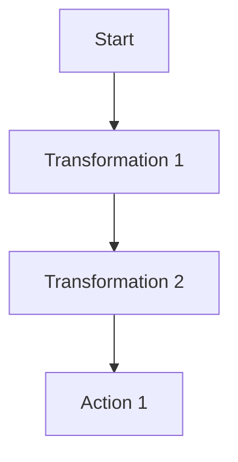

# Spark原理与代码实例讲解

作者：禅与计算机程序设计艺术

## 1. 背景介绍

### 1.1 大数据时代的挑战

在大数据时代，数据的规模和复杂度不断增加，传统的数据处理工具和方法已经无法满足需求。企业需要能够快速处理和分析海量数据的工具，以便从中提取有价值的信息，做出更明智的决策。

### 1.2 Spark的诞生

Apache Spark于2009年由加州大学伯克利分校AMPLab开发，并于2010年开源。它是一种基于内存的大数据处理框架，旨在提供比Hadoop MapReduce更快的速度和更易用的编程接口。Spark不仅支持批处理，还支持流处理、机器学习和图计算等多种数据处理模式。

### 1.3 Spark的优势

- **速度快**：Spark利用内存进行数据处理，避免了大量的磁盘I/O操作，使得其处理速度比传统的Hadoop MapReduce快100倍。
- **易用性**：Spark提供了丰富的API，支持Scala、Java、Python和R等多种编程语言，极大地方便了开发者的使用。
- **通用性**：Spark不仅支持批处理，还支持流处理、交互式查询和图计算等多种数据处理模式，满足了不同场景下的数据处理需求。
- **扩展性**：Spark可以在集群上运行，能够处理TB级甚至PB级的数据。

## 2. 核心概念与联系

### 2.1 RDD（弹性分布式数据集）

RDD是Spark的核心抽象，代表一个不可变的分布式数据集。RDD提供了丰富的操作接口，包括转换操作（如map、filter）和行动操作（如reduce、collect）。RDD的特点是容错性高，可以通过血统信息（Lineage）自动重算丢失的数据分区。

### 2.2 DAG（有向无环图）

Spark通过DAG来表示作业的执行计划。DAG由一系列的阶段（Stage）组成，每个阶段包含多个任务（Task）。Spark将DAG划分为多个阶段，并在每个阶段内并行执行任务，从而提高数据处理效率。

### 2.3 SparkContext

SparkContext是Spark应用的入口点，负责与集群管理器（如YARN、Mesos）通信，分配资源和调度任务。通过SparkContext，用户可以创建RDD、广播变量和累加器等。

### 2.4 Transformations和Actions

Transformations是对RDD的转换操作，生成新的RDD，如map、filter、flatMap等。Transformations是惰性计算的，只有在执行Actions时才会触发计算。Actions是对RDD的行动操作，如reduce、collect、count等，会触发实际的计算并返回结果。

### 2.5 广播变量和累加器

广播变量用于在集群中高效地分发只读变量，避免了在每个任务中重复传输数据。累加器用于在集群中进行全局的累加操作，如计数和求和，常用于调试和性能优化。

## 3. 核心算法原理具体操作步骤

### 3.1 RDD的创建与转换

#### 3.1.1 从集合创建RDD

```scala
val data = Array(1, 2, 3, 4, 5)
val rdd = sc.parallelize(data)
```

#### 3.1.2 从外部存储创建RDD

```scala
val rdd = sc.textFile("hdfs://path/to/file")
```

#### 3.1.3 常见的Transformations

- **map**: 对RDD中的每个元素进行操作，生成新的RDD。

```scala
val rdd2 = rdd.map(x => x * 2)
```

- **filter**: 过滤RDD中的元素，保留满足条件的元素。

```scala
val rdd3 = rdd.filter(x => x % 2 == 0)
```

- **flatMap**: 对RDD中的每个元素进行操作，并将结果扁平化。

```scala
val rdd4 = rdd.flatMap(x => Array(x, x * 2))
```

### 3.2 DAG的生成与执行

#### 3.2.1 DAG的生成

当用户对RDD进行一系列的Transformations时，Spark会生成一个DAG来表示这些操作。DAG是一个有向无环图，其中每个节点代表一个RDD，每条边代表一个转换操作。DAG的生成是惰性计算的，只有在执行Actions时才会触发实际的计算。

#### 3.2.2 DAG的执行

当用户执行一个Action时，Spark会将DAG划分为多个阶段（Stage），并在每个阶段内并行执行任务（Task）。每个任务处理一个数据分区，任务的执行结果会被传递到下一阶段，直到整个DAG执行完毕。



### 3.3 广播变量和累加器的使用

#### 3.3.1 广播变量

广播变量用于在集群中高效地分发只读变量，避免了在每个任务中重复传输数据。

```scala
val broadcastVar = sc.broadcast(Array(1, 2, 3))
rdd.map(x => x + broadcastVar.value(0))
```

#### 3.3.2 累加器

累加器用于在集群中进行全局的累加操作，如计数和求和。

```scala
val accum = sc.longAccumulator("My Accumulator")
rdd.foreach(x => accum.add(x))
println(accum.value)
```

## 4. 数学模型和公式详细讲解举例说明

### 4.1 RDD的血统信息

RDD的血统信息（Lineage）是一个DAG，用于记录RDD的转换操作。血统信息可以帮助Spark在发生故障时重算丢失的数据分区，从而实现容错。

### 4.2 数据分区与任务调度

Spark将RDD划分为多个数据分区（Partition），每个分区对应一个任务（Task）。任务的调度基于数据的本地性（Data Locality），尽量将任务调度到存储数据的节点上执行，以减少数据传输的开销。

### 4.3 计算模型

Spark的计算模型基于MapReduce，但进行了优化。MapReduce模型中，数据在Map和Reduce阶段之间需要频繁地写入和读取磁盘，而Spark通过在内存中进行数据处理，极大地提高了计算速度。

$$
\text{Speedup} = \frac{T_{\text{Hadoop}}}{T_{\text{Spark}}}
$$

其中，$T_{\text{Hadoop}}$是Hadoop的执行时间，$T_{\text{Spark}}$是Spark的执行时间。

## 5. 项目实践：代码实例和详细解释说明

### 5.1 构建Spark应用

#### 5.1.1 创建SparkContext

```scala
import org.apache.spark.{SparkConf, SparkContext}

val conf = new SparkConf().setAppName("MyApp").setMaster("local")
val sc = new SparkContext(conf)
```

#### 5.1.2 读取数据

```scala
val data = sc.textFile("hdfs://path/to/file")
```

#### 5.1.3 数据处理

```scala
val words = data.flatMap(line => line.split(" "))
val wordCounts = words.map(word => (word, 1)).reduceByKey(_ + _)
```

#### 5.1.4 结果输出

```scala
wordCounts.saveAsTextFile("hdfs://path/to/output")
```

### 5.2 实战案例：词频统计

#### 5.2.1 读取数据

```scala
val data = sc.textFile("hdfs://path/to/textfile")
```

#### 5.2.2 数据预处理

```scala
val words = data.flatMap(line => line.split("\\W+")).filter(word => word.nonEmpty)
```

#### 5.2.3 词频统计

```scala
val wordCounts = words.map(word => (word.toLowerCase, 1)).reduceByKey(_ + _)
```

#### 5.2.4 结果保存

```scala
wordCounts.saveAsTextFile("hdfs://path/to/output")
```

## 6. 实际应用场景

### 6.1 日志分析

Spark可以用于实时日志分析，通过对服务器日志进行实时处理和分析，帮助企业快速发现和解决问题，提高系统的稳定性和性能。

### 6.2 数据仓库

Spark可以用于构建高效的数据仓库，通过对海量数据进行快速处理和分析，帮助企业从数据中提取有价值的信息，支持业务决策。

### 6.3 机器学习

Spark MLlib是Spark的机器学习库，提供了丰富的