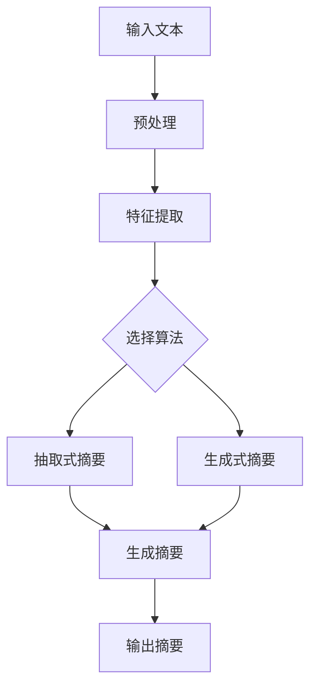

# Text Summarization原理与代码实例讲解

作者：禅与计算机程序设计艺术

## 1.背景介绍

### 1.1 什么是文本摘要

文本摘要（Text Summarization）是一种自然语言处理（NLP）任务，其目标是从给定的文本中提取出最重要的信息，并生成较短的文本来传达原文的主要内容。文本摘要技术在信息过载的时代尤为重要，它能够帮助用户快速获取关键信息，从而节省时间和精力。

### 1.2 文本摘要的重要性

随着互联网的普及和信息量的爆炸式增长，人们每天都要面对大量的文本数据。如何快速地从这些海量信息中提取出有用的内容，成为了一个迫切需要解决的问题。文本摘要技术不仅能提高信息处理的效率，还能在新闻聚合、文献综述、搜索引擎优化等诸多领域发挥重要作用。

### 1.3 文本摘要的分类

文本摘要主要分为两类：抽取式摘要（Extractive Summarization）和生成式摘要（Abstractive Summarization）。

- 抽取式摘要：从原文中直接提取出重要的句子或段落，组成摘要。
- 生成式摘要：通过理解和重构原文，生成新的句子，概括出原文的主要内容。

## 2.核心概念与联系

### 2.1 抽取式摘要

抽取式摘要通过选择原文中的重要句子或段落来生成摘要。这种方法的优点是生成的摘要内容准确，保留了原文的语义和信息，但缺点是可能会导致上下文不连贯，缺乏流畅性。

### 2.2 生成式摘要

生成式摘要通过理解原文的语义，生成新的句子来概括原文的主要内容。这种方法的优点是摘要更加流畅自然，但缺点是生成的内容可能会有信息遗漏或错误。

### 2.3 评估指标

评估文本摘要质量的常用指标包括ROUGE（Recall-Oriented Understudy for Gisting Evaluation）和BLEU（Bilingual Evaluation Understudy）。ROUGE主要用于评估摘要与参考摘要之间的重合度，而BLEU则常用于评估机器翻译的质量。

## 3.核心算法原理具体操作步骤

### 3.1 抽取式摘要算法

#### 3.1.1 TF-IDF算法

TF-IDF（Term Frequency-Inverse Document Frequency）是一种用于评估一个词在文档中的重要性的统计方法。它通过计算词频（TF）和逆文档频率（IDF）来衡量词的重要性。

$$
TF(t) = \frac{\text{词}t\text{在文档中的出现次数}}{\text{文档中的总词数}}
$$

$$
IDF(t) = \log \left( \frac{\text{文档总数}}{\text{包含词}t\text{的文档数}} \right)
$$

#### 3.1.2 TextRank算法

TextRank是一种基于图的排序算法，用于抽取重要句子。它通过构建句子之间的相似度图，利用PageRank算法对句子进行排序。

#### 3.1.3 LSA（Latent Semantic Analysis）

LSA通过对文档进行奇异值分解（SVD），将文档映射到一个低维空间，提取出重要的主题和句子。

### 3.2 生成式摘要算法

#### 3.2.1 Seq2Seq模型

Seq2Seq（Sequence to Sequence）模型是一种基于神经网络的生成模型，常用于机器翻译、文本摘要等任务。它由编码器（Encoder）和解码器（Decoder）组成，通过RNN、LSTM或GRU等结构实现。

#### 3.2.2 Transformer模型

Transformer模型利用自注意力机制（Self-Attention）来建模序列间的依赖关系，克服了RNN的长距离依赖问题。BERT、GPT等模型都是基于Transformer的变种。

### 3.3 算法流程图



## 4.数学模型和公式详细讲解举例说明

### 4.1 TF-IDF模型

TF-IDF模型通过计算词频和逆文档频率来衡量词的重要性。假设有一个文档集合 $D$，其中包含文档 $d_i$ 和词 $t_j$，则词 $t_j$ 在文档 $d_i$ 中的TF-IDF值可以表示为：

$$
\text{TF-IDF}(t_j, d_i) = \text{TF}(t_j, d_i) \times \text{IDF}(t_j)
$$

### 4.2 TextRank模型

TextRank模型通过构建句子之间的相似度图来提取重要句子。假设有一个句子集合 $S$，其中包含句子 $s_i$ 和 $s_j$，则句子 $s_i$ 和 $s_j$ 之间的相似度可以表示为：

$$
\text{Sim}(s_i, s_j) = \frac{\sum_{k \in \text{common}(s_i, s_j)} \text{TF-IDF}(k, s_i) \times \text{TF-IDF}(k, s_j)}{\sqrt{\sum_{k \in s_i} \text{TF-IDF}(k, s_i)^2} \times \sqrt{\sum_{k \in s_j} \text{TF-IDF}(k, s_j)^2}}
$$

然后，通过PageRank算法对句子进行排序，得到重要句子的排序结果。

### 4.3 Seq2Seq模型

Seq2Seq模型通过编码器和解码器实现文本摘要。假设输入序列为 $X = (x_1, x_2, \ldots, x_n)$，输出序列为 $Y = (y_1, y_2, \ldots, y_m)$，则编码器将输入序列映射为上下文向量 $C$：

$$
h_t = \text{Encoder}(x_t, h_{t-1})
$$

$$
C = h_n
$$

解码器根据上下文向量 $C$ 生成输出序列：

$$
s_t = \text{Decoder}(y_{t-1}, s_{t-1}, C)
$$

## 5.项目实践：代码实例和详细解释说明

### 5.1 抽取式摘要代码实例

以下是使用Python实现TF-IDF算法进行抽取式摘要的代码实例：

```python
import nltk
from sklearn.feature_extraction.text import TfidfVectorizer
from nltk.tokenize import sent_tokenize

# 下载punkt模型
nltk.download('punkt')

def extractive_summary(text, num_sentences):
    sentences = sent_tokenize(text)
    tfidf_vectorizer = TfidfVectorizer()
    tfidf_matrix = tfidf_vectorizer.fit_transform(sentences)
    sentence_scores = tfidf_matrix.sum(axis=1).flatten().tolist()[0]
    ranked_sentences = [sentences[i] for i in sorted(range(len(sentence_scores)), key=lambda i: sentence_scores[i], reverse=True)]
    summary = ' '.join(ranked_sentences[:num_sentences])
    return summary

# 示例文本
text = """
人工智能（Artificial Intelligence，缩写为AI）是计算机科学的一个分支，它的目标是使机器能够执行通常需要人类智能才能完成的任务。
这些任务包括学习、推理、问题解决、感知和语言理解等。
近年来，随着计算能力和数据量的增加，人工智能技术得到了快速发展，并在各个领域得到了广泛应用。
"""

# 生成摘要
summary = extractive_summary(text, 2)
print(summary)
```

### 5.2 生成式摘要代码实例

以下是使用Python和Hugging Face的Transformers库实现生成式摘要的代码实例：

```python
from transformers import pipeline

# 加载预训练模型
summarizer = pipeline("summarization")

# 示例文本
text = """
人工智能（Artificial Intelligence，缩写为AI）是计算机科学的一个分支，它的目标是使机器能够执行通常需要人类智能才能完成的任务。
这些任务包括学习、推理、问题解决、感知和语言理解等。
近年来，随着计算能力和数据量的增加，人工智能技术得到了快速发展，并在各个领域得到了广泛应用。
"""

# 生成摘要
summary = summarizer(text, max_length=50, min_length=25, do_sample=False)
print(summary[0]['summary_text'])
```

## 6.实际应用场景

### 6.1 新闻聚