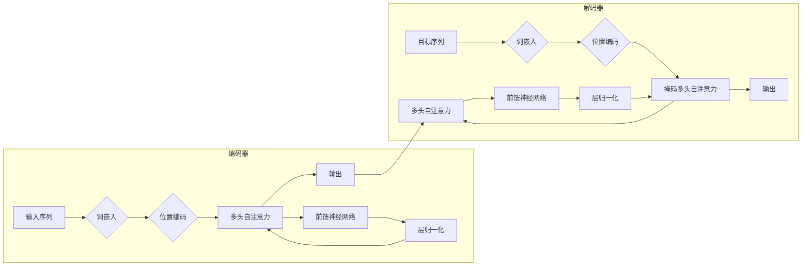

## Transformer在多模态任务中的应用前景

作者：禅与计算机程序设计艺术

## 1. 背景介绍

### 1.1 多模态学习的兴起与挑战

近年来，随着深度学习技术的飞速发展，人工智能领域取得了令人瞩目的成就。其中，多模态学习作为一项新兴的研究方向，旨在使机器能够像人类一样理解和处理来自多种感官的信息，例如文本、图像、语音等。这种能力对于构建更加智能和人性化的 AI 系统至关重要，也为解决许多现实世界问题提供了新的思路和方法。

然而，多模态学习也面临着诸多挑战：

* **数据异构性:** 不同模态的数据通常具有不同的统计特性和表示形式，例如文本是离散的符号序列，而图像是连续的像素值矩阵。如何有效地融合和处理这些异构数据是一个关键问题。
* **模态间交互:** 不同模态的信息之间存在着复杂的语义关联和交互关系，例如图像可以提供文本描述中未提及的细节，而语音可以传达文本无法表达的情绪。如何捕捉和建模这些交互关系对于实现多模态理解至关重要。
* **计算效率:** 多模态数据通常规模庞大，处理和分析这些数据需要巨大的计算资源和时间成本。如何提高多模态学习的效率是一个亟待解决的问题。

### 1.2 Transformer 架构的优势

Transformer 是一种基于自注意力机制的神经网络架构，最初应用于自然语言处理领域，并取得了突破性进展。与传统的循环神经网络 (RNN) 相比，Transformer 具有以下优势：

* **并行计算:** Transformer 可以并行处理序列数据，从而显著提高计算效率。
* **长距离依赖关系建模:** 自注意力机制允许 Transformer 捕捉序列中任意两个位置之间的依赖关系，无论它们之间的距离有多远。
* **可解释性:** 自注意力机制的权重可以用来分析模型学习到的语义关系，从而提高模型的可解释性。

由于这些优势，Transformer 已被广泛应用于各种自然语言处理任务，并在机器翻译、文本摘要、问答系统等领域取得了 state-of-the-art 的结果。

## 2. 核心概念与联系

### 2.1 Transformer 架构回顾

Transformer 架构主要由编码器和解码器两部分组成，如下图所示：



* **编码器:** 编码器负责将输入序列转换为上下文向量表示。它由多个相同的层堆叠而成，每个层包含两个子层：多头自注意力层和前馈神经网络层。
* **解码器:** 解码器负责根据上下文向量生成目标序列。它也由多个相同的层堆叠而成，每个层除了包含编码器中的两个子层外，还包含一个掩码多头自注意力层，用于防止模型在生成过程中关注到未来的信息。

### 2.2 多模态 Transformer 的设计思路

将 Transformer 应用于多模态任务的关键在于如何有效地融合和处理来自不同模态的信息。目前，主要有以下几种设计思路：

* **单流架构:** 将所有模态的数据拼接成一个单一的输入序列，然后使用标准的 Transformer 架构进行处理。这种方法简单直观，但无法充分利用不同模态之间的交互信息。
* **双流架构:** 使用两个独立的 Transformer 编码器分别处理不同模态的数据，然后将它们的输出融合在一起。这种方法可以更好地捕捉模态特定的信息，但需要设计有效的融合机制。
* **交叉注意力机制:** 在 Transformer 的编码器和解码器之间引入交叉注意力机制，允许模型在生成过程中关注到来自不同模态的信息。这种方法可以更有效地利用模态间的交互信息，但计算复杂度较高。

## 3. 核心算法原理具体操作步骤

### 3.1 自注意力机制

自注意力机制是 Transformer 架构的核心组件，它允许模型在处理序列数据时关注到序列中任意两个位置之间的依赖关系。其具体操作步骤如下：

1. **计算查询、键和值向量:** 对于输入序列中的每个词向量，分别乘以三个不同的矩阵，得到对应的查询向量 $Q$、键向量 $K$ 和值向量 $V$。
2. **计算注意力权重:** 计算每个查询向量与所有键向量之间的点积，然后使用 softmax 函数进行归一化，得到注意力权重矩阵 $A$。
3. **加权求和:** 将值向量矩阵 $V$ 与注意力权重矩阵 $A$ 相乘，得到加权求和后的向量表示。

$$
A = \text{softmax}(\frac{QK^T}{\sqrt{d_k}})
$$

$$
\text{Attention}(Q, K, V) = AV
$$

其中，$d_k$ 是键向量的维度，用于缩放点积结果，避免数值过大。

### 3.2 多头注意力机制

多头注意力机制是自注意力机制的扩展，它将自注意力机制并行执行多次，然后将多个注意力头的输出拼接在一起，从而捕捉到更加丰富的语义信息。

### 3.3 位置编码

由于 Transformer 架构没有显式地对序列数据的顺序信息进行建模，因此需要引入位置编码来提供位置信息。位置编码通常是一个与输入序列长度相同的向量，它可以与词向量相加，或者与词向量拼接在一起。

## 4. 数学模型和公式详细讲解举例说明

### 4.1 自注意力机制的数学模型

自注意力机制可以看作是一个键值对查询的过程。给定一个查询向量 $q$，它会在键向量集合 $K = \{k_1, k_2, ..., k_n\}$ 中寻找与其最相关的键向量，然后返回对应的值向量 $v_i$。

注意力权重 $a_i$ 表示查询向量 $q$ 与键向量 $k_i$ 之间的相关程度，可以使用点积来计算：

$$
a_i = q \cdot k_i
$$

为了避免数值过大，可以使用 softmax 函数对注意力权重进行归一化：

$$
\alpha_i = \frac{\exp(a_i)}{\sum_{j=1}^{n} \exp(a_j)}
$$

最终，自注意力机制的输出是所有值向量的加权平均：

$$
\text{Attention}(q, K, V) = \sum_{i=1}^{n} \alpha_i v_i
$$

### 4.2 多头注意力机制的数学模型

多头注意力机制将自注意力机制并行执行 $h$ 次，每个注意力头使用不同的参数矩阵 $W_i^Q$、$W_i^K$、$W_i^V$ 来计算查询、键和值向量：

$$
Q_i = qW_i^Q
$$

$$
K_i = KW_i^K
$$

$$
V_i = VW_i^V
$$

每个注意力头的输出为：

$$
\text{head}_i = \text{Attention}(Q_i, K_i, V_i)
$$

最终，将所有注意力头的输出拼接在一起，然后乘以一个参数矩阵 $W^O$，得到多头注意力机制的输出：

$$
\text{MultiHead}(Q, K, V) = \text{Concat}(\text{head}_1, ..., \text{head}_h)W^O
$$

## 5. 项目实践：代码实例和详细解释说明

```python
import torch
import torch.nn as nn

class Transformer(nn.Module):
    def __init__(self, d_model, nhead, num_encoder_layers, num_decoder_layers):
        super(Transformer, self).__init__()

        # 编码器
        encoder_layer = nn.TransformerEncoderLayer(d_model, nhead)
        self.encoder = nn.TransformerEncoder(encoder_layer, num_encoder_layers)

        # 解码器
        decoder_layer = nn.TransformerDecoderLayer(d_model, nhead)
        self.decoder = nn.TransformerDecoder(decoder_layer, num_decoder_layers)

        # 线性层
        self.linear = nn.Linear(d_model, vocab_size)

    def forward(self, src, tgt, src_mask, tgt_mask):
        # 编码器输出
        encoder_output = self.encoder(src, src_mask)

        # 解码器输出
        decoder_output = self.decoder(tgt, encoder_output, tgt_mask, src_mask)

        # 线性层输出
        output = self.linear(decoder_output)

        return output
```

**代码解释:**

* `d_model`: 模型的维度。
* `nhead`: 多头注意力机制中注意力头的数量。
* `num_encoder_layers`: 编码器层的数量。
* `num_decoder_layers`: 解码器层的数量。
* `vocab_size`: 词汇表的大小。
* `src`: 源序列。
* `tgt`: 目标序列。
* `src_mask`: 源序列的掩码，用于屏蔽填充位置。
* `tgt_mask`: 目标序列的掩码，用于屏蔽填充位置和未来的信息。

## 6. 实际应用场景

### 6.1 图像描述生成

给定一张图像，生成一段描述性的文本。

**模型架构:**

可以使用编码器-解码器架构，其中编码器使用卷积神经网络 (CNN) 提取图像特征，解码器使用 Transformer 生成文本描述。

### 6.2 视频问答

给定一段视频和一个问题，模型需要理解视频内容并回答问题。

**模型架构:**

可以使用双流架构，其中一个 Transformer 编码器处理视频帧序列，另一个 Transformer 编码器处理问题文本，然后将它们的输出融合在一起，最后使用一个线性层预测答案。

### 6.3 语音识别

将语音信号转换为文本。

**模型架构:**

可以使用编码器-解码器架构，其中编码器使用音频特征提取器 (例如，MFCC) 提取语音特征，解码器使用 Transformer 生成文本序列。

## 7. 总结：未来发展趋势与挑战

### 7.1 未来发展趋势

* **更加强大的多模态表示学习:** 研究更加强大的多模态表示学习方法，能够更好地捕捉不同模态之间的语义关联和交互关系。
* **更高效的多模态模型训练:** 探索更高效的多模态模型训练方法，例如模型压缩、知识蒸馏等。
* **更广泛的应用领域:** 将多模态 Transformer 应用于更广泛的领域，例如机器人、自动驾驶、医疗诊断等。

### 7.2 面临的挑战

* **数据稀缺性:** 多模态数据通常难以获取，尤其是高质量的标注数据。
* **模型可解释性:** 多模态 Transformer 模型通常比较复杂，难以解释其预测结果。
* **伦理和社会影响:** 多模态 AI 系统的应用可能会带来伦理和社会影响，例如隐私泄露、歧视等。

## 8. 附录：常见问题与解答

### 8.1 Transformer 与 RNN 相比有哪些优势？

Transformer 相比于 RNN 具有以下优势：

* **并行计算:** Transformer 可以并行处理序列数据，从而显著提高计算效率。
* **长距离依赖关系建模:** 自注意力机制允许 Transformer 捕捉序列中任意两个位置之间的依赖关系，无论它们之间的距离有多远。
* **可解释性:** 自注意力机制的权重可以用来分析模型学习到的语义关系，从而提高模型的可解释性。

### 8.2 多模态 Transformer 有哪些应用场景？

多模态 Transformer 可以应用于各种需要处理多种模态数据的场景，例如：

* 图像描述生成
* 视频问答
* 语音识别
* 机器翻译
* 情感分析

### 8.3 多模态 Transformer 面临哪些挑战？

多模态 Transformer 面临以下挑战：

* 数据稀缺性
* 模型可解释性
* 伦理和社会影响
