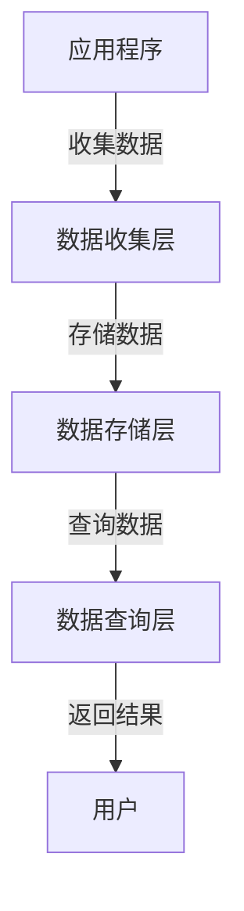

# YARN Timeline Server原理与代码实例讲解

作者：禅与计算机程序设计艺术

## 1. 背景介绍

### 1.1 YARN简介

YARN（Yet Another Resource Negotiator）是Hadoop 2.0引入的资源管理系统，它将资源管理和任务调度从MapReduce中分离出来，使得Hadoop集群不仅可以运行MapReduce任务，还可以运行其他类型的分布式计算任务。YARN的主要组件包括ResourceManager、NodeManager和ApplicationMaster。

### 1.2 Timeline Server的引入

随着YARN的应用日益广泛，集群中运行的任务数量和复杂度不断增加，如何有效地管理和追踪这些任务的运行状态成为一个重要问题。为了解决这一问题，YARN引入了Timeline Server，它提供了一个通用的框架，用于收集和查询应用程序的运行历史数据。

### 1.3 Timeline Server的作用

Timeline Server的主要作用是收集和存储应用程序的运行历史数据，包括应用程序的事件、指标和配置信息。通过这些数据，用户可以分析应用程序的性能、诊断问题和优化资源利用。

## 2. 核心概念与联系

### 2.1 Timeline Entity

Timeline Entity是Timeline Server中最基本的概念，它表示一个应用程序运行过程中产生的一个逻辑单元。每个Timeline Entity都有一个唯一的ID和一组属性，用于描述该实体的状态和行为。

### 2.2 Timeline Event

Timeline Event是与Timeline Entity相关联的事件，它表示某个时间点上发生的特定事件。每个Timeline Event都有一个时间戳和一组属性，用于描述该事件的详细信息。

### 2.3 Timeline Metrics

Timeline Metrics是与Timeline Entity相关联的度量数据，它表示某个时间段内的性能指标。每个Timeline Metrics都有一个时间序列，用于记录该指标在不同时间点上的值。

### 2.4 Timeline Domain

Timeline Domain是用于隔离不同应用程序的数据域，它提供了一种机制，用于控制不同用户对Timeline数据的访问权限。每个Timeline Domain都有一个唯一的ID和一组访问控制策略。

### 2.5 Timeline Server架构

Timeline Server的架构可以分为三个层次：数据收集层、数据存储层和数据查询层。数据收集层负责从各个应用程序中收集Timeline数据，数据存储层负责将这些数据存储到持久化存储中，数据查询层负责提供查询接口，供用户查询和分析Timeline数据。



## 3. 核心算法原理具体操作步骤

### 3.1 数据收集

数据收集是Timeline Server的第一步，它负责从各个应用程序中收集Timeline Entity、Timeline Event和Timeline Metrics数据。应用程序通过调用Timeline Client API，将这些数据发送到Timeline Server的数据收集层。

### 3.2 数据存储

数据存储是Timeline Server的第二步，它负责将收集到的Timeline数据存储到持久化存储中。Timeline Server的数据存储层通常使用HBase或LevelDB作为底层存储系统，以保证数据的高可用性和高性能。

### 3.3 数据查询

数据查询是Timeline Server的第三步，它负责提供查询接口，供用户查询和分析Timeline数据。用户可以通过REST API或命令行工具，向Timeline Server的数据查询层发送查询请求，获取所需的Timeline数据。

## 4. 数学模型和公式详细讲解举例说明

### 4.1 数据模型

Timeline Server的数据模型可以用一个三元组 $(E, A, V)$ 来表示，其中 $E$ 表示Timeline Entity，$A$ 表示属性，$V$ 表示属性值。每个Timeline Entity都有一组属性，每个属性都有一个或多个属性值。

### 4.2 时间序列模型

Timeline Metrics的数据模型可以用一个四元组 $(E, M, T, V)$ 来表示，其中 $E$ 表示Timeline Entity，$M$ 表示度量指标，$T$ 表示时间戳，$V$ 表示指标值。每个Timeline Metrics都有一个时间序列，用于记录该指标在不同时间点上的值。

### 4.3 数据存储模型

Timeline Server的数据存储模型可以用一个二元组 $(K, V)$ 来表示，其中 $K$ 表示键，$V$ 表示值。键通常是由Timeline Entity的ID和属性名组成的，值是对应的属性值。为了提高查询性能，Timeline Server通常会对键进行哈希处理，并将数据存储到哈希表中。

$$
K = \text{hash}(E.\text{id}, A.\text{name})
$$

## 5. 项目实践：代码实例和详细解释说明

### 5.1 环境准备

在开始项目实践之前，需要准备好开发环境，包括安装Hadoop、配置YARN和Timeline Server。以下是一个简单的环境准备步骤：

```bash
# 安装Hadoop
wget https://downloads.apache.org/hadoop/common/hadoop-3.3.1/hadoop-3.3.1.tar.gz
tar -xzvf hadoop-3.3.1.tar.gz
mv hadoop-3.3.1 /usr/local/hadoop

# 配置YARN
vim /usr/local/hadoop/etc/hadoop/yarn-site.xml
# 添加以下配置
<configuration>
    <property>
        <name>yarn.resourcemanager.hostname</name>
        <value>localhost</value>
    </property>
    <property>
        <name>yarn.timeline-service.enabled</name>
        <value>true</value>
    </property>
    <property>
        <name>yarn.timeline-service.leveldb-timeline-store.path</name>
        <value>/usr/local/hadoop/timeline</value>
    </property>
</configuration>

# 启动Hadoop和YARN
/usr/local/hadoop/sbin/start-dfs.sh
/usr/local/hadoop/sbin/start-yarn.sh
```

### 5.2 收集数据

以下是一个简单的Java代码示例，用于从应用程序中收集Timeline数据：

```java
import org.apache.hadoop.yarn.api.records.timeline.TimelineEntity;
import org.apache.hadoop.yarn.api.records.timeline.TimelineEvent;
import org.apache.hadoop.yarn.client.api.TimelineClient;

public class TimelineExample {
    public static void main(String[] args) throws Exception {
        TimelineClient client = TimelineClient.createTimelineClient();
        client.init(new Configuration());
        client.start();

        // 创建Timeline Entity
        TimelineEntity entity = new TimelineEntity();
        entity.setEntityId("example_entity");
        entity.setEntityType("example_type");

        // 添加属性
        entity.addPrimaryFilter("user", "test_user");
        entity.addOtherInfo("info_key", "info_value");

        // 创建Timeline Event
        TimelineEvent event = new TimelineEvent();
        event.setEventType("example_event");
        event.setTimestamp(System.currentTimeMillis());
        event.addEventInfo("event_key", "event_value");

        // 添加事件到实体
        entity.addEvent(event);

        // 发送数据到Timeline Server
        client.putEntities(entity);

        client.stop();
    }
}
```

### 5.3 查询数据

以下是一个简单的REST API查询示例，用于从Timeline Server中查询Timeline数据：

```bash
curl -X GET "http://localhost:8188/ws/v1/timeline/TEZ_DAG_ID/example_entity?fields=events,primaryfilters,otherinfo,metrics"
```

## 6. 实际应用场景

### 6.1 性能分析

通过收集和分析Timeline数据，用户可以了解应用程序的性能瓶颈，找到优化的方向。例如，可以通过分析任务的运行时间和资源使用情况，找出资源利用率不高的任务，并进行优化。

### 6.2 问题诊断

当应用程序出现问题时，Timeline数据可以提供详细的运行历史记录，帮助用户快速定位问题。例如，可以通过分析Timeline Event，找到导致任务失败的原因，并进行修复。

### 6.3 资源优化

通过收集和分析Timeline数据，用户可以了解集群资源的使用情况，找到资源浪费的地方。例如，可以通过分析Timeline Metrics，找出资源利用率低的节点，并进行调整。

## 7. 工具和资源推荐

### 7.1 开发工具

- IntelliJ IDEA：一款功能强大的Java开发工具，支持YARN应用程序的开发和调试。
- Eclipse：另一款流行的Java开发工具，也支持YARN应用程序的开发和调试。

### 7.2 资源推荐

- [Hadoop官网](https://hadoop.apache.org/): 提供了丰富的文档和教程，帮助用户了解和使用Hadoop和YARN。
- [YARN官方文档](https://hadoop.apache.org/docs/current/hadoop-yarn/hadoop-yarn-site/YARN.html): 提供了详细的YARN架