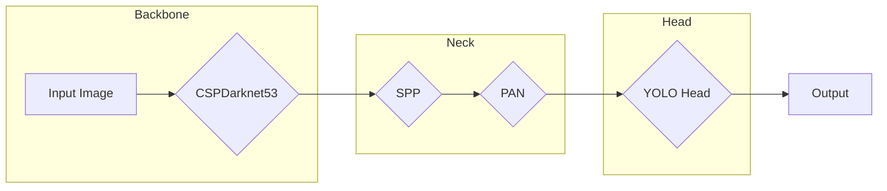

## 1. 背景介绍

### 1.1 目标检测技术的发展历程

目标检测作为计算机视觉领域的核心任务之一，其发展历程可谓波澜壮阔。从早期的传统方法，如 Viola-Jones 算法和 HOG+SVM，到基于深度学习的 Two-Stage 方法，如 R-CNN、Fast R-CNN 和 Faster R-CNN，再到 One-Stage 方法，如 YOLO、SSD 和 RetinaNet，目标检测技术不断突破精度和速度的瓶颈，极大地推动了人脸识别、自动驾驶、智能安防等领域的应用发展。

### 1.2  YOLO 系列算法概述

YOLO（You Only Look Once）系列算法是 One-Stage 目标检测算法的代表，其特点是速度快、精度高，能够很好地平衡实时性和准确性。自 2015 年 Joseph Redmon 提出 YOLOv1 以来，YOLO 系列算法不断迭代更新，YOLOv2、YOLOv3、YOLOv4、YOLOv5 等版本相继问世，每一代都在前一代的基础上进行改进和优化，不断提升性能。

### 1.3 YOLOv7 的优势和贡献

2022年7月，YOLOv7 横空出世，再次刷新了目标检测领域的性能记录。相比于之前的版本，YOLOv7 主要有以下几个方面的优势：

* **更高的精度:**  YOLOv7 在速度相当的情况下，精度超越了所有已知的目标检测器，包括 YOLOv5、Scaled-YOLOv4、YOLOX、PPYOLOE、DETR、Sparse R-CNN 和 Swin Transformer 等。
* **更快的速度:**  YOLOv7 的推理速度达到了惊人的 160 FPS，比 YOLOv5 快了 120%，比 YOLOX 快了 50%。
* **更少的参数量:**  YOLOv7 的模型参数量更少，这意味着它更容易训练和部署。
* **更强的泛化能力:**  YOLOv7 在不同数据集上的表现更加稳定，泛化能力更强。

## 2. 核心概念与联系

### 2.1  YOLOv7 的网络架构

YOLOv7 的网络架构主要包含以下几个部分：

* **Backbone:** 用于提取图像特征，通常使用 CSPDarknet53 网络。
* **Neck:** 用于融合不同尺度的特征图，通常使用 SPP 和 PAN 结构。
* **Head:**  用于预测目标的类别和边界框，通常使用 YOLO Head。




### 2.2  核心模块详解

#### 2.2.1 CSPDarknet53

CSPDarknet53 是一种深度残差网络，其特点是使用了 Cross Stage Partial Connections (CSP) 结构。CSP 结构将输入特征图分成两部分，一部分经过残差模块，另一部分直接与残差模块的输出特征图进行拼接，这样可以减少计算量，提高推理速度。

#### 2.2.2 SPP

Spatial Pyramid Pooling (SPP) 空间金字塔池化层可以将任意大小的特征图转换成固定长度的特征向量，从而提高网络对不同尺度目标的检测能力。

#### 2.2.3 PAN

Path Aggregation Network (PAN) 路径聚合网络可以融合不同层级的特征，提高目标检测的精度。

#### 2.2.4 YOLO Head

YOLO Head 用于预测目标的类别和边界框，它包含三个分支：

* **分类分支:**  预测目标的类别。
* **边界框回归分支:**  预测目标的边界框坐标。
* **置信度分支:**  预测目标的置信度，即预测框中包含目标的概率。


### 2.3  YOLOv7 的工作流程

YOLOv7 的工作流程如下：

1. 将输入图像缩放至固定大小，并送入 Backbone 网络中提取特征。
2. 将 Backbone 网络提取到的多尺度特征图送入 Neck 网络中进行融合。
3. 将 Neck 网络输出的特征图送入 Head 网络中进行预测。
4. 对 Head 网络的预测结果进行解码，得到最终的检测结果。

## 3. 核心算法原理具体操作步骤

### 3.1  训练阶段

#### 3.1.1 数据预处理

* **图像增强:**  对训练图像进行随机翻转、裁剪、缩放、颜色变换等操作，以增强模型的泛化能力。
* **标注框处理:**  将标注框的坐标转换为 YOLOv7 模型所需的格式。

#### 3.1.2  损失函数

YOLOv7 使用多任务损失函数，包括分类损失、边界框回归损失和置信度损失。

* **分类损失:**  使用交叉熵损失函数。
* **边界框回归损失:**  使用 CIoU Loss 函数。
* **置信度损失:**  使用二元交叉熵损失函数。

#### 3.1.3  优化器

YOLOv7 使用 SGD 优化器进行训练。

#### 3.1.4  训练策略

YOLOv7 使用 Warmup、Cosine Annealing LR 和 EMA 等训练策略来提高模型的性能。

### 3.2  推理阶段

#### 3.2.1  模型加载

加载训练好的 YOLOv7 模型。

#### 3.2.2  图像预处理

将输入图像缩放至固定大小。

#### 3.2.3  模型推理

将预处理后的图像送入 YOLOv7 模型中进行推理。

#### 3.2.4  结果解码

对模型的预测结果进行解码，得到最终的检测结果。

## 4. 数学模型和公式详细讲解举例说明

### 4.1  边界框回归

YOLOv7 使用 CIoU Loss 函数来计算边界框回归损失。CIoU Loss 函数考虑了预测框和真实框的重叠面积、中心点距离和长宽比，能够更好地衡量预测框和真实框之间的差异。

$$
CIoU = 1 - IoU + \frac{\rho^2(b, b^{gt})}{c^2} + \alpha v
$$

其中：

* $IoU$ 为预测框和真实框的交并比。
* $\rho(b, b^{gt})$ 为预测框中心点和真实框中心点的欧式距离。
* $c$ 为能够同时包含预测框和真实框的最小闭包区域的对角线长度。
* $\alpha$ 为权重系数。
* $v$ 为衡量长宽比一致性的指标。

### 4.2  非极大值抑制

YOLOv7 使用非极大值抑制 (NMS) 算法来去除重叠的预测框。NMS 算法的原理是，首先根据置信度对预测框进行排序，然后保留置信度最高的预测框，并去除与其重叠度超过一定阈值的预测框。

## 5. 项目实践：代码实例和详细解释说明

### 5.1  环境配置

* Python 3.7+
* PyTorch 1.7+
* CUDA 10.2+

### 5.2  数据准备

下载 COCO 数据集，并将其转换为 YOLOv7 模型所需的格式。

### 5.3  模型训练

```python
import torch
from yolov7 import YOLOv7

# 初始化模型
model = YOLOv7(num_classes=80)

# 加载预训练权重
model.load_state_dict(torch.load('yolov7.pt'))

# 定义优化器
optimizer = torch.optim.SGD(model.parameters(), lr=0.001, momentum=0.9)

# 定义损失函数
criterion = YOLOv7Loss()

# 训练模型
for epoch in range(num_epochs):
    for images, targets in train_loader:
        # 前向传播
        outputs = model(images)

        # 计算损失
        loss = criterion(outputs, targets)

        # 反向传播
        optimizer.zero_grad()
        loss.backward()
        optimizer.step()

        # 打印训练信息
        print(f'Epoch: {epoch+1}, Loss: {loss.item():.4f}')

# 保存模型
torch.save(model.state_dict(), 'yolov7_trained.pt')
```

### 5.4  模型评估

```python
import torch
from yolov7 import YOLOv7

# 初始化模型
model = YOLOv7(num_classes=80)

# 加载训练好的权重
model.load_state_dict(torch.load('yolov7_trained.pt'))

# 评估模型
model.eval()
with torch.no_grad():
    for images, targets in val_loader:
        # 前向传播
        outputs = model(images)

        # 计算评估指标
        precision, recall, ap = evaluate(outputs, targets)

        # 打印评估结果
        print(f'Precision: {precision:.4f}, Recall: {recall:.4f}, AP: {ap:.4f}')
```

### 5.5  模型预测

```python
import torch
from yolov7 import YOLOv7

# 初始化模型
model = YOLOv7(num_classes=80)

# 加载训练好的权重
model.load_state_dict(torch.load('yolov7_trained.pt'))

# 加载图像
image = Image.open('test.jpg')

# 模型预测
results = model(image)

# 显示预测结果
draw_boxes(image, results)
```

## 6. 实际应用场景

YOLOv7 作为一种高精度、高效率的目标检测算法，在许多领域都有着广泛的应用，例如：

* **自动驾驶:**  用于检测车辆、行人、交通信号灯等目标，为自动驾驶汽车提供环境感知能力。
* **智能安防:**  用于检测入侵者、识别可疑行为，提高安防系统的智能化水平。
* **工业检测:**  用于检测产品缺陷、识别产品类型，提高工业生产效率。
* **医疗影像分析:**  用于检测肿瘤、识别病变区域，辅助医生进行诊断。

## 7. 工具和资源推荐

* **Darknet:** YOLOv7 官方代码库，使用 C 语言编写。
* **PyTorch:**  开源深度学习框架，提供了丰富的 API 和工具，方便开发者进行模型训练和部署。
* **COCO 数据集:**  大规模目标检测数据集，包含 80 个类别，超过 20 万张图像。

## 8. 总结：未来发展趋势与挑战

YOLOv7 的出现再次刷新了目标检测领域的性能记录，展现了 One-Stage 目标检测算法的强大实力。未来，目标检测技术将朝着以下几个方向发展：

* **更高的精度和速度:**  随着硬件设备的不断发展，目标检测算法的精度和速度将进一步提升。
* **更强的鲁棒性:**  目标检测算法需要具备更强的鲁棒性，以应对复杂多变的现实场景。
* **更广泛的应用:**  目标检测技术将应用于更多领域，例如视频分析、机器人技术等。


## 9. 附录：常见问题与解答

### 9.1  YOLOv7 与 YOLOv5 的区别？

YOLOv7 在 YOLOv5 的基础上进行了一系列改进，主要包括：

* **网络架构:**  YOLOv7 使用了 CSPDarknet53 作为 Backbone 网络，并引入了 SPP 和 PAN 结构。
* **损失函数:**  YOLOv7 使用 CIoU Loss 函数来计算边界框回归损失。
* **训练策略:**  YOLOv7 使用 Warmup、Cosine Annealing LR 和 EMA 等训练策略。

### 9.2  YOLOv7 的优缺点？

**优点：**

* 高精度、高效率。
* 易于训练和部署。

**缺点：**

* 对小目标的检测效果还有待提升。
* 模型的泛化能力还有待进一步提高。


### 9.3  如何选择合适的目标检测算法？

选择合适的目标检测算法需要考虑以下因素：

* **精度要求:**  不同的应用场景对目标检测的精度要求不同。
* **速度要求:**  不同的应用场景对目标检测的速度要求不同。
* **硬件资源:**  不同的目标检测算法对硬件资源的要求不同。
* **数据集:**  不同的目标检测算法在不同数据集上的表现不同。
