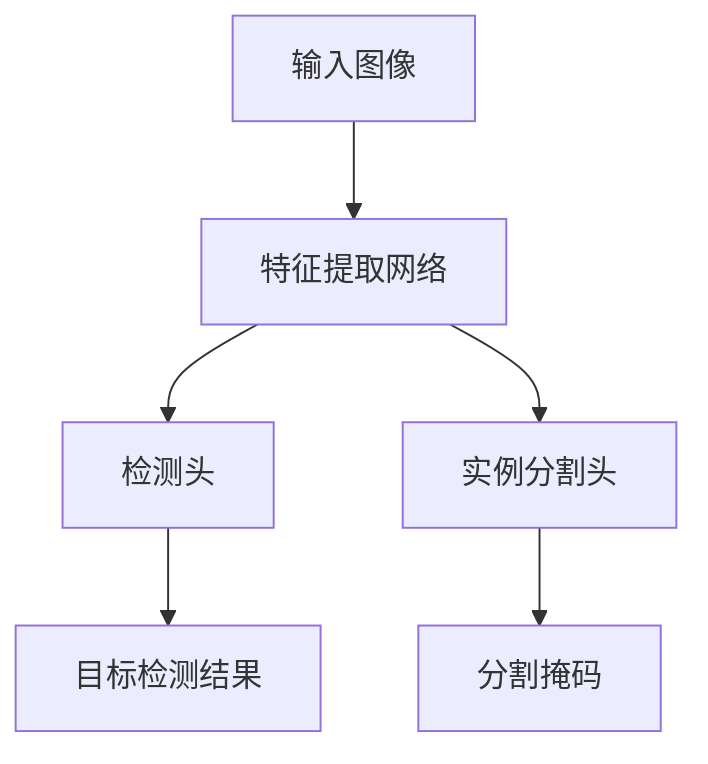

# YOLOv8实例分割：精确定位目标的每个像素

作者：禅与计算机程序设计艺术

## 1.背景介绍

### 1.1 深度学习与计算机视觉

近年来，深度学习在计算机视觉领域取得了显著进展。计算机视觉技术广泛应用于自动驾驶、医疗影像分析、智能监控等领域。目标检测与实例分割是计算机视觉中的两项核心任务。目标检测旨在识别图像中的目标并给出其边界框，而实例分割不仅要识别目标，还要精确到像素级别地分割每个目标。

### 1.2 YOLO系列算法的演进

YOLO（You Only Look Once）系列算法自提出以来，以其快速且准确的目标检测能力，受到了广泛关注。YOLOv1到YOLOv7版本不断优化和改进，提升了目标检测的精度和速度。YOLOv8作为最新版本，引入了实例分割功能，使其在目标检测的基础上，进一步实现了像素级别的精确定位。

### 1.3 实例分割的挑战与意义

实例分割任务面临的主要挑战包括：复杂背景下的目标分割、目标间的遮挡、目标形状的多样性等。解决这些挑战，不仅能提升计算机视觉系统的鲁棒性，还能在自动驾驶、机器人导航等领域发挥重要作用。

## 2.核心概念与联系

### 2.1 YOLOv8概述

YOLOv8在前几代YOLO算法的基础上进行了改进和扩展。它结合了目标检测与实例分割，采用了更为先进的特征提取网络和多尺度特征融合技术，使其在精度和速度上都达到了新的高度。

### 2.2 实例分割的定义

实例分割是一种计算机视觉任务，它不仅需要识别图像中的目标，还需要精确地分割出每个目标的轮廓。与语义分割不同，实例分割需要区分同类别的不同实例。

### 2.3 YOLOv8与实例分割的结合

YOLOv8通过引入实例分割头（Instance Segmentation Head），在目标检测的基础上，进一步实现了对每个目标的像素级别分割。其核心思想是利用目标检测框架中的特征图，通过多层卷积和上采样操作，生成高分辨率的分割掩码。

## 3.核心算法原理具体操作步骤

### 3.1 网络架构

YOLOv8的网络架构包括三个主要部分：特征提取网络、检测头和实例分割头。特征提取网络采用了改进的CSPDarknet作为骨干网络，检测头负责目标检测，实例分割头负责生成分割掩码。



### 3.2 特征提取网络

特征提取网络采用了CSPDarknet架构，通过引入跨阶段部分网络（CSPNet），有效地减少了计算量和参数量，同时提升了特征提取的能力。

### 3.3 检测头

检测头采用了多尺度特征融合技术，通过不同尺度的特征图进行目标检测，提升了对不同大小目标的检测能力。具体来说，检测头包括三个尺度的特征图，每个特征图都进行目标检测，生成边界框和类别信息。

### 3.4 实例分割头

实例分割头通过多层卷积和上采样操作，将特征图逐步恢复到高分辨率，生成每个目标的分割掩码。具体操作步骤如下：

1. 从特征提取网络获取特征图。
2. 通过多层卷积和上采样操作，将特征图逐步恢复到高分辨率。
3. 生成每个目标的分割掩码。

## 4.数学模型和公式详细讲解举例说明

### 4.1 YOLOv8的损失函数

YOLOv8的损失函数包括三个部分：边界框回归损失、分类损失和分割损失。总损失函数可以表示为：

$$
L = L_{box} + L_{cls} + L_{mask}
$$

其中，$L_{box}$ 是边界框回归损失，$L_{cls}$ 是分类损失，$L_{mask}$ 是分割损失。

### 4.2 边界框回归损失

边界框回归损失采用的是GIoU损失，定义如下：

$$
L_{box} = 1 - \text{GIoU}(B, B_{gt})
$$

其中，$B$ 是预测的边界框，$B_{gt}$ 是真实的边界框，GIoU是广义交并比。

### 4.3 分类损失

分类损失采用的是交叉熵损失，定义如下：

$$
L_{cls} = - \sum_{i=1}^{C} y_i \log(p_i)
$$

其中，$C$ 是类别数，$y_i$ 是真实标签，$p_i$ 是预测概率。

### 4.4 分割损失

分割损失采用的是二值交叉熵损失，定义如下：

$$
L_{mask} = - \sum_{i=1}^{N} \left[ y_i \log(p_i) + (1 - y_i) \log(1 - p_i) \right]
$$

其中，$N$ 是像素数，$y_i$ 是真实的分割掩码，$p_i$ 是预测的分割掩码。

## 5.项目实践：代码实例和详细解释说明

### 5.1 环境配置

在开始项目实践之前，需要配置好开发环境。以下是环境配置的具体步骤：

1. 安装Python 3.8或以上版本。
2. 安装PyTorch 1.10或以上版本。
3. 安装YOLOv8所需的依赖库。

```bash
pip install torch torchvision
pip install yolo-v8
```

### 5.2 数据准备

为了进行实例分割训练，需要准备好训练数据。训练数据应包括输入图像和对应的分割掩码。以下是数据准备的具体步骤：

1. 收集并标注数据集。
2. 将数据集划分为训练集和验证集。
3. 将数据集组织成YOLOv8所需的格式。

### 5.3 模型训练

以下是YOLOv8实例分割模型的训练代码示例：

```python
import torch
from yolo_v8 import YOLOv8

# 加载训练数据
train_dataset = ...

# 初始化模型
model = YOLOv8(num_classes=80)

# 定义优化器和损失函数
optimizer = torch.optim.Adam(model.parameters(), lr=0.001)
criterion = model.loss_function

# 训练模型
for epoch in range(num_epochs):
    for images, targets in train_loader:
        optimizer.zero_grad()
        outputs = model(images)
        loss = criterion(outputs, targets)
        loss.backward()
        optimizer.step()
    print(f'Epoch [{epoch+1}/{num_epochs}], Loss: {loss.item():.4f}')
```

### 5.4 模型评估

训练完成后，需要对模型进行评估。以下是模型评估的代码示例：

```python
# 加载验证数据
val_dataset = ...

# 评估模型
model.eval()
with torch.no_grad():
    for images, targets in val_loader:
        outputs = model(images)
        # 计算评估指标
        ...
```

### 5.5 模型推理

训练和评估完成后，可以使用模型进行推理。以下是模型推理的代码示例：

```python
# 加载测试图像
test_image = ...

# 进行推理
model.eval()
with torch.no_grad():
    output = model(test_image)
    # 可视化分割结果
    ...
```

## 6.实际应用场景

### 6.1 自动驾驶

在自动驾驶领域，实例分割技术可以帮助车辆精确识别和分割道路上的行人、车辆、交通标志等目标，提升自动驾驶系统的安全性和可靠性。

### 6.2 医疗影像分析

在医疗影像分析中，实例分割技术可以用于精确分割病变区域，如肿瘤、病灶等，辅助医生进行诊断和治疗规划。

### 6.3 智能监控

在智能监控系统中，实例分割技术可以用于精确识别和跟踪监控画面中的人物和物品，提升监控系统的智能化水平。

## 7.工具和资源推荐

### 7.1 工具推荐

