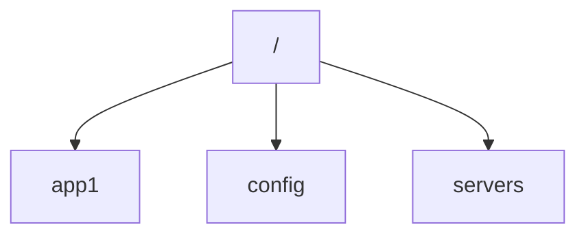

# Zookeeper分布式协调服务原理与代码实例讲解

## 1.背景介绍

### 1.1 什么是分布式系统

在当今时代，随着业务规模和用户量的不断增长,单个服务器已经无法满足高并发、高可用性的需求。分布式系统应运而生,将原本运行在单个进程上的应用程序分布到多个节点上运行,以提高系统的可靠性和扩展性。

分布式系统是由多个计算机组件(节点)组成的软件系统,这些计算机组件通过网络协同工作,对外提供统一的服务。分布式系统的优势包括:

- 高可用性(High Availability)
- 可伸缩性(Scalability)
- 容错性(Fault Tolerance)

### 1.2 分布式系统面临的挑战

然而,构建一个可靠的分布式系统并非易事。由于节点之间通过网络进行通信,分布式系统会面临一些独有的挑战:

- 网络分区(Network Partition)
- 节点故障(Node Failure)
- 数据一致性(Data Consistency)

为了解决这些挑战,分布式系统需要一种协调机制,以确保各个节点能够正确、高效地协作。这就是Zookeeper的用武之地。

### 1.3 Zookeeper简介

Zookeeper是一个开源的分布式协调服务,为分布式应用提供高效可靠的协调服务。它主要用于解决分布式环境下的数据管理、集群管理、分布式同步等问题。Zookeeper本身也是一个分布式系统,由一个领导者(Leader)和多个跟随者(Follower)组成。

Zookeeper的设计目标是:

- 简单可靠:它的核心是一个精简的文件系统,支持诸如数据节点(znode)、监视器(watcher)等功能。
- 高性能:采用内存数据库和非阻塞IO,提供高吞吐和低延迟。
- 可伸缩:支持水平扩展,增加更多的机器来提高整体性能。

## 2.核心概念与联系 

### 2.1 数据模型

Zookeeper维护一个类似于文件系统的数据结构,称为数据树(Data Tree)。数据树由一系列数据节点(znode)组成,每个节点可以存储数据和元数据(stat)。如下图所示:



每个数据节点可以拥有子节点,从而形成一个层次化的名字空间。节点路径用"/"分隔,如"/app1/p1"。

### 2.2 会话(Session)

为了与Zookeeper服务建立连接,客户端需要创建一个会话(Session)。会话对应一个超时时间,如果在该时间内客户端与服务器之间没有任何通信,服务器将认为会话已过期并删除相关数据。

会话是通过会话ID(sessionId)和密码(password)来标识的。这些信息在连接建立时由服务器返回给客户端。

### 2.3 监视器(Watcher)

客户端可以在指定的znode上设置监视器(Watcher),一旦该节点的数据发生变化,服务器会通知所有设置了监视器的客户端。这种通知机制是Zookeeper实现分布式协调的关键。

监视器是一次性触发的,一旦被触发就会从服务器移除。如果客户端需要持续监视,则必须重新注册新的监视器。

### 2.4 版本控制

每个znode都有一个版本号,随着数据变更自动递增。版本号可以用于实现乐观锁和检测数据是否被其他客户端修改。

## 3.核心算法原理具体操作步骤

### 3.1 Zookeeper原子广播协议

Zookeeper使用原子广播(Atomic Broadcast)协议来确保数据在集群中的一致性。原子广播保证了所有消息被按照相同的顺序传递到每个副本上。

Zookeeper的原子广播协议有两种模式:

1. 消息广播(Broadcast)
2. 增量更新(Incremental Change)

消息广播模式用于事务请求,如创建或删除节点。Zookeeper Leader向所有Follower发送消息并等待过半写入成功后返回结果。

增量更新模式用于节点内容更新。Leader将新数据发送给所有Follower,Follower完成更新后向Leader确认。

### 3.2 选举算法(Leader Election)

Zookeeper使用Zab协议进行Leader选举。选举过程如下:

1. 启动时,所有服务器初始化为Follower状态,开始投票选举Leader。
2. 每个服务器交换其最后已知的epoch和事务ID(zxid)。
3. 持有最新epoch和最高zxid的服务器获胜,成为新的Leader。如果有多个服务器持有相同的信息,则按服务器ID选举。
4. Leader向所有Follower同步最新数据,Follower完成后加入集群。
5. 如果Leader宕机,集群会重新进入选举状态。

### 3.3 数据同步

为了保证数据在集群中的一致性,Zookeeper采用了以下数据同步策略:

1. 写请求首先由Leader处理,生成事务并广播给所有Follower。
2. Follower将写请求持久化到磁盘后向Leader反馈。
3. Leader等待过半Follower完成后,提交事务并向所有Follower发送commit消息。
4. Follower收到commit后,更新内存数据树,并向客户端返回结果。

## 4. 数学模型和公式详细讲解举例说明

### 4.1 Zab协议一致性证明

Zab协议通过以下两个不变量来保证数据一致性:

**不变量1:对于任意服务器S,如果S已经投票给epoch e的leader l,那么S的所有提交的事务都来自于epoch <= e的leader。**

形式化表述为:
$$\forall s \in \text{Servers}, \forall l \in \text{Leaders}, \forall e \in \text{Epochs}, \text{voted}(s,e,l) \Rightarrow \forall t \in \text{transactions}, \text{committed}(s,t) \Rightarrow \text{epoch}(t) \leq e$$

**不变量2:如果存在一个epoch e,e中至少有一个事务被所有服务器提交,那么对于任意更高的epoch e',其leader必须是e中已提交事务的一个服务器。**

形式化表述为:
$$\forall e,e' \in \text{Epochs}, e' > e \land \exists t \in \text{transactions}, \text{committed}(\text{Quorum},t) \land \text{epoch}(t) = e \Rightarrow \exists s \in \text{Servers}, \text{leader}(e') = s \land \text{committed}(s,t)$$

通过数学归纳法可以证明,如果上述两个不变量成立,那么Zab协议就可以保证数据在集群中的一致性。

### 4.2 Zab协议消息复杂度分析

假设有N个服务器,每次写请求需要广播2N条消息(Proposal和Commit),那么:

- 最好情况下,只需要2N条消息即可完成一次写入。
- 最坏情况下,如果Leader频繁变更,每次写入都需要先进行一次Leader选举,那么消息复杂度为O(N^2)。

因此,Zab协议的消息复杂度为O(N)~O(N^2),与集群大小N成正比。这表明Zab协议的性能在较大的集群中会受到影响,需要通过水平扩展等手段进行优化。

## 4. 项目实践:代码实例和详细解释说明

在这一部分,我们将通过一个基于Apache Curator的示例项目来展示如何使用Zookeeper Java客户端API。Curator是一个流行的Zookeeper客户端框架,提供了连接重试、反复执行等高级特性。

### 4.1 建立Zookeeper连接

首先,我们需要建立与Zookeeper服务器的连接。Curator提供了`RetryPolicy`来控制重试策略。

```java
// 重试策略:初始重试间隔为1秒,之后重试间隔逐渐增大
RetryPolicy retryPolicy = new ExponentialBackoffRetry(1000, 3);

// 创建Zookeeper连接
CuratorFramework client = CuratorFrameworkFactory.newClient(
    "127.0.0.1:2181", 5000, 3000, retryPolicy);
client.start();
```

### 4.2 创建Znode

我们可以使用`create()`方法在Zookeeper中创建一个新的Znode。

```java
// 创建一个临时节点
client.create()
    .withMode(CreateMode.EPHEMERAL)
    .forPath("/temp", "hello".getBytes());

// 创建一个持久节点
client.create()
    .forPath("/app1", "world".getBytes());
```

`CreateMode`指定了Znode的类型,包括持久节点(PERSISTENT)和临时节点(EPHEMERAL)。临时节点在客户端会话结束时会被自动删除。

### 4.3 读取Znode数据

使用`getData()`方法可以读取Znode的数据和元数据(stat)。

```java
// 获取Znode数据
byte[] data = client.getData().forPath("/app1");
String value = new String(data);

// 获取Znode元数据
Stat stat = new Stat();
data = client.getData().storingStatIn(stat).forPath("/app1");
```

### 4.4 监视Znode变化

我们可以设置`Watcher`来监视特定Znode的变化。

```java
// 注册Watcher
client.getData().usingWatcher(new MyWatcher()).forPath("/app1");

class MyWatcher implements CuratorWatcher {
    @Override
    public void process(WatchedEvent event) {
        // 处理Znode变化事件
    }
}
```

每次触发Watcher后,都需要重新注册以保持监视状态。

### 4.5 删除Znode

使用`delete()`方法可以删除一个Znode。

```java
// 删除一个Znode
client.delete().forPath("/temp");

// 删除一个有子节点的Znode
client.delete().deletingChildrenIfNeeded().forPath("/app1");
```

如果要删除一个非空的Znode,需要设置`deletingChildrenIfNeeded()`参数。

通过这个示例项目,我们可以看到如何使用Zookeeper Java客户端API执行基本的CRUD操作和监视Znode变化事件。Curator框架还提供了分布式锁、Leader选举等高级功能,可以大大简化分布式应用的开发。

## 5.实际应用场景

Zookeeper作为一个分布式协调服务,在很多分布式系统中发挥着重要作用。下面列举了一些典型的应用场景:

### 5.1 配置管理

许多分布式系统都需要在运行时动态更新配置。将配置信息存储在Zookeeper中,客户端可以实时监视配置变化并自动更新本地配置。

Zookeeper天生支持推拉模式,可以实现配置的集中式管理和分布式获取。

### 5.2 命名服务

在分布式环境中,需要有一个全局唯一的命名服务来管理资源命名。Zookeeper可以作为这样的命名服务,为分布式节点提供统一的命名规则。

例如,在Hadoop生态系统中,NameNode的主机名和RPC地址等信息就存储在Zookeeper中。

### 5.3 分布式锁

Zookeeper可以用于实现分布式锁,从而确保分布式环境中的某些操作是互斥的。

分布式锁的实现原理是,多个客户端尝试在同一个Znode下创建临时子节点,能够创建成功的客户端则获得锁。当客户端释放锁时,相应的临时节点会被删除。

### 5.4 Leader选举

Zookeeper也可以用于Leader选举,确保分布式集群中有且只有一个Leader提供服务。

Leader选举的基本思路是,多个节点创建临时顺序子节点,序号最小的节点成为Leader。当Leader宕机时,下一个最小序号的节点会被选举为新的Leader。

### 5.5 其他应用

除了上述场景外,Zookeeper还可以用于:

- 分布式队列:使用Znode维护队列
- 分布式通知/协调:使用Watcher实现通知机制

总的来说,只要是需要分布式协调的场景,都可以考虑使用Zookeeper来简化开发。

## 6.工具和资源推荐

### 6.1 Zookeeper客户端

- Apache Curator: 功能丰富的Zookeeper Java客户端库
- Kazoo: 用于Python的Zookeeper客户端库
- Zookeeper.jl: 用于Julia的Zoo