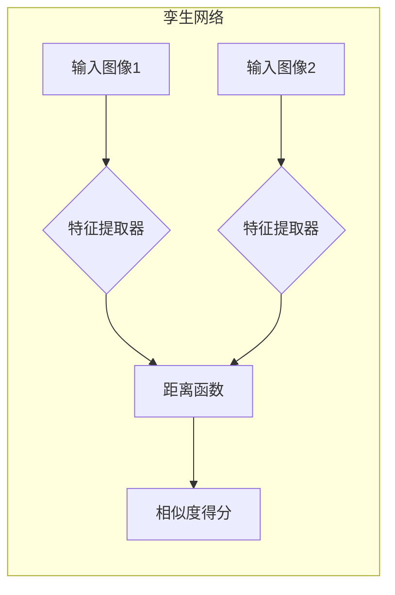
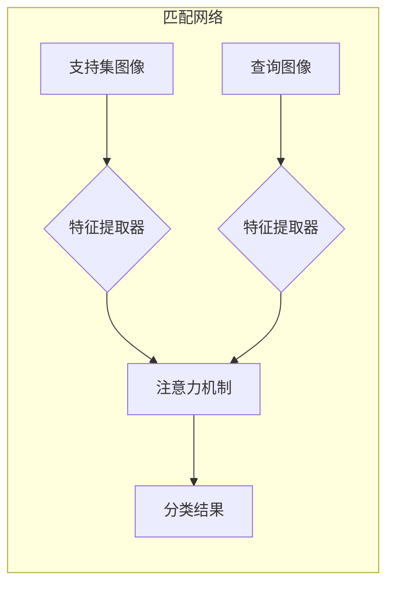

# few-shot原理与代码实战案例讲解

作者：禅与计算机程序设计艺术

## 1. 背景介绍

### 1.1 深度学习的痛点：数据依赖

深度学习在过去十年中取得了巨大的成功，已经在图像识别、自然语言处理、语音识别等领域实现了突破性进展。然而，深度学习模型的训练通常需要大量的标注数据，这对于许多实际应用场景来说是一个巨大的挑战。

例如，在医疗领域，获取大量的标注数据非常困难且昂贵；在金融领域，数据隐私和安全问题使得共享数据变得非常敏感。此外，即使有足够的数据，训练一个复杂的深度学习模型也需要大量的计算资源和时间。

### 1.2  小样本学习：应对数据稀缺的利器

为了解决深度学习对数据的依赖问题，小样本学习（Few-shot Learning）应运而生。小样本学习旨在利用少量样本训练出泛化能力强的模型，从而在数据稀缺的情况下也能取得良好的性能。

### 1.3 few-shot的定义与意义

Few-shot learning，顾名思义，是指在仅有少量样本的情况下，训练模型的能力。这对于许多实际应用场景具有重要意义，例如：

* **冷启动问题:** 新上线的产品或服务往往缺乏足够的历史数据，few-shot learning 可以帮助模型快速学习新任务。
* **个性化推荐:**  用户的个人偏好数据通常较少，few-shot learning 可以根据用户的少量历史行为进行精准推荐。
* **罕见事件预测:** 罕见事件的发生频率低，历史数据稀缺，few-shot learning 可以帮助模型更好地识别和预测此类事件。

## 2. 核心概念与联系

### 2.1  小样本学习的分类

小样本学习可以根据样本数量和任务类型进行分类，常见的分类方法包括：

* **样本数量:** 
    * **Zero-shot Learning:**  零样本学习，即在没有任何训练样本的情况下，模型能够识别新类别。
    * **One-shot Learning:**  单样本学习，即每个类别只有一个训练样本。
    * **Few-shot Learning:** 少样本学习，即每个类别只有少量训练样本，通常为 1 到 5 个。
* **任务类型:**
    * **N-way K-shot classification:**  N 路 K 样本分类，即从 N 个类别中，每个类别有 K 个样本，对测试样本进行分类。
    * **Metric Learning:** 度量学习，通过学习样本之间的距离度量，将测试样本分类到距离最近的类别中。
    * **Meta-Learning:** 元学习，通过学习如何学习，使模型能够快速适应新的任务。

### 2.2  Few-shot 与其他学习范式的关系

Few-shot learning 与其他机器学习范式密切相关，例如：

* **迁移学习 (Transfer Learning):** 迁移学习利用源领域的数据和知识来提高目标领域的学习效果，few-shot learning 可以看作是一种特殊的迁移学习，将每个类别看作一个单独的领域。
* **多任务学习 (Multi-task Learning):** 多任务学习同时学习多个相关任务，并利用任务之间的共性来提高每个任务的学习效果，few-shot learning 可以看作是一种极端的多任务学习，每个类别对应一个任务。
* **元学习 (Meta-Learning):**  元学习旨在学习如何学习，使模型能够快速适应新的任务，few-shot learning 可以利用元学习来学习一个通用的特征提取器或分类器，从而快速适应新的类别。

## 3.  核心算法原理具体操作步骤

### 3.1  基于度量学习的 Few-shot 方法

基于度量学习的 Few-shot 方法是目前最常用的方法之一，其核心思想是学习一个 embedding 空间，使得属于同一类别的样本在 embedding 空间中距离更近，而不同类别的样本距离更远。

#### 3.1.1  孪生网络 (Siamese Networks)

孪生网络是度量学习的经典方法之一，其结构如下图所示：



孪生网络有两个相同的特征提取器，分别处理两个输入样本，然后计算两个样本特征表示之间的距离。训练过程中，最小化相同类别样本之间的距离，最大化不同类别样本之间的距离。

#### 3.1.2  匹配网络 (Matching Networks)

匹配网络是另一种常用的基于度量学习的 Few-shot 方法，其结构如下图所示：



匹配网络使用注意力机制来计算支持集中每个样本与查询样本之间的相似度，然后根据相似度对支持集进行加权求和，得到查询样本的预测结果。

### 3.2  基于元学习的 Few-shot 方法

基于元学习的 Few-shot 方法将 Few-shot learning 问题看作一个元学习问题，通过学习如何学习，使模型能够快速适应新的类别。

#### 3.2.1  MAML (Model-Agnostic Meta-Learning)

MAML 是一种常用的元学习算法，其目标是学习一个模型参数的初始化值，使得模型能够在少量样本上快速微调到最佳状态。

MAML 的训练过程包括两个阶段：

* **内循环 (Inner Loop):** 在每个任务上，使用少量样本对模型参数进行微调。
* **外循环 (Outer Loop):**  根据内循环的更新结果，更新模型参数的初始化值，使得模型能够在新的任务上更快地收敛。

#### 3.2.2  Prototypical Networks

原型网络是一种简单有效的基于元学习的 Few-shot 方法，其核心思想是为每个类别学习一个原型表示，然后将查询样本分类到距离最近的原型表示的类别中。

原型网络的训练过程如下：

* 从每个类别中随机选择一些样本作为支持集，计算每个类别的原型表示，通常为支持集中样本特征表示的平均值。
* 计算查询样本与每个类别原型表示之间的距离，将查询样本分类到距离最近的原型表示的类别中。
* 更新模型参数，最小化分类损失。


## 4. 数学模型和公式详细讲解举例说明

### 4.1  基于度量学习的 Few-shot 方法

#### 4.1.1  孪生网络

孪生网络的目标函数通常为 contrastive loss，其公式如下：

$$
L = \frac{1}{2N} \sum_{i=1}^N \left( y_i d(x_i, x_i') + (1 - y_i) max(0, m - d(x_i, x_i')) \right)
$$

其中：

* $N$ 为样本数量。
* $x_i$ 和 $x_i'$ 为一对输入样本。
* $y_i$ 为标签，相同类别为 1，不同类别为 0。
* $d(x_i, x_i')$ 为两个样本特征表示之间的距离。
* $m$ 为 margin，用于控制不同类别样本之间的距离。

#### 4.1.2  匹配网络

匹配网络使用注意力机制来计算支持集中每个样本与查询样本之间的相似度，其公式如下：

$$
a(x, x_i) = \frac{exp(c(f(x), g(x_i)))}{\sum_{j=1}^k exp(c(f(x), g(x_j)))}
$$

其中：

* $x$ 为查询样本。
* $x_i$ 为支持集中的第 $i$ 个样本。
* $f(x)$ 和 $g(x_i)$ 分别为查询样本和支持集中样本的特征表示。
* $c(f(x), g(x_i))$ 为查询样本和支持集中样本特征表示之间的相似度函数，例如 cosine 相似度。

### 4.2  基于元学习的 Few-shot 方法

#### 4.2.1  MAML

MAML 的目标函数为：

$$
\min_{\theta} \sum_{\mathcal{T}_i \sim p(\mathcal{T})} \mathcal{L}_{\mathcal{T}_i}(\theta')
$$

其中：

* $\theta$ 为模型参数。
* $\mathcal{T}_i$ 为一个任务。
* $p(\mathcal{T})$ 为任务分布。
* $\mathcal{L}_{\mathcal{T}_i}(\theta')$ 为模型在任务 $\mathcal{T}_i$ 上的损失函数，$\theta'$ 为模型参数在任务 $\mathcal{T}_i$ 上微调后的值。

#### 4.2.2  Prototypical Networks

原型网络的目标函数为：

$$
L = -\log p(y=c | x, S)
$$

其中：

* $x$ 为查询样本。
* $y$ 为查询样本的真实类别。
* $c$ 为预测类别。
* $S$ 为支持集。
* $p(y=c | x, S)$ 为查询样本属于类别 $c$ 的概率。

## 5. 项目实践：代码实例和详细解释说明

### 5.1  Omniglot 字符识别

Omniglot 数据集是一个包含 50 种不同语言的 1623 个手写字符数据集，每个字符只有 20 个样本。Omniglot 数据集通常用于 Few-shot learning 算法的评估。

本节将使用 PyTorch 实现一个基于原型网络的 Omniglot 字符识别模型。

#### 5.1.1  数据预处理

```python
import torch
from torch.utils.data import Dataset, DataLoader
from torchvision import transforms
from PIL import Image

class OmniglotDataset(Dataset):
    def __init__(self, data_dir, transform=None):
        self.data_dir = data_dir
        self.transform = transform
        self.img_paths = []
        self.labels = []

        for class_id in range(1623):
            class_dir = os.path.join(data_dir, str(class_id))
            for img_name in os.listdir(class_dir):
                img_path = os.path.join(class_dir, img_name)
                self.img_paths.append(img_path)
                self.labels.append(class_id)

    def __len__(self):
        return len(self.img_paths)

    def __getitem__(self, idx):
        img_path = self.img_paths[idx]
        label = self.labels[idx]

        img = Image.open(img_path)
        if self.transform:
            img = self.transform(img)

        return img, label

# 定义数据预处理
transform = transforms.Compose([
    transforms.Resize((28, 28)),
    transforms.ToTensor(),
    transforms.Normalize(mean=[0.5], std=[0.5])
])

# 创建数据集
train_dataset = OmniglotDataset(data_dir='./omniglot/images_background', transform=transform)
test_dataset = OmniglotDataset(data_dir='./omniglot/images_evaluation', transform=transform)

# 创建数据加载器
train_loader = DataLoader(train_dataset, batch_size=32, shuffle=True)
test_loader = DataLoader(test_dataset, batch_size=32, shuffle=False)
```

#### 5.1.2  模型定义

```python
import torch.nn as nn

class PrototypicalNetwork(nn.Module):
    def __init__(self, in_channels, hidden_size, out_features):
        super(PrototypicalNetwork, self).__init__()
        self.encoder = nn.Sequential(
            nn.Conv2d(in_channels, hidden_size, kernel_size=3, padding=1),
            nn.BatchNorm2d(hidden_size),
            nn.ReLU(),
            nn.MaxPool2d(kernel_size=2),
            nn.Conv2d(hidden_size, hidden_size, kernel_size=3, padding=1),
            nn.BatchNorm2d(hidden_size),
            nn.ReLU(),
            nn.MaxPool2d(kernel_size=2),
        )
        self.out_features = out_features

    def forward(self, x):
        x = self.encoder(x)
        x = x.view(x.size(0), -1)
        return x

    def get_prototypes(self, support_images, support_labels, n_way, n_shot):
        """
        计算每个类别的原型表示
        """
        prototypes = torch.zeros(n_way, self.out_features).to(device)
        for i in range(n_way):
            # 获取当前类别的支持集样本
            class_indices = torch.where(support_labels == i)[0]
            class_images = support_images[class_indices]

            # 计算当前类别的原型表示
            prototypes[i] = torch.mean(self.forward(class_images), dim=0)

        return prototypes
```

#### 5.1.3  训练模型

```python
# 定义设备
device = torch.device('cuda' if torch.cuda.is_available() else 'cpu')

# 创建模型
model = PrototypicalNetwork(in_channels=1, hidden_size=64, out_features=64).to(device)

# 定义优化器和损失函数
optimizer = torch.optim.Adam(model.parameters(), lr=0.001)
loss_fn = nn.CrossEntropyLoss()

# 定义训练循环
def train(model, train_loader, optimizer, loss_fn, n_way, n_shot, n_query):
    model.train()
    for batch_idx, (images, labels) in enumerate(train_loader):
        # 将数据移动到设备
        images = images.to(device)
        labels = labels.to(device)

        # 随机选择类别
        selected_classes = torch.randperm(len(train_dataset.classes))[:n_way]

        # 构建支持集和查询集
        support_images = []
        support_labels = []
        query_images = []
        query_labels = []
        for i, class_id in enumerate(selected_classes):
            # 获取当前类别的样本索引
            class_indices = torch.where(labels == class_id)[0]

            # 随机选择支持集和查询集样本
            selected_indices = torch.randperm(len(class_indices))
            support_indices = class_indices[selected_indices[:n_shot]]
            query_indices = class_indices[selected_indices[n_shot:n_shot + n_query]]

            # 将样本添加到支持集和查询集中
            support_images.append(images[support_indices])
            support_labels.append(torch.tensor([i] * n_shot).to(device))
            query_images.append(images[query_indices])
            query_labels.append(torch.tensor([i] * n_query).to(device))

        # 将支持集和查询集转换为张量
        support_images = torch.cat(support_images, dim=0)
        support_labels = torch.cat(support_labels, dim=0)
        query_images = torch.cat(query_images, dim=0)
        query_labels = torch.cat(query_labels, dim=0)

        # 计算原型表示
        prototypes = model.get_prototypes(support_images, support_labels, n_way, n_shot)

        # 计算查询样本与每个原型表示之间的距离
        distances = torch.cdist(model(query_images), prototypes)

        # 计算损失函数
        loss = loss_fn(-distances, query_labels)

        # 反向传播和参数更新
        optimizer.zero_grad()
        loss.backward()
        optimizer.step()

        # 打印训练信息
        if batch_idx % 100 == 0:
            print('Train Epoch: {} [{}/{} ({:.0f}%)]\tLoss: {:.6f}'.format(
                epoch, batch_idx * len(images), len(train_loader.dataset),
                100. * batch_idx / len(train_loader), loss.item()))

# 训练模型
n_way = 5
n_shot = 5
n_query = 15
for epoch in range(10):
    train(model, train_loader, optimizer, loss_fn, n_way, n_shot, n_query)
```

#### 5.1.4  测试模型

```python
# 定义测试循环
def test(model, test_loader, loss_fn, n_way, n_shot, n_query):
    model.eval()
    test_loss = 0
    correct = 0
    with torch.no_grad():
        for batch_idx, (images, labels) in enumerate(test_loader):
            # 将数据移动到设备
            images = images.to(device)
            labels = labels.to(device)

            # 随机选择类别
            selected_classes = torch.randperm(len(test_dataset.classes))[:n_way]

            # 构建支持集和查询集
            support_images = []
            support_labels = []
            query_images = []
            query_labels = []
            for i, class_id in enumerate(selected_classes):
                