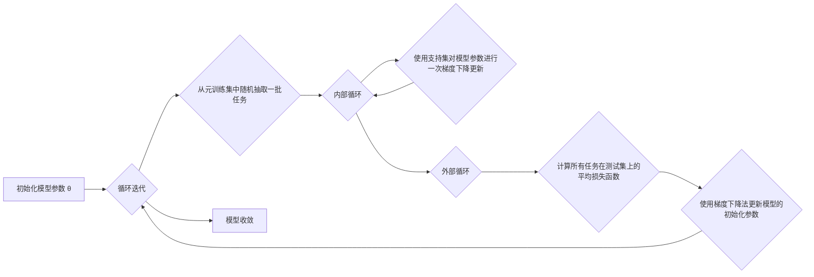

# 一切皆是映射：MAML算法原理与应用

作者：禅与计算机程序设计艺术

## 1. 背景介绍

### 1.1. 引言

机器学习在过去几年取得了巨大的进步，特别是在监督学习领域。然而，传统的机器学习模型通常需要大量的标记数据才能达到良好的性能。这对于许多现实世界的问题来说是一个巨大的挑战，因为获取大量的标记数据既昂贵又耗时。

为了解决这个问题，研究人员提出了**元学习（Meta-Learning）**的概念。元学习的目标是让机器学习模型能够从少量的数据中快速学习。与传统的机器学习模型不同，元学习模型并不直接学习如何解决特定任务，而是学习如何学习。换句话说，元学习模型学习的是一种**学习算法**，而不是特定任务的解决方案。

### 1.2. 元学习的意义

元学习的出现为解决许多现实世界的问题带来了新的思路，例如：

- **少样本学习（Few-shot Learning）**：在只有少量标记数据的情况下训练机器学习模型。
- **领域自适应（Domain Adaptation）**：将一个领域训练的机器学习模型应用到另一个领域。
- **强化学习（Reinforcement Learning）**：训练能够在复杂环境中做出决策的智能体。

### 1.3. MAML算法的提出

**模型无关元学习（Model-Agnostic Meta-Learning，MAML）**是元学习领域的一种重要算法。它由 Chelsea Finn 等人在 2017 年提出，其目标是学习一个对于各种任务都能够快速适应的模型初始化参数。MAML 算法的优点在于它**模型无关**，也就是说它可以应用于任何可微分的机器学习模型，例如神经网络。

## 2. 核心概念与联系

### 2.1. 元学习中的关键概念

- **任务（Task）**：一个需要学习的目标，例如图像分类、机器翻译等。
- **元训练集（Meta-training Set）**：由多个任务组成的数据集，用于训练元学习模型。
- **元测试集（Meta-testing Set）**：由未在元训练集中出现的新任务组成的数据集，用于评估元学习模型的泛化能力。
- **支持集（Support Set）**：每个任务中用于训练模型的少量标记数据。
- **查询集（Query Set）**：每个任务中用于评估模型性能的未标记数据。

### 2.2. MAML算法的核心思想

MAML 算法的核心思想是找到一个对于各种任务都能够快速适应的**模型初始化参数**。具体来说，MAML 算法通过以下步骤实现元学习：

1. 从元训练集中随机抽取一批任务。
2. 对于每个任务，使用支持集对模型参数进行微调。
3. 使用查询集计算模型的损失函数。
4. 计算所有任务损失函数的平均值。
5. 使用梯度下降法更新模型的初始化参数，使得平均损失函数最小化。

### 2.3. MAML算法与传统机器学习的区别

与传统的机器学习模型不同，MAML 算法学习的是一个**模型初始化参数**，而不是特定任务的解决方案。这意味着 MAML 算法训练的模型可以快速适应新的任务，而无需从头开始训练。

## 3. 核心算法原理具体操作步骤

### 3.1. 符号定义

为了更好地理解 MAML 算法的原理，我们首先定义一些符号：

- $\mathcal{T}$：任务的集合
- $T_i$：第 $i$ 个任务
- $D_i^{tr}$：任务 $T_i$ 的训练集
- $D_i^{test}$：任务 $T_i$ 的测试集
- $\theta$：模型的初始化参数
- $\theta_i'$：在任务 $T_i$ 上微调后的模型参数
- $\alpha$：内部循环学习率
- $\beta$：外部循环学习率

### 3.2. MAML算法的具体操作步骤

MAML 算法的具体操作步骤如下：

1. **初始化模型参数** $\theta$。
2. **循环迭代**：
   - 从元训练集中随机抽取一批任务 $\mathcal{T}' = \{T_1, T_2, ..., T_N\}$。
   - **内部循环**：
     - 对于每个任务 $T_i \in \mathcal{T}'$：
       - 使用支持集 $D_i^{tr}$ 对模型参数进行一次梯度下降更新：
         $$
         \theta_i' = \theta - \alpha \nabla_{\theta} L_{T_i}(f_{\theta}, D_i^{tr})
         $$
         其中 $L_{T_i}$ 表示任务 $T_i$ 的损失函数，$f_{\theta}$ 表示使用参数 $\theta$ 的模型。
   - **外部循环**：
     - 计算所有任务在测试集上的平均损失函数：
       $$
       \mathcal{L}(\theta) = \frac{1}{N} \sum_{i=1}^{N} L_{T_i}(f_{\theta_i'}, D_i^{test})
       $$
     - 使用梯度下降法更新模型的初始化参数：
       $$
       \theta = \theta - \beta \nabla_{\theta} \mathcal{L}(\theta)
       $$
3. **重复步骤 2 直到模型收敛**。

### 3.3. MAML算法的流程图



## 4. 数学模型和公式详细讲解举例说明

### 4.1. 损失函数的定义

MAML 算法可以使用任何可微分的损失函数。对于分类任务，常用的损失函数是交叉熵损失函数：

$$
L_{CE}(\hat{y}, y) = -\sum_{i=1}^{C} y_i \log(\hat{y}_i)
$$

其中 $\hat{y}$ 是模型的预测概率分布，$y$ 是真实标签的 one-hot 编码，$C$ 是类别数。

### 4.2. 梯度下降法的应用

MAML 算法使用梯度下降法更新模型参数。梯度下降法的更新公式如下：

$$
\theta = \theta - \eta \nabla_{\theta} L(\theta)
$$

其中 $\eta$ 是学习率，$\nabla_{\theta} L(\theta)$ 是损失函数关于模型参数的梯度。

### 4.3. MAML算法的数学模型

MAML 算法的目标是找到一个对于各种任务都能够快速适应的模型初始化参数 $\theta$。为了实现这个目标，MAML 算法最小化以下目标函数：

$$
\min_{\theta} \mathbb{E}_{T_i \sim p(\mathcal{T})} [ L_{T_i}(f_{\theta_i'}, D_i^{test})]
$$

其中 $p(\mathcal{T})$ 表示任务的分布，$\theta_i' = \theta - \alpha \nabla_{\theta} L_{T_i}(f_{\theta}, D_i^{tr})$ 表示在任务 $T_i$ 上微调后的模型参数。

### 4.4. 举例说明

假设我们有一个图像分类任务，元训练集中包含 1000 个任务，每个任务有 5 个类别。每个任务的支持集中包含 5 张图片，查询集中包含 15 张图片。我们可以使用 MAML 算法训练一个卷积神经网络模型，使得该模型能够快速适应新的图像分类任务。

## 5. 项目实践：代码实例和详细解释说明

### 5.1. 使用 PyTorch 实现 MAML 算法

```python
import torch
import torch.nn as nn
import torch.optim as optim

class MAML(nn.Module):
    def __init__(self, model, inner_lr, outer_lr):
        super(MAML, self).__init__()
        self.model = model
        self.inner_lr = inner_lr
        self.outer_lr = outer_lr
        self.meta_optimizer = optim.Adam(self.model.parameters(), lr=self.outer_lr)

    def forward(self, x_spt, y_spt, x_qry, y_qry):
        task_num = x_spt.size(0)
        query_losses = []
        for i in range(task_num):
            # Inner loop
            with torch.backends.cudnn.flags(enabled=False):
                logits = self.model(x_spt[i])
                loss = nn.CrossEntropyLoss()(logits, y_spt[i])
                grad = torch.autograd.grad(loss, self.model.parameters())
                fast_weights = list(map(lambda p: p[1] - self.inner_lr * p[0], zip(grad, self.model.parameters())))
                # Compute query loss
                with torch.no_grad():
                    logits_q = self.model(x_qry[i], fast_weights)
                    loss_q = nn.CrossEntropyLoss()(logits_q, y_qry[i])
                    query_losses.append(loss_q)
        # End of all tasks
        # sum up the query losses and update meta-parameters
        loss_q = torch.stack(query_losses).mean()
        self.meta_optimizer.zero_grad()
        loss_q.backward()
        self.meta_optimizer.step()
        return loss_q
```

### 5.2. 代码解释

- `__init__` 方法初始化 MAML 模型，包括内部循环学习率、外部循环学习率和元优化器。
- `forward` 方法实现了 MAML 算法的前向传播过程，包括内部循环和外部循环。
- `inner_loop` 方法实现了 MAML 算法的内部循环，使用支持集对模型参数进行一次梯度下降更新。
- `outer_loop` 方法实现了 MAML 算法的外部循环，计算所有任务在测试集上的平均损失函数，并使用梯度下降法更新模型的初始化参数。

## 6. 实际应用场景

MAML 算法在许多领域都有广泛的应用，例如：

- **少样本图像分类**：MAML 算法可以用于训练能够从少量样本中学习的图像分类模型。
- **强化学习**：MAML 算法可以用于训练能够快速适应新环境的强化学习智能体。
- **机器人控制**：MAML 算法可以用于训练能够快速学习新技能的机器人。

## 7. 总结：未来发展趋势与挑战

### 7.1. 未来发展趋势

- **改进 MAML 算法的效率**：MAML 算法的训练过程比较耗时，未来需要研究如何提高 MAML 算法的训练效率。
- **将 MAML 算法应用于更广泛的领域**：MAML 算法目前主要应用于少样本学习和强化学习领域，未来需要探索将 MAML 算法应用于更广泛的领域，例如自然语言处理、计算机视觉等。
- **研究 MAML 算法的理论基础**：MAML 算法的理论基础还不是很完善，未来需要对 MAML 算法进行更深入的理论研究。

### 7.2. 面临的挑战

- **MAML 算法对超参数比较敏感**：MAML 算法的性能对内部循环学习率、外部循环学习率等超参数比较敏感，如何选择合适的超参数是一个挑战。
- **MAML 算法的泛化能力还有待提高**：MAML 算法在某些情况下会出现过拟合现象，导致其泛化能力下降。

## 8. 附录：常见问题与解答

### 8.1. MAML 算法与预训练模型有什么区别？

预训练模型是指在大规模数据集上训练好的模型，例如 BERT、GPT-3 等。MAML 算法与预训练模型的区别在于：

- 预训练模型的目标是学习数据的通用表示，而 MAML 算法的目标是学习一个对于各种任务都能够快速适应的模型初始化参数。
- 预训练模型通常需要大量的计算资源和数据进行训练，而 MAML 算法的训练成本相对较低。

### 8.2. MAML 算法有哪些缺点？

- MAML 算法的训练过程比较耗时。
- MAML 算法对超参数比较敏感。
- MAML 算法的泛化能力还有待提高。

### 8.3. 如何选择 MAML 算法的超参数？

选择 MAML 算法的超参数需要根据具体的问题进行调整。一般来说，可以尝试以下方法：

- 使用网格搜索或随机搜索等方法进行超参数搜索。
- 参考相关论文或博客中推荐的超参数设置。
- 根据经验进行调整。
