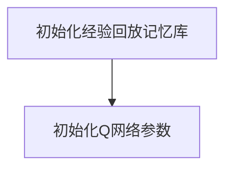
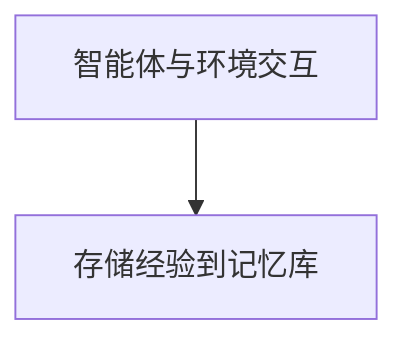
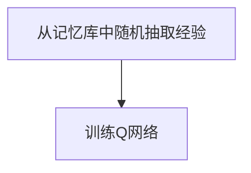
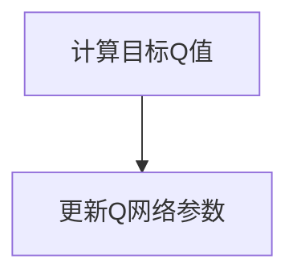

# 一切皆是映射：强化学习中的不稳定性和方差问题：DQN案例研究

作者：禅与计算机程序设计艺术

## 1.背景介绍

### 1.1 强化学习的崛起

强化学习（Reinforcement Learning, RL）是一种机器学习的分支，旨在通过智能体与环境的交互来学习策略，以最大化累积奖励。近年来，RL在多个领域取得了显著的进展，包括游戏、机器人控制和自动驾驶等。

### 1.2 深度Q网络（DQN）的诞生

深度Q网络（Deep Q-Network, DQN）由DeepMind团队提出，是RL领域的一个里程碑。DQN结合了深度学习和Q学习，通过深度神经网络来近似Q值函数，从而在高维状态空间中实现了有效的策略学习。然而，DQN也暴露了一些问题，如训练不稳定性和高方差，这些问题限制了其在实际应用中的表现。

### 1.3 问题定义

本文将深入探讨DQN中的不稳定性和方差问题，分析其产生的原因，并提出解决这些问题的方法。我们将通过具体的案例研究和数学模型来揭示这些问题的本质，并提供实用的解决方案和最佳实践。

## 2.核心概念与联系

### 2.1 强化学习的基本概念

#### 2.1.1 状态、动作和奖励

在RL中，智能体通过在不同状态下执行动作来与环境交互，并根据环境反馈的奖励来调整策略。状态（State）表示环境的当前情况，动作（Action）是智能体在当前状态下可以执行的操作，奖励（Reward）是环境对智能体动作的反馈。

#### 2.1.2 策略和价值函数

策略（Policy）是智能体选择动作的规则，可以是确定性的或随机的。价值函数（Value Function）用于评估在某一状态或执行某一动作时的期望累积奖励。

### 2.2 深度Q网络（DQN）

#### 2.2.1 Q学习

Q学习是一种无模型的RL算法，通过更新Q值表来学习最优策略。Q值表示在某一状态下执行某一动作的期望累积奖励。

#### 2.2.2 深度神经网络的引入

DQN使用深度神经网络来近似Q值函数，从而在高维状态空间中实现了有效的策略学习。DQN的核心是通过经验回放和目标网络来稳定训练过程。

### 2.3 不稳定性和方差问题的定义

#### 2.3.1 不稳定性

不稳定性指的是训练过程中模型参数剧烈波动，导致策略无法收敛或收敛速度极慢。

#### 2.3.2 方差

方差是指模型在不同训练过程中表现出的差异性，高方差意味着模型的表现不一致，难以在实际应用中稳定发挥。

## 3.核心算法原理具体操作步骤

### 3.1 DQN算法步骤

#### 3.1.1 初始化

初始化经验回放记忆库和Q网络的参数。



#### 3.1.2 交互与存储

智能体与环境交互，并将经验存储到记忆库中。



#### 3.1.3 经验回放

从记忆库中随机抽取小批量经验进行训练。



#### 3.1.4 更新Q值

使用Bellman方程更新Q值。



### 3.2 经验回放和目标网络

#### 3.2.1 经验回放

经验回放通过随机抽取经验来打破数据相关性，减小模型训练的不稳定性。

#### 3.2.2 目标网络

目标网络用于计算目标Q值，定期更新以减小目标值的波动。

## 4.数学模型和公式详细讲解举例说明

### 4.1 Bellman方程

Bellman方程是Q学习的核心，用于更新Q值：

$$
Q(s, a) = r + \gamma \max_{a'} Q(s', a')
$$

其中，$s$ 是当前状态，$a$ 是当前动作，$r$ 是即时奖励，$\gamma$ 是折扣因子，$s'$ 是下一状态，$a'$ 是下一动作。

### 4.2 损失函数

DQN的损失函数用于衡量预测Q值和目标Q值之间的差异：

$$
L(\theta) = \mathbb{E}[(r + \gamma \max_{a'} Q(s', a'; \theta^-) - Q(s, a; \theta))^2]
$$

其中，$\theta$ 是Q网络的参数，$\theta^-$ 是目标网络的参数。

### 4.3 方差分析

方差分析用于评估模型在不同训练过程中的表现差异：

$$
\sigma^2 = \frac{1}{N} \sum_{i=1}^N (x_i - \mu)^2
$$

其中，$N$ 是样本数量，$x_i$ 是样本值，$\mu$ 是样本均值。

## 5.项目实践：代码实例和详细解释说明

### 5.1 环境设置

使用OpenAI Gym创建环境：

```python
import gym

env = gym.make('CartPole-v1')
```

### 5.2 Q网络定义

使用TensorFlow或PyTorch定义Q网络：

```python
import tensorflow as tf
from tensorflow.keras import layers

def create_q_network(input_shape, num_actions):
    model = tf.keras.Sequential([
        layers.Input(shape=input_shape),
        layers.Dense(24, activation='relu'),
        layers.Dense(24, activation='relu'),
        layers.Dense(num_actions, activation='linear')
    ])
    return model
```

### 5.3 训练过程

定义训练过程，包括经验回放和目标网络更新：

```python
import numpy as np
import random

memory = []
gamma = 0.99
epsilon = 1.0
epsilon_min = 0.01
epsilon_decay = 0.995

for episode in range(1000):
    state = env.reset()
    done = False
    while not done:
        if np.random.rand() <= epsilon:
            action = np.random.choice(env.action_space.n)
        else:
            action = np.argmax(q_network.predict(state)[0])
        
        next_state, reward, done, _ = env.step(action)
        memory.append((state, action, reward, next_state, done))
        
        if len(memory) > batch_size:
            minibatch = random.sample(memory, batch_size)
            for state, action, reward, next_state, done in minibatch:
                target = reward
                if not done:
                    target += gamma * np.amax(target_q_network.predict(next_state)[0])
                target_f = q_network.predict(state)
                target_f[0][action] = target
                q_network.fit(state, target_f, epochs=1, verbose=0)
        
        if epsilon > epsilon_min:
            epsilon *= epsilon_decay
```

### 5.4 模型评估

评估模型在测试环境中的表现：

```python
total_rewards = []
for episode in range(100):
    state = env.reset()
    total_reward = 0
    done = False
    while not done:
        action = np.argmax(q_network.predict(state)[0])
        next_state, reward, done, _ = env.step(action)
        total_reward += reward
        state = next_state
    total_rewards.append(total_reward)

print(f'Average Reward: {np.mean(total_rewards)}')
```

## 6.实际应用场景

### 6.1 游戏AI

DQN在游戏AI中得到了广泛应用，如Atari游戏中的超级人类表现。

### 6.2 机器人控制

DQN用于机器人控制，实现了复杂任务的自动化，如机械臂抓取和无人机飞行。

### 6.3 自动驾驶

DQN在自动驾驶中用于决策和路径规划，提高了车辆的安全性和效率。

## 7.工具和资源推荐

### 7.1 开源库

#### 7.1.1 OpenAI Gym

OpenAI Gym提供了丰富的环境，用于RL算法的测试和评估。

#### 7.1.2 TensorFlow和PyTorch

TensorFlow和PyTorch是两大主流深度学习框架，支持DQN的实现和训练。

### 7.2 在线课程

#### 7.2.1 Coursera

Coursera上的强化学习课程涵盖了从基础到高级的内容，适合不同层次的学习者。

#### 7.2