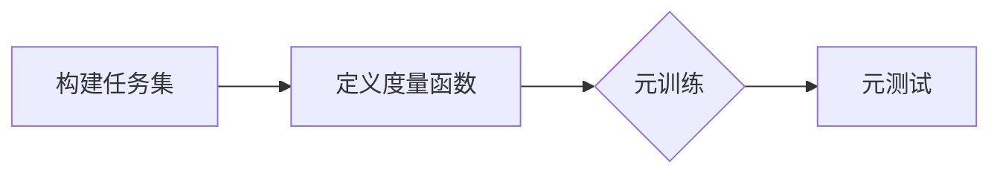
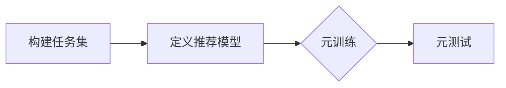

# 一切皆是映射：通过元学习提升个性化推荐系统性能

作者：禅与计算机程序设计艺术

## 1. 背景介绍

### 1.1.  个性化推荐系统的兴起与挑战

随着互联网的飞速发展，信息过载问题日益严峻，人们迫切需要一种能够从海量信息中快速找到自己感兴趣内容的技术。个性化推荐系统应运而生，并迅速成为电商、社交媒体、新闻门户等众多互联网平台的标配。

个性化推荐系统旨在根据用户的历史行为、兴趣偏好等信息，向用户推荐其可能感兴趣的商品或内容。然而，传统的推荐系统面临着诸多挑战：

* **数据稀疏性:** 新用户或冷启动商品缺乏足够的历史交互数据，难以进行准确的推荐。
* **冷启动问题:** 新上线的商品或服务缺乏用户交互数据，难以被推荐给潜在用户。
* **可解释性:**  许多推荐算法缺乏透明度，难以解释推荐结果背后的原因。
* **可扩展性:**  随着用户和商品数量的爆炸式增长，传统推荐算法在计算效率和存储空间上面临巨大挑战。

### 1.2.  元学习：一种解决个性化推荐系统挑战的新思路

元学习（Meta-Learning），又称为“学习如何学习”，近年来在机器学习领域受到了广泛关注。与传统的机器学习方法不同，元学习的目标并非学习一个能够在特定任务上表现良好的模型，而是学习一种能够快速适应新任务的“学习算法”。

将元学习应用于个性化推荐系统，可以将每个用户或每个商品都视为一个独立的学习任务。通过学习大量用户或商品的个性化偏好模式，元学习模型能够快速适应新的用户或商品，从而有效解决数据稀疏性和冷启动问题。

### 1.3.  本文目标与结构

本文将深入探讨如何利用元学习技术提升个性化推荐系统的性能，并详细介绍几种基于元学习的推荐算法。

本文结构如下：

* **第二章：核心概念与联系** 将介绍元学习、推荐系统、嵌入表示等核心概念，并阐述它们之间的内在联系。
* **第三章：核心算法原理具体操作步骤** 将详细介绍几种基于元学习的推荐算法，包括基于度量学习的元学习推荐、基于模型无关元学习的推荐等。
* **第四章：数学模型和公式详细讲解举例说明** 将对元学习推荐算法中涉及的数学模型和公式进行详细讲解，并结合具体实例进行说明。
* **第五章：项目实践：代码实例和详细解释说明** 将提供基于Python和TensorFlow/PyTorch的元学习推荐算法代码实例，并给出详细的解释说明。
* **第六章：实际应用场景** 将介绍元学习推荐算法在电商、社交媒体、新闻推荐等领域的实际应用场景。
* **第七章：工具和资源推荐** 将推荐一些常用的元学习推荐算法工具包和学习资源。
* **第八章：总结：未来发展趋势与挑战**  将总结元学习推荐算法的优势和局限性，并展望其未来发展趋势和挑战。
* **第九章：附录：常见问题与解答**  将解答一些读者在学习和应用元学习推荐算法过程中可能遇到的常见问题。

## 2. 核心概念与联系

### 2.1. 元学习：学习如何学习

元学习是一种机器学习方法，其目标是学习一种能够快速适应新任务的“学习算法”。与传统的机器学习方法不同，元学习并不直接学习一个能够在特定任务上表现良好的模型，而是学习一种能够从少量数据中快速学习新任务的算法。

元学习可以类比为人类的学习过程。人类在学习新知识时，往往会借鉴以往的学习经验，从而更快地掌握新知识。例如，一个学习过骑自行车的人，在学习骑摩托车时，会比没有骑过自行车的人更容易上手。这是因为骑自行车和骑摩托车在平衡控制等方面存在着相似性，学习过骑自行车的人可以将这些经验迁移到骑摩托车的学习中。

元学习的目标就是让机器也具备这种“学习如何学习”的能力。通过学习大量不同但相关的任务，元学习模型可以学习到一种通用的学习算法，这种算法可以快速适应新的任务，即使新任务的数据非常少。

### 2.2. 推荐系统：个性化推荐

推荐系统是一种信息过滤系统，其目标是从海量信息中筛选出用户可能感兴趣的信息，并推荐给用户。推荐系统广泛应用于电商、社交媒体、新闻门户等众多互联网平台。

个性化推荐系统是一种特殊的推荐系统，它会根据用户的历史行为、兴趣偏好等信息，向用户推荐其可能感兴趣的商品或内容。例如，亚马逊会根据用户的浏览历史、购买记录等信息，向用户推荐其可能感兴趣的商品。

### 2.3. 嵌入表示：将用户和商品映射到低维空间

嵌入表示（Embedding）是一种将离散变量（例如，用户ID、商品ID）映射到连续向量空间的技术。在推荐系统中，嵌入表示可以将用户和商品映射到一个低维向量空间，从而方便计算用户和商品之间的相似度。

例如，假设我们有一个电商平台，平台上有100万个用户和1000万个商品。我们可以使用嵌入表示将每个用户和每个商品都映射到一个128维的向量空间。这样，我们就可以使用向量之间的距离来衡量用户和商品之间的相似度。

### 2.4. 元学习与推荐系统的联系

元学习可以应用于个性化推荐系统，以解决传统推荐系统面临的挑战。具体来说，元学习可以用于：

* **解决数据稀疏性和冷启动问题:**  元学习模型可以学习到一种通用的用户偏好模式，这种模式可以用于预测新用户或冷启动商品的评分。
* **提高推荐结果的可解释性:**  一些元学习算法可以提供推荐结果的可解释性，例如，解释哪些用户特征或商品特征对推荐结果的影响最大。
* **增强推荐系统的鲁棒性:**  元学习模型对噪声数据和异常值具有更强的鲁棒性。

## 3. 核心算法原理具体操作步骤

### 3.1.  基于度量学习的元学习推荐

#### 3.1.1 算法原理

基于度量学习的元学习推荐算法将每个用户或每个商品都视为一个独立的学习任务，并学习一个度量函数，该函数可以衡量不同任务之间的相似度。

#### 3.1.2 具体操作步骤

1. **构建任务集:** 将每个用户或每个商品的历史交互数据视为一个独立的任务。
2. **定义度量函数:**  选择一个合适的度量函数，例如欧氏距离、余弦相似度等。
3. **元训练:**  使用任务集中的部分任务训练元学习模型，学习目标是最小化不同任务之间度量函数的值。
4. **元测试:**  使用任务集中剩余的任务评估元学习模型的性能，例如，预测新用户或冷启动商品的评分。

#### 3.1.3 算法流程图



### 3.2.  基于模型无关元学习的推荐

#### 3.2.1 算法原理

基于模型无关元学习的推荐算法不依赖于特定的推荐模型，而是学习一种通用的模型初始化方法，该方法可以使推荐模型在新的用户或商品上快速收敛。

#### 3.2.2 具体操作步骤

1. **构建任务集:** 将每个用户或每个商品的历史交互数据视为一个独立的任务。
2. **定义推荐模型:** 选择一个合适的推荐模型，例如矩阵分解、协同过滤等。
3. **元训练:**  使用任务集中的部分任务训练元学习模型，学习目标是最小化推荐模型在所有任务上的损失函数。
4. **元测试:**  使用任务集中剩余的任务评估元学习模型的性能，例如，预测新用户或冷启动商品的评分。

#### 3.2.3 算法流程图



## 4. 数学模型和公式详细讲解举例说明

### 4.1.  基于度量学习的元学习推荐

#### 4.1.1 度量函数

度量函数用于衡量不同任务之间的相似度。常用的度量函数包括：

* **欧氏距离:** 
  $d(x, y) = \sqrt{\sum_{i=1}^{n}(x_i - y_i)^2}$

* **余弦相似度:** 
  $cos(\theta) = \frac{x \cdot y}{||x|| ||y||}$

#### 4.1.2 损失函数

损失函数用于衡量元学习模型的性能。常用的损失函数包括：

* **均方误差损失函数:** 
  $MSE = \frac{1}{n}\sum_{i=1}^{n}(y_i - \hat{y_i})^2$

* **交叉熵损失函数:** 
  $CE = -\frac{1}{n}\sum_{i=1}^{n}[y_i log(\hat{y_i}) + (1 - y_i)log(1 - \hat{y_i})]$

#### 4.1.3 举例说明

假设我们有一个电影推荐系统，我们想使用基于度量学习的元学习算法来解决冷启动问题。

* **构建任务集:**  将每个用户的历史评分数据视为一个独立的任务。
* **定义度量函数:**  使用余弦相似度来衡量不同用户之间的相似度。
* **元训练:**  使用任务集中的部分任务训练元学习模型，学习目标是最小化不同用户之间余弦相似度的值。
* **元测试:**  使用任务集中剩余的任务评估元学习模型的性能，例如，预测新用户对未评分电影的评分。

### 4.2.  基于模型无关元学习的推荐

#### 4.2.1  模型无关元学习

模型无关元学习（Model-Agnostic Meta-Learning，MAML）是一种通用的元学习算法，它可以用于任何可微分的模型。MAML 的目标是学习一个模型参数的初始化值，使得该模型在经过少量梯度下降步骤后，就能在新任务上取得良好的性能。

#### 4.2.2 损失函数

MAML 的损失函数定义为模型在所有任务上的损失函数的和。

#### 4.2.3 举例说明

假设我们有一个电商平台，我们想使用基于模型无关元学习的推荐算法来解决冷启动问题。

* **构建任务集:** 将每个商品的历史销售数据视为一个独立的任务。
* **定义推荐模型:** 使用矩阵分解模型来预测用户对商品的评分。
* **元训练:**  使用任务集中的部分任务训练元学习模型，学习目标是最小化矩阵分解模型在所有任务上的均方误差损失函数。
* **元测试:**  使用任务集中剩余的任务评估元学习模型的性能，例如，预测新商品的销量。

## 5. 项目实践：代码实例和详细解释说明

### 5.1. 基于Python和TensorFlow的代码实例

```python
import tensorflow as tf

# 定义度量函数
def euclidean_distance(a, b):
  return tf.sqrt(tf.reduce_sum(tf.square(a - b), axis=1))

# 定义元学习模型
class MetaLearner(tf.keras.Model):
  def __init__(self, input_dim, embedding_dim):
    super(MetaLearner, self).__init__()
    self.embedding_layer = tf.keras.layers.Dense(embedding_dim, activation='relu')

  def call(self, inputs):
    return self.embedding_layer(inputs)

# 定义元训练函数
def meta_train(model, optimizer, tasks, inner_steps):
  # 遍历所有任务
  for task in tasks:
    with tf.GradientTape() as tape:
      # 获取任务数据
      support_inputs, support_labels = task['support']
      query_inputs, query_labels = task['query']

      # 计算支持集的嵌入表示
      support_embeddings = model(support_inputs)

      # 计算查询集的嵌入表示
      query_embeddings = model(query_inputs)

      # 计算支持集和查询集之间的距离
      distances = euclidean_distance(support_embeddings, query_embeddings)

      # 计算损失函数
      loss = tf.reduce_mean(tf.nn.sparse_softmax_cross_entropy_with_logits(
          labels=query_labels, logits=distances))

    # 计算梯度
    gradients = tape.gradient(loss, model.trainable_variables)

    # 更新模型参数
    optimizer.apply_gradients(zip(gradients, model.trainable_variables))

# 定义元测试函数
def meta_test(model, tasks):
  # 遍历所有任务
  for task in tasks:
    # 获取任务数据
    support_inputs, support_labels = task['support']
    query_inputs, query_labels = task['query']

    # 计算支持集的嵌入表示
    support_embeddings = model(support_inputs)

    # 计算查询集的嵌入表示
    query_embeddings = model(query_inputs)

    # 计算支持集和查询集之间的距离
    distances = euclidean_distance(support_embeddings, query_embeddings)

    # 预测查询集的标签
    predictions = tf.argmax(distances, axis=1)

    # 计算准确率
    accuracy = tf.reduce_mean(tf.cast(tf.equal(predictions, query_labels), tf.float32))

    # 打印准确率
    print('Accuracy: {}'.format(accuracy.numpy()))

# 定义超参数
input_dim = 10
embedding_dim = 5
learning_rate = 0.01
inner_steps = 5
num_tasks = 100

# 创建元学习模型
model = MetaLearner(input_dim, embedding_dim)

# 创建优化器
optimizer = tf.keras.optimizers.Adam(learning_rate=learning_rate)

# 创建任务集
tasks = []
for _ in range(num_tasks):
  # 生成随机数据
  support_inputs = tf.random.normal((10, input_dim))
  support_labels = tf.random.uniform((10,), minval=0, maxval=10, dtype=tf.int32)
  query_inputs = tf.random.normal((5, input_dim))
  query_labels = tf.random.uniform((5,), minval=0, maxval=10, dtype=tf.int32)

  # 创建任务
  task = {
      'support': (support_inputs, support_labels),
      'query': (query_inputs, query_labels)
  }

  # 将任务添加到任务集中
  tasks.append(task)

# 元训练
meta_train(model, optimizer, tasks, inner_steps)

# 元测试
meta_test(model, tasks)
```

### 5.2. 代码解释

*  `euclidean_distance` 函数计算两个张量之间的欧氏距离。
*  `MetaLearner` 类定义了一个简单的元学习模型，该模型包含一个全连接层，用于将输入数据映射到嵌入空间。
*  `meta_train` 函数定义了元训练过程。在元训练过程中，模型会遍历所有任务，并使用支持集数据计算损失函数和梯度，然后使用梯度下降算法更新模型参数。
*  `meta_test` 函数定义了元测试过程。在元测试过程中，模型会遍历所有任务，并使用查询集数据评估模型性能。

## 6. 实际应用场景

### 6.1.  电商推荐

* **个性化商品推荐:**  根据用户的历史浏览、购买记录等信息，向用户推荐其可能感兴趣的商品。
* **冷启动商品推荐:**  对于新上架的商品，由于缺乏历史销售数据，传统的推荐算法难以进行准确的推荐。元学习推荐算法可以学习到一种通用的用户偏好模式，从而有效解决冷启动商品推荐问题。

### 6.2.  社交媒体

* **好友推荐:**  根据用户的社交关系、兴趣爱好等信息，向用户推荐其可能感兴趣的好友。
* **内容推荐:**  根据用户的历史点赞、评论、转发等行为，向用户推荐其可能感兴趣的内容。

### 6.3.  新闻推荐

* **个性化新闻推荐:**  根据用户的历史阅读记录、兴趣标签等信息，向用户推荐其可能感兴趣的新闻。
* **突发新闻推荐:**  对于突发新闻，由于缺乏历史数据，传统的推荐算法难以进行准确的推荐。元学习推荐算法可以学习到一种通用的用户偏好模式，从而有效解决突发新闻推荐问题。

## 7. 工具和资源推荐

### 7.1.  元学习工具包

* **Learn2Learn:**  一个基于PyTorch的元学习工具包，提供了多种元学习算法的实现，包括MAML、Prototypical Networks等。
* **Meta-Learning Benchmark:**  一个元学习算法的基准测试平台，提供了多个元学习数据集和评估指标。

### 7.2.  学习资源

* **元学习综述论文:**  "Meta-Learning in Neural Networks: A Survey"
* **元学习课程:**  Stanford CS330: Deep Multi-Task and Meta Learning

## 8. 总结：未来发展趋势与挑战

### 8.1. 优势

* **解决数据稀疏性和冷启动问题:**  元学习模型可以学习到一种通用的用户偏好模式，从而有效解决数据稀疏性和冷启动问题。
* **提高推荐结果的可解释性:**  一些元学习算法可以提供推荐结果的可解释性，例如，解释哪些用户特征或商品特征对推荐结果的影响最大。
* **增强推荐系统的鲁棒性:**  元学习模型对噪