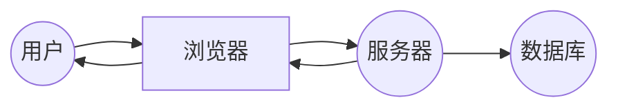

##  中学成绩管理系统详细设计与具体代码实现

作者：禅与计算机程序设计艺术

## 1. 背景介绍

### 1.1. 成绩管理系统的重要性

随着教育信息化的不断发展，中学教育领域对于信息化管理的需求日益增长。传统的成绩管理方式存在着效率低下、易出错、数据安全性差等问题，已无法满足现代教育管理的需求。因此，开发一套功能完善、操作便捷、安全可靠的中学成绩管理系统，对于提高学校教学管理水平、减轻教师工作负担、促进学生全面发展具有重要意义。

### 1.2.  系统目标

本系统旨在为中学提供一个全面、高效、安全的成绩管理平台，实现以下目标：

* **信息化管理**:  将传统的纸质成绩单、报表等信息电子化，方便存储、查询和分析。
* **提高效率**:  简化成绩录入、修改、统计等操作流程，减轻教师工作负担。
* **数据安全**:  保障学生成绩信息的安全性，防止数据丢失或泄露。
* **家校互动**:  为家长提供一个便捷的平台，实时了解学生成绩情况。

### 1.3.  目标用户

本系统的目标用户包括：

* **学校管理员**: 负责系统的维护和管理，包括用户管理、权限设置等。
* **教师**: 负责学生成绩的录入、修改、查询、统计和分析等。
* **学生**: 可以查询自己的成绩信息。
* **家长**: 可以通过系统了解孩子的成绩情况。

## 2.  核心概念与联系

### 2.1.  系统架构

本系统采用 B/S 架构，即浏览器/服务器架构。用户通过浏览器访问系统，服务器端负责处理用户的请求，并将结果返回给浏览器。



### 2.2.  主要模块

本系统主要包括以下模块：

* **用户管理模块**: 负责管理系统用户，包括用户的添加、删除、修改、权限设置等。
* **学生管理模块**: 负责管理学生信息，包括学生的添加、删除、修改、查询等。
* **课程管理模块**: 负责管理课程信息，包括课程的添加、删除、修改、查询等。
* **成绩管理模块**: 负责管理学生成绩，包括成绩的录入、修改、查询、统计、分析等。
* **报表管理模块**: 负责生成各种统计报表，例如班级成绩单、学生成绩排名、单科成绩分析等。
* **系统设置模块**: 负责系统的基本设置，例如学年学期设置、考试类型设置等。

### 2.3.  模块之间的联系

各模块之间相互协作，共同完成系统的各项功能。例如，教师在录入学生成绩时，需要先选择学生、课程、考试类型等信息，这些信息分别来自学生管理模块、课程管理模块和系统设置模块。

## 3.  核心算法原理具体操作步骤

### 3.1.  成绩计算算法

本系统采用百分制计算学生成绩，并提供加权平均分、排名等功能。

**3.1.1. 加权平均分计算**

加权平均分是指将各科成绩乘以相应的权重后求和，再除以总权重得到的平均分。计算公式如下：

$$
\text{加权平均分} = \frac{\sum_{i=1}^{n} \text{成绩}_i \times \text{权重}_i}{\sum_{i=1}^{n} \text{权重}_i}
$$

其中，$n$ 表示课程数量，$\text{成绩}_i$ 表示第 $i$ 门课程的成绩，$\text{权重}_i$ 表示第 $i$ 门课程的权重。

**3.1.2. 排名计算**

排名是指根据学生的加权平均分进行排序，并赋予每个学生一个唯一的排名。排名规则如下：

* 加权平均分高的学生排名靠前。
* 加权平均分相同的学生，排名相同。

**3.1.3. 操作步骤**

1. 获取学生所有科目的成绩和权重。
2. 根据加权平均分计算公式，计算学生的加权平均分。
3. 根据排名规则，对所有学生进行排序，并赋予每个学生一个唯一的排名。

### 3.2.  数据校验算法

为了保证数据的准确性，本系统在数据录入、修改等环节，都进行了严格的数据校验。

**3.2.1. 数据类型校验**

数据类型校验是指检查输入的数据是否符合要求的数据类型。例如，学生的学号必须是数字，姓名必须是字符串。

**3.2.2. 数据范围校验**

数据范围校验是指检查输入的数据是否在合理的范围内。例如，学生的成绩必须在 0 到 100 之间。

**3.2.3. 数据格式校验**

数据格式校验是指检查输入的数据是否符合要求的格式。例如，学生的出生日期必须是 yyyy-MM-dd 的格式。

**3.2.4. 操作步骤**

1. 定义数据校验规则，例如数据类型、数据范围、数据格式等。
2. 在数据录入、修改等环节，对输入的数据进行校验。
3. 如果校验失败，则提示用户输入错误，并要求重新输入。

## 4. 数学模型和公式详细讲解举例说明

### 4.1.  正态分布模型

正态分布是一种常见的概率分布，也称为高斯分布。在成绩管理系统中，可以用正态分布模型来分析学生的成绩分布情况。

**4.1.1.  公式**

正态分布的概率密度函数为：

$$
f(x) = \frac{1}{\sigma\sqrt{2\pi}}e^{-\frac{(x-\mu)^2}{2\sigma^2}}
$$

其中，$\mu$ 是均值，$\sigma$ 是标准差。

**4.1.2.  举例说明**

假设某班学生的数学成绩服从正态分布，均值为 70 分，标准差为 10 分。则可以使用正态分布模型来计算以下问题：

*  成绩在 60 分到 80 分之间的学生比例。
*  成绩排名前 10% 的学生的最低分数。

**4.1.3.  代码实现**

可以使用 Python 中的 SciPy 库来进行正态分布相关的计算。

```python
from scipy.stats import norm

# 创建正态分布对象
dist = norm(loc=70, scale=10)

# 计算成绩在 60 分到 80 分之间的学生比例
prob = dist.cdf(80) - dist.cdf(60)
print(f"成绩在 60 分到 80 分之间的学生比例为：{prob:.2%}")

# 计算成绩排名前 10% 的学生的最低分数
score = dist.ppf(0.9)
print(f"成绩排名前 10% 的学生的最低分数为：{score:.2f}")
```

### 4.2.  线性回归模型

线性回归模型是一种用于建立两个变量之间线性关系的统计模型。在成绩管理系统中，可以用线性回归模型来预测学生的期末成绩。

**4.2.1.  公式**

线性回归模型的公式为：

$$
y = \beta_0 + \beta_1 x + \epsilon
$$

其中，$y$ 是因变量，$x$ 是自变量，$\beta_0$ 是截距，$\beta_1$ 是斜率，$\epsilon$ 是误差项。

**4.2.2.  举例说明**

假设要根据学生的平时成绩来预测期末成绩，可以使用线性回归模型来建立模型。

**4.2.3.  代码实现**

可以使用 Python 中的 Scikit-learn 库来进行线性回归模型的训练和预测。

```python
from sklearn.linear_model import LinearRegression

# 准备训练数据
X = [[80], [70], [90], [60]]
y = [85, 75, 95, 65]

# 创建线性回归模型
model = LinearRegression()

# 训练模型
model.fit(X, y)

# 预测期末成绩
X_test = [[75]]
y_pred = model.predict(X_test)
print(f"预测的期末成绩为：{y_pred[0]:.2f}")
```

## 5. 项目实践：代码实例和详细解释说明

### 5.1.  开发环境搭建

*  编程语言：Python
*  Web 框架：Django
*  数据库：MySQL
*  开发工具：PyCharm

### 5.2.  数据库设计

```sql
-- 创建数据库
CREATE DATABASE IF NOT EXISTS school;

-- 使用数据库
USE school;

-- 创建学生表
CREATE TABLE student (
  id INT PRIMARY KEY AUTO_INCREMENT,
  name VARCHAR(255) NOT NULL,
  gender VARCHAR(10) NOT NULL,
  birthday DATE NOT NULL,
  class_id INT NOT NULL,
  FOREIGN KEY (class_id) REFERENCES class(id)
);

-- 创建班级表
CREATE TABLE class (
  id INT PRIMARY KEY AUTO_INCREMENT,
  name VARCHAR(255) NOT NULL
);

-- 创建课程表
CREATE TABLE course (
  id INT PRIMARY KEY AUTO_INCREMENT,
  name VARCHAR(255) NOT NULL
);

-- 创建成绩表
CREATE TABLE score (
  id INT PRIMARY KEY AUTO_INCREMENT,
  student_id INT NOT NULL,
  course_id INT NOT NULL,
  score FLOAT NOT NULL,
  FOREIGN KEY (student_id) REFERENCES student(id),
  FOREIGN KEY (course_id) REFERENCES course(id)
);
```

### 5.3.  代码实现

**5.3.1.  模型层**

```python
from django.db import models


class Student(models.Model):
    name = models.CharField(max_length=255)
    gender = models.CharField(max_length=10)
    birthday = models.DateField()
    class_id = models.IntegerField()

    def __str__(self):
        return self.name


class Class(models.Model):
    name = models.CharField(max_length=255)

    def __str__(self):
        return self.name


class Course(models.Model):
    name = models.CharField(max_length=255)

    def __str__(self):
        return self.name


class Score(models.Model):
    student = models.ForeignKey(Student, on_delete=models.CASCADE)
    course = models.ForeignKey(Course, on_delete=models.CASCADE)
    score = models.FloatField()

    def __str__(self):
        return f"{self.student} - {self.course}: {self.score}"
```

**5.3.2.  视图层**

```python
from django.shortcuts import render
from .models import Student, Class, Course, Score


def index(request):
    students = Student.objects.all()
    context = {'students': students}
    return render(request, 'index.html', context)


def student_detail(request, student_id):
    student = Student.objects.get(pk=student_id)
    scores = Score.objects.filter(student=student)
    context = {'student': student, 'scores': scores}
    return render(request, 'student_detail.html', context)
```

**5.3.3.  模板层**

```html
<!DOCTYPE html>
<html lang="en">
<head>
    <meta charset="UTF-8">
    <title>学生列表</title>
</head>
<body>
<h1>学生列表</h1>
<table>
    <thead>
    <tr>
        <th>姓名</th>
        <th>性别</th>
        <th>生日</th>
        <th>班级</th>
        <th>操作</th>
    </tr>
    </thead>
    <tbody>
    
    <tr>
        <td>{{ student.name }}</td>
        <td>{{ student.gender }}</td>
        <td>{{ student.birthday }}</td>
        <td>{{ student.class_id }}</td>
        <td>
            <a href="">详情</a>
        </td>
    </tr>
    
    </tbody>
</table>
</body>
</html>
```

```html
<!DOCTYPE html>
<html lang="en">
<head>
    <meta charset="UTF-8">
    <title>学生详情</title>
</head>
<body>
<h1>{{ student.name }}</h1>
<p>性别：{{ student.gender }}</p>
<p>生日：{{ student.birthday }}</p>
<p>班级：{{ student.class_id }}</p>

<h2>成绩</h2>
<table>
    <thead>
    <tr>
        <th>课程</th>
        <th>成绩</th>
    </tr>
    </thead>
    <tbody>
    
    <tr>
        <td>{{ score.course }}</td>
        <td>{{ score.score }}</td>
    </tr>
    
    </tbody>
</table>
</body>
</html>
```

## 6. 实际应用场景

### 6.1.  学校日常成绩管理

学校可以使用本系统进行学生的日常成绩管理，包括成绩录入、修改、查询、统计、分析等。

### 6.2.  家校互动

家长可以通过系统提供的账号登录系统，查看孩子的成绩情况，并与老师进行沟通交流。

### 6.3.  教学质量分析

学校领导和教师可以根据系统提供的各种统计报表，分析教学质量，制定相应的教学计划。

## 7. 工具和资源推荐

### 7.1.  Django 框架

Django 是一个高性能的 Python Web 框架，可以快速开发 Web 应用。

### 7.2.  MySQL 数据库

MySQL 是一种常用的关系型数据库管理系统，性能稳定，易于使用。

### 7.3.  PyCharm IDE

PyCharm 是一款功能强大的 Python IDE，可以提高开发效率。

## 8. 总结：未来发展趋势与挑战

### 8.1.  未来发展趋势

*  **云计算**: 将成绩管理系统部署到云平台上，可以降低系统维护成本，提高系统可靠性。
*  **大数据分析**: 利用大数据分析技术，可以挖掘学生成绩数据背后的规律，为教学管理提供决策支持。
*  **人工智能**: 将人工智能技术应用到成绩管理系统中，可以实现自动化评分、个性化学习推荐等功能。

### 8.2.  挑战

*  **数据安全**: 随着教育信息化的不断发展，数据安全问题日益突出，如何保障学生成绩信息的安全性是一个重要挑战。
*  **系统性能**: 随着学生数量和数据量的不断增加，如何提高系统的性能是一个重要挑战。
*  **用户体验**: 如何设计出用户友好、操作便捷的系统界面，也是一个需要不断探索的问题。

## 9. 附录：常见问题与解答

### 9.1.  如何添加新用户？

1.  使用管理员账号登录系统。
2.  进入用户管理模块。
3.  点击“添加用户”按钮。
4.  填写用户信息，并设置用户角色和权限。
5.  点击“保存”按钮。

### 9.2.  如何修改学生成绩？

1.  使用教师账号登录系统。
2.  进入成绩管理模块。
3.  找到要修改成绩的学生。
4.  点击“修改”按钮。
5.  修改学生成绩。
6.  点击“保存”按钮。

### 9.3.  如何生成班级成绩单？

1.  使用教师账号登录系统。
2.  进入报表管理模块。
3.  选择“班级成绩单”报表。
4.  设置查询条件，例如班级、考试类型等。
5.  点击“生成报表”按钮。