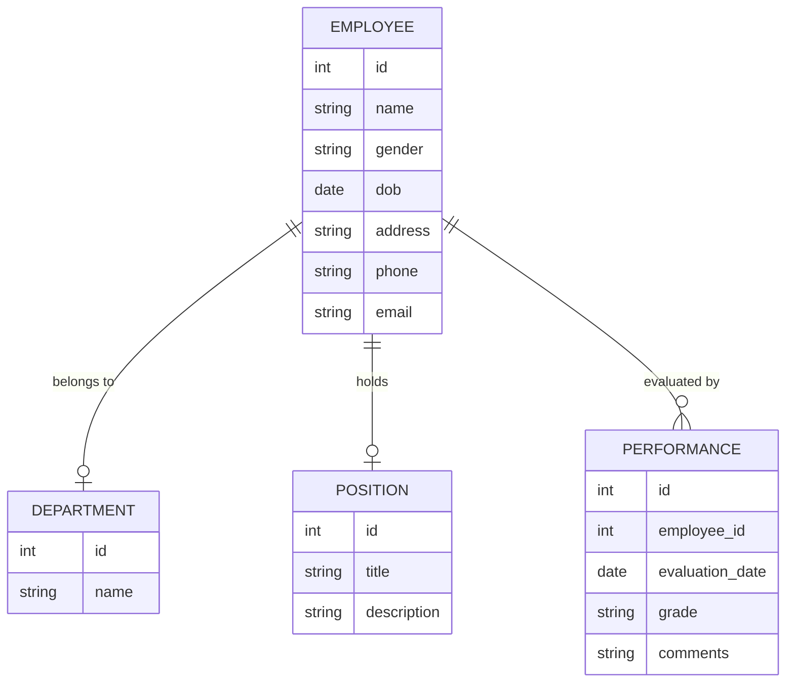
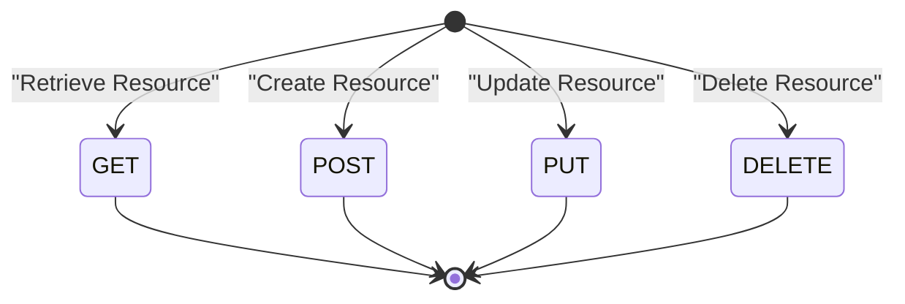

# 人才档案管理系统详细设计与具体代码实现

作者：禅与计算机程序设计艺术

## 1.背景介绍

### 1.1 人才档案管理的必要性
在现代企业中，人才是最重要的资源之一。为了有效地管理和利用这一资源，企业需要一个系统来记录、存储和分析员工的各种信息。这不仅有助于人力资源部门进行招聘、培训和绩效评估，还能为企业的战略决策提供数据支持。

### 1.2 现有系统的局限性
目前市场上存在许多人才档案管理系统，但大多数系统存在以下问题：
- 功能单一，难以满足企业多样化需求。
- 用户界面复杂，不易操作。
- 数据安全性不足，存在泄露风险。
- 缺乏灵活性，难以与其他系统集成。

### 1.3 本文的目标
本文旨在设计并实现一个高效、安全、易用且具有高度灵活性的人才档案管理系统。我们将详细介绍系统的设计思路、核心算法、数学模型、代码实现以及实际应用场景，帮助读者全面理解并掌握这一系统的开发方法。

## 2.核心概念与联系

### 2.1 人才档案
人才档案是指记录员工个人信息、工作经历、教育背景、技能、绩效评估等数据的集合。这些数据是企业进行人力资源管理和决策的重要依据。

### 2.2 数据库设计
人才档案管理系统的核心是数据库设计。我们需要设计一个高效的数据库结构，以便快速存储和检索数据。常用的数据库设计方法包括ER图、关系模型等。

### 2.3 用户界面
用户界面是系统与用户交互的桥梁。一个良好的用户界面应当简洁明了、易于操作，并能提供丰富的功能。

### 2.4 安全性
数据安全是人才档案管理系统的重要考虑因素。我们需要采用加密、权限控制等技术手段来保护数据的安全。

### 2.5 系统集成
为了提高系统的灵活性和扩展性，我们需要设计系统的接口，使其能够与其他系统（如ERP、CRM等）进行集成。

## 3.核心算法原理具体操作步骤

### 3.1 数据存储与检索算法
为了提高数据存储和检索的效率，我们采用了B树和哈希表等数据结构。B树适用于范围查询，而哈希表适用于精确查询。

#### 3.1.1 B树
B树是一种平衡树结构，适用于数据库和文件系统等场景。其插入、删除和查找操作的时间复杂度均为O(log n)。

#### 3.1.2 哈希表
哈希表是一种基于键值对的数据结构，具有快速的插入和查找性能。其平均时间复杂度为O(1)。

### 3.2 数据加密算法
为了保护数据的安全性，我们采用了AES对称加密算法。AES算法具有高效、安全的特点，是目前广泛应用的加密算法之一。

#### 3.2.1 AES算法原理
AES（Advanced Encryption Standard）是一种对称加密算法，支持128位、192位和256位密钥长度。其加密过程包括多个轮次的字节替换、行移位、列混淆和轮密钥加等操作。

### 3.3 权限控制算法
为了实现细粒度的权限控制，我们采用了基于角色的访问控制（RBAC）模型。RBAC模型通过角色来管理用户的权限，简化了权限管理的复杂性。

#### 3.3.1 RBAC模型
RBAC模型包括用户、角色和权限三个主要元素。用户通过角色获得权限，角色是权限的集合。

### 3.4 系统集成算法
为了实现系统的集成，我们设计了基于RESTful API的接口。RESTful API是一种轻量级的Web服务接口，具有简单、灵活的特点。

#### 3.4.1 RESTful API设计
RESTful API采用HTTP协议，使用URL表示资源，使用HTTP方法（GET、POST、PUT、DELETE）进行操作。

## 4.数学模型和公式详细讲解举例说明

### 4.1 数据库设计
我们采用ER图（实体-关系图）来设计数据库结构。ER图是一种用于表示实体及其关系的图形工具。

#### 4.1.1 实体与关系
在我们的系统中，主要实体包括员工、部门、职位、绩效评估等。实体之间的关系包括员工与部门的隶属关系、员工与职位的任职关系等。



### 4.2 数据加密
AES算法的加密和解密过程可以用数学公式表示。

#### 4.2.1 AES加密公式
AES加密过程包括多个轮次，每个轮次的操作可以表示为：
$$
C = E_k(P)
$$
其中，$C$ 是密文，$P$ 是明文，$E_k$ 是基于密钥 $k$ 的加密函数。

#### 4.2.2 AES解密公式
AES解密过程的公式为：
$$
P = D_k(C)
$$
其中，$D_k$ 是基于密钥 $k$ 的解密函数。

### 4.3 权限控制
RBAC模型的数学表示如下：

#### 4.3.1 用户-角色关系
$$
U \times R
$$
其中，$U$ 是用户集合，$R$ 是角色集合。

#### 4.3.2 角色-权限关系
$$
R \times P
$$
其中，$P$ 是权限集合。

### 4.4 系统集成
RESTful API的设计可以用状态转移图表示。以下是一个简单的状态转移图示例：



## 5.项目实践：代码实例和详细解释说明

### 5.1 数据库设计与实现

#### 5.1.1 数据库表结构
我们使用MySQL数据库来存储人才档案数据。以下是数据库表结构的SQL语句：

```sql
CREATE TABLE Employee (
    id INT PRIMARY KEY AUTO_INCREMENT,
    name VARCHAR(100) NOT NULL,
    gender VARCHAR(10),
    dob DATE,
    address VARCHAR(255),
    phone VARCHAR(20),
    email VARCHAR(100)
);

CREATE TABLE Department (
    id INT PRIMARY KEY AUTO_INCREMENT,
    name VARCHAR(100) NOT NULL
);

CREATE TABLE Position (
    id INT PRIMARY KEY AUTO_INCREMENT,
    title VARCHAR(100) NOT NULL,
    description TEXT
);

CREATE TABLE Performance (
    id INT PRIMARY KEY AUTO_INCREMENT,
    employee_id INT,
    evaluation_date DATE,
    grade VARCHAR(10),
    comments TEXT,
    FOREIGN KEY (employee_id) REFERENCES Employee(id)
);
```

### 5.2 数据加密与解密

#### 5.2.1 AES加密与解密代码
我们使用Python的`pycryptodome`库来实现AES加密和解密：

```python
from Crypto.Cipher import AES
from Crypto.Random import get_random_bytes
import base64

def encrypt(plain_text, key):
    cipher = AES.new(key, AES.MODE_EAX)
    nonce = cipher.nonce
    ciphertext, tag = cipher.encrypt_and_digest(plain_text.encode('utf-8'))
    return base64.b64encode(nonce + ciphertext).decode('utf-8')

def decrypt(cipher_text, key):
    raw_data = base64.b64decode(cipher_text)
    nonce = raw_data[:16]
    ciphertext = raw_data[16:]
    cipher = AES.new(key, AES.MODE_EAX, nonce=nonce)
    plain_text = cipher.decrypt(ciphertext).decode('utf-8')
    return plain_text

key = get_random_bytes(16)
encrypted = encrypt("Sensitive Data", key)
decrypted = decrypt(encrypted, key)

print(f"Encrypted: {encrypted}")
print(f"Decrypted: {decrypted}")
```

### 5.3 权限控制

#### 5.3.1 RBAC模型实现
我们使用Django框架来实现RBAC模型：

```python
from