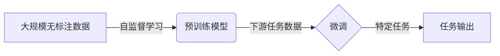
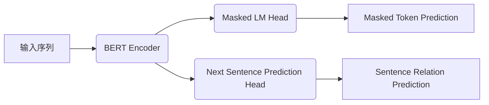

# 从零开始大模型开发与微调：人工智能的历史与未来

## 1.背景介绍

### 1.1 人工智能的兴起

人工智能(Artificial Intelligence, AI)是当代最具颠覆性和变革性的技术之一。自20世纪50年代问世以来,AI技术经历了几个重要的发展阶段,从早期的专家系统和机器学习,到近年来的深度学习和大规模预训练语言模型的崛起。

### 1.2 大模型的重要性

随着计算能力的不断提高和海量数据的积累,大规模预训练模型(Large Pre-trained Models)成为了推动AI发展的核心动力。这些庞大的神经网络模型通过在大规模无标注数据上预训练,掌握了丰富的知识和语义表征能力,可以被进一步微调以适应各种下游任务。

### 1.3 挑战与机遇

尽管大模型取得了令人瞩目的成就,但其发展也面临着诸多挑战,如巨大的计算资源需求、数据隐私和安全问题、模型公平性和可解释性等。同时,大模型的出现也为人工智能的发展带来了前所未有的机遇,如知识迁移、多任务学习、少样本学习等,有望推动AI技术向通用人工智能(Artificial General Intelligence, AGI)的目标迈进。

## 2.核心概念与联系

### 2.1 预训练与微调

大模型开发的核心思想是"预训练与微调"(Pre-training and Fine-tuning)范式。预训练阶段是在大规模无标注数据上进行自监督学习,获取通用的语义表征能力;微调阶段则是将预训练模型在特定的下游任务数据上进行进一步训练,使其适应目标任务。



### 2.2 自监督学习

自监督学习(Self-Supervised Learning)是预训练阶段的关键技术,它通过构建预测目标,使模型从无标注数据中学习有用的表征。常见的自监督技术包括:

- **Masked Language Modeling**: 预测被掩码的词
- **Next Sentence Prediction**: 判断句子是否连贯
- **Contrastive Learning**: 学习相似和不相似样本之间的区别

### 2.3 迁移学习

迁移学习(Transfer Learning)是利用预训练模型中学习到的知识,将其应用于新任务的过程。这不仅提高了下游任务的性能,还节省了从头训练所需的时间和计算资源。

### 2.4 多任务学习

多任务学习(Multi-Task Learning)旨在让模型同时学习多个相关任务,从而提高泛化能力和鲁棒性。在大模型中,通常会在预训练阶段引入多种自监督任务,使模型获得更丰富的表征能力。

## 3.核心算法原理具体操作步骤

### 3.1 Transformer 架构

Transformer 是大模型中最常用的基础架构,其基于自注意力(Self-Attention)机制,能够有效捕捉序列中的长程依赖关系。主要组件包括:

- **Multi-Head Attention**: 多头注意力机制,捕捉不同子空间的特征
- **Feed-Forward Network**: 前馈神经网络,提供非线性变换能力
- **Positional Encoding**: 位置编码,赋予序列元素位置信息


### 3.2 BERT 模型

BERT(Bidirectional Encoder Representations from Transformers)是一个里程碑式的预训练语言模型,采用了 Masked LM 和 Next Sentence Prediction 两种自监督任务,能够捕捉双向上下文信息。微调时,只需添加适当的输出层即可用于各种下游任务。



### 3.3 GPT 模型

GPT(Generative Pre-trained Transformer)则是一种自回归(Auto-Regressive)语言模型,专注于生成式任务。它通过预测下一个词的概率分布,学习到文本的语义和语法知识。GPT 模型可用于文本生成、摘要、问答等任务。


### 3.4 微调策略

微调时需要注意以下几点:

1. **学习率**: 较小的学习率有助于保留预训练知识
2. **训练数据**: 充足的高质量标注数据对性能提升至关重要
3. **训练步数**: 过多训练可能导致灾难性遗忘(catastrophic forgetting)
4. **层级微调**: 根据任务特征,选择微调全部或部分层

## 4.数学模型和公式详细讲解举例说明

### 4.1 Self-Attention 机制

自注意力机制是 Transformer 的核心,它通过计算查询(Query)与键(Key)的相似性,获得值(Value)的加权和作为输出。数学上可表示为:

$$\mathrm{Attention}(Q, K, V) = \mathrm{softmax}\left(\frac{QK^T}{\sqrt{d_k}}\right)V$$

其中 $Q$、$K$、$V$ 分别是查询、键和值的线性变换,通过缩放点积注意力计算相似性。

### 4.2 Multi-Head Attention

为了捕捉不同子空间的信息,Multi-Head Attention 将注意力分成多个"头"(Head),每个头学习不同的表征,最后将所有头的结果拼接:

$$\begin{aligned}
\mathrm{MultiHead}(Q, K, V) &= \mathrm{Concat}(\mathrm{head}_1, \dots, \mathrm{head}_h)W^O\\
\mathrm{head}_i &= \mathrm{Attention}(QW_i^Q, KW_i^K, VW_i^V)
\end{aligned}$$

其中 $W_i^Q$、$W_i^K$、$W_i^V$ 和 $W^O$ 是可学习的线性变换参数。

### 4.3 Masked Language Modeling

BERT 中的 Masked LM 任务是将输入序列中的部分词随机用特殊标记 [MASK] 替换,然后最大化这些被掩码词的预测概率:

$$\mathcal{L}_\mathrm{MLM} = -\mathbb{E}_{x \sim X_\mathrm{masked}}\left[\sum_{t=1}^T \log P(x_t | x_{\backslash t})\right]$$

其中 $X_\mathrm{masked}$ 是被掩码的输入序列,目标是最大化被掩码位置的条件概率。

### 4.4 自回归语言模型

GPT 等自回归语言模型的目标是最大化生成序列的条件概率:

$$\mathcal{L}_\mathrm{LM} = -\mathbb{E}_{x \sim X}\left[\sum_{t=1}^T \log P(x_t | x_{<t})\right]$$

其中 $x_{<t}$ 表示序列前 $t-1$ 个词,模型需要学习基于历史上下文预测下一个词的分布。

## 4.项目实践:代码实例和详细解释说明

以下是使用 Hugging Face 库在 PyTorch 中微调 BERT 模型进行文本分类的示例代码:

```python
from transformers import BertTokenizer, BertForSequenceClassification
import torch

# 加载预训练模型和分词器
tokenizer = BertTokenizer.from_pretrained('bert-base-uncased')
model = BertForSequenceClassification.from_pretrained('bert-base-uncased', num_labels=2)

# 数据预处理
text = "This is a great movie!"
inputs = tokenizer.encode_plus(text, return_tensors='pt', padding='max_length', truncation=True)

# 前向传播
outputs = model(**inputs)
logits = outputs.logits

# 计算损失和预测
criterion = torch.nn.CrossEntropyLoss()
labels = torch.tensor([1]).unsqueeze(0)  # 样本标签
loss = criterion(logits, labels)
predicted = torch.argmax(logits, dim=-1)

# 微调
optimizer = torch.optim.AdamW(model.parameters(), lr=2e-5)
for epoch in range(3):
    outputs = model(**inputs)
    loss = criterion(outputs.logits, labels)
    loss.backward()
    optimizer.step()
    optimizer.zero_grad()
```

这个示例展示了如何加载预训练的 BERT 模型,对输入文本进行编码,计算损失和预测结果,以及如何通过反向传播和优化器进行微调。需要注意的是,实际应用中还需要准备足够的训练数据,并进行适当的数据增强和超参数调整。

## 5.实际应用场景

大模型在各个领域都有广泛的应用,下面列举了一些典型场景:

### 5.1 自然语言处理

- **文本分类**: 新闻分类、情感分析、垃圾邮件检测等
- **机器翻译**: 将一种语言翻译成另一种语言
- **文本生成**: 自动写作、对话系统、自动总结等
- **问答系统**: 基于知识库回答自然语言问题

### 5.2 计算机视觉

- **图像分类**: 识别图像中的物体和场景
- **目标检测**: 定位和标注图像中的目标物体
- **图像生成**: 根据文本描述生成相应的图像
- **视频理解**: 视频分类、行为识别、视频问答等

### 5.3 语音与音频

- **语音识别**: 将语音转录为文本
- **语音合成**: 将文本转化为自然语音
- **音频分类**: 识别音频中的事件和场景
- **音乐建模**: 音乐生成和音乐信号处理

### 5.4 其他领域

- **生物医学**: 蛋白质结构预测、基因组分析等
- **金融**: 市场预测、欺诈检测、风险管理等
- **智能制造**: 预测维护、工艺优化、质量控制等

## 6.工具和资源推荐

### 6.1 预训练模型库

- **Hugging Face Transformers**: 囊括了大量预训练模型,提供了统一的API
- **AllenNLP**: 由 AI2 开发的开源 NLP 研究库
- **PyTorch Lightning**: 简化了深度学习模型的开发流程

### 6.2 大模型在线服务

- **OpenAI GPT-3**: 强大的生成式语言模型,提供付费 API 服务
- **Anthropic Claude**: 新一代对话式 AI 助手
- **Google PaLM**: 支持多模态任务的大规模语言模型

### 6.3 开源项目

- **Stanford Alpaca**: 基于指令的对话模型
- **BigScience BLOOM**: 多语种开源大模型
- **OPT**: Meta AI 开源的预训练语言模型

### 6.4 教程和文档

- **Hugging Face Course**: 免费的 NLP 课程和教程
- **Stanford CS224N**: 斯坦福大学自然语言处理公开课
- **Papers With Code**: 提供论文、代码和评测结果

## 7.总结:未来发展趋势与挑战

### 7.1 通用人工智能

虽然目前的大模型在特定任务上表现出色,但距离实现真正的通用人工智能(AGI)仍有很长的路要走。未来需要进一步提升模型的推理能力、常识推理、因果推理和多模态理解能力,以及更强的可解释性和鲁棒性。

### 7.2 模型效率

随着模型规模的不断扩大,训练和推理所需的计算资源和能耗也在快速增长,这对环境和可持续发展构成了挑战。提高模型效率、减少碳足迹是未来需要重点关注的方向。

### 7.3 数据隐私和伦理

大模型训练所需的海量数据可能包含隐私和版权信息,而模型输出也存在潜在的安全和伦理风险。如何保护个人隐私、维护模型公平性和可解释性,是大模型发展需要解决的重要课题。

### 7.4 多模态融合

未来的人工智能系统需要能够seamlessly融合视觉、语音、文本和其他模态信息