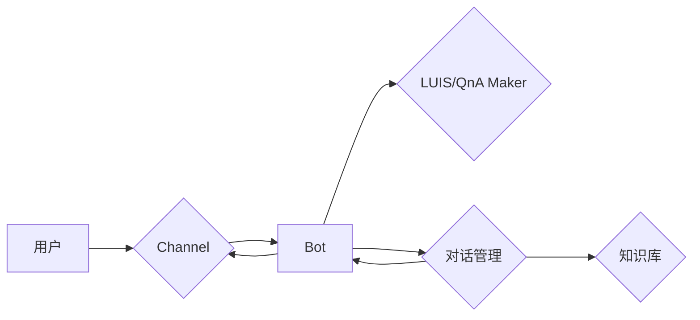

# 使用 Azure Bot Service 构建聊天机器人

作者：禅与计算机程序设计艺术

## 1. 背景介绍

### 1.1 聊天机器人的兴起

近年来，随着人工智能技术的快速发展，聊天机器人（Chatbot）作为一种新型的人机交互方式，逐渐走进了人们的视野。从简单的问答系统到复杂的智能助手，聊天机器人在各个领域都展现出了巨大的潜力。

### 1.2 Azure Bot Service 简介

Azure Bot Service 是微软 Azure 云平台提供的一项 PaaS 服务，旨在帮助开发者快速构建、部署和管理智能聊天机器人。它提供了一套完整的工具和框架，简化了聊天机器人的开发流程，并支持多种消息通道和语言。

### 1.3 本文目标

本文将深入探讨如何使用 Azure Bot Service 构建聊天机器人，涵盖从基础概念到实际应用的各个方面，帮助读者快速掌握聊天机器人开发技能。

## 2. 核心概念与联系

### 2.1 聊天机器人的基本组成

一个典型的聊天机器人系统通常由以下几个核心组件构成：

* **用户界面（UI）：** 负责与用户进行交互，接收用户输入并展示机器人回复。
* **自然语言理解（NLU）：** 负责将用户输入的自然语言转换为机器可理解的语义表示。
* **对话管理（DM）：** 负责管理对话流程，根据用户意图和对话历史选择合适的回复策略。
* **自然语言生成（NLG）：** 负责将机器生成的语义表示转换为自然语言回复。
* **知识库：** 存储聊天机器人所需的领域知识和对话数据。

### 2.2 Azure Bot Service 核心概念

* **Bot：** 指的是聊天机器人本身，是 Azure Bot Service 中的基本单位。
* **Channel：** 指的是聊天机器人与用户交互的渠道，例如 Facebook Messenger、Skype、Microsoft Teams 等。
* **LUIS：** Language Understanding Intelligent Service，微软 Azure 云平台提供的一项自然语言理解服务，可以用于识别用户意图和提取实体。
* **QnA Maker：**  微软 Azure 云平台提供的一项问答服务，可以用于构建基于 FAQ 的聊天机器人。
* **Bot Framework SDK：**  微软提供的一套软件开发工具包，用于开发和部署聊天机器人。

### 2.3 核心概念联系

下图展示了 Azure Bot Service 核心概念之间的联系：



## 3. 核心算法原理具体操作步骤

### 3.1 使用 Azure Bot Service 创建聊天机器人

1. 登录 Azure Portal，选择 "创建资源"，搜索 "Bot Channels Registration" 并创建。
2. 在 "Bot Channels Registration" 页面中，选择 "Channels" 选项卡，添加需要支持的渠道。
3. 选择 "Configuration" 选项卡，获取 Bot ID 和 Bot Password，这些信息将在后续步骤中使用。

### 3.2 使用 Bot Framework SDK 开发聊天机器人

1. 创建一个新的 .NET Core 项目。
2. 使用 NuGet 安装 Bot Framework SDK 包。
3. 创建一个继承自 `ActivityHandler` 的类，并实现 `OnMessageActivityAsync` 方法，该方法用于处理用户发送的文本消息。

```csharp
using Microsoft.Bot.Builder;
using Microsoft.Bot.Schema;
using System.Threading;
using System.Threading.Tasks;

public class MyBot : ActivityHandler
{
    protected override async Task OnMessageActivityAsync(ITurnContext<IMessageActivity> turnContext, CancellationToken cancellationToken)
    {
        var message = turnContext.Activity.Text;
        // 处理用户消息
        await turnContext.SendActivityAsync(MessageFactory.Text($"You said: {message}"), cancellationToken);
    }
}
```

### 3.3 将聊天机器人部署到 Azure

1. 在 Visual Studio 中右键单击项目，选择 "发布"。
2. 选择 "Azure" 作为发布目标，并选择之前创建的 "Bot Channels Registration" 资源。
3. 完成发布后，聊天机器人将部署到 Azure 并可以通过之前配置的渠道进行访问。

## 4. 数学模型和公式详细讲解举例说明

### 4.1 自然语言处理中的词向量模型

词向量模型是自然语言处理中常用的技术之一，用于将单词表示为低维稠密向量。常用的词向量模型包括 Word2Vec 和 GloVe。

#### 4.1.1 Word2Vec

Word2Vec 是一种基于神经网络的词向量模型，可以通过训练大量的文本数据来学习单词的语义表示。Word2Vec 模型有两种常见的训练方法：CBOW 和 Skip-gram。

**CBOW 模型**

CBOW 模型的训练目标是根据上下文单词预测目标单词。例如，对于句子 "The cat sat on the mat"，如果目标单词是 "sat"，则上下文单词为 "The", "cat", "on", "the", "mat"。

**Skip-gram 模型**

Skip-gram 模型的训练目标是根据目标单词预测上下文单词。例如，对于句子 "The cat sat on the mat"，如果目标单词是 "sat"，则上下文单词为 "The", "cat", "on", "the", "mat"。

#### 4.1.2 GloVe

GloVe 是一种基于全局词共现信息的词向量模型。GloVe 模型首先构建一个词共现矩阵，然后使用矩阵分解技术将词向量学习出来。

### 4.2  文本分类中的朴素贝叶斯算法

朴素贝叶斯算法是一种基于贝叶斯定理的分类算法，常用于文本分类任务。

#### 4.2.1 贝叶斯定理

贝叶斯定理是概率论中的一个重要定理，用于计算条件概率。

$$
P(A|B) = \frac{P(B|A)P(A)}{P(B)}
$$

其中：

* $P(A|B)$ 表示在事件 B 发生的情况下，事件 A 发生的概率。
* $P(B|A)$ 表示在事件 A 发生的情况下，事件 B 发生的概率。
* $P(A)$ 表示事件 A 发生的概率。
* $P(B)$ 表示事件 B 发生的概率。

#### 4.2.2 朴素贝叶斯算法

朴素贝叶斯算法假设各个特征之间相互独立，即一个特征的取值不会影响其他特征的取值。

对于文本分类任务，假设 $C$ 表示类别，$F_1, F_2, ..., F_n$ 表示文本特征，则根据贝叶斯定理，可以得到：

$$
P(C|F_1, F_2, ..., F_n) = \frac{P(F_1, F_2, ..., F_n|C)P(C)}{P(F_1, F_2, ..., F_n)}
$$

由于各个特征之间相互独立，所以可以得到：

$$
P(F_1, F_2, ..., F_n|C) = P(F_1|C)P(F_2|C)...P(F_n|C)
$$

因此，可以得到朴素贝叶斯分类器的分类规则：

$$
C^* = \arg\max_C P(C)\prod_{i=1}^n P(F_i|C)
$$

## 5. 项目实践：代码实例和详细解释说明

### 5.1 创建一个简单的问答聊天机器人

```csharp
using Microsoft.Bot.Builder;
using Microsoft.Bot.Schema;
using System.Collections.Generic;
using System.Threading;
using System.Threading.Tasks;

public class QnABot : ActivityHandler
{
    private readonly Dictionary<string, string> _qaPairs = new Dictionary<string, string>()
    {
        { "你好", "你好！" },
        { "你是谁", "我是一个问答机器人。" },
        { "再见", "再见！" }
    };

    protected override async Task OnMessageActivityAsync(ITurnContext<IMessageActivity> turnContext, CancellationToken cancellationToken)
    {
        var message = turnContext.Activity.Text;
        if (_qaPairs.ContainsKey(message))
        {
            await turnContext.SendActivityAsync(MessageFactory.Text(_qaPairs[message]), cancellationToken);
        }
        else
        {
            await turnContext.SendActivityAsync(MessageFactory.Text("对不起，我不明白你的意思。"), cancellationToken);
        }
    }
}
```

### 5.2  使用 LUIS 识别用户意图

1. 登录 LUIS 网站，创建一个新的 LUIS 应用。
2. 定义意图和实体。例如，可以定义一个 "问候" 意图和一个 "姓名" 实体。
3. 训练 LUIS 模型。
4. 在聊天机器人代码中调用 LUIS API，识别用户意图。

```csharp
// 调用 LUIS API
var luisResult = await _luisRecognizer.RecognizeAsync(turnContext, cancellationToken);

// 获取用户意图
var topIntent = luisResult.GetTopScoringIntent();

// 根据用户意图执行相应操作
switch (topIntent.intent)
{
    case "问候":
        await turnContext.SendActivityAsync(MessageFactory.Text("你好！"), cancellationToken);
        break;
    default:
        await turnContext.SendActivityAsync(MessageFactory.Text("对不起，我不明白你的意思。"), cancellationToken);
        break;
}
```

## 6. 实际应用场景

### 6.1  客户服务

聊天机器人可以用于自动化客户服务流程，例如回答常见问题、处理订单查询和解决技术问题。

### 6.2  电子商务

聊天机器人可以用于提供个性化的购物体验，例如推荐产品、提供折扣信息和处理付款。

### 6.3  教育

聊天机器人可以用于创建虚拟导师，为学生提供个性化的学习体验。

### 6.4  医疗保健

聊天机器人可以用于提供医疗咨询、预约挂号和提醒服药。

## 7. 工具和资源推荐

### 7.1  Azure Bot Service

* **官方文档：** https://docs.microsoft.com/en-us/azure/bot-service/
* **Bot Framework SDK：** https://github.com/microsoft/botframework-sdk

### 7.2  自然语言处理工具

* **NLTK：** https://www.nltk.org/
* **SpaCy：** https://spacy.io/

### 7.3  机器学习平台

* **Azure Machine Learning：** https://azure.microsoft.com/en-us/services/machine-learning/
* **Google Cloud AI Platform：** https://cloud.google.com/ai-platform/

## 8. 总结：未来发展趋势与挑战

### 8.1  未来发展趋势

* **更加智能化：** 随着人工智能技术的不断发展，聊天机器人将变得更加智能化，能够理解更加复杂的语义和处理更加复杂的对话场景。
* **更加个性化：** 聊天机器人将能够根据用户的个人喜好和历史行为提供更加个性化的服务。
* **更加普及化：** 聊天机器人的开发成本将不断降低，应用范围将更加广泛。

### 8.2  挑战

* **自然语言理解的准确性：** 自然语言理解是聊天机器人的核心技术之一，但目前的自然语言理解技术还存在一定的局限性，例如对于歧义句的处理和对于新词的识别。
* **对话管理的复杂性：** 对话管理是聊天机器人的另一个核心技术，如何设计合理的对话流程和处理复杂的对话场景是一个挑战。
* **用户隐私和数据安全：** 聊天机器人需要收集和处理用户的个人信息，如何保护用户隐私和数据安全是一个重要问题。

## 9. 附录：常见问题与解答

### 9.1  如何测试聊天机器人？

可以使用 Bot Framework Emulator 对聊天机器人进行测试。Bot Framework Emulator 是一款桌面应用程序，可以模拟用户与聊天机器人的交互过程。

### 9.2  如何处理聊天机器人中的错误？

可以使用 Application Insights 对聊天机器人进行监控，及时发现和处理错误。

### 9.3  如何提高聊天机器人的性能？

可以使用 Azure 缓存和 Azure CDN 等服务来提高聊天机器人的性能。
