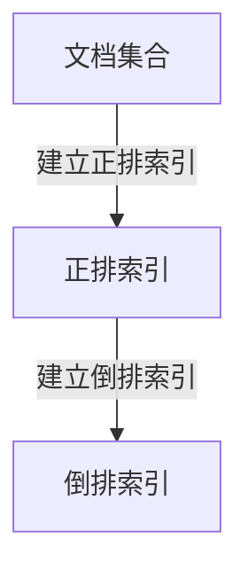

# 倒排索引的可视化与数据分析

作者：禅与计算机程序设计艺术

## 1.背景介绍

### 1.1 什么是倒排索引

倒排索引（Inverted Index）是一种常用于信息检索系统的数据结构。它的主要作用是建立词项到文档之间的映射关系，从而高效地支持全文搜索。倒排索引的核心思想是将文档中的词项进行索引，并记录词项出现的位置和频率，从而在搜索时快速定位相关文档。

### 1.2 倒排索引的重要性

在大规模数据处理和信息检索领域，倒排索引是不可或缺的工具。它不仅可以显著提高搜索速度，还能优化存储空间利用率。尤其在搜索引擎、电子商务平台和大数据分析中，倒排索引的应用极为广泛。

### 1.3 本文目标

本文旨在深入探讨倒排索引的原理、实现方法及其在数据分析中的应用。通过详细的算法步骤、数学模型和实际代码示例，帮助读者全面理解倒排索引的工作机制，并提供可视化工具和资源推荐，助力实际项目开发。

## 2.核心概念与联系

### 2.1 倒排索引的基本结构

倒排索引主要由两个部分组成：词项字典（Term Dictionary）和倒排列表（Inverted List）。

- **词项字典**：存储所有出现过的词项，并为每个词项分配一个唯一的标识符。
- **倒排列表**：记录每个词项在文档中的出现情况，包括文档ID和词项位置。

### 2.2 正排索引与倒排索引

正排索引（Forward Index）是指将文档ID映射到文档内容的索引结构。与之相对，倒排索引是将词项映射到包含该词项的文档ID的索引结构。两者的关系可以用下图表示：



### 2.3 倒排索引与布尔模型

倒排索引常用于布尔模型（Boolean Model）中的查询处理。布尔模型通过布尔运算符（如AND, OR, NOT）组合查询条件，倒排索引则通过快速检索倒排列表来实现高效的布尔查询。

## 3.核心算法原理具体操作步骤

### 3.1 文档预处理

在建立倒排索引之前，需要对文档进行预处理，包括分词、去停用词和词干提取等步骤。

#### 3.1.1 分词

分词是将文档中的文本划分为独立的词项。常用的分词算法包括基于规则的分词和统计学分词。

#### 3.1.2 去停用词

停用词（Stop Words）是指在文档中频繁出现但对检索意义不大的词项，如“的”、“是”、“在”等。去除停用词可以减少索引规模，提高检索效率。

#### 3.1.3 词干提取

词干提取（Stemming）是将词项还原为其词根形式的过程。例如，将“running”还原为“run”。

### 3.2 倒排索引的构建

倒排索引的构建包括以下步骤：

1. **初始化词项字典和倒排列表**：创建空的词项字典和倒排列表。
2. **遍历文档集合**：对每个文档进行分词处理，生成词项列表。
3. **更新词项字典**：将词项添加到词项字典中，并为每个词项分配唯一标识符。
4. **更新倒排列表**：记录每个词项在文档中的位置和频率。

### 3.3 倒排索引的优化

倒排索引的优化主要包括压缩技术和跳跃表（Skip List）。

#### 3.3.1 压缩技术

压缩技术可以有效减少倒排列表的存储空间。常用的压缩算法包括Gamma编码和Delta编码。

#### 3.3.2 跳跃表

跳跃表通过在倒排列表中添加跳跃指针，实现快速跳转，减少查询时间。

## 4.数学模型和公式详细讲解举例说明

### 4.1 倒排列表的数学表示

倒排列表可以用数学集合表示。设 $D$ 为文档集合，$T$ 为词项集合，倒排列表 $L_t$ 表示包含词项 $t$ 的文档集合：

$$
L_t = \{d \in D \mid t \in d\}
$$

### 4.2 词频-逆文档频率（TF-IDF）

词频-逆文档频率（TF-IDF）是评估词项重要性的统计方法。词频（Term Frequency, TF）表示词项在文档中的出现频率，逆文档频率（Inverse Document Frequency, IDF）表示词项在所有文档中的稀有程度。TF-IDF的计算公式为：

$$
\text{TF-IDF}(t, d) = \text{TF}(t, d) \times \text{IDF}(t)
$$

其中，词频 $\text{TF}(t, d)$ 和逆文档频率 $\text{IDF}(t)$ 的计算公式分别为：

$$
\text{TF}(t, d) = \frac{f_{t,d}}{\sum_{t' \in d} f_{t',d}}
$$

$$
\text{IDF}(t) = \log \frac{N}{|\{d \in D \mid t \in d\}|}
$$

其中，$f_{t,d}$ 表示词项 $t$ 在文档 $d$ 中的出现次数，$N$ 表示文档总数。

### 4.3 布尔查询的集合运算

布尔查询通过集合运算实现。设 $Q$ 为查询条件，包含词项 $t_1, t_2, \ldots, t_n$，布尔查询的结果集合 $R$ 为：

$$
R = L_{t_1} \cap L_{t_2} \cap \ldots \cap L_{t_n}
$$

## 5.项目实践：代码实例和详细解释说明

### 5.1 文档预处理代码示例

以下是一个简单的文档预处理代码示例，包括分词和去停用词：

```python
import nltk
from nltk.corpus import stopwords
from nltk.tokenize import word_tokenize

# 下载必要的资源
nltk.download('punkt')
nltk.download('stopwords')

# 示例文档
document = "This is a sample document for inverted index construction."

# 分词
tokens = word_tokenize(document)

# 去停用词
filtered_tokens = [word for word in tokens if word.lower() not in stopwords.words('english')]

print(filtered_tokens)
```

### 5.2 倒排索引构建代码示例

以下是一个简单的倒排索引构建代码示例：

```python
from collections import defaultdict

# 初始化倒排索引
inverted_index = defaultdict(list)

# 示例文档集合
documents = {
    1: "This is a sample document.",
    2: "This document is another example.",
    3: "Inverted index is useful for search engines."
}

# 构建倒排索引
for doc_id, text in documents.items():
    tokens = word_tokenize(text)
    for token in tokens:
        if token.lower() not in stopwords.words('english'):
            inverted_index[token.lower()].append(doc_id)

print(dict(inverted_index))
```

### 5.3 倒排索引查询代码示例

以下是一个简单的倒排索引查询代码示例：

```python
def boolean_query(query, index):
    query_tokens = word_tokenize(query)
    result_sets = []
    for token in query_tokens:
        if token.lower() in index:
            result_sets.append(set(index[token.lower()]))
    if result_sets:
        return set.intersection(*result_sets)
    return set()

# 示例查询
query = "sample document"
result = boolean_query(query, inverted_index)
print(result)
```

## 6.实际应用场景

### 6.1 搜索引擎

倒排索引是搜索引擎的核心组件。通过倒排索引，搜索引擎可以快速检索包含查询词项的文档，并根据词项的重要性排序结果。

### 6.2 电子商务平台

在电子商务平台中，倒排索引用于产品搜索和推荐系统。通过倒排索引，用户可以快速找到包含特定关键词的产品，并根据用户的搜索历史推荐相关产品。

### 6.3