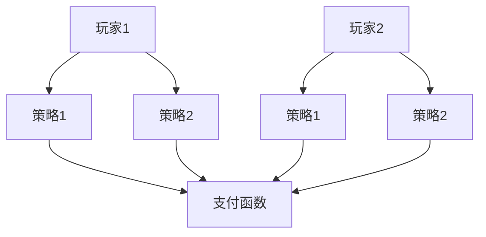
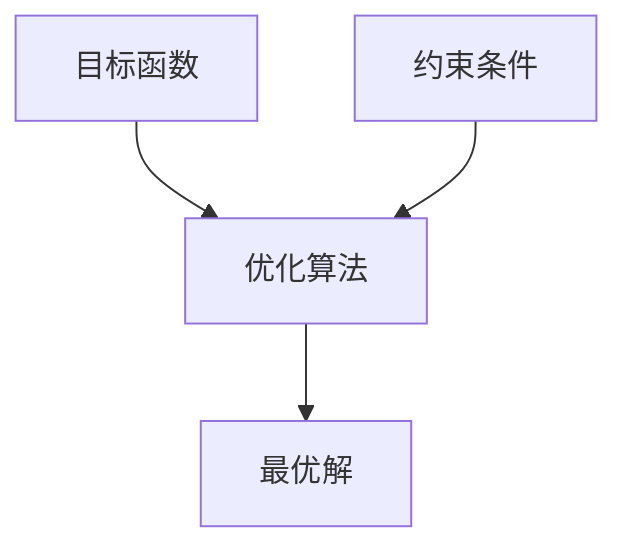
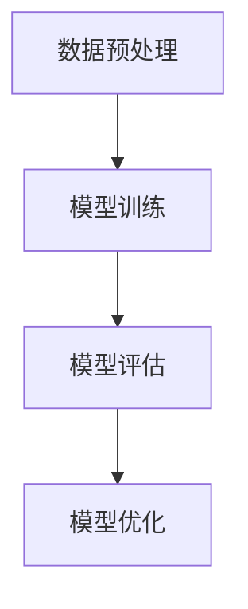

# 公平性在智能电网中的应用

作者：禅与计算机程序设计艺术

## 1.背景介绍

### 1.1 智能电网的兴起

智能电网（Smart Grid）是现代电力系统发展的重要方向，通过引入先进的传感器、通信技术和计算技术，实现电力系统的自动化、信息化和智能化。智能电网不仅能够提高电力系统的效率和可靠性，还能够支持可再生能源的接入和分布式能源管理。

### 1.2 公平性在智能电网中的重要性

随着智能电网的发展，公平性问题逐渐引起了广泛关注。公平性不仅关系到电力资源的合理分配，还涉及到电力市场的健康发展和社会的可持续发展。公平性可以体现在多个方面，如电力价格的公平、电力资源的公平分配、接入机会的公平等。

### 1.3 本文的目标

本文旨在探讨公平性在智能电网中的应用，分析其核心概念与联系，介绍相关的核心算法原理和操作步骤，详细讲解数学模型和公式，通过项目实践展示具体的代码实例和解释说明，探讨实际应用场景，推荐相关工具和资源，并总结未来的发展趋势与挑战。

## 2.核心概念与联系

### 2.1 公平性定义

公平性（Fairness）在智能电网中是指在电力资源分配、定价和接入机会等方面，能够保证各方利益的平等和公正。公平性涉及多个层面，包括经济公平、技术公平和社会公平。

### 2.2 公平性与效率的关系

在智能电网中，公平性和效率常常是相互冲突的目标。提高系统效率通常意味着优化资源利用，但这可能导致资源分配的不均衡，从而影响公平性。因此，在设计智能电网系统时，需要在公平性和效率之间找到平衡点。

### 2.3 公平性与可再生能源的关系

可再生能源（如风能和太阳能）的广泛接入是智能电网的重要特征之一。然而，可再生能源的间歇性和不稳定性给电力系统的公平性带来了挑战。如何在保证系统稳定性的同时，实现可再生能源的公平接入，是智能电网面临的重要问题。

### 2.4 公平性与电力市场的关系

电力市场的健康发展依赖于公平的市场规则和机制。在电力市场中，公平性体现在市场准入、交易规则、电价机制等方面。公平的市场环境能够促进竞争，激发创新，从而推动电力行业的可持续发展。

## 3.核心算法原理具体操作步骤

### 3.1 公平性算法概述

在智能电网中，实现公平性的算法有很多种，常见的包括基于博弈论的算法、基于优化理论的算法和基于机器学习的算法。不同的算法适用于不同的应用场景和需求。

### 3.2 基于博弈论的公平性算法

博弈论是一种研究决策者之间策略互动的理论，广泛应用于智能电网中的公平性问题。通过构建博弈模型，可以分析各方的利益和策略，从而设计出公平的资源分配方案。

#### 3.2.1 博弈模型的构建

博弈模型通常包括以下几个要素：
- 玩家（Players）：参与决策的各方，如电力公司、用户等。
- 策略（Strategies）：各方可以选择的行动方案。
- 支付函数（Payoff Functions）：各方在不同策略组合下的收益。

#### 3.2.2 纳什均衡的求解

纳什均衡（Nash Equilibrium）是博弈论中的一个重要概念，指在一个策略组合下，没有任何一方可以通过单方面改变策略而获得更高的收益。在智能电网中，通过求解纳什均衡，可以找到各方利益的平衡点，从而实现公平性。

### 3.3 基于优化理论的公平性算法

优化理论是研究如何在给定约束条件下，找到最优解的数学理论。在智能电网中，通过构建优化模型，可以在满足公平性约束的同时，优化系统效率。

#### 3.3.1 优化模型的构建

优化模型通常包括以下几个要素：
- 目标函数（Objective Function）：需要优化的目标，如系统效率、成本等。
- 约束条件（Constraints）：需要满足的条件，如公平性约束、技术约束等。

#### 3.3.2 优化算法的求解

常见的优化算法包括线性规划（Linear Programming）、非线性规划（Nonlinear Programming）和整数规划（Integer Programming）等。在智能电网中，可以根据具体问题选择合适的优化算法进行求解。

### 3.4 基于机器学习的公平性算法

机器学习是一种通过数据驱动的方法，广泛应用于智能电网中的预测、分类和优化等问题。通过训练机器学习模型，可以实现智能电网中的公平性优化。

#### 3.4.1 数据预处理

数据预处理是机器学习的基础步骤，包括数据清洗、特征选择和特征工程等。通过对数据进行预处理，可以提高模型的准确性和泛化能力。

#### 3.4.2 模型训练与评估

常见的机器学习模型包括线性回归（Linear Regression）、支持向量机（Support Vector Machine）和神经网络（Neural Networks）等。在智能电网中，可以根据具体问题选择合适的模型进行训练和评估。

## 4.数学模型和公式详细讲解举例说明

### 4.1 博弈论模型

#### 4.1.1 玩家与策略

假设智能电网中有两个玩家，玩家1和玩家2，各自有两种策略可供选择，策略1和策略2。我们用 $s_1$ 和 $s_2$ 分别表示玩家1和玩家2的策略组合。

#### 4.1.2 支付函数

支付函数表示玩家在不同策略组合下的收益。假设玩家1和玩家2的支付函数分别为 $u_1(s_1, s_2)$ 和 $u_2(s_1, s_2)$。

$$
u_1(s_1, s_2) = a s_1 + b s_2
$$

$$
u_2(s_1, s_2) = c s_1 + d s_2
$$

其中，$a, b, c, d$ 是常数，表示不同策略组合下的收益系数。

#### 4.1.3 纳什均衡

纳什均衡是指在一个策略组合下，没有任何一方可以通过单方面改变策略而获得更高的收益。求解纳什均衡的方法包括迭代法、图论法等。

### 4.2 优化模型

#### 4.2.1 目标函数

假设智能电网的目标是最大化系统效率，目标函数可以表示为：

$$
\max \sum_{i=1}^n E_i
$$

其中，$E_i$ 表示第 $i$ 个用户的电力消耗，$n$ 是用户总数。

#### 4.2.2 约束条件

约束条件包括公平性约束和技术约束。假设公平性约束表示为：

$$
\sum_{i=1}^n \alpha_i E_i \leq C
$$

其中，$\alpha_i$ 表示用户 $i$ 的权重，$C$ 是公平性约束的阈值。

#### 4.2.3 优化算法

常见的优化算法包括线性规划和非线性规划。通过求解优化模型，可以在满足公平性约束的同时，优化系统效率。

### 4.3 机器学习模型

#### 4.3.1 数据预处理

数据预处理包括数据清洗、特征选择和特征工程等步骤。假设我们有一个包含 $m$ 个样本的数据集，每个样本有 $n$ 个特征，数据矩阵表示为 $X \in \mathbb{R}^{m \times n}$。

#### 4.3.2 模型训练

假设我们使用线性回归模型进行预测，模型的目标是最小