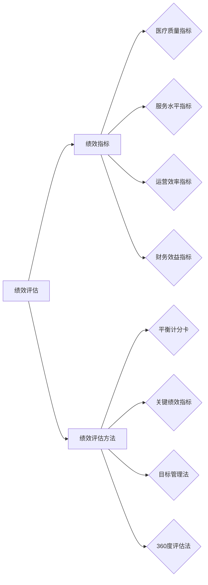

## 医院绩效评估系统设计与实现

作者：禅与计算机程序设计艺术

## 1. 背景介绍

### 1.1 绩效评估的重要性

在当今竞争激烈的医疗环境中，医院需要不断提高自身的医疗质量、服务水平和运营效率，以满足患者日益增长的需求。而医院绩效评估作为一种有效的管理工具，可以帮助医院识别自身的优势和劣势，发现问题并制定改进措施，从而提升医院的整体管理水平和竞争力。

### 1.2 传统绩效评估方法的局限性

传统的医院绩效评估方法主要依赖于人工收集数据、统计分析和专家评审，存在着以下局限性：

* **主观性强：** 评估指标和权重设置、数据收集和分析过程容易受到人为因素的影响，导致评估结果缺乏客观性和公正性。
* **效率低下：** 人工收集和处理数据耗时耗力，难以满足医院对绩效评估的时效性要求。
* **数据孤岛：** 各个部门之间的数据难以共享和整合，无法进行全面的绩效分析。

### 1.3 医院绩效评估系统的发展趋势

随着信息技术的快速发展，医院绩效评估系统逐渐向信息化、智能化方向发展，呈现出以下发展趋势：

* **数据驱动：** 利用医院信息系统、电子病历等数据来源，实现绩效数据的自动化采集和分析。
* **指标体系科学化：** 建立基于平衡计分卡、关键绩效指标等理论的科学化指标体系，全面、客观地反映医院的运营状况。
* **评估方法智能化：** 运用数据挖掘、机器学习等技术，实现对医院绩效的智能化分析和预测。
* **可视化展示：** 通过图表、报表等形式，直观地展示医院的绩效状况和发展趋势。

## 2. 核心概念与联系

### 2.1 绩效评估

绩效评估是指对组织、部门、个人等工作目标的达成情况进行系统、客观、公正的评价，以确定其工作效率、工作质量和工作效益，并为改进工作提供依据的过程。

### 2.2 绩效指标

绩效指标是衡量绩效的具体标准，是绩效评估的基础。医院绩效指标可以分为以下几类：

* **医疗质量指标：** 例如，住院患者死亡率、手术并发症发生率、平均住院日等。
* **服务水平指标：** 例如，患者满意度、投诉率、平均等候时间等。
* **运营效率指标：** 例如，床位周转率、医疗设备利用率、药品库存周转率等。
* **财务效益指标：** 例如，医疗收入、成本控制、利润率等。

### 2.3 绩效评估方法

常见的医院绩效评估方法包括：

* **平衡计分卡 (BSC)：** 从财务、客户、内部流程、学习与成长四个维度对医院进行全面评估。
* **关键绩效指标 (KPI)：** 选取能够反映医院关键成功因素的指标进行评估。
* **目标管理法 (MBO)：** 将医院的总体目标分解为各个部门和个人的具体目标，并定期进行评估。
* **360度评估法：** 从上级、下级、同事、患者等多个角度对被评估者进行全面评估。

### 2.4 核心概念联系图



## 3. 核心算法原理具体操作步骤

本节以基于平衡计分卡的医院绩效评估系统为例，介绍其核心算法原理和具体操作步骤。

### 3.1 构建平衡计分卡指标体系

根据医院的战略目标和发展方向，确定平衡计分卡的四个维度，并为每个维度设置相应的指标。例如：

| 维度 | 指标 |
|---|---|
| 财务 | 医疗收入增长率、成本控制率、利润率 |
| 客户 | 患者满意度、投诉率、复诊率 |
| 内部流程 | 住院患者平均住院日、手术并发症发生率、药品库存周转率 |
| 学习与成长 | 员工培训 hours、科研成果数量、信息化建设水平 |

### 3.2  数据采集和处理

从医院信息系统、电子病历、财务系统等数据源中，自动采集与指标相关的原始数据。对原始数据进行清洗、转换、整合，形成可用于分析的结构化数据。

### 3.3 指标计算和分析

根据预先设定的计算公式，对结构化数据进行计算，得到各个指标的具体数值。利用统计分析、数据挖掘等方法，对指标数据进行分析，识别医院的优势和劣势，发现问题和改进方向。

### 3.4 绩效评估和报告生成

根据指标分析结果，对医院的整体绩效进行评估，并生成可视化的评估报告。报告内容包括：

* 关键指标的完成情况
* 各个维度的绩效得分
* 优势和劣势分析
* 改进建议

### 3.5 绩效改进和跟踪

根据评估结果，制定相应的改进措施，并跟踪改进效果。定期进行绩效评估，形成闭环管理机制，不断提升医院的整体管理水平。

## 4. 数学模型和公式详细讲解举例说明

### 4.1 指标权重确定

指标权重是指各个指标在总体评估中的重要程度。确定指标权重的方法有很多，例如：

* **专家打分法：** 邀请相关领域的专家对各个指标的重要性进行打分，并根据得分情况确定权重。
* **层次分析法 (AHP)：** 将指标体系分解为多个层次，通过两两比较的方式确定各层次指标的相对重要性，最终计算出每个指标的权重。
* **熵值法：** 根据指标数据的变异程度确定权重，指标数据变异程度越大，说明该指标越重要，权重也应该越大。

### 4.2 绩效得分计算

假设医院的平衡计分卡指标体系中包含 $n$ 个指标，每个指标的权重为 $w_i$，实际值为 $x_i$，目标值为 $t_i$，则该指标的得分 $s_i$ 可以使用如下公式计算：

$$
s_i =
\begin{cases}
w_i \times \frac{x_i}{t_i} & x_i \le t_i \\
w_i + (1-w_i) \times \frac{x_i - t_i}{x_{max} - t_i} & x_i > t_i
\end{cases}
$$

其中，$x_{max}$ 为该指标的理论最大值。

### 4.3 举例说明

例如，某医院的“患者满意度”指标权重为 0.2，目标值为 90%，实际值为 95%，则该指标的得分：

$$
s = 0.2 + (1-0.2) \times \frac{95\% - 90\%}{100\% - 90\%} = 0.28
$$

## 5. 项目实践：代码实例和详细解释说明

### 5.1 技术架构

本项目采用 B/S 架构，使用 Spring Boot 框架构建后端服务，使用 Vue.js 框架开发前端页面，使用 MySQL 数据库存储数据。

### 5.2 代码实例

**后端代码示例：**

```java
@RestController
@RequestMapping("/api/performance")
public class PerformanceController {

    @Autowired
    private PerformanceService performanceService;

    @PostMapping("/evaluate")
    public Result<PerformanceEvaluation> evaluate(@RequestBody PerformanceEvaluationRequest request) {
        // 数据校验
        // ...

        // 调用 Service 层进行评估
        PerformanceEvaluation evaluation = performanceService.evaluate(request);

        // 返回评估结果
        return Result.success(evaluation);
    }
}
```

**前端代码示例：**

```javascript
<template>
  <div>
    <el-button type="primary" @click="evaluate">评估</el-button>

    <el-table v-if="evaluation" :data="evaluation.indicators">
      <el-table-column prop="name" label="指标名称"></el-table-column>
      <el-table-column prop="score" label="得分"></el-table-column>
    </el-table>
  </div>
</template>

<script>
export default {
  data() {
    return {
      evaluation: null,
    };
  },
  methods: {
    evaluate() {
      // 发送评估请求
      this.$axios.post('/api/performance/evaluate').then(response => {
        this.evaluation = response.data.data;
      });
    },
  },
};
</script>
```

### 5.3 代码解释

* 后端代码定义了一个 `PerformanceController` 类，用于处理绩效评估相关的请求。
* `evaluate` 方法接收评估请求参数，调用 `PerformanceService` 进行评估，并返回评估结果。
* 前端代码定义了一个按钮，点击按钮发送评估请求。
* 评估结果返回后，使用 `el-table` 组件展示评估结果。

## 6. 实际应用场景

医院绩效评估系统可以应用于以下场景：

* **医院管理层：** 全面了解医院的运营状况，识别优势和劣势，制定发展战略和改进措施。
* **科室负责人：** 跟踪科室的绩效指标完成情况，发现问题并及时解决，提升科室的管理水平。
* **医务人员：** 了解自身的绩效水平，发现不足之处，不断学习和提升自身能力。
* **政府监管部门：** 对医院的医疗质量、服务水平等进行监督和管理，促进医院的健康发展。

## 7. 总结：未来发展趋势与挑战

### 7.1 未来发展趋势

* **更加智能化：** 随着人工智能技术的不断发展，医院绩效评估系统将更加智能化，例如：
    * 自动识别关键指标
    * 智能化分析和预测绩效
    * 提供个性化的改进建议
* **更加精细化：** 绩效评估的粒度将更加精细，例如：
    * 从科室层面细化到医生、护士个人
    * 从单一指标评估发展到多维度综合评估
* **更加数据驱动：** 随着医疗数据的不断积累，绩效评估将更加依赖于数据分析，例如：
    * 利用大数据技术挖掘潜在的绩效问题
    * 使用机器学习算法预测未来绩效趋势

### 7.2 面临的挑战

* **数据质量问题：** 医疗数据的准确性、完整性和一致性直接影响着绩效评估的结果。
* **指标体系构建：** 构建科学、合理、可行的指标体系是绩效评估的关键。
* **评估结果应用：** 绩效评估结果应该与医院的激励机制、资源配置等方面相结合，才能真正发挥作用。

## 8. 附录：常见问题与解答

### 8.1 问：医院绩效评估系统的数据来源有哪些？

答：医院绩效评估系统的数据来源主要包括：

* 医院信息系统 (HIS)：例如，门诊挂号、住院登记、收费结算等数据。
* 电子病历系统 (EMR)：例如，患者基本信息、诊断信息、治疗信息、用药信息等数据。
* 财务系统：例如，医疗收入、成本支出、利润等数据。
* 人事系统：例如，员工基本信息、职称信息、培训信息等数据。
* 其他系统：例如，医疗设备管理系统、药品管理系统等。

### 8.2 问：如何保证医院绩效评估系统的公平公正？

答：保证医院绩效评估系统的公平公正可以采取以下措施：

* 建立科学合理的指标体系，确保指标的客观性和可衡量性。
* 制定规范的数据采集和处理流程，确保数据的准确性和完整性。
* 采用多种评估方法进行交叉验证，避免单一评估方法的局限性。
* 建立健全的评估结果申诉机制，保障被评估对象的合法权益。


## 总结

医院绩效评估系统是提升医院管理水平的重要工具，随着信息技术的不断发展，医院绩效评估系统将更加智能化、精细化和数据驱动。未来，医院绩效评估系统将面临着数据质量、指标体系构建、评估结果应用等方面的挑战，需要不断探索和创新，才能更好地服务于医院的发展。
