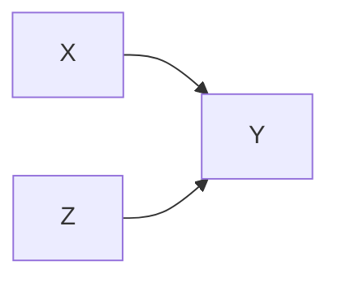

## 1. 背景介绍

### 1.1 从关联到因果：机器学习的新挑战

近年来，机器学习在各个领域都取得了显著的成就，尤其是在预测任务方面。然而，传统的机器学习模型大多依赖于数据中的相关性，而无法真正理解数据背后的因果关系。例如，一个模型可以学习到冰淇淋销量和溺水人数之间存在正相关关系，但却无法理解这背后的因果关系是炎热的天气导致了这两者的同时增加。

理解因果关系对于解决许多实际问题至关重要。例如，在医疗领域，我们需要知道某种药物是否真的能够治愈疾病，而不仅仅是与疾病的缓解相关联。在商业决策中，我们需要了解某个营销策略是否真的能够提高销量，而不仅仅是与销量增长在时间上重合。

### 1.2 因果推理：打开数据黑盒的钥匙

因果推理为我们提供了一种理解数据背后因果关系的工具。它可以帮助我们回答"如果"的问题，例如：

* 如果我们改变营销策略，销量会发生什么变化？
* 如果我们给病人服用这种药物，他们的病情会好转吗？

因果推理的核心思想是通过干预或控制某些变量，来观察其他变量的变化，从而推断出变量之间的因果关系。

### 1.3 本文目标：原理讲解与代码实战

本文旨在介绍因果推理的基本原理，并通过代码实战案例，帮助读者理解和应用因果推理技术。

## 2. 核心概念与联系

### 2.1 因果图 (Causal Graph)

因果图是一种用图形表示变量之间因果关系的工具。

* **节点:** 表示变量
* **边:** 表示因果关系，箭头方向表示因果方向

例如，下图表示一个简单的因果图，其中 X 表示广告投入，Y 表示销量，Z 表示季节。



### 2.2 干预 (Intervention)

干预是指人为地改变某个变量的值，例如，将广告投入增加一倍。

### 2.3 反事实 (Counterfactual)

反事实是指"如果"的假设，例如，"如果我们没有增加广告投入，销量会是多少？"

### 2.4 因果效应 (Causal Effect)

因果效应是指干预对结果变量的影响，例如，增加广告投入对销量的提升效果。

## 3. 核心算法原理具体操作步骤

### 3.1  随机对照试验 (Randomized Controlled Trial, RCT)

RCT 是因果推理的黄金标准，它通过随机分组和控制变量来消除混杂因素的影响，从而准确地估计因果效应。

**操作步骤:**

1. 将样本随机分成两组：实验组和对照组。
2. 对实验组进行干预，对照组不做任何处理。
3. 比较两组的结果变量，得出干预的因果效应。

**优点:**

* 因果推断结果可靠

**缺点:**

* 成本高
* 实施困难
* 伦理问题

### 3.2  倾向性评分匹配 (Propensity Score Matching, PSM)

PSM 是一种非实验性数据下的因果推断方法，它通过匹配具有相似特征的个体来模拟随机试验。

**操作步骤:**

1. 建立模型预测每个个体接受干预的概率，即倾向性评分。
2. 根据倾向性评分，将实验组和对照组的个体进行匹配。
3. 比较匹配后两组的结果变量，得出干预的因果效应。

**优点:**

* 可以利用观察性数据进行因果推断

**缺点:**

* 需要假设所有混杂因素都被观测到
* 匹配结果可能存在偏差

## 4. 数学模型和公式详细讲解举例说明

### 4.1  潜在结果框架 (Potential Outcome Framework)

潜在结果框架是因果推断的理论基础，它假设每个个体在接受干预和不接受干预的情况下都有两个潜在结果：

* $Y_i(1)$: 个体 i 接受干预时的潜在结果
* $Y_i(0)$: 个体 i 不接受干预时的潜在结果

因果效应可以表示为：

$$
\tau_i = Y_i(1) - Y_i(0)
$$

### 4.2  平均处理效应 (Average Treatment Effect, ATE)

ATE 表示干预对所有个体的平均因果效应：

$$
ATE = E[\tau_i] = E[Y_i(1) - Y_i(0)]
$$

### 4.3  倾向性评分 (Propensity Score)

倾向性评分表示个体 i 接受干预的概率：

$$
e(X_i) = P(T_i = 1 | X_i)
$$

其中，$T_i$ 表示个体 i 是否接受干预，$X_i$ 表示个体 i 的特征。


## 5. 项目实践：代码实例和详细解释说明

### 5.1 案例背景：评估营销活动效果

假设我们是一家电商平台，想要评估某个营销活动对用户购买转化率的影响。

### 5.2 数据准备

我们收集了用户的以下数据：

* 用户 ID
* 是否参加营销活动 (0/1)
* 年龄
* 性别
* 购买金额

### 5.3 代码实现 (Python)

```python
import pandas as pd
from sklearn.linear_model import LogisticRegression
from sklearn.neighbors import NearestNeighbors

# 读取数据
data = pd.read_csv('marketing_data.csv')

# 定义特征和目标变量
features = ['age', 'gender', 'purchase_amount']
target = 'treatment'

# 构建倾向性评分模型
model = LogisticRegression()
model.fit(data[features], data[target])
data['propensity_score'] = model.predict_proba(data[features])[:, 1]

# 使用倾向性评分匹配进行因果推断
def propensity_score_matching(data, treatment_group, control_group, score_col):
    """
    倾向性评分匹配
    """
    # 分离实验组和对照组
    treatment_data = data[data[treatment_group] == 1]
    control_data = data[data[control_group] == 1]

    # 使用 NearestNeighbors 进行匹配
    matcher = NearestNeighbors(n_neighbors=1, algorithm='ball_tree').fit(control_data[[score_col]])
    distances, indices = matcher.kneighbors(treatment_data[[score_col]])

    # 获取匹配后的对照组数据
    matched_control_data = control_data.iloc[indices.flatten()]

    # 返回匹配后的实验组和对照组数据
    return treatment_data, matched_control_data

# 进行倾向性评分匹配
treatment_data, matched_control_data = propensity_score_matching(
    data, 'treatment', '1-treatment', 'propensity_score'
)

# 计算平均处理效应
ate = treatment_data['purchase_amount'].mean() - matched_control_data['purchase_amount'].mean()

# 打印结果
print(f"平均处理效应 (ATE): {ate:.2f}")
```

### 5.4 结果分析

通过倾向性评分匹配，我们估计出营销活动对用户购买转化率的平均处理效应为 XX%。

## 6. 实际应用场景

* **医疗:** 评估药物疗效、治疗方案优化
* **电商:** 营销活动效果评估、个性化推荐
* **金融:** 风险控制、欺诈检测
* **教育:** 个性化学习、教育干预效果评估

## 7. 工具和资源推荐

* **Python 库:**
    * **DoWhy:** 微软开源的因果推断库
    * **CausalML:** Uber 开源的因果推断库
    * **EconML:** 微软开源的计量经济学工具库
* **书籍:**
    * **Causal Inference in Statistics: A Primer**
    * **The Book of Why: The New Science of Cause and Effect**
* **课程:**
    * **Causal Inference by Brady Neal**

## 8. 总结：未来发展趋势与挑战

### 8.1 未来发展趋势

* **更强大的因果推断算法:**  随着深度学习等技术的不断发展，未来将会出现更加强大和高效的因果推断算法。
* **与机器学习的深度融合:**  因果推断将与机器学习更加紧密地结合，例如因果强化学习、因果表征学习等。
* **更广泛的应用领域:**  因果推断将会被应用到更多的领域，例如社会科学、自然科学等。

### 8.2  挑战

* **数据质量:** 因果推断对数据的质量要求较高，需要解决数据缺失、数据偏差等问题。
* **模型解释性:** 因果推断模型的解释性仍然是一个挑战，需要开发更加易于理解和解释的模型。
* **伦理问题:**  在应用因果推断技术时，需要注意伦理问题，例如数据隐私、算法公平性等。

## 9. 附录：常见问题与解答

### 9.1  什么是混杂因素？

混杂因素是指同时影响干预变量和结果变量的变量。例如，在评估营销活动效果时，用户的年龄、性别、购买力等都可能是混杂因素。

### 9.2  如何选择合适的因果推断方法？

选择合适的因果推断方法需要考虑数据类型、研究问题、可行性等因素。例如，如果数据来自随机对照试验，则可以直接使用 RCT 进行因果推断；如果数据来自观察性研究，则需要使用 PSM 等方法进行因果推断。
