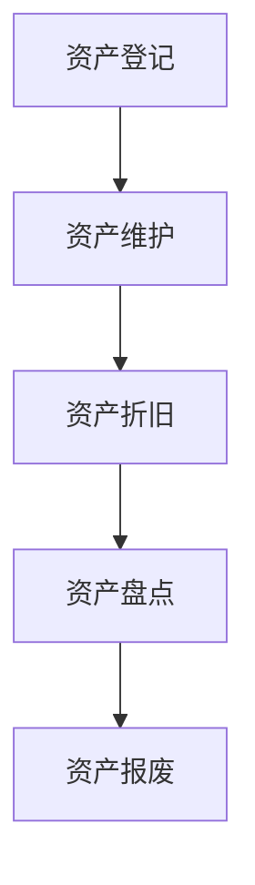
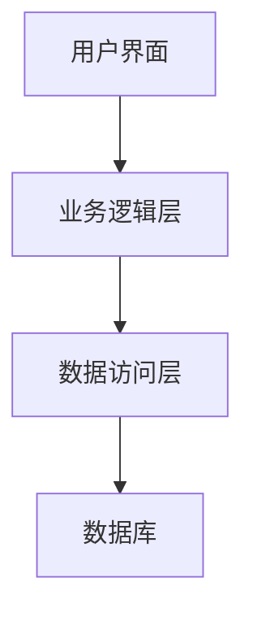

# 固定资产管理系统详细设计与具体代码实现

作者：禅与计算机程序设计艺术

## 1.背景介绍

### 1.1 固定资产管理的必要性

固定资产是企业的重要资源，涉及到企业的生产、经营和管理。有效的固定资产管理可以帮助企业提高资源利用效率、降低成本、避免资产流失和浪费。传统的手工管理方式已经无法满足现代企业的需求，信息化的固定资产管理系统应运而生。

### 1.2 固定资产管理系统的目标

固定资产管理系统的主要目标是实现对企业固定资产的全生命周期管理，包括资产的购置、使用、维护、折旧、报废等环节。通过系统化的管理，可以实现资产信息的实时更新和查询，提高管理效率和决策支持能力。

### 1.3 现有系统的不足

现有的固定资产管理系统存在以下不足：
- 数据分散，信息共享困难。
- 缺乏自动化流程，依赖手工操作，效率低下。
- 报表生成复杂，数据分析能力不足。
- 系统扩展性差，难以适应企业发展的需求。

## 2.核心概念与联系

### 2.1 固定资产生命周期

固定资产生命周期包括以下阶段：
- 购置：资产的采购和入库。
- 使用：资产的使用和维护。
- 折旧：资产价值的逐步减少。
- 盘点：定期对资产进行清查和核对。
- 报废：资产的处置和报废。

### 2.2 固定资产管理系统的主要模块

固定资产管理系统通常包括以下主要模块：
- 资产登记：记录资产的基本信息。
- 资产维护：管理资产的使用和维护记录。
- 资产折旧：计算和记录资产的折旧情况。
- 资产盘点：定期进行资产盘点和核对。
- 资产报废：管理资产的报废和处置。

### 2.3 核心概念之间的联系

各个模块之间的联系如图所示：



## 3.核心算法原理具体操作步骤

### 3.1 资产折旧计算

资产折旧是固定资产管理中的一个重要环节，常用的折旧方法包括直线法、双倍余额递减法和年数总和法。

#### 3.1.1 直线法

直线法是最简单的一种折旧方法，每年的折旧费用相等。

$$
\text{年折旧额} = \frac{\text{资产原值} - \text{残值}}{\text{使用年限}}
$$

#### 3.1.2 双倍余额递减法

双倍余额递减法是一种加速折旧的方法，前期折旧费用较高，后期逐渐减少。

$$
\text{年折旧额} = 2 \times \frac{\text{账面价值}}{\text{使用年限}}
$$

#### 3.1.3 年数总和法

年数总和法也是一种加速折旧的方法，折旧费用逐年递减。

$$
\text{年折旧额} = \frac{\text{资产原值} - \text{残值}}{\text{年数总和}} \times \text{剩余年数}
$$

### 3.2 资产盘点算法

资产盘点是保证资产信息准确性的关键步骤。盘点算法包括以下几个步骤：

1. 生成盘点任务：系统根据预设的盘点周期生成盘点任务。
2. 盘点执行：盘点人员根据盘点任务对资产进行清查。
3. 盘点数据录入：将盘点结果录入系统。
4. 盘点差异分析：系统自动分析盘点结果与账面数据的差异。
5. 盘点结果处理：对盘点差异进行处理，更新资产信息。

## 4.数学模型和公式详细讲解举例说明

### 4.1 直线法折旧计算的数学模型

直线法折旧计算公式为：

$$
\text{年折旧额} = \frac{\text{资产原值} - \text{残值}}{\text{使用年限}}
$$

例如，一台设备的原值为100,000元，残值为10,000元，使用年限为10年，则每年的折旧额为：

$$
\text{年折旧额} = \frac{100,000 - 10,000}{10} = 9,000 \text{元}
$$

### 4.2 双倍余额递减法的数学模型

双倍余额递减法的折旧计算公式为：

$$
\text{年折旧额} = 2 \times \frac{\text{账面价值}}{\text{使用年限}}
$$

假设一台设备的原值为100,000元，使用年限为10年，第一年的折旧额为：

$$
\text{年折旧额} = 2 \times \frac{100,000}{10} = 20,000 \text{元}
$$

第二年的折旧额为：

$$
\text{年折旧额} = 2 \times \frac{80,000}{10} = 16,000 \text{元}
$$

### 4.3 年数总和法的数学模型

年数总和法的折旧计算公式为：

$$
\text{年折旧额} = \frac{\text{资产原值} - \text{残值}}{\text{年数总和}} \times \text{剩余年数}
$$

假设一台设备的原值为100,000元，残值为10,000元，使用年限为5年，则年数总和为：

$$
5 + 4 + 3 + 2 + 1 = 15
$$

第一年的折旧额为：

$$
\text{年折旧额} = \frac{100,000 - 10,000}{15} \times 5 = 30,000 \text{元}
$$

第二年的折旧额为：

$$
\text{年折旧额} = \frac{100,000 - 10,000}{15} \times 4 = 24,000 \text{元}
$$

## 4.项目实践：代码实例和详细解释说明

### 4.1 系统架构设计

固定资产管理系统的架构设计如图所示：



### 4.2 代码实例：资产折旧计算

以下是一个使用Python实现直线法折旧计算的代码示例：

```python
class FixedAsset:
    def __init__(self, original_value, residual_value, useful_life):
        self.original_value = original_value
        self.residual_value = residual_value
        self.useful_life = useful_life

    def straight_line_depreciation(self):
        annual_depreciation = (self.original_value - self.residual_value) / self.useful_life
        return annual_depreciation

# 示例
asset = FixedAsset(100000, 10000, 10)
print(f"每年折旧额: {asset.straight_line_depreciation()} 元")
```

### 4.3 代码实例：资产盘点

以下是一个使用Python实现资产盘点的代码示例：

```python
class AssetInventory:
    def __init__(self):
        self.assets = {}

    def add_asset(self, asset_id, asset_name):
        self.assets[asset_id] = asset_name

    def perform_inventory(self, inventory_data):
        discrepancies = []
        for asset_id, asset_name in inventory_data.items():
            if asset_id not in self.assets:
                discrepancies.append((asset_id, asset_name, 'Missing'))
            elif self.assets[asset_id] != asset_name:
                discrepancies.append((asset_id, asset_name, 'Name Mismatch'))
        return discrepancies

# 示例
inventory = AssetInventory()
inventory.add_asset('A001', 'Laptop')
inventory.add_asset('A002', 'Printer')

inventory_data = {
    'A001': 'Laptop',
    'A003': 'Projector'
}

discrepancies = inventory.perform_inventory(inventory_data)
print(f"盘点差异: {discrepancies}")
```

## 5.实际应用场景

### 5.1 制造业

在制造业中，固定资产管理系统可以帮助企业管理生产设备、工具和设施，确保设备的正常运行和及时维护，减少停机时间，提高生产效率。

### 5.2 服务业

在服务业中，固定资产管理系统可以帮助企业管理办公设备、车辆和其他资产，确保资产的合理使用和维护，提高服务质量和客户满意度。

### 5.3 教育行业

