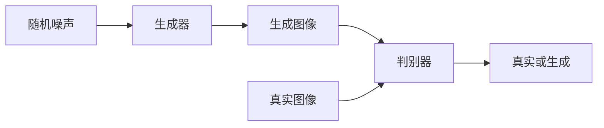
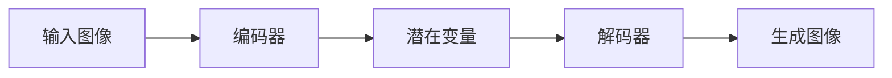
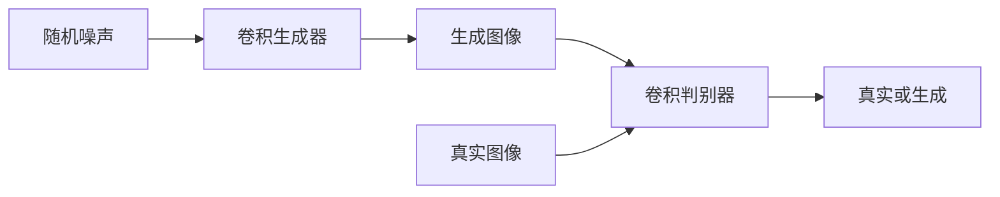

# 《图像生成：深度学习的应用领域》

作者：禅与计算机程序设计艺术

## 1. 背景介绍

### 1.1 深度学习的兴起

近年来，深度学习技术在多个领域取得了显著的进展，从语音识别到自然语言处理，再到图像处理，深度学习模型展示了其强大的学习和泛化能力。在图像处理领域，尤其是图像生成方面，深度学习的应用更是引人注目。

### 1.2 图像生成的历史与发展

图像生成技术的历史可以追溯到计算机图形学的早期阶段。传统的图像生成方法依赖于手工设计的算法和规则，生成的图像质量和多样性有限。然而，随着深度学习技术的发展，特别是生成对抗网络（GANs）和变分自编码器（VAEs）的出现，图像生成技术迎来了革命性的变化。

### 1.3 研究动机与目标

本篇文章旨在深入探讨深度学习在图像生成领域的应用，介绍核心概念与算法原理，详细讲解数学模型和公式，并通过项目实践展示具体实现方法。我们还将探讨图像生成技术的实际应用场景，推荐相关工具和资源，并展望未来的发展趋势与挑战。

## 2. 核心概念与联系

### 2.1 深度学习与图像生成

深度学习是一种通过多层神经网络进行特征学习和数据表示的方法。图像生成是指通过算法从无到有地创建图像，深度学习模型在图像生成中扮演着核心角色，尤其是GANs和VAEs。

### 2.2 生成对抗网络（GANs）

GANs由生成器（Generator）和判别器（Discriminator）组成，生成器负责生成假图像，判别器则负责区分真图像和假图像。通过两者的对抗训练，生成器逐渐学会生成逼真的图像。

### 2.3 变分自编码器（VAEs）

VAEs是一种生成模型，通过编码器将输入图像编码为潜在变量，再通过解码器从潜在变量生成图像。VAEs的核心在于其概率模型，可以生成多样性较高的图像。

### 2.4 深度卷积生成对抗网络（DCGANs）

DCGANs是GANs的一种改进版本，使用深度卷积神经网络作为生成器和判别器。DCGANs在图像生成质量和训练稳定性方面表现出色，是目前图像生成领域的主流方法之一。

## 3. 核心算法原理具体操作步骤

### 3.1 生成对抗网络（GANs）

#### 3.1.1 GANs的基本结构

GANs由两个主要部分组成：生成器和判别器。生成器的任务是从随机噪声中生成逼真的图像，而判别器的任务是区分真实图像和生成图像。



#### 3.1.2 训练步骤

1. 初始化生成器和判别器的权重。
2. 从真实数据集中采样一批真实图像。
3. 从随机噪声中生成一批假图像。
4. 使用真实图像和假图像分别更新判别器。
5. 使用判别器的反馈更新生成器。
6. 重复上述步骤，直到生成器生成的图像足够逼真。

### 3.2 变分自编码器（VAEs）

#### 3.2.1 VAEs的基本结构

VAEs由编码器、解码器和潜在变量组成。编码器将输入图像编码为潜在变量，解码器则从潜在变量生成图像。



#### 3.2.2 训练步骤

1. 编码器将输入图像编码为潜在变量的均值和方差。
2. 从均值和方差中采样潜在变量。
3. 解码器从潜在变量生成图像。
4. 计算重构误差和KL散度。
5. 使用重构误差和KL散度更新编码器和解码器。

### 3.3 深度卷积生成对抗网络（DCGANs）

#### 3.3.1 DCGANs的基本结构

DCGANs使用卷积神经网络作为生成器和判别器，能够更好地捕捉图像的空间特征。



#### 3.3.2 训练步骤

1. 初始化卷积生成器和判别器的权重。
2. 从真实数据集中采样一批真实图像。
3. 从随机噪声中生成一批假图像。
4. 使用真实图像和假图像分别更新卷积判别器。
5. 使用卷积判别器的反馈更新卷积生成器。
6. 重复上述步骤，直到卷积生成器生成的图像足够逼真。

## 4. 数学模型和公式详细讲解举例说明

### 4.1 GANs的数学模型

GANs的目标是通过优化生成器和判别器的对抗损失函数来生成逼真的图像。GANs的损失函数可以表示为：

$$
\min_G \max_D V(D, G) = \mathbb{E}_{x \sim p_{data}(x)}[\log D(x)] + \mathbb{E}_{z \sim p_z(z)}[\log(1 - D(G(z)))]
$$

其中，$G$ 是生成器，$D$ 是判别器，$p_{data}(x)$ 是真实数据分布，$p_z(z)$ 是噪声分布。

### 4.2 VAEs的数学模型

VAEs的目标是通过最大化变分下界（ELBO）来生成多样性的图像。VAEs的损失函数可以表示为：

$$
\mathcal{L} = -\mathbb{E}_{q(z|x)}[\log p(x|z)] + KL(q(z|x) \| p(z))
$$

其中，$q(z|x)$ 是编码器，$p(x|z)$ 是解码器，$KL$ 是Kullback-Leibler散度。

### 4.3 DCGANs的数学模型

DCGANs的损失函数与GANs类似，但使用卷积神经网络作为生成器和判别器。其损失函数可以表示为：

$$
\min_{G_{conv}} \max_{D_{conv}} V(D_{conv}, G_{conv}) = \mathbb{E}_{x \sim p_{data}(x)}[\log D_{conv}(x)] + \mathbb{E}_{z \sim p_z(z)}[\log(1 - D_{conv}(G_{conv}(z)))]
$$

其中，$G_{conv}$ 是卷积生成器，$D_{conv}$ 是卷积判别器。

## 5. 项目实践：代码实例和详细解释说明

### 5.1 GANs的代码实例

以下是一个简单的GANs实现示例，使用Python和TensorFlow：

```python
import tensorflow as tf
from tensorflow.keras import layers

# 定义生成器
def build_generator():
    model = tf.keras.Sequential()
    model.add(layers.Dense(256, activation='relu', input_dim=100))
    model.add(layers.BatchNormalization())
    model.add(layers.Dense(512, activation='relu'))
    model.add(layers.BatchNormalization())
    model.add(layers.Dense(1024, activation='relu'))
    model.add(layers.BatchNormalization())
    model.add(layers.Dense(28 * 28 * 1, activation='tanh'))
    model.add(layers.Reshape((28, 28, 1)))
    return model

# 定义判别器
def build_discriminator():
    model = tf.keras.Sequential()
    model.add(layers.Flatten(input_shape=(28, 28, 1)))
    model.add(layers.Dense(512, activation='relu'))
    model.add(layers.Dense(256, activation='relu'))
    model.add(layers.Dense(1, activation='sigmoid'))
    return model

# 定义GAN模型
def build_gan(generator, discriminator):
    model = tf.keras.Sequential()
    model.add(generator)
    model.add(discriminator)
    return model

# 初始化生成器和判别器
generator = build