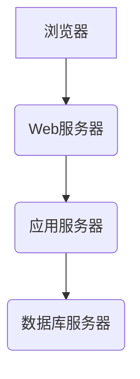
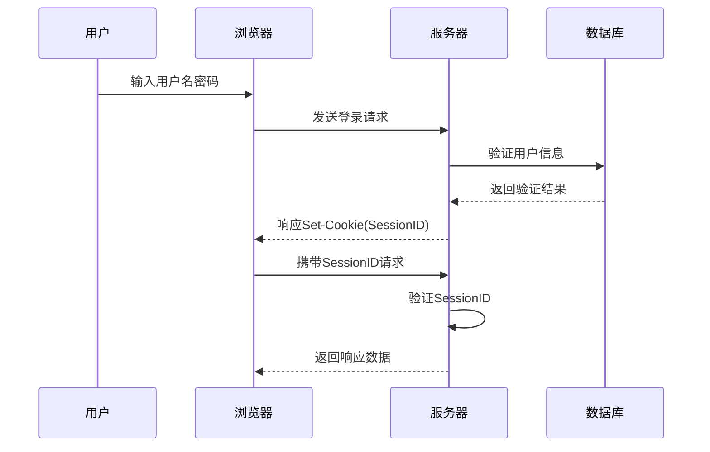
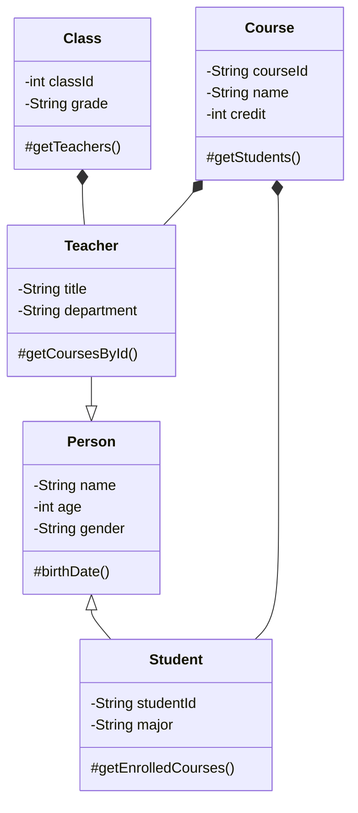

# 基于Web的师资管理系统设计与实现

## 1.背景介绍

### 1.1 项目背景

随着教育事业的不断发展,师资管理工作变得越来越繁重和复杂。传统的纸质档案管理方式已经无法满足现代化管理的需求,给学校的师资管理工作带来了诸多挑战。因此,构建一个高效、安全、便捷的基于Web的师资管理系统就显得尤为重要。

### 1.2 系统目标

本项目旨在设计并实现一个基于B/S(Browser/Server)架构的Web师资管理系统,实现对教师信息的统一管理,包括教师基本信息、教育经历、工作经历、科研成果等数据的录入、存储、查询、修改和统计分析,从而提高学校师资管理工作的效率,为决策者提供准确的数据支持。

### 1.3 系统价值

- 提高管理效率:系统化、数字化管理教师信息,减少人工操作
- 数据安全可靠:集中存储,权限管控,数据备份
- 实时更新共享:实时更新教师信息,各部门实时共享数据
- 统计分析支持:提供多维度统计分析,支持决策

## 2.核心概念与联系

### 2.1 B/S架构

B/S(Browser/Server)架构是一种典型的客户机/服务器模式,客户端只需使用浏览器,服务器端负责运算和存储。具有跨平台、易部署、低成本等优点,适合构建Web应用。

### 2.2 三层架构 

本系统采用经典的三层架构模式:表现层(前端)、业务逻辑层(中间件)、数据访问层(数据库),各层分工明确,有利于开发和维护。



### 2.3 核心技术

- 前端:HTML5,CSS3,JavaScript,BootStrap等
- 后端:Java,SpringBoot,SpringMVC,MyBatis等
- 数据库:MySQL
- 中间件:Tomcat,Nginx等
- 版本控制:Git

## 3.核心算法原理具体操作步骤

### 3.1 用户认证

用户认证是系统的入口,保证系统安全。本系统使用基于Session的认证机制:

1. 用户输入用户名密码
2. 服务器验证身份,创建Session对象存储用户信息
3. 服务器向客户端响应Set-Cookie头,写入SessionID
4. 后续请求自动携带SessionID进行身份验证



### 3.2 数据持久化

教师信息需要长期保存,采用关系型数据库MySQL进行持久化存储:

1. 创建数据库和表
2. 使用MyBatis操作数据库
3. 定义数据访问接口
4. 配置映射文件,绑定接口与SQL
5. 调用接口方法完成数据库操作



## 4.数学模型和公式详细讲解举例说明

在教师工作量统计分析中,我们需要计算每位教师的总工作量分值。假设有以下计算规则:

- 课程门数贡献系数$\alpha$
- 班级人数贡献系数$\beta$
- 课程学分贡献系数$\gamma$

教师$i$的总工作量分值$W_i$计算如下:

$$W_i = \sum_{j=1}^{m}(\alpha N_{ij} + \beta S_{ij} + \gamma C_{ij})$$

其中:
- $m$是教师$i$所授课程数量
- $N_{ij}$是教师$i$教授第$j$门课程的门数(取值1)
- $S_{ij}$是教师$i$第$j$门课程的总班级人数之和
- $C_{ij}$是教师$i$第$j$门课程的学分数

例如,假设$\alpha=10,\beta=2,\gamma=5$:
- 教师A教授2门课,第一门人数80人,学分3分;第二门人数50人,学分2分
- 则A的总工作量为: $W_A = 10\times2 + 2\times(80+50) + 5\times(3+2) = 20 + 260 + 25 = 305$

通过这一数学模型,可以量化和对比不同教师的教学工作量,为工作量分配提供依据。

## 4.项目实践:代码实例和详细解释说明

### 4.1 教师信息管理模块

#### 4.1.1 功能概述

教师信息管理是系统的核心模块,实现对教师基本信息、教育经历、工作经历、科研成果等数据的增删改查操作。

#### 4.1.2 技术实现

- 前端:使用Bootstrap构建响应式界面
- 后端:SpringMVC接收请求,SpringBoot整合各层
- 持久层:MyBatis操作MySQL数据库

#### 4.1.3 代码示例

```java
// TeacherController.java
@RestController
@RequestMapping("/teacher")
public class TeacherController {

    @Autowired
    private TeacherService teacherService;

    // 查询教师列表
    @GetMapping("/list")
    public ResponseEntity<List<Teacher>> getTeacherList() {
        List<Teacher> teachers = teacherService.getAllTeachers();
        return ResponseEntity.ok(teachers);
    }
    
    // 添加教师
    @PostMapping("/add")
    public ResponseEntity<String> addTeacher(@RequestBody Teacher teacher) {
        boolean success = teacherService.insertTeacher(teacher);
        if (success) {
            return ResponseEntity.ok("添加教师成功");
        } else {
            return ResponseEntity.badRequest().body("添加教师失败");
        }
    }
    
    // 其他CRUD方法...
}
```

```xml
<!-- TeacherMapper.xml -->
<mapper namespace="com.example.dao.TeacherDao">
    <resultMap id="teacherMap" type="com.example.model.Teacher">
        <!-- 字段映射 -->
    </resultMap>
    
    <select id="getAllTeachers" resultMap="teacherMap">
        SELECT * FROM teacher;
    </select>
    
    <insert id="insertTeacher" parameterType="com.example.model.Teacher">
        INSERT INTO teacher (name, age, gender, title, department)
        VALUES (#{name}, #{age}, #{gender}, #{title}, #{department})
    </insert>
    
    <!-- 其他映射语句 -->
</mapper>
```

上述代码展示了教师信息管理的关键部分,包括:

- SpringMVC控制器接收请求,调用服务层方法
- 服务层方法调用数据访问层执行数据库操作
- MyBatis映射文件绑定接口与SQL语句

## 5.实际应用场景

### 5.1 教师信息查询

- 学校领导可查询教师基本信息、职称、学历等,了解师资状况
- 教务处可查询教师课程负担情况,为排课提供依据
- 人事处可查询教师工作经历,为职称评审提供支持

### 5.2 教师工作量统计

- 统计每位教师的年度教学工作量分值
- 按工作量排名,为教师绩效考核提供客观依据
- 工作量过重的教师可适当减负,保证教学质量

### 5.3 学生成绩管理

- 教师可录入学生成绩,一键完成平时分、期末分计算
- 自动按规则计算学生最终成绩,减轻教师工作量
- 学生可随时查询个人成绩,精准掌握学习状况

### 5.4 教学质量评价

- 学生可对教师的教学质量进行在线评价
- 系统自动统计教师评价结果,形成量化指标
- 为教学质量评估和教师职称评审提供参考

## 6.工具和资源推荐

- IDE:IntelliJ IDEA,Visual Studio Code
- 构建工具:Maven,Gradle
- 版本控制:Git,GitHub
- 项目管理:Jira,Trello
- 文档工具:Confluence,ShowDoc
- 测试工具:JUnit,Selenium
- 部署工具:Jenkins,Docker
- 在线资源:GitHub,Stack Overflow,Spring官网,MyBatis官网

## 7.总结:未来发展趋势与挑战

### 7.1 发展趋势

- 云端部署:将系统部署到云端,实现随时随地访问
- 大数据分析:整合更多数据源,提供多维度数据分析
- 人工智能:利用AI技术如自然语言处理改善用户体验
- 移动端支持:开发移动APP客户端,支持移动办公
- 系统集成:与其他系统如财务系统、实验室管理系统集成

### 7.2 面临挑战

- 数据安全:加强数据加密和访问控制,防止数据泄露
- 系统扩展性:设计模块化架构,便于功能扩展和技术升级  
- 并发压力:采用缓存、负载均衡等优化措施,提高高并发能力
- 用户体验:不断优化UI/UX设计,提升系统易用性

## 8.附录:常见问题与解答  

### 8.1 如何实现教师信息修改功能?

1. 前端提供教师信息修改表单
2. 提交修改请求到TeacherController的update方法
3. 在Service层调用updateTeacher方法
4. Dao层的updateTeacher方法拼接UPDATE SQL并执行

### 8.2 如何设计学生选课功能?

1. 维护课程表、选课记录表
2. 学生通过选课页面提交选课申请
3. 后台进行选课规则校验(如重复选课、课程人数上限等)
4. 符合规则则插入选课记录,反之拒绝申请

### 8.3 如何处理并发修改的问题?

1. 使用乐观锁,在数据库记录中增加版本号字段
2. 修改记录时,将当前版本号作为条件,更新数据并将版本号+1
3. 若有并发修改,版本号不匹配则更新失败,防止覆盖

以上是本文的全部内容,希望对您有所帮助。如有任何疑问,欢迎随时提出。