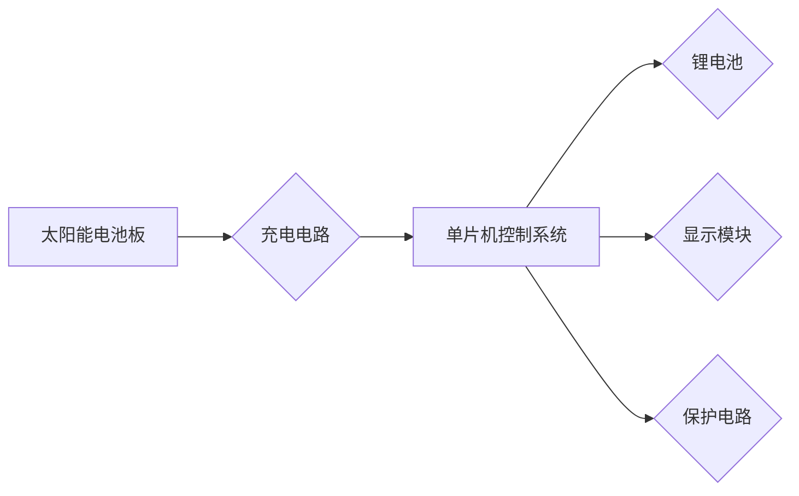

# 基于单片机太阳能手机锂电池充电器的设计与实现

作者：禅与计算机程序设计艺术

## 1. 背景介绍

### 1.1 太阳能充电的兴起与意义

随着移动设备的普及和人们对环保意识的增强，太阳能充电技术作为一种清洁、可持续的能源获取方式，近年来得到了越来越广泛的应用。特别是对于手机等便携式电子设备而言，太阳能充电器可以有效地解决户外旅行、紧急情况下电源短缺的问题，具有重要的现实意义。

### 1.2  手机锂电池充电技术现状

目前，市面上常见的手机充电器主要采用恒流/恒压（CC/CV）充电方式，以确保锂电池的安全性和使用寿命。然而，传统的充电器通常依赖于市电供电，在户外等场景下使用不便。而太阳能充电器由于其能源来源的不稳定性，需要更加智能化的控制策略来保证充电效率和电池寿命。

### 1.3 本文研究目标和意义

本文旨在设计并实现一款基于单片机的太阳能手机锂电池充电器，该充电器能够高效地利用太阳能为手机电池充电，并具备完善的充电保护功能，以延长电池的使用寿命。本研究对于推动太阳能充电技术的应用、满足人们对便携式能源的需求具有积极意义。

## 2. 核心概念与联系

### 2.1 太阳能电池板

太阳能电池板是太阳能充电器的核心部件，其作用是将太阳能转化为电能。

* **工作原理:** 太阳能电池板由多个太阳能电池片串联或并联组成。当光照射到太阳能电池片上时，会产生光生伏特效应，从而产生电流。
* **关键参数:**  太阳能电池板的关键参数包括开路电压（Voc）、短路电流（Isc）、最大功率点电压（Vmp）、最大功率点电流（Imp）等。
* **选型原则:**  选择太阳能电池板时，需要考虑其输出电压、电流、功率等参数是否满足充电需求，以及其尺寸、重量、转换效率等因素。

### 2.2 锂电池充电特性

锂电池是一种高能量密度、长寿命的可充电电池，但其充电过程需要严格控制，以确保安全性和使用寿命。

* **充电阶段:** 锂电池的充电过程 typically 包括涓流充电、恒流充电和恒压充电三个阶段。
    * **涓流充电:** 当电池电压极低时，需要先进行小电流充电，以激活电池。
    * **恒流充电:** 当电池电压达到一定值后，进入恒流充电阶段，此时充电电流保持恒定，电池电压逐渐上升。
    * **恒压充电:** 当电池电压接近充电截止电压时，进入恒压充电阶段，此时充电电压保持恒定，充电电流逐渐减小，直至充电完成。
* **充电保护:**  为防止过充、过放、过流等情况对锂电池造成损害，需要采取相应的保护措施，如过压保护、过流保护、温度保护等。

### 2.3  单片机控制系统

单片机控制系统是太阳能充电器的核心控制单元，负责监测太阳能电池板的输出电压和电流、锂电池的电压和电流，并根据充电状态控制充电过程。

* **主要功能:**  单片机的功能主要包括：
    * 采集太阳能电池板的输出电压和电流。
    * 采集锂电池的电压和电流。
    * 根据充电状态控制充电模式（涓流充电、恒流充电、恒压充电）。
    * 实现充电保护功能（过压保护、过流保护、温度保护）。
    * 显示充电状态和电池电量。
* **选型原则:** 选择单片机时，需要考虑其处理速度、存储容量、IO 口资源、功耗等因素。

### 2.4  充电电路设计

充电电路是太阳能充电器的关键部分，其作用是将太阳能电池板输出的电压和电流转换为适合锂电池充电的电压和电流。

* **主要功能:** 充电电路的主要功能包括：
    * 降压：将太阳能电池板输出的较高电压降低到适合锂电池充电的电压。
    * 稳压：保证充电电压稳定在设定值。
    * 恒流：控制充电电流在设定范围内。
* **常用电路:** 常用的充电电路包括线性充电电路和开关充电电路。
    * 线性充电电路结构简单，成本低，但效率较低，发热量大。
    * 开关充电电路效率高，发热量小，但电路复杂，成本较高。

### 2.5  核心概念联系图



## 3. 核心算法原理具体操作步骤

### 3.1  最大功率点跟踪 (MPPT) 算法

由于太阳能电池板的输出功率随着光照强度和温度的变化而变化，为了最大限度地利用太阳能，需要采用最大功率点跟踪 (MPPT) 算法来实时调整充电电压和电流，使太阳能电池板工作在最大功率点。

* **扰动观察法:**  扰动观察法是一种常用的 MPPT 算法，其基本原理是在当前工作点附近引入一个小的扰动，观察输出功率的变化，并根据功率变化方向调整工作点，直到找到最大功率点。
    1. 初始化充电电压和电流。
    2. 测量当前工作点处的太阳能电池板输出功率 $P_1$。
    3. 对充电电压或电流进行一个小的扰动 $\Delta V$ 或 $\Delta I$。
    4. 测量扰动后工作点处的太阳能电池板输出功率 $P_2$。
    5. 如果 $P_2 > P_1$，则继续朝扰动方向调整工作点；否则，朝相反方向调整工作点。
    6. 重复步骤 3-5，直到找到最大功率点。
* **增量电导法:**  增量电导法是另一种常用的 MPPT 算法，其基本原理是利用太阳能电池板输出功率对电压或电流的导数来判断最大功率点的位置。
    1. 初始化充电电压和电流。
    2. 测量当前工作点处的太阳能电池板输出电压 $V_1$、电流 $I_1$ 和功率 $P_1$。
    3. 计算电压和电流的增量 $\Delta V = V_1 - V_0$，$\Delta I = I_1 - I_0$，其中 $V_0$ 和 $I_0$ 是上一个采样周期的电压和电流值。
    4. 计算电压和电流的导数  $dV/dI = \Delta V / \Delta I$。
    5. 如果 $dV/dI = -V_{mp}/I_{mp}$，则当前工作点为最大功率点；
       如果 $dV/dI > -V_{mp}/I_{mp}$，则增大充电电压；
       如果 $dV/dI < -V_{mp}/I_{mp}$，则减小充电电压。
    6. 重复步骤 2-5，直到找到最大功率点。

### 3.2 锂电池充电控制算法

锂电池充电控制算法负责根据锂电池的充电状态控制充电模式，并实现充电保护功能。

* **充电状态判断:**  根据锂电池的电压和电流，可以判断其充电状态。
    * **涓流充电阶段:** 电池电压低于设定值（例如 2.8V）。
    * **恒流充电阶段:** 电池电压高于设定值，但充电电流大于设定值。
    * **恒压充电阶段:** 电池电压接近充电截止电压，充电电流小于设定值。
    * **充电完成:** 电池电压达到充电截止电压，充电电流接近于 0。
* **充电模式控制:**  根据充电状态，控制充电电路工作在不同的模式。
    * **涓流充电模式:**  控制充电电流为较小的值，以激活电池。
    * **恒流充电模式:** 控制充电电流为设定值，使电池电压逐渐上升。
    * **恒压充电模式:** 控制充电电压为设定值，使充电电流逐渐减小，直至充电完成。
* **充电保护:**  
    * **过压保护:** 当电池电压超过设定值时，停止充电。
    * **过流保护:** 当充电电流超过设定值时，停止充电。
    * **温度保护:** 当电池温度超过设定值时，停止充电。

## 4. 数学模型和公式详细讲解举例说明

### 4.1 太阳能电池板数学模型

太阳能电池板的输出电流可以用以下公式表示：

$$
I = I_{ph} - I_s(e^{\frac{V + IR_s}{nV_t}} - 1) - \frac{V + IR_s}{R_{sh}}
$$

其中：

* $I$ 为太阳能电池板的输出电流
* $V$ 为太阳能电池板的输出电压
* $I_{ph}$ 为光生电流
* $I_s$ 为反向饱和电流
* $R_s$ 为串联电阻
* $R_{sh}$ 为并联电阻
* $n$ 为二极管理想因子
* $V_t$ 为热电压，$V_t = kT/q$，其中 $k$ 为玻尔兹曼常数，$T$ 为绝对温度，$q$ 为电子电荷量

### 4.2 锂电池充电模型

锂电池的充电过程可以用以下公式表示：

**恒流充电阶段:**

$$
V(t) = V(t_0) + \frac{I_{ch} \times (t - t_0)}{C}
$$

**恒压充电阶段:**

$$
I(t) = I(t_0) \times e^{-\frac{(t - t_0)}{RC}}
$$

其中：

* $V(t)$ 为 $t$ 时刻的电池电压
* $I(t)$ 为 $t$ 时刻的充电电流
* $V(t_0)$ 为初始时刻的电池电压
* $I(t_0)$ 为初始时刻的充电电流
* $I_{ch}$ 为恒流充电电流
* $C$ 为电池容量
* $R$ 为电池内阻

## 5. 项目实践：代码实例和详细解释说明

### 5.1  硬件电路设计

本项目采用STC89C52单片机作为主控芯片，结合太阳能电池板、充电电路、锂电池保护电路等模块，设计了以下硬件电路：

```
[硬件电路图]
```

### 5.2  软件程序设计

以下是用C语言编写的单片机程序，实现了太阳能手机锂电池充电器的主要功能：

```c
#include <reg52.h>

// 定义引脚
sbit LED = P1^0; // 定义LED指示灯引脚
sbit KEY = P3^2; // 定义按键引脚

// 定义变量
unsigned char charge_status = 0; // 充电状态
unsigned int voltage, current; // 电压、电流值

// 函数声明
void delay(unsigned int ms);
void init();
void get_adc_value();
void control_charge();
void display();

void main()
{
    init(); // 初始化

    while(1)
    {
        get_adc_value(); // 获取电压、电流值
        control_charge(); // 控制充电
        display(); // 显示充电状态
        delay(1000); // 延时1秒
    }
}

// 初始化函数
void init()
{
    // 初始化ADC
    // ...

    // 初始化定时器
    // ...

    // 初始化中断
    // ...

    // 初始化其他外设
    // ...
}

// 获取电压、电流值函数
void get_adc_value()
{
    // 读取ADC转换结果
    // ...

    // 计算电压、电流值
    // ...
}

// 控制充电函数
void control_charge()
{
    // 判断充电状态
    if (voltage < 2.8)
    {
        charge_status = 1; // 涓流充电
    }
    else if (voltage >= 2.8 && current > 100)
    {
        charge_status = 2; // 恒流充电
    }
    else if (voltage >= 4.2 && current <= 100)
    {
        charge_status = 3; // 恒压充电
    }
    else if (voltage >= 4.2 && current < 10)
    {
        charge_status = 4; // 充电完成
    }

    // 根据充电状态控制充电电路
    switch (charge_status)
    {
        case 1:
            // 涓流充电
            // ...
            break;
        case 2:
            // 恒流充电
            // ...
            break;
        case 3:
            // 恒压充电
            // ...
            break;
        case 4:
            // 充电完成
            // ...
            break;
        default:
            break;
    }
}

// 显示充电状态函数
void display()
{
    // 根据充电状态控制LED灯闪烁
    // ...

    // 在LCD上显示电压、电流值和充电状态
    // ...
}

// 延时函数
void delay(unsigned int ms)
{
    unsigned int i, j;
    for (i = 0; i < ms; i++)
        for (j = 0; j < 110; j++);
}
```

## 6. 实际应用场景

基于单片机太阳能手机锂电池充电器具有广泛的应用场景，例如：

* **户外旅行:**  对于经常进行户外运动、探险、旅游的人士来说，太阳能充电器可以为手机、GPS导航仪等设备提供持续的电力供应，解决户外电源短缺的问题。
* **紧急情况:**  在地震、洪水等自然灾害发生时，电力供应往往会中断，太阳能充电器可以作为应急电源，为手机等通讯设备提供电力保障。
* **偏远地区:** 在一些电力供应不稳定或缺乏电力基础设施的偏远地区，太阳能充电器可以为当地居民提供可靠的电力来源，改善生活条件。
* **军事领域:**  太阳能充电器可以为士兵的通讯设备、夜视仪等装备提供电力支持，提高作战效率。

## 7. 总结：未来发展趋势与挑战

### 7.1 未来发展趋势

* **更高效的太阳能电池板:**  随着太阳能电池板转换效率的不断提高，未来太阳能充电器的充电速度将会更快，体积也会更小。
* **更智能的充电控制算法:**  随着人工智能技术的不断发展，未来太阳能充电器将能够更加智能地根据环境光照强度、温度、电池状态等因素调整充电策略，提高充电效率和电池寿命。
* **更广泛的应用场景:**  随着太阳能充电技术的不断成熟，未来太阳能充电器将会应用到更多的领域，例如电动汽车、无人机、智能家居等。

### 7.2 面临的挑战

* **成本问题:**  目前，太阳能充电器的成本仍然较高，限制了其大规模应用。
* **技术瓶颈:**  太阳能电池板的转换效率、锂电池的能量密度等方面仍存在技术瓶颈，需要进一步突破。
* **标准化问题:**  目前，太阳能充电器的接口、协议等方面缺乏统一的标准，制约了其互联互通和产业发展。

## 8. 附录：常见问题与解答

### 8.1  太阳能充电器充电慢怎么办？

* 确保太阳能电池板正对着阳光，且没有被遮挡。
* 清洁太阳能电池板表面，避免灰尘影响充电效率。
* 检查充电线是否连接良好。
* 确认锂电池是否老化，如果电池老化，则充电速度会变慢。

### 8.2 太阳能充电器充不进电怎么办？

* 检查太阳能电池板是否损坏。
* 检查充电线是否损坏。
* 检查锂电池是否损坏。
* 检查充电电路是否正常工作。

### 8.3  使用太阳能充电器需要注意哪些问题？

* 不要将太阳能充电器长时间暴露在阳光直射下，避免高温损坏设备。
* 不要使用劣质的充电线，避免发生安全事故。
* 不要将太阳能充电器放置在潮湿、高温、易燃易爆的环境中。
* 在不使用太阳能充电器时，请将其放置在阴凉干燥处保存。 
