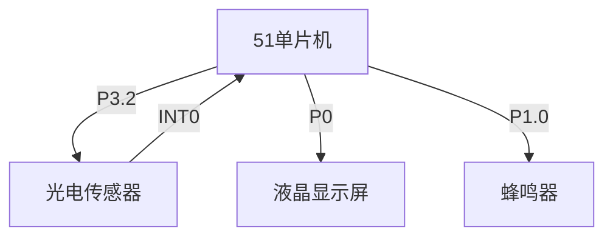
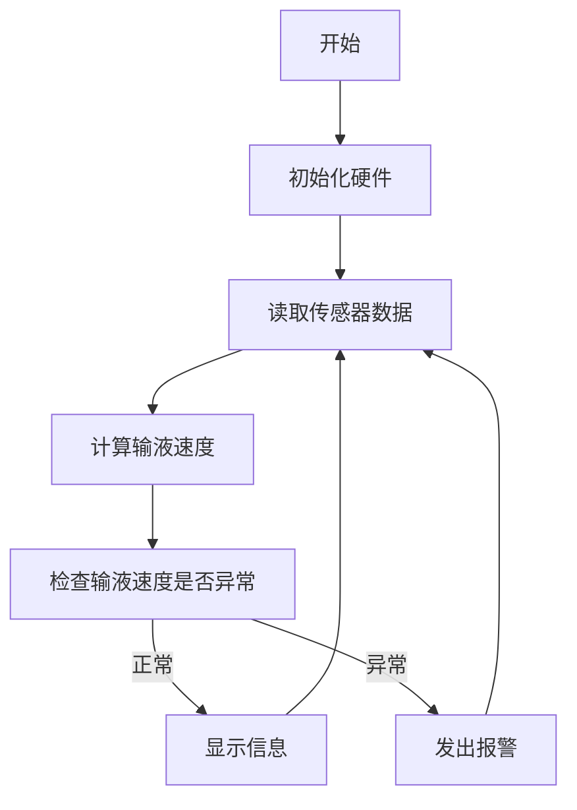

# 基于单片机智能便携式输液器滴检测报警的设计与实现

## 1.背景介绍

### 1.1 医疗输液系统的重要性

在现代医疗保健领域中,静脉输液是一种非常普遍和重要的治疗方式。通过向患者的静脉注射液体药物、营养液或者盐水等,可以有效地补充体液、调节电解质平衡、给药治疗等。然而,传统的输液系统存在一些潜在的风险和不足,比如输液速度不精确、液体滴漏、空气栓塞等,可能会给患者带来安全隐患。因此,开发一种智能便携式输液器系统,能够实时监测输液过程、检测异常并发出报警,对于提高医疗质量和患者安全具有重要意义。

### 1.2 现有输液器系统的局限性

目前,医院中使用的大型输液系统虽然功能强大,但由于体积庞大、价格昂贵、操作复杂等原因,难以满足家庭或者远程医疗等场景下的需求。另一方面,市面上的普通家用输液器缺乏智能化监控和报警功能,存在一定的安全隐患。因此,开发一种智能便携式输液器系统,将智能检测和报警功能与便携性有机结合,可以很好地解决上述问题。

## 2.核心概念与联系

### 2.1 单片机系统

单片机(Single-Chip Microcomputer)是一种高度集成的微型计算机系统,它将微处理器的运算和控制单元、存储程序和数据的存储器、计数器、定时器等周边设备集成在一个芯片上。由于单片机具有体积小、功耗低、成本低廉等优势,非常适合应用于智能化控制系统。

在本项目中,我们选择使用51单片机作为系统的核心控制单元,负责采集输液滴检测传感器的数据、执行报警控制算法、驱动液晶显示屏和蜂鸣器等外围设备。

### 2.2 输液滴检测原理

输液滴检测是整个系统的核心,通过检测输液管路中液滴的流动情况,可以计算出实际的输液速度,并与预设的期望速度进行比较,从而判断是否存在异常情况。

本系统采用光电式传感器实现滴检测。工作原理是:将一个发光二极管(LED)和一个光电晶体管组成发射端和接收端,当液滴通过时会遮挡光线,从而导致接收端的光电流发生变化。通过检测光电流的变化,即可判断出液滴的流动情况。

### 2.3 报警控制算法

报警控制算法是系统智能化的关键所在。通过分析输液滴检测数据,系统需要判断是否存在异常情况(如输液过快、输液过慢、管路堵塞等),并根据异常类型发出相应的报警信号,提醒使用者及时处理。

同时,算法还需要具备一定的容错能力,能够有效过滤掉由于偶然因素(如震动等)导致的短暂异常,避免发出错误报警,提高系统的稳定性。

## 3.核心算法原理具体操作步骤

### 3.1 输液滴检测算法

输液滴检测算法的主要任务是根据光电传感器的数据,计算出实际的输液速度。具体步骤如下:

1. 初始化相关硬件,包括定时器、外部中断等。
2. 设置一个计数器变量`drop_count`记录液滴数量,初始值为0。
3. 在外部中断服务程序中,每当检测到一个液滴时,就将`drop_count`加1。
4. 使用定时器每隔一段时间(如1秒)读取`drop_count`的值,并将其清零。读取的`drop_count`值就是这段时间内的液滴数量。
5. 根据标定参数(如每ml液体对应的液滴数量),将液滴数量转换为实际输液量,进而计算出输液速度。

通过这种方式,我们可以实时监测输液速度的变化情况。

### 3.2 报警控制算法

报警控制算法需要综合考虑多种异常情况,并根据异常的严重程度发出不同级别的报警。算法的主要步骤如下:

1. 设定输液速度的正常范围,如每分钟20~40滴。
2. 获取当前的实际输液速度。
3. 判断实际速度是否超出正常范围:
    - 如果实际速度过快(如>40滴/分钟),则发出急性报警(如鸣响蜂鸣器)。
    - 如果实际速度过慢(如<20滴/分钟),则发出缓性报警(如在液晶显示屏上显示警告信息)。
4. 引入一定的容错机制,如果异常情况持续一段时间(如30秒)才发出报警,避免由于短暂的异常导致错误报警。
5. 如果异常情况持续存在,则定期重复报警,提醒用户处理。

此外,算法还需要考虑其他异常情况,如管路堵塞(连续一段时间检测不到液滴)、空气栓塞等,并采取相应的报警措施。

## 4.数学模型和公式详细讲解举例说明

在输液速度的计算过程中,我们需要建立输液量和液滴数量之间的数学模型。假设每ml输液液体对应的液滴数量为$k$,则在给定时间$t$内,输液量$V$和液滴数量$N$的关系为:

$$V = \frac{N}{k}$$

进而,输液速度$v$可以表示为:

$$v = \frac{V}{t} = \frac{N}{kt}$$

其中$N$为单位时间$t$内检测到的液滴数量。

我们以一个具体例子说明输液速度的计算过程。假设标定参数$k=20$滴/ml,即每ml输液液体对应20滴液滴。在1秒的时间内,传感器检测到30滴液滴,则该时刻的输液速度为:

$$\begin{aligned}
N &= 30\\
k &= 20\ \text{滴/ml}\\
t &= 1\ \text{秒}\\
v &= \frac{N}{kt} = \frac{30}{20 \times 1} = 1.5\ \text{ml/秒}
\end{aligned}$$

如果将时间换算为分钟,输液速度就是$1.5 \times 60 = 90$ml/分钟。

通过上述模型和公式,我们可以根据检测到的液滴数量,精确计算出实际的输液速度,为报警控制算法提供关键数据支持。

## 4.项目实践:代码实例和详细解释说明

### 4.1 硬件电路连接

智能输液器系统的硬件电路主要包括51单片机、光电传感器、液晶显示屏、蜂鸣器等部分,它们与单片机的引脚连接如下:



- 光电传感器的输出端连接到单片机的P3.2引脚,用于读取传感器数据。同时,传感器的输出端也连接到单片机的外部中断INT0,用于检测液滴通过时的中断信号。
- 液晶显示屏的数据总线连接到单片机的P0端口。
- 蜂鸣器连接到单片机的P1.0引脚,用于发出报警声音。

### 4.2 主程序流程

智能输液器系统的主程序流程如下:



1. 初始化硬件,包括定时器、外部中断、液晶显示屏等。
2. 读取光电传感器的数据,检测液滴的流动情况。
3. 根据液滴数量计算实际的输液速度。
4. 检查输液速度是否超出正常范围,如果异常则发出报警,否则在液晶屏上显示当前输液信息。
5. 循环执行2~4步骤,实时监控输液过程。

### 4.3 关键代码模块

#### 4.3.1 外部中断服务程序

当液滴通过光电传感器时,会触发外部中断INT0,执行以下中断服务程序:

```c
void ext0_isr(void) interrupt 0
{
    drop_count++; // 计数液滴数量
    ...
}
```

在中断服务程序中,我们将一个全局变量`drop_count`加1,用于记录液滴的数量。

#### 4.3.2 输液速度计算函数

定时器中断程序会每隔一段时间调用以下函数,计算输液速度:

```c
float calc_flow_rate(void)
{
    unsigned int temp = drop_count;
    drop_count = 0; // 清零计数器
    
    float rate = temp * 60.0 / (k * timer_interval);
    // rate 为 ml/min
    
    return rate;
}
```

- 首先读取`drop_count`的值并将其清零,避免重复计数。
- 根据液滴数量`temp`、标定参数`k`和计时间隔`timer_interval`,计算出输液速度`rate`(单位为ml/min)。
- 返回计算得到的输液速度值。

#### 4.3.3 报警控制函数

以下函数根据输液速度判断是否需要报警,并执行相应的操作:

```c
void check_alarm(float rate)
{
    if (rate > RATE_HIGH) // 输液速度过快
    {
        alarm_high();
    }
    else if (rate < RATE_LOW) // 输液速度过慢
    {
        alarm_low();
    }
    else // 正常范围
    {
        clear_alarm();
    }
}

void alarm_high(void)
{
    // 发出急性报警,如鸣响蜂鸣器
    ...
}

void alarm_low(void)
{
    // 发出缓性报警,如在液晶屏显示警告
    ...
}

void clear_alarm(void)
{
    // 清除报警状态
    ...
}
```

- `check_alarm`函数根据输液速度`rate`的值,判断是否超出正常范围(`RATE_HIGH`和`RATE_LOW`为预设的阈值)。
- 如果速度过快,则调用`alarm_high`函数发出急性报警;如果速度过慢,则调用`alarm_low`函数发出缓性报警。
- 在正常范围内,调用`clear_alarm`函数清除报警状态。
- `alarm_high`、`alarm_low`和`clear_alarm`函数分别实现具体的报警和清除操作,如控制蜂鸣器、更新液晶显示等。

通过这些关键代码模块,我们实现了输液滴检测、速度计算和报警控制的核心功能。

## 5.实际应用场景

智能便携式输液器系统具有广阔的应用前景,可以为各种场景下的输液治疗提供安全可靠的保障。

### 5.1 家庭医疗

对于一些需要在家中进行长期输液治疗的患者(如肿瘤患者、肾衰患者等),智能输液器可以提供远程监控和报警功能,减轻家人的照看压力,提高治疗的安全性。

### 5.2 远程医疗

在偏远地区或者灾难救援等场景下,智能输液器可以与远程医疗系统相结合,实现输液过程的实时监控和报警,确保患者的用药安全。

### 5.3 临床输液

在医院等临床场景中,智能输液器也可以作为辅助设备使用,为医护人员提供输液过程的实时监测和报警支持,提高工作效率和医疗质量。

### 5.4 动物医疗

智能输液器在动物医疗领域也有广阔的应用前景,可以为宠物医院、农场等场所提供输液监控和报警服务。

## 6.工具和资源推荐

在开发智能输液器系统的过程中,我们可以利用一些优