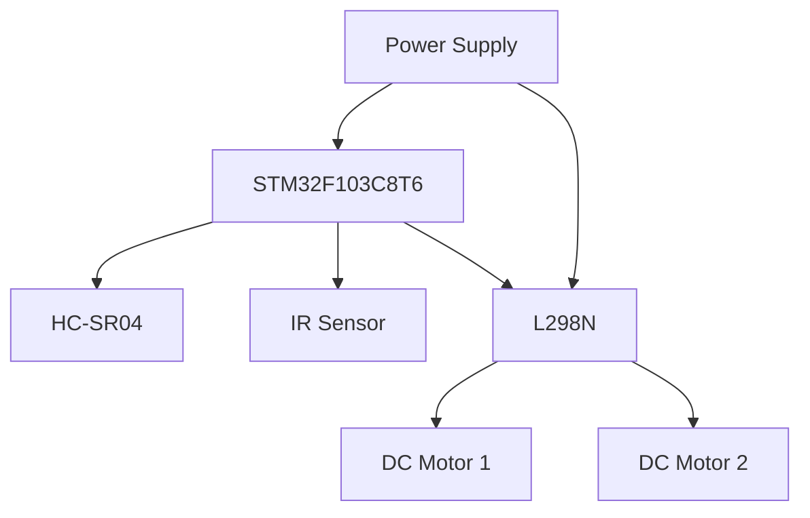

# 基于单片机智能扫地吸尘小车的设计与实现

作者：禅与计算机程序设计艺术

## 1. 背景介绍

### 1.1 智能家居与智能清洁的兴起

随着科技的不断进步，智能家居设备逐渐进入人们的日常生活。智能扫地吸尘小车作为智能家居的重要组成部分，不仅可以减轻家庭清洁的负担，还能提高生活质量。近年来，市场上涌现了许多不同品牌和型号的智能扫地吸尘小车，它们在功能和性能上各有千秋。

### 1.2 单片机在智能设备中的应用

单片机（Microcontroller Unit, MCU）作为一种集成了CPU、内存、输入输出接口等功能的微型计算机，被广泛应用于各种智能设备中。其低成本、低功耗、易编程等特点，使其成为智能扫地吸尘小车的理想选择。

### 1.3 本文的目的与结构

本文旨在介绍基于单片机的智能扫地吸尘小车的设计与实现。文章将从核心概念、算法原理、数学模型、项目实践、实际应用场景、工具和资源推荐等方面进行详细讲解，帮助读者全面理解并掌握相关技术。

## 2. 核心概念与联系

### 2.1 单片机的基本概念

单片机是一种集成了中央处理器（CPU）、存储器（RAM和ROM）、输入输出接口（I/O）等功能的微型计算机。常见的单片机包括AVR、PIC、STM32等。它们广泛应用于各种嵌入式系统中。

### 2.2 智能扫地吸尘小车的工作原理

智能扫地吸尘小车主要由以下几个部分组成：
- **传感器模块**：用于检测环境信息，如红外传感器、超声波传感器等。
- **控制模块**：通常由单片机组成，用于处理传感器数据并控制小车的运动。
- **驱动模块**：包括电机和驱动电路，用于驱动小车的移动。
- **吸尘模块**：包括风机和垃圾收集装置，用于吸尘和收集垃圾。

### 2.3 单片机与智能扫地吸尘小车的联系

单片机在智能扫地吸尘小车中起着核心控制作用。它接收传感器数据，通过算法处理后，发送控制信号给驱动模块，使小车能够自主避障、规划路径并进行清洁工作。

## 3. 核心算法原理具体操作步骤

### 3.1 避障算法

避障算法是智能扫地吸尘小车的核心算法之一。常见的避障算法包括：
- **基于传感器的简单避障算法**：通过红外传感器或超声波传感器检测前方障碍物，若检测到障碍物，则改变小车的行进方向。
- **基于栅格地图的避障算法**：将环境划分为栅格，每个栅格代表一个区域，通过传感器数据更新栅格状态，规划无障碍路径。

### 3.2 路径规划算法

路径规划算法用于在已知环境中规划最优路径。常见的路径规划算法包括：
- **A*算法**：一种启发式搜索算法，通过估算当前节点到目标节点的代价，选择代价最小的路径。
- **Dijkstra算法**：一种经典的最短路径算法，通过逐步扩展节点，找到从起点到终点的最短路径。

### 3.3 清扫算法

清扫算法用于规划小车的清扫路径，确保覆盖整个清扫区域。常见的清扫算法包括：
- **螺旋线算法**：从中心向外螺旋状移动，逐步覆盖整个清扫区域。
- **随机漫步算法**：随机选择方向移动，通过多次覆盖达到清扫效果。

## 4. 数学模型和公式详细讲解举例说明

### 4.1 传感器数据处理

传感器数据处理是智能扫地吸尘小车的基础。以超声波传感器为例，其测距公式为：

$$
d = \frac{v \cdot t}{2}
$$

其中，$d$ 为距离，$v$ 为声波传播速度，$t$ 为声波往返时间。

### 4.2 路径规划中的A*算法

A*算法通过估算当前节点到目标节点的代价（$f(n)$），选择代价最小的路径。其公式为：

$$
f(n) = g(n) + h(n)
$$

其中，$g(n)$ 为起点到当前节点的实际代价，$h(n)$ 为当前节点到目标节点的估算代价。

### 4.3 电机控制中的PID算法

PID算法用于控制电机速度，其公式为：

$$
u(t) = K_p e(t) + K_i \int_{0}^{t} e(\tau) d\tau + K_d \frac{de(t)}{dt}
$$

其中，$u(t)$ 为控制输出，$e(t)$ 为误差，$K_p$、$K_i$、$K_d$ 分别为比例、积分、微分系数。

## 5. 项目实践：代码实例和详细解释说明

### 5.1 硬件选型与搭建

#### 5.1.1 硬件选型

- **单片机**：STM32F103C8T6
- **传感器**：HC-SR04超声波传感器、IR红外传感器
- **电机**：直流电机
- **驱动模块**：L298N电机驱动模块
- **其他**：电源模块、底盘、吸尘模块

#### 5.1.2 硬件搭建

硬件搭建包括传感器、驱动模块、电机等的连接。以下是硬件连接示意图：



### 5.2 软件设计与实现

#### 5.2.1 传感器数据读取

以下是读取HC-SR04超声波传感器数据的代码示例：

```c
#include "stm32f10x.h"

void HCSR04_Init(void) {
    // 初始化GPIO和定时器
}

uint32_t HCSR04_Read(void) {
    uint32_t distance;
    // 发送超声波信号
    // 计算往返时间
    // 转换为距离
    return distance;
}
```

#### 5.2.2 避障算法实现

以下是基于传感器数据的简单避障算法实现：

```c
void AvoidObstacle(void) {
    uint32_t distance = HCSR04_Read();
    if (distance < 20) {
        // 障碍物距离小于20cm，改变方向
        ChangeDirection();
    } else {
        // 无障碍物，继续前进
        MoveForward();
    }
}
```

#### 5.2.3 电机控制

以下是基于PID算法的电机速度控制代码示例：

```c
float Kp = 1.0, Ki = 0.1, Kd = 0.01;
float integral = 0, previous_error = 0;

void MotorControl(float setpoint, float measured_value) {
    float error = setpoint - measured_value;
    integral += error;
    float derivative = error - previous_error;
    float output = Kp * error + Ki * integral + Kd * derivative;
    previous_error = error;
    SetMotorSpeed(output);
}
```

## 6. 实际应用场景

### 6.1 家庭清洁

智能扫地吸尘小车可以在家庭环境中自动清洁地面，特别适用于地毯、木地板等多种地面材质。

### 6.2 办公室清洁

在办公室环境中，智能扫地吸尘小车能够自动清洁地面，提高办公环境的整洁度，减少人工清洁的工作量。

### 6.3 商场与公共场所清洁

智能扫地吸尘小车可以在商场、公共场所等大面积环境中进行自动清洁，提高清洁效率，保障环境卫生。

## 7. 工具和资源推荐

### 7.