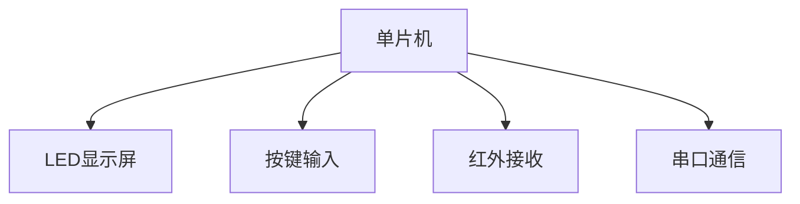

# 基于单片机的LED广告牌设计

## 1. 背景介绍

### 1.1 LED广告牌的起源与发展
LED广告牌作为一种新型的广告媒介，因其亮度高、能耗低、寿命长等优势，迅速在全球范围内普及。传统的广告牌主要依靠纸质或喷绘材料，更新成本高且不易维护。随着LED技术的发展，LED广告牌逐渐取代传统广告牌，成为现代城市景观中不可或缺的一部分。

### 1.2 单片机在LED广告牌中的应用
单片机（Microcontroller Unit, MCU）作为一种集成了CPU、存储器、I/O接口等功能的微型计算机，广泛应用于各种嵌入式系统中。在LED广告牌的设计中，单片机起到了控制和管理的核心作用。它不仅负责驱动LED显示屏，还要处理各种输入信号，实现广告内容的动态更新。

### 1.3 项目目标与意义
本项目旨在设计并实现一个基于单片机的LED广告牌系统。通过本项目的实施，读者将掌握单片机的基本原理和编程技巧，了解LED显示技术，并能够设计和实现一个完整的LED广告牌控制系统。

## 2. 核心概念与联系

### 2.1 单片机基本概念
单片机是一种高度集成的微型计算机，通常包括以下几个部分：
- **中央处理器（CPU）**：负责执行指令和处理数据。
- **存储器**：包括程序存储器（ROM）和数据存储器（RAM）。
- **输入/输出接口（I/O）**：用于与外部设备进行数据交换。
- **定时器/计数器**：用于时间和事件的计量。
- **串行通信接口**：用于与其他设备进行串行通信。

### 2.2 LED显示技术
LED（Light Emitting Diode）是一种能够发光的半导体器件。LED显示屏由大量LED点阵组成，通过控制每个LED的亮灭和颜色，可以实现图像和文字的显示。常见的LED显示屏类型包括单色、双色和全彩屏。

### 2.3 单片机与LED的接口与控制
单片机通过I/O接口与LED显示屏连接，控制每个LED的亮度和颜色。常见的控制方式包括：
- **静态扫描**：每个LED点直接连接到单片机的I/O口，适用于小规模LED阵列。
- **动态扫描**：通过多路复用技术，减少I/O口的使用，适用于大规模LED阵列。

### 2.4 显示驱动与刷新机制
LED显示屏的驱动和刷新机制是实现动态显示的关键。通常采用PWM（Pulse Width Modulation）技术，通过调节脉冲宽度来控制LED的亮度。此外，刷新频率也是影响显示效果的重要因素，过低的刷新频率会导致闪烁现象。

## 3. 核心算法原理具体操作步骤

### 3.1 系统架构设计
系统架构设计是整个项目的基础，主要包括硬件架构和软件架构两部分。

#### 3.1.1 硬件架构设计
硬件架构设计涉及单片机的选择、LED显示屏的选择、驱动电路设计等。常用的单片机型号有STC89C52、ATmega328等。

#### 3.1.2 软件架构设计
软件架构设计包括系统初始化、显示控制、输入处理等模块。主要编程语言为C语言，开发环境可以选择Keil或Arduino IDE。

### 3.2 显示控制算法
显示控制算法是实现LED广告牌动态显示的核心。常用的显示控制算法有静态扫描和动态扫描。

#### 3.2.1 静态扫描算法
静态扫描算法适用于小规模LED阵列，每个LED点直接连接到单片机的I/O口。算法步骤如下：
1. 初始化I/O口和LED显示屏。
2. 设置显示缓冲区，存储待显示的图像或文字数据。
3. 循环扫描每个LED点，控制其亮度和颜色。

#### 3.2.2 动态扫描算法
动态扫描算法适用于大规模LED阵列，通过多路复用技术，减少I/O口的使用。算法步骤如下：
1. 初始化I/O口和LED显示屏。
2. 设置显示缓冲区，存储待显示的图像或文字数据。
3. 按行或列进行扫描，逐行或逐列刷新LED显示屏。

### 3.3 输入处理与响应
输入处理与响应是实现广告内容动态更新的关键。常见的输入方式有按键输入、遥控输入和串口通信。

#### 3.3.1 按键输入处理
按键输入处理包括按键扫描、去抖动处理和按键事件响应。算法步骤如下：
1. 初始化按键接口。
2. 定时扫描按键状态。
3. 去抖动处理，确保按键状态稳定。
4. 根据按键事件更新显示内容。

#### 3.3.2 遥控输入处理
遥控输入处理包括红外接收、电平转换和事件响应。算法步骤如下：
1. 初始化红外接收接口。
2. 接收并解码红外信号。
3. 根据遥控事件更新显示内容。

#### 3.3.3 串口通信处理
串口通信处理包括串口初始化、数据接收和事件响应。算法步骤如下：
1. 初始化串口接口。
2. 接收并解析串口数据。
3. 根据串口命令更新显示内容。

## 4. 数学模型和公式详细讲解举例说明

### 4.1 PWM调制技术
PWM（Pulse Width Modulation）是一种通过调节脉冲宽度来控制LED亮度的技术。其数学模型如下：

$$
D = \frac{T_{\text{on}}}{T_{\text{total}}}
$$

其中，$D$ 为占空比，$T_{\text{on}}$ 为脉冲高电平时间，$T_{\text{total}}$ 为脉冲周期。

### 4.2 动态扫描算法
动态扫描算法通过多路复用技术，减少I/O口的使用。其数学模型如下：

$$
N_{\text{IO}} = \log_2(N_{\text{LED}})
$$

其中，$N_{\text{IO}}$ 为所需I/O口数量，$N_{\text{LED}}$ 为LED点数量。

### 4.3 显示刷新频率
显示刷新频率是影响显示效果的重要因素。其数学模型如下：

$$
f_{\text{refresh}} = \frac{1}{T_{\text{refresh}}}
$$

其中，$f_{\text{refresh}}$ 为刷新频率，$T_{\text{refresh}}$ 为刷新周期。

## 5. 项目实践：代码实例和详细解释说明

### 5.1 硬件连接与电路设计
硬件连接与电路设计是项目实践的基础。以下是一个典型的硬件连接示意图：



### 5.2 软件实现与代码实例
软件实现是项目的核心部分，主要包括系统初始化、显示控制和输入处理等模块。以下是一个简单的代码实例：

```c
#include <reg52.h>

#define LED_PORT P0

void delay(unsigned int ms);
void init();
void display();

void main() {
    init();
    while (1) {
        display();
        delay(100);
    }
}

void delay(unsigned int ms) {
    unsigned int i, j;
    for (i = 0; i < ms; i++)
        for (j = 0; j < 120; j++);
}

void init() {
    LED_PORT = 0x00;  // 初始化LED端口
}

void display() {
    LED_PORT = 0xFF;  // 点亮所有LED
    delay(500);
    LED_PORT = 0x00;  // 熄灭所有LED
    delay(500);
}
```

### 5.3 详细解释与优化建议
上述代码实现了一个简单的LED闪烁效果，主要步骤如下：
1. 初始化LED端口。
2. 在主循环中控制LED的亮灭。
3. 通过延时函数实现闪烁效果。

优化建议：
1. 使用定时器中断实现精确延时，减少主循环的负担。
2. 增加输入处理模块，实现广告内容的动态更新。
3. 优化显示控制算法，提高显示刷新频率。

## 6. 实际应用场景

### 6.1 商业广告
LED广告牌广泛应用于商业广告领域，如商场