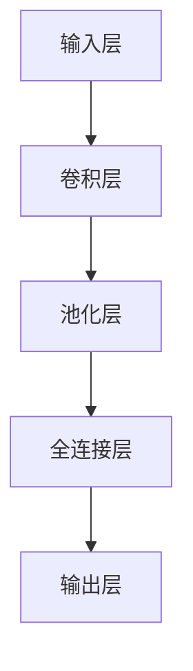

# 基于卷积神经网络的网络安全态势感知研究

作者：禅与计算机程序设计艺术

## 1. 背景介绍

### 1.1 网络安全态势感知的概念

网络安全态势感知（Cyber Situational Awareness, CSA）是指通过对网络环境中各种信息的收集、分析和判断，全面了解和掌握网络安全态势，为决策提供支持。随着网络攻击的复杂性和频率不断增加，传统的安全防护手段已经难以应对新型威胁，网络安全态势感知成为保障网络安全的重要手段。

### 1.2 卷积神经网络在网络安全中的应用

卷积神经网络（Convolutional Neural Networks, CNNs）是深度学习中的一种重要模型，因其在图像处理方面的优越性能而广泛应用。近年来，研究人员开始将CNN应用于网络安全领域，通过对网络流量数据的特征提取和分类，实现对网络攻击的检测和防御。

### 1.3 研究目标

本文旨在探讨基于卷积神经网络的网络安全态势感知技术，分析其核心算法原理，展示具体操作步骤，并通过项目实践提供代码实例和详细解释，最终总结其实际应用场景、推荐工具和资源，以及未来发展趋势与挑战。

## 2. 核心概念与联系

### 2.1 卷积神经网络的基本结构

卷积神经网络主要由卷积层、池化层和全连接层组成。卷积层通过卷积操作提取输入数据的局部特征，池化层通过下采样操作减少数据的维度和计算量，全连接层则将提取到的特征进行综合处理，最终输出分类结果。



### 2.2 网络流量数据的特征提取

网络流量数据通常包含大量的时间序列信息和多维特征，如源IP地址、目的IP地址、端口号、协议类型、数据包长度等。通过对这些特征进行提取和处理，可以为卷积神经网络提供有效的输入数据。

### 2.3 卷积神经网络与网络安全态势感知的结合

将卷积神经网络应用于网络安全态势感知中，可以通过对网络流量数据的特征提取和分类，实现对网络攻击的检测和预警。具体来说，卷积神经网络可以通过学习网络流量数据中的特征模式，识别正常流量和异常流量，从而实现对网络攻击的快速响应和防御。

## 3. 核心算法原理具体操作步骤

### 3.1 数据预处理

在进行网络安全态势感知之前，首先需要对网络流量数据进行预处理，包括数据清洗、特征提取和归一化处理等。

#### 3.1.1 数据清洗

数据清洗是指去除网络流量数据中的噪声和无关信息，如重复的数据包、不完整的数据包等。

#### 3.1.2 特征提取

特征提取是指从原始网络流量数据中提取出有用的特征，如源IP地址、目的IP地址、端口号、协议类型、数据包长度等。

#### 3.1.3 数据归一化

数据归一化是指将不同尺度的特征值转换到同一尺度范围内，以提高卷积神经网络的训练效果。

### 3.2 卷积神经网络的构建

在完成数据预处理后，需要构建卷积神经网络模型。通常包括以下几个步骤：

#### 3.2.1 定义网络结构

根据具体应用场景和数据特征，定义卷积神经网络的结构，包括卷积层、池化层和全连接层的数量和参数。

#### 3.2.2 参数初始化

对卷积神经网络的参数进行初始化，如卷积核的权重、偏置等。

#### 3.2.3 模型训练

使用预处理后的网络流量数据对卷积神经网络进行训练，通过反向传播算法不断调整网络参数，以提高模型的分类准确率。

#### 3.2.4 模型评估

使用测试数据对训练好的卷积神经网络模型进行评估，验证其在网络攻击检测中的效果。

### 3.3 网络攻击检测

通过训练好的卷积神经网络模型，对实时网络流量数据进行检测，识别异常流量和攻击行为。

## 4. 数学模型和公式详细讲解举例说明

### 4.1 卷积运算

卷积层是卷积神经网络的核心组成部分，通过卷积运算提取输入数据的局部特征。卷积运算的数学表达式如下：

$$
Y(i, j) = \sum_{m=0}^{M-1} \sum_{n=0}^{N-1} X(i+m, j+n) \cdot K(m, n)
$$

其中，$Y(i, j)$ 表示输出特征图的元素，$X(i, j)$ 表示输入特征图的元素，$K(m, n)$ 表示卷积核的元素，$M$ 和 $N$ 分别表示卷积核的高度和宽度。

### 4.2 池化运算

池化层通过下采样操作减少数据的维度和计算量，常用的池化方法包括最大池化和平均池化。最大池化的数学表达式如下：

$$
Y(i, j) = \max_{0 \leq m < M, 0 \leq n < N} X(i+m, j+n)
$$

其中，$Y(i, j)$ 表示输出特征图的元素，$X(i, j)$ 表示输入特征图的元素，$M$ 和 $N$ 分别表示池化窗口的高度和宽度。

### 4.3 全连接层

全连接层将提取到的特征进行综合处理，最终输出分类结果。全连接层的数学表达式如下：

$$
Y = W \cdot X + b
$$

其中，$Y$ 表示输出向量，$W$ 表示权重矩阵，$X$ 表示输入向量，$b$ 表示偏置向量。

### 4.4 反向传播算法

反向传播算法是卷积神经网络的训练算法，通过计算损失函数的梯度，不断调整网络参数。损失函数的数学表达式如下：

$$
L = \frac{1}{N} \sum_{i=1}^{N} (y_i - \hat{y}_i)^2
$$

其中，$L$ 表示损失函数，$N$ 表示样本数量，$y_i$ 表示真实标签，$\hat{y}_i$ 表示预测标签。

## 5. 项目实践：代码实例和详细解释说明

### 5.1 数据预处理

```python
import pandas as pd
from sklearn.preprocessing import StandardScaler

# 读取网络流量数据
data = pd.read_csv('network_traffic_data.csv')

# 数据清洗
data = data.dropna()

# 特征提取
features = data[['src_ip', 'dst_ip', 'src_port', 'dst_port', 'protocol', 'packet_length']]

# 数据归一化
scaler = StandardScaler()
features = scaler.fit_transform(features)
```

### 5.2 卷积神经网络的构建

```python
import tensorflow as tf
from tensorflow.keras import layers, models

# 定义卷积神经网络结构
model = models.Sequential()
model.add(layers.Conv2D(32, (3, 3), activation='relu', input_shape=(64, 64, 1)))
model.add(layers.MaxPooling2D((2, 2)))
model.add(layers.Conv2D(64, (3, 3), activation='relu'))
model.add(layers.MaxPooling2D((2, 2)))
model.add(layers.Conv2D(64, (3, 3), activation='relu'))
model.add(layers.Flatten())
model.add(layers.Dense(64, activation='relu'))
model.add(layers.Dense(10, activation='softmax'))

# 编译模型
model.compile(optimizer='adam', loss='sparse_categorical_crossentropy', metrics=['accuracy'])
```

### 5.3 模型训练

```python
# 训练模型
history = model.fit(features, labels, epochs=10, validation_split=0.2)
```

### 5.4 模型评估

```python
# 评估模型
test_loss, test_acc = model.evaluate(test_features, test_labels)
print(f'Test accuracy: {test_acc}')
```

### 5.5 网络攻击检测

```python
# 实时网络流量数据检测
def detect_attack(data):
    features = preprocess_data(data)
    predictions = model.predict(features)
    return predictions

#