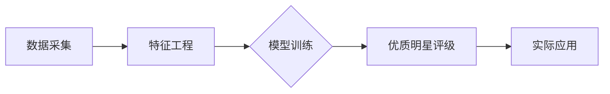

##  基于微博论坛的优质明星系统的设计与实现

作者：禅与计算机程序设计艺术

## 1. 背景介绍

### 1.1 社交媒体与粉丝经济的兴起

近年来，社交媒体的兴起和快速发展极大地改变了人们的生活方式，也催生了庞大的粉丝经济。微博、Twitter、Instagram 等社交平台成为了明星与粉丝互动的重要场所，明星的影响力在社交媒体上得到了极大的放大，进而带动了粉丝经济的蓬勃发展。

### 1.2  传统明星评价体系的不足

传统的明星评价体系主要依赖于作品数量、奖项荣誉、商业价值等指标，这些指标往往难以全面客观地反映明星的真实影响力和价值。同时，传统的评价体系缺乏粉丝参与，难以体现粉丝的情感和诉求。

### 1.3 优质明星系统的意义

基于微博论坛的优质明星系统旨在利用社交媒体的海量数据，构建一套更加科学、客观、全面的明星评价体系，为粉丝提供更加精准的明星推荐服务，同时也为明星自身的发展提供数据支持和决策参考。

## 2. 核心概念与联系

### 2.1 优质明星的定义

本系统将“优质明星”定义为：在微博论坛等社交平台上，拥有较高活跃度、正面形象、优质内容输出以及积极粉丝互动的明星。

### 2.2  核心概念

* **活跃度：** 指明星在微博论坛上的发帖频率、互动频率、粉丝增长速度等指标。
* **正面形象：** 指明星在微博论坛上的言论、行为、形象等是否积极正面，是否符合社会公序良俗。
* **优质内容输出：** 指明星在微博论坛上发布的内容是否具有价值，例如：原创作品、生活感悟、公益活动等。
* **积极粉丝互动：** 指明星与粉丝在微博论坛上的互动是否积极正面，例如：回复评论、点赞转发、参与话题讨论等。

### 2.3 概念之间的联系

这四个核心概念之间相互联系，共同构成对“优质明星”的完整定义。例如：活跃度高的明星更容易吸引粉丝关注，发布优质内容的明星更容易获得粉丝认可，积极与粉丝互动的明星更容易提升粉丝粘性。

## 3. 核心算法原理具体操作步骤

### 3.1 数据采集

* **数据来源：** 微博API、论坛爬虫
* **数据内容：** 明星微博数据（发帖内容、互动数据、粉丝数据等）、论坛帖子数据（帖子内容、评论数据、点赞数据等）
* **数据清洗：** 对采集到的原始数据进行清洗，去除重复数据、无效数据、敏感信息等。

### 3.2  特征工程

* **活跃度特征：** 发帖频率、互动频率、粉丝增长速度等。
* **正面形象特征：** 情感分析、关键词提取、舆情监控等。
* **优质内容输出特征：** 文本分类、主题模型、内容质量评估等。
* **积极粉丝互动特征：** 互动频率、互动情感分析、粉丝画像分析等。

### 3.3 模型训练

* **模型选择：** 逻辑回归、支持向量机、随机森林等。
* **模型训练：** 使用清洗后的数据对模型进行训练，并对模型进行评估和优化。

### 3.4  优质明星评级

* **模型预测：** 使用训练好的模型对明星进行预测，得到每个明星的优质指数。
* **排名生成：** 根据优质指数对明星进行排名，生成优质明星榜单。

## 4. 数学模型和公式详细讲解举例说明

### 4.1  活跃度模型

#### 4.1.1 模型公式

$ 活跃度 = w_1 * 发帖频率 + w_2 * 互动频率 + w_3 * 粉丝增长速度 $

#### 4.1.2 参数说明

* $w_1$, $w_2$, $w_3$ 分别表示发帖频率、互动频率、粉丝增长速度的权重。

#### 4.1.3  举例说明

假设某明星在过去一个月内发布了 100 条微博，与粉丝互动了 500 次，粉丝数量增加了 10000，则该明星的活跃度指数为：

$ 活跃度 = 0.5 * 100 + 0.3 * 500 + 0.2 * 10000 = 2150 $

### 4.2 正面形象模型

#### 4.2.1 模型公式

$ 正面形象 = f(情感分析(文本), 关键词(文本)) $

#### 4.2.2 参数说明

* $f(x, y)$ 表示一个函数，将情感分析结果和关键词提取结果作为输入，输出正面形象得分。

#### 4.2.3  举例说明

假设某明星发布的一条微博文本为“今天参加了公益活动，帮助了很多需要帮助的人，感觉很开心”，经过情感分析后得到情感得分为 0.8，关键词提取结果为“公益活动”、“帮助”、“开心”，则该条微博的正面形象得分可以表示为：

$ 正面形象 = f(0.8, ["公益活动", "帮助", "开心"]) $

### 4.3  优质内容输出模型

#### 4.3.1 模型公式

$ 优质内容 = g(主题模型(文本), 内容质量评估(文本)) $

#### 4.3.2 参数说明

* $g(x, y)$ 表示一个函数，将主题模型结果和内容质量评估结果作为输入，输出优质内容得分。

#### 4.3.3 举例说明

假设某明星发布的一篇博客文章，经过主题模型分析后，确定其主题为“科技创新”，内容质量评估结果为 80 分，则该篇博客文章的优质内容得分可以表示为：

$ 优质内容 = g("科技创新", 80) $

### 4.4  积极粉丝互动模型

#### 4.4.1 模型公式

$ 互动质量 = h(互动频率, 互动情感分析(文本), 粉丝画像分析(粉丝数据)) $

#### 4.4.2 参数说明

* $h(x, y, z)$ 表示一个函数，将互动频率、互动情感分析结果、粉丝画像分析结果作为输入，输出互动质量得分。

#### 4.4.3 举例说明

假设某明星在过去一个月内与粉丝互动了 500 次，互动情感分析结果显示正面情感占比 80%，粉丝画像分析结果显示其粉丝群体主要为 18-25 岁的女性，则该明星的互动质量得分可以表示为：

$ 互动质量 = h(500, 0.8, {"年龄": "18-25", "性别": "女"}) $

## 5. 项目实践：代码实例和详细解释说明

### 5.1 数据采集模块

```python
import requests
from bs4 import BeautifulSoup

# 微博API获取明星微博数据
def get_weibo_data(uid):
    url = f"https://m.weibo.cn/api/container/getIndex?type=uid&value={uid}"
    response = requests.get(url)
    data = response.json()
    # 解析微博数据
    # ...

# 论坛爬虫获取帖子数据
def get_forum_data(url):
    response = requests.get(url)
    soup = BeautifulSoup(response.text, 'html.parser')
    # 解析帖子数据
    # ...
```

### 5.2  特征工程模块

```python
import jieba
from snownlp import SnowNLP

# 使用jieba分词进行文本分词
def text_segmentation(text):
    words = jieba.cut(text)
    return list(words)

# 使用SnowNLP进行情感分析
def sentiment_analysis(text):
    s = SnowNLP(text)
    return s.sentiments
```

### 5.3  模型训练模块

```python
from sklearn.linear_model import LogisticRegression
from sklearn.model_selection import train_test_split

# 划分训练集和测试集
X_train, X_test, y_train, y_test = train_test_split(X, y, test_size=0.2)

# 创建逻辑回归模型
model = LogisticRegression()

# 训练模型
model.fit(X_train, y_train)

# 评估模型
score = model.score(X_test, y_test)
print(f"模型准确率：{score}")
```

## 6. 实际应用场景

* **明星经纪公司：** 可以利用该系统评估旗下艺人的影响力和价值，制定更加精准的宣传推广策略。
* **品牌广告商：** 可以利用该系统筛选更加符合品牌形象的明星代言人，提升广告投放效果。
* **影视制作公司：** 可以利用该系统评估演员的市场号召力和粉丝基础，为影视剧 casting 提供数据参考。
* **粉丝群体：** 可以利用该系统更加客观地了解偶像的真实影响力和价值，参与到偶像的成长和发展中。

## 7. 工具和资源推荐

* **Python:** 数据分析和机器学习的常用编程语言。
* **Scikit-learn:** Python 的机器学习库，提供了丰富的机器学习算法和工具。
* **TensorFlow:** Google 开源的深度学习框架，可以用于构建更加复杂的模型。
* **Jieba:** 中文分词工具。
* **SnowNLP:** 中文情感分析工具。

## 8. 总结：未来发展趋势与挑战

### 8.1 未来发展趋势

* **更加精准的评价体系:** 随着社交媒体数据量的不断增长和算法的不断优化，优质明星评价体系将会更加精准和客观。
* **更加个性化的推荐服务:** 基于用户画像和兴趣偏好的明星推荐服务将会更加精准和个性化。
* **更加多元化的应用场景:** 优质明星系统将会应用于更多领域，例如：明星教育培训、粉丝社区运营等。

### 8.2  挑战

* **数据隐私保护:** 如何在利用海量社交媒体数据的同时，保护用户隐私安全是一个重要挑战。
* **算法公平性:** 如何确保算法的公平性和客观性，避免出现偏见和歧视是一个重要挑战。
* **技术更新迭代:** 社交媒体平台和技术发展日新月异，如何保持系统的先进性和竞争力是一个重要挑战。

## 9. 附录：常见问题与解答

### 9.1  如何保证数据的真实性？

* 数据来源可靠：数据主要来源于微博API和论坛爬虫，保证了数据的真实性和可靠性。
* 数据清洗严格：对采集到的原始数据进行严格的清洗，去除重复数据、无效数据、敏感信息等。
* 模型训练科学：使用科学的算法和模型对数据进行训练，保证了模型的准确性和可靠性。

### 9.2 如何避免算法的偏见和歧视？

* 数据多样性：采集来自不同平台、不同类型的数据，保证数据的多样性和代表性。
* 算法公平性评估：对算法进行公平性评估，识别并消除算法中的偏见和歧视。
* 人工审核机制：建立人工审核机制，对算法结果进行人工审核，确保结果的公平性和客观性。


## 10. Mermaid流程图


