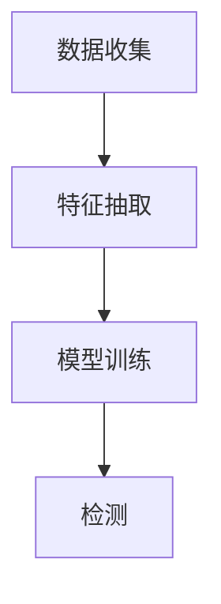

# 基于自动特征抽取的恶意URL检测

作者：禅与计算机程序设计艺术

## 1.背景介绍

### 1.1 恶意URL的威胁

在互联网的世界里，恶意URL（Uniform Resource Locator）是一种常见的威胁。它们通常被用于传播恶意软件、钓鱼攻击、数据窃取等恶意活动。随着互联网的普及和发展，恶意URL的数量和复杂性也在不断增加，给网络安全带来了巨大的挑战。

### 1.2 传统检测方法的局限性

传统的恶意URL检测方法主要依赖于黑名单和规则匹配。然而，这些方法存在几个显著的局限性：

1. **时效性差**：黑名单需要不断更新，无法及时应对新出现的恶意URL。
2. **误报率高**：规则匹配方法容易产生误报，影响用户体验。
3. **难以检测复杂攻击**：复杂的恶意URL往往采用多种混淆技术，传统方法难以有效检测。

### 1.3 自动特征抽取的优势

为了克服传统方法的局限性，基于自动特征抽取的恶意URL检测方法应运而生。通过机器学习和深度学习技术，自动特征抽取能够：

1. **提高检测准确性**：通过学习大量样本数据，自动特征抽取可以提取出更加有效的特征，显著提高检测的准确性。
2. **降低误报率**：自动特征抽取能够更好地区分正常URL和恶意URL，减少误报。
3. **应对复杂攻击**：深度学习模型具有强大的特征表示能力，能够应对各种复杂的恶意URL攻击。

## 2.核心概念与联系

### 2.1 特征抽取

特征抽取是指从原始数据中提取出能够反映数据本质特征的过程。在恶意URL检测中，特征抽取的目的是将URL转换为机器学习算法可以处理的特征向量。常见的特征包括URL的长度、字符分布、域名信息等。

### 2.2 机器学习与深度学习

机器学习是一种通过数据驱动的方式来构建模型的方法。深度学习是机器学习的一个子领域，利用多层神经网络来进行特征表示和学习。在恶意URL检测中，深度学习模型能够自动从数据中学习到有效的特征，表现出色。

### 2.3 恶意URL检测流程

恶意URL检测的基本流程包括数据收集、特征抽取、模型训练和检测。具体流程如下：



### 2.4 数据集

数据集是机器学习模型训练和测试的基础。在恶意URL检测中，常用的数据集包括公共数据集和自定义数据集。公共数据集如Kaggle上的URL数据集，包含了大量的正常和恶意URL样本。

## 3.核心算法原理具体操作步骤

### 3.1 数据收集

数据收集是恶意URL检测的第一步。数据来源可以是公开的恶意URL列表、网络爬虫抓取的URL等。在数据收集过程中，需要保证数据的多样性和代表性。

### 3.2 特征抽取

特征抽取是将原始URL转换为特征向量的过程。常用的特征抽取方法包括：

1. **静态特征抽取**：提取URL的静态特征，如长度、字符分布、域名信息等。
2. **动态特征抽取**：通过模拟URL的访问行为，提取动态特征，如HTTP响应码、页面内容等。
3. **文本特征抽取**：将URL视为文本，使用自然语言处理技术提取特征，如TF-IDF、词向量等。

### 3.3 模型训练

模型训练是指使用收集到的数据和提取的特征来训练机器学习模型。常用的模型包括：

1. **传统机器学习模型**：如决策树、随机森林、支持向量机等。
2. **深度学习模型**：如卷积神经网络（CNN）、循环神经网络（RNN）、长短期记忆网络（LSTM）等。

### 3.4 检测

检测是指使用训练好的模型对新出现的URL进行分类，判断其是否为恶意URL。在实际应用中，检测过程需要考虑实时性和准确性。

## 4.数学模型和公式详细讲解举例说明

### 4.1 特征表示

在恶意URL检测中，特征表示是一个关键问题。假设我们有一个URL $u$，我们可以将其表示为一个特征向量 $\mathbf{x}$。特征向量的每一个元素表示一个特征，如URL的长度、字符分布等。

### 4.2 机器学习模型

假设我们使用一个二分类模型来进行恶意URL检测。模型的输入是特征向量 $\mathbf{x}$，输出是一个概率值 $p$，表示URL为恶意的概率。模型的基本形式可以表示为：

$$
p = f(\mathbf{x}; \theta)
$$

其中，$f$ 是模型函数，$\theta$ 是模型参数。

### 4.3 损失函数

为了训练模型，我们需要定义一个损失函数来衡量模型的预测误差。常用的损失函数是交叉熵损失函数，其形式为：

$$
L = -\frac{1}{N} \sum_{i=1}^{N} \left[ y_i \log(p_i) + (1 - y_i) \log(1 - p_i) \right]
$$

其中，$N$ 是样本数量，$y_i$ 是第 $i$ 个样本的真实标签，$p_i$ 是模型的预测概率。

### 4.4 优化算法

为了最小化损失函数，我们可以使用梯度下降算法。梯度下降的更新公式为：

$$
\theta \leftarrow \theta - \eta \nabla_\theta L
$$

其中，$\eta$ 是学习率，$\nabla_\theta L$ 是损失函数关于参数 $\theta$ 的梯度。

## 5.项目实践：代码实例和详细解释说明

### 5.1 数据预处理

在项目实践中，数据预处理是非常重要的一步。以下是一个简单的Python代码示例，展示如何进行数据预处理：

```python
import pandas as pd
from sklearn.model_selection import train_test_split
from sklearn.feature_extraction.text import TfidfVectorizer

# 加载数据
data = pd.read_csv('url_data.csv')

# 提取特征和标签
urls = data['url']
labels = data['label']

# 使用TF-IDF进行文本特征抽取
vectorizer = TfidfVectorizer()
X = vectorizer.fit_transform(urls)

# 划分训练集和测试集
X_train, X_test, y_train, y_test = train_test_split(X, labels, test_size=0.2, random_state=42)
```

### 5.2 模型训练

接下来，我们可以使用一个简单的机器学习模型来训练数据。以下是一个使用随机森林模型的示例：

```python
from sklearn.ensemble import RandomForestClassifier
from sklearn.metrics import accuracy_score

# 初始化模型
model = RandomForestClassifier(n_estimators=100, random_state=42)

# 训练模型
model.fit(X_train, y_train)

# 预测
y_pred = model.predict(X_test)

# 评估模型
accuracy = accuracy_score(y_test, y_pred)
print(f'Accuracy: {accuracy:.2f}')
```

### 5.3 深度学习模型

如果使用深度学习模型，我们可以使用Keras库来构建一个简单的神经网络：

```python
from keras.models import Sequential
from keras.layers import Dense, Dropout
from keras.optimizers import Adam

# 构建模型
model = Sequential()
model.add(Dense(128, input_dim=X_train.shape[1], activation='relu'))
model.add(Dropout(0.5))
model.add(Dense(64, activation='relu'))
model.add(Dropout(0.5))
model.add(Dense(1, activation='sigmoid'))

# 编译模型
model.compile(loss='binary_crossentropy', optimizer=Adam(lr=0.001), metrics=['accuracy'])

# 训练模型
model.fit(X_train, y_train, epochs=10, batch_size=32, validation_data=(X_test, y_test))

# 评估模型
loss, accuracy = model.evaluate(X_test, y_test)
print(f'Accuracy: {accuracy:.2f}')
```

## 6.实际应用场景

### 6.1 网络安全

恶意URL检测在网络安全中有着广泛的应用。通过实时检测和拦截恶意URL，可以有效防止恶意软件传播、