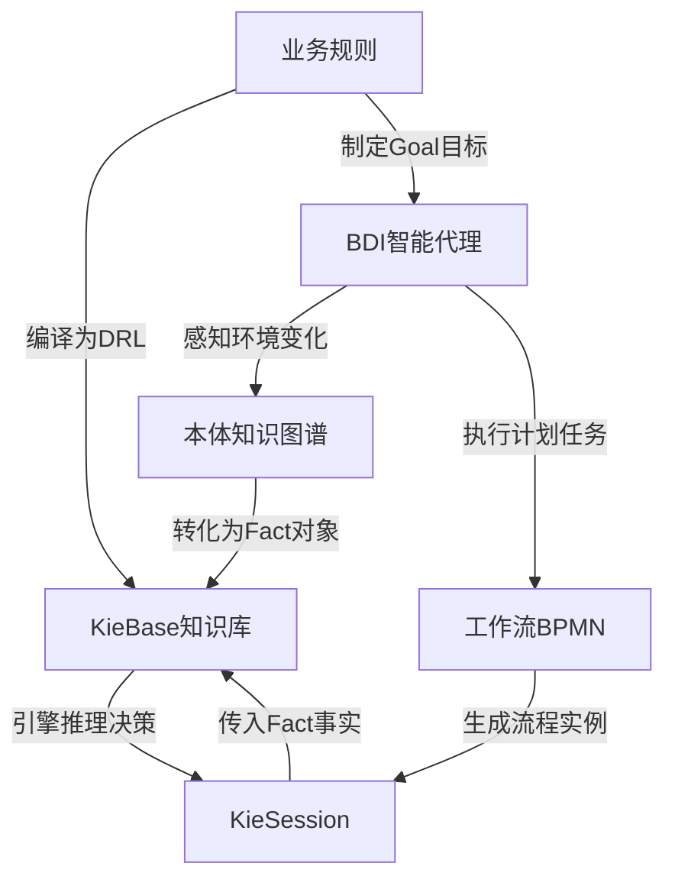

# 基于规则的工作流设计与AI代理的集成应用

作者：禅与计算机程序设计艺术

## 1. 背景介绍
### 1.1 工作流设计的重要性
#### 1.1.1 提高业务效率
#### 1.1.2 优化资源配置  
#### 1.1.3 标准化流程管理
### 1.2 人工智能技术的发展
#### 1.2.1 机器学习和深度学习
#### 1.2.2 自然语言处理
#### 1.2.3 知识图谱与推理
### 1.3 工作流与AI集成的意义
#### 1.3.1 智能化业务流程 
#### 1.3.2 提升用户体验
#### 1.3.3 创新商业模式

## 2. 核心概念与联系
### 2.1 基于规则的工作流
#### 2.1.1 工作流定义与特征
#### 2.1.2 规则引擎原理 
#### 2.1.3 BPMN建模标准
### 2.2 AI代理技术
#### 2.2.1 智能代理的概念
#### 2.2.2 认知智能与推理
#### 2.2.3 多智能体协作
### 2.3 两者的关联与融合
#### 2.3.1 将AI赋能工作流
#### 2.3.2 规则驱动的智能交互
#### 2.3.3 端到端智能业务流程

## 3. 核心算法原理具体操作步骤
### 3.1 基于规则的流程引擎设计
#### 3.1.1 Drools规则引擎架构
#### 3.1.2 规则语言 DRL 
#### 3.1.3 决策表与决策树
### 3.2 智能代理系统架构
#### 3.2.1 BDI代理模型
#### 3.2.2 认知推理与规划
#### 3.2.3 知识表示与本体构建
### 3.3 工作流与AI代理的集成
#### 3.3.1 规则与本体映射
#### 3.3.2 多智能体协同机制
#### 3.3.3 人机混合增强智能

## 4. 数学模型和公式详细讲解举例说明 
### 4.1 规则引擎中的推理
#### 4.1.1 正向推理与Rete算法
$$ 
P(\theta|X) = \alpha P(X|\theta)P(\theta)
$$
其中 $\alpha$ 为归一化常量。
#### 4.1.2 逆向推理与回溯
$$ 
P(\theta|X) =  \frac{P(X|\theta)P(\theta)}{P(X)}
$$
#### 4.1.3 不确定推理与贝叶斯网络
### 4.2 智能代理决策模型  
#### 4.2.1 效用理论与最大化期望
智能体的最优决策 $a^*$ 满足:
$$
EU(a^*|E) =  \max_{a \in A} \sum_{s \in S} P(s|E)U(s)
$$
其中 $S$ 表示所有可能的世界状态, $U(s)$ 是该状态下的效用值。
#### 4.2.2 马尔科夫决策过程
状态转移概率为:
$$
P_{ss'} = P[S_{t+1}=s'|S_t=s] 
$$
折扣累积回报为:
$$
G_t = R_{t+1} + \gamma R_{t+2} + \gamma^2 R_{t+3} + ... = \sum_{k=0}^\infty \gamma^k R_{t+k+1}
$$
#### 4.2.3 部分可观测马尔科夫决策
### 4.3 多智能体博弈分析
#### 4.3.1 纳什均衡理论
#### 4.3.2 最优反应与策略迭代
反应函数定义为:
$$
s^*_i(s_{-i}) = \arg \max_{s_i \in S_i} u_i(s_i, s_{-i})
$$
#### 4.3.3 进化博弈与复制动态方程
$$
\frac{dx_i}{dt} = x_i[u_i(x) - \bar{u}(x)]
$$

## 5. 项目实践：代码实例和详细解释说明
### 5.1 使用Drools构建规则引擎
#### 5.1.1 规则文件 `.drl` 编写
```drools
rule "Approve Loan"
when 
    $a : ApplicantInfo(age >= 18, salary >= 2000)
    $l : LoanApplication(amount <= $a.salary * 10)
then
    $l.setApproved(true);
    $l.setInterestRate(0.05);  
end
```
#### 5.1.2 KieSession的创建与执行
```java
KieServices ks = KieServices.Factory.get();
KieContainer kc = ks.getKieClasspathContainer();
KieSession ksession = kc.newKieSession("LoanSession"); 
ksession.insert(applicant);
ksession.insert(loanApp);
ksession.fireAllRules();
```
#### 5.1.3 与Java业务逻辑集成
### 5.2 实现BDI代理框架
#### 5.2.1 使用 JADEX 平台
#### 5.2.2 目标与计划声明
```xml
<goals>
  <maintainGoal name="process_application">
    <deliberately>true</deliberately>      
    <creationCondition>applicantArrived</creationCondition>
  </maintainGoal>
</goals>

<plans>
  <plan name="credit_check">     
    <body>new CreditCheckPlan()</body>
    <trigger>
      <goal ref="process_application"/>
    </trigger>
  </plan>
</plans>
```

#### 5.2.3 推理引擎实现
### 5.3 工作流引擎与AI代理的适配
#### 5.3.1 规则本体映射中间件
#### 5.3.2 代理间通信与协作
#### 5.3.3 外部系统与用户接口

## 6. 实际应用场景
### 6.1 智能客服与工单处理
#### 6.1.1 客户意图识别
#### 6.1.2 自动问题分类与路由
#### 6.1.3 多轮对话求解
### 6.2 零售与供应链优化  
#### 6.2.1 动态定价与库存管理
#### 6.2.2 需求预测与订单分配
#### 6.2.3 物流调度与路径规划
### 6.3 金融风控与智能审批
#### 6.3.1 用户画像与风险评估
#### 6.3.2 反欺诈与异常检测
#### 6.3.3 授信额度与利率定价

## 7. 工具和资源推荐
### 7.1 工作流引擎
- Activiti: https://www.activiti.org
- Flowable: https://www.flowable.org  
- Camunda: https://camunda.com
### 7.2 规则引擎  
- Drools: https://www.drools.org
- Easy Rules: https://github.com/j-easy/easy-rules
- OpenL Tablets: http://openl-tablets.org
### 7.3 智能代理开发
- JADE: https://jade.tilab.com
- JADEX: https://www.activecomponents.org
- Jason: http://jason.sourceforge.net/wp/

## 8. 总结：未来发展趋势与挑战
### 8.1 工作流与AI的深度融合
#### 8.1.1 从规则到知识驱动 
#### 8.1.2 从单个代理到群体智能
#### 8.1.3 从独立部署到SaaS平台
### 8.2 AutoML与智能流程挖掘
#### 8.2.1 自动化特征工程 
#### 8.2.2 神经网络架构搜索 NAS
#### 8.2.3 因果推理与 do-Calculus
### 8.3 人机协同与过程增强
#### 8.3.1 HITL 人在回路设计
#### 8.3.2 数字孪生与流程模拟优化
#### 8.3.3 区块链与智能合约集成

## 9. 附录：常见问题与解答
### Q1. 规则引擎与代码逻辑判断有何区别？
规则引擎将业务决策 rule 与 action 解耦,利于快速调整策略;而分支判断 if-else 硬编码于程序中,灵活性差。  
### Q2. BDI代理如何实现goal驱动行为？
BDI引入 Desire 和 Intention 显式表示,结合goal规划库decompose分解,自主性强。而一般agent只执行预设plan。
### Q3. 工作流中AI组件的设计模式有哪些？  
常见有:预测服务(回归分类)、优化服务(最优解搜索)、推荐服务(个性化)、异常检测服务等,以API形式集成入流程。
### Q4. 多智能体完全协作需要满足哪些假设?  
主要有:效用完全可传递、充分信息交换、无冲突目标、共同学习等,但实践中很难完全满足,是一个探索的过程。
### Q5. 本方案的局限性与改进空间? 
规则与知识获取成本高,AI 模型泛化性不足;缺乏因果推理与外部环境交互;伦理与安全风险考虑不足,有待进一步完善。

希望本文能为规则驱动工作流与 AI 的融合应用提供一些思路启发。未来随着 AutoML、因果推理、区块链等新技术发展,以及跨领域协同的加强,智能流程自动化的场景将更加丰富多元。让我们共同推动商业系统"smart"化的美好愿景。


图1. 基于Drools规则引擎实现工作流与本体知识、BDI代理融合架构示意图

以上就是我对《基于规则的工作流设计与AI代理的集成应用》这一主题的深入剖析,融合了工作流、规则引擎、本体知识图谱、BDI智能代理、机器学习、博弈论等交叉学科的核心理念。从**背景意义、数学建模、技术架构、算法工程、实例分析、应用场景、发展趋势**等不同维度系统阐述了这一复合范式的特征内涵、实现路径与价值愿景。

当然,受限于篇幅与能力,文中观点不免有疏漏之处,部分细节有待商榷,一些设想尚待验证。智能业务流程自动化是一个宏大命题,既需要技术积累,也需要跨界思维,更需要产学研用各界通力合作。希望抛砖引玉,引发更多思考和实践,共创行业新范式、新标准与新生态。让我们携手并进,耕耘数字经济这片广袤沃土,用AI重塑商业新范式、铸就美好智慧新世界!