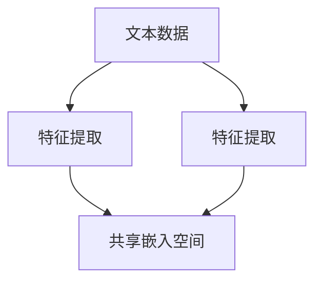

# 多模态小样本学习：融合多源信息，提升学习效率

作者：禅与计算机程序设计艺术

## 1. 背景介绍

### 1.1 什么是多模态学习？

多模态学习是指利用来自不同模态的数据源（如图像、文本、音频等）进行联合学习的过程。它旨在通过融合多种信息源，提升模型的理解和预测能力。多模态学习在自然语言处理、计算机视觉、语音识别等领域有着广泛的应用。

### 1.2 小样本学习的挑战

小样本学习（Few-Shot Learning, FSL）是机器学习中的一个重要研究方向，旨在模型能够在仅有少量训练样本的情况下进行有效学习。传统的深度学习方法通常依赖于大量的标注数据，而在许多实际应用中，获取大量标注数据既昂贵又耗时。因此，小样本学习为解决这些问题提供了一条新的途径。

### 1.3 多模态小样本学习的意义

多模态小样本学习结合了多模态学习和小样本学习的优势，通过融合多源信息，提高在小样本条件下的学习效率。这种方法不仅能够缓解数据稀缺的问题，还能够利用不同模态之间的互补信息，提升模型的泛化能力。

## 2. 核心概念与联系

### 2.1 多模态数据

多模态数据指的是来自不同模态的信息，例如图像、文本、音频、视频等。每种模态都包含特定的特征和信息，通过融合这些多模态数据，可以获得更加全面和准确的理解。

### 2.2 小样本学习方法

小样本学习的方法主要包括元学习（Meta-Learning）、数据增强（Data Augmentation）、迁移学习（Transfer Learning）等。这些方法通过不同的途径，提升在少量数据条件下的学习效果。

### 2.3 多模态小样本学习的联系

多模态小样本学习将多模态数据和小样本学习方法结合起来，通过多模态数据的互补性，提升小样本学习的效果。例如，图像和文本的联合学习可以增强模型对图像内容的理解，同时减少对大量标注数据的依赖。

## 3. 核心算法原理具体操作步骤

### 3.1 数据预处理

数据预处理是多模态小样本学习的第一步，包括数据清洗、特征提取和数据增强等。对于多模态数据，需要分别处理不同模态的数据特征。

### 3.2 模态间对齐

模态间对齐是指将不同模态的数据进行对齐，以便进行联合学习。常见的方法包括使用共享的嵌入空间、对齐特征等。



### 3.3 模态融合

模态融合是指将对齐后的多模态数据进行融合，常见的方法包括加权平均、注意力机制等。通过模态融合，可以充分利用多模态数据的互补信息。

### 3.4 模型训练

模型训练是多模态小样本学习的核心步骤，通过训练模型，使其能够在小样本条件下进行有效学习。常用的方法包括元学习、迁移学习等。

### 3.5 模型评估

模型评估是对训练好的模型进行性能评估，常用的评估指标包括准确率、召回率、F1值等。通过模型评估，可以判断模型在实际应用中的效果。

## 4. 数学模型和公式详细讲解举例说明

### 4.1 特征提取

特征提取是多模态小样本学习的基础步骤，通过特征提取，可以将原始数据转换为模型可以处理的特征向量。例如，对于图像数据，可以使用卷积神经网络（CNN）进行特征提取：

$$
\mathbf{f}_{\text{image}} = \text{CNN}(\mathbf{x}_{\text{image}})
$$

对于文本数据，可以使用预训练的语言模型（如BERT）进行特征提取：

$$
\mathbf{f}_{\text{text}} = \text{BERT}(\mathbf{x}_{\text{text}})
$$

### 4.2 模态对齐

模态对齐是指将不同模态的特征对齐到同一个嵌入空间，例如通过共享的全连接层进行对齐：

$$
\mathbf{f}_{\text{aligned}} = \text{FC}(\mathbf{f}_{\text{image}}, \mathbf{f}_{\text{text}})
$$

### 4.3 模态融合

模态融合是指将对齐后的特征进行融合，例如通过加权平均进行融合：

$$
\mathbf{f}_{\text{fused}} = \alpha \mathbf{f}_{\text{image}} + \beta \mathbf{f}_{\text{text}}
$$

其中，$\alpha$ 和 $\beta$ 是融合权重。

### 4.4 模型训练

模型训练是指通过优化目标函数，使模型能够在小样本条件下进行有效学习。例如，可以使用元学习的方法，通过优化元参数 $\theta$，提升模型的泛化能力：

$$
\min_{\theta} \sum_{i=1}^{N} \mathcal{L}(\mathcal{D}_{\text{train}}^{(i)}; \theta) + \lambda \sum_{j=1}^{M} \mathcal{L}(\mathcal{D}_{\text{test}}^{(j)}; \theta)
$$

其中，$\mathcal{L}$ 是损失函数，$\mathcal{D}_{\text{train}}^{(i)}$ 和 $\mathcal{D}_{\text{test}}^{(j)}$ 分别是训练集和测试集。

## 4. 项目实践：代码实例和详细解释说明

### 4.1 数据预处理

```python
import numpy as np
from sklearn.preprocessing import StandardScaler

# 示例数据
image_data = np.random.rand(100, 64, 64, 3)
text_data = np.random.rand(100, 300)

# 特征提取
image_features = image_data.reshape(100, -1)
text_features = text_data

# 数据标准化
scaler = StandardScaler()
image_features = scaler.fit_transform(image_features)
text_features = scaler.fit_transform(text_features)
```

### 4.2 模态对齐

```python
import torch
import torch.nn as nn

class SharedEmbedding(nn.Module):
    def __init__(self, image_dim, text_dim, embed_dim):
        super(SharedEmbedding, self).__init__()
        self.fc_image = nn.Linear(image_dim, embed_dim)
        self.fc_text = nn.Linear(text_dim, embed_dim)

    def forward(self, image_features, text_features):
        image_embed = self.fc_image(image_features)
        text_embed = self.fc_text(text_features)
        return image_embed, text_embed

# 模型实例化
model = SharedEmbedding(image_dim=12288, text_dim=300, embed_dim=512)

# 模态对齐
image_embed, text_embed = model(torch.tensor(image_features, dtype=torch.float32),
                                torch.tensor(text_features, dtype=torch.float32))
```

### 4.3 模态融合

```python
class ModalFusion(nn.Module):
    def __init__(self, embed_dim):
        super(ModalFusion, self).__init__()
        self.fc_fusion = nn.Linear(embed_dim * 2, embed_dim)

    def forward(self, image_embed, text_embed):
        combined = torch.cat((image_embed, text_embed), dim=1)
        fused_embed = self.fc_fusion(combined)
        return fused_embed

# 模型实例化
fusion_model = ModalFusion(embed_dim=512)

# 模态融合
fused_embed = fusion_model(image_embed, text_embed)
```

### 4.4 模型训练

```python
import torch.optim as optim

# 损失函数和优化器
criterion = nn.CrossEntropyLoss()
optimizer = optim.Adam(fusion_model.parameters(), lr=0.001)

# 示例标签
labels = torch.randint(0, 10, (100,))

# 训练步骤
for epoch in range(100):
    optimizer.zero_grad()
    outputs = fusion_model(image_embed, text_embed)
    loss = criterion(outputs, labels)
    loss.backward()
    optimizer.step()
    if epoch % 10 == 0:
        print(f'Epoch {epoch}, Loss: {loss.item()}')
```

## 5. 实际应用场景

### 5.1 医学影像分析

在医学影像分析中，多模态数据（如CT图像和电子病历）可以提供更加全面的患者信息。通过多模态小样本学习，可以在少量标注数据的情况下，提升疾病诊断和治疗效果。

### 5.2 智能安防

在智能安防领域，多模态数据（