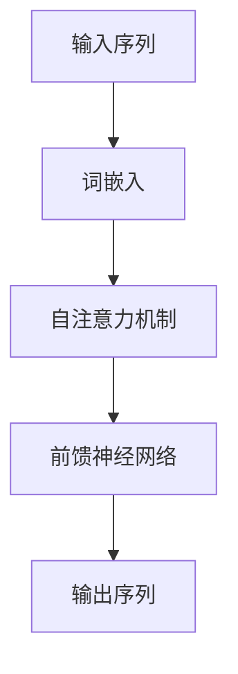

# 大规模语言模型从理论到实践 手动构建指令

## 1. 背景介绍

### 1.1 大规模语言模型的兴起

大规模语言模型（Large Language Models, LLMs）在过去几年中取得了显著的进展，尤其是OpenAI的GPT系列和Google的BERT系列，这些模型在自然语言处理（NLP）任务中表现出了卓越的性能。LLMs通过在大规模文本数据上进行预训练，能够捕捉丰富的语言特征，从而在各种下游任务中展现出强大的泛化能力。

### 1.2 研究背景与动机

随着计算资源的提升和数据量的增加，研究人员发现大规模语言模型不仅能够处理传统的NLP任务，如翻译、问答、文本生成等，还在生成代码、创作艺术作品等领域展现出巨大潜力。然而，构建和训练一个高效的大规模语言模型并非易事，需要深入理解其理论基础和实际操作步骤。

### 1.3 文章目标

本文旨在详细介绍大规模语言模型的理论基础、核心算法、数学模型，并通过实际项目实践，提供具体的代码示例和详细解释，帮助读者从理论到实践全面掌握大规模语言模型的构建方法。

## 2. 核心概念与联系

### 2.1 语言模型的定义

语言模型是通过概率分布来描述一个语言序列（如句子）的生成过程。其目标是估计一个给定序列的概率：

$$ P(w_1, w_2, ..., w_n) $$

其中，$w_i$ 代表序列中的第 $i$ 个词。

### 2.2 语言模型的类型

#### 2.2.1 统计语言模型

早期的语言模型主要基于统计方法，如n-gram模型，通过计算词语共现的频率来估计序列的概率。然而，这类模型在处理长距离依赖和稀疏数据时效果不佳。

#### 2.2.2 神经网络语言模型

神经网络语言模型（Neural Language Models, NLMs）利用神经网络捕捉语言中的复杂模式。典型的NLMs包括循环神经网络（RNN）、长短期记忆网络（LSTM）和转换器（Transformer）。

### 2.3 大规模语言模型的特点

大规模语言模型通过在大规模数据集上进行预训练，能够捕捉丰富的上下文信息和复杂的语言模式。这些模型通常具有数十亿甚至上百亿的参数，如GPT-3、BERT-large等。

### 2.4 预训练与微调

大规模语言模型的训练通常分为两个阶段：预训练和微调。预训练阶段，模型在大规模无监督数据上学习语言特征；微调阶段，模型在特定任务的有监督数据上进行调整，以提高特定任务的性能。

## 3. 核心算法原理具体操作步骤

### 3.1 数据准备

#### 3.1.1 数据收集

数据是大规模语言模型的基础。通常需要收集大量的文本数据，如维基百科、书籍、新闻文章等。

#### 3.1.2 数据预处理

对收集到的数据进行清洗、分词、去除停用词等预处理操作，以保证数据的质量和一致性。

### 3.2 模型架构设计

#### 3.2.1 Transformer架构

Transformer是当前最流行的语言模型架构，其核心组件包括自注意力机制（Self-Attention）和前馈神经网络（Feed-Forward Neural Network）。



#### 3.2.2 GPT架构

GPT（Generative Pre-trained Transformer）是基于Transformer的生成式预训练模型，其特点是采用单向的自注意力机制。

#### 3.2.3 BERT架构

BERT（Bidirectional Encoder Representations from Transformers）是另一种基于Transformer的模型，采用双向的自注意力机制，能够更好地捕捉上下文信息。

### 3.3 模型训练

#### 3.3.1 预训练

在大规模无标签数据上进行预训练，使用目标如掩码语言模型（Masked Language Model, MLM）或自回归语言模型（Autoregressive Language Model）。

#### 3.3.2 微调

在特定任务的数据集上进行微调，以提高模型在该任务上的性能。

### 3.4 模型评估

使用标准的NLP评估指标，如准确率、F1-score、BLEU等，对模型性能进行评估。

## 4. 数学模型和公式详细讲解举例说明

### 4.1 自注意力机制

自注意力机制是Transformer的核心，其计算公式为：

$$
\text{Attention}(Q, K, V) = \text{softmax}\left(\frac{QK^T}{\sqrt{d_k}}\right)V
$$

其中，$Q$、$K$、$V$分别表示查询（Query）、键（Key）和值（Value）矩阵，$d_k$表示键的维度。

### 4.2 掩码语言模型

掩码语言模型的目标是预测被掩码的词语，其损失函数为：

$$
L = -\sum_{i=1}^N \log P(w_i | w_{1:i-1}, w_{i+1:N})
$$

### 4.3 自回归语言模型

自回归语言模型通过递归地预测下一个词语，其损失函数为：

$$
L = -\sum_{i=1}^N \log P(w_i | w_{1:i-1})
$$

### 4.4 示例：GPT-3的训练过程

GPT-3的训练过程包括以下几个步骤：

1. 数据收集与预处理
2. 模型架构设计
3. 预训练
4. 微调

## 5. 项目实践：代码实例和详细解释说明

### 5.1 数据准备

```python
import os
import re
import json
import numpy as np
import pandas as pd
from sklearn.model_selection import train_test_split

# 数据加载
data_path = 'path/to/data'
files = os.listdir(data_path)
texts = []

for file in files:
    with open(os.path.join(data_path, file), 'r', encoding='utf-8') as f:
        texts.append(f.read())

# 数据预处理
def preprocess(text):
    text = re.sub(r'\s+', ' ', text)
    text = re.sub(r'[^a-zA-Z0-9\s]', '', text)
    return text.lower()

texts = [preprocess(text) for text in texts]

# 数据拆分
train_texts, val_texts = train_test_split(texts, test_size=0.2, random_state=42)
```

### 5.2 模型架构设计

```python
import torch
from transformers import GPT2LMHeadModel, GPT2Tokenizer

# 模型加载
model_name = 'gpt2'
model = GPT2LMHeadModel.from_pretrained(model_name)
tokenizer = GPT2Tokenizer.from_pretrained(model_name)

# 模型参数设置
model.config.max_length = 512
model.config.pad_token_id = tokenizer.eos_token_id
```

### 5.3 模型训练

```python
from transformers import Trainer, TrainingArguments

# 数据集准备
class TextDataset(torch.utils.data.Dataset):
    def __init__(self, texts, tokenizer, max_length):
        self.texts = texts
        self.tokenizer = tokenizer
        self.max_length = max_length

    def __len__(self):
        return len(self.texts)

    def __getitem__(self, idx):
        text = self.texts[idx]
        inputs = self.tokenizer(text, return_tensors='pt', max_length=self.max_length, truncation=True, padding='max_length')
        return inputs.input_ids.squeeze(), inputs.attention_mask.squeeze()

train_dataset = TextDataset(train_texts, tokenizer, model.config.max_length)
val_dataset = TextDataset(val_texts, tokenizer, model.config.max_length)

# 训练参数设置
training_args = TrainingArguments(
    output_dir='./results',
    num_train_epochs=3,
    per_device_train_batch_size=4,
    per_device_eval_batch_size=4,
    warmup_steps=500,
    weight_decay=0.01,
    logging_dir='./logs',
)

# 模型训练
trainer = Trainer(
    model=model,
    args=training_args,
    train_dataset=train_dataset,
    eval_dataset=val_dataset,
)

trainer.train()
```

### 5.4 模型评估

```python
# 模型评估
eval_results = trainer.evaluate()
print(f"Evaluation results: {eval_results}")
```

## 6. 实际应用场景

### 6.1 文本生成

大规模语言模型在文本生成任务中表现出