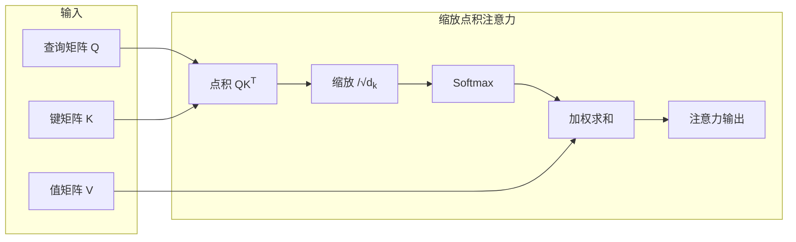

# 大规模语言模型从理论到实践：注意力机制优化

作者：禅与计算机程序设计艺术

## 1. 背景介绍

### 1.1 大规模语言模型的兴起

近年来，随着深度学习技术的飞速发展，大规模语言模型（LLM，Large Language Model）逐渐走入大众视野，并展现出惊人的能力。从最初的 BERT、GPT-2，到如今的 GPT-3、PaLM 等，LLM 的参数规模和性能不断刷新纪录，在自然语言处理的各个领域都取得了突破性进展，例如：

* **文本生成**:  自动生成高质量的文章、诗歌、代码等。
* **机器翻译**: 实现快速、准确的跨语言翻译。
* **问答系统**:  理解复杂问题并给出精准答案。
* **代码生成**:  根据自然语言描述生成代码。

### 1.2 注意力机制的重要性

注意力机制（Attention Mechanism）是 LLM 取得成功的关键因素之一。传统的循环神经网络（RNN）在处理长序列数据时容易出现梯度消失或爆炸问题，而注意力机制能够有效解决这一难题，并显著提升模型对长距离依赖关系的建模能力。

简单来说，注意力机制允许模型在处理每个词语时，关注输入序列中与其相关的部分，从而更好地理解上下文信息。例如，在翻译“I love you”这句话时，模型可以利用注意力机制，将“love”与“I”和“you”联系起来，从而更准确地理解这句话的情感。

### 1.3 本文目标

本文旨在深入探讨大规模语言模型中注意力机制的优化方法，并结合实际案例分析其应用。我们将从以下几个方面展开讨论：

* 注意力机制的基本原理和常见变体。
* 影响注意力机制性能的关键因素。
* 常见的注意力机制优化方法，包括算法改进、结构优化和训练技巧等。
* 注意力机制在不同 LLM 模型中的应用案例分析。

## 2. 核心概念与联系

### 2.1 注意力机制的基本原理

注意力机制的核心思想是，对于输入序列中的每个元素，计算其与其他元素的相关性，并根据相关性大小分配不同的权重。这些权重决定了模型在处理当前元素时，应该关注哪些其他元素的信息。

以机器翻译为例，假设我们要将英文句子 "The cat sat on the mat" 翻译成中文 "猫 坐在  垫子 上"。在处理 "sat" 这个词时，注意力机制会计算 "sat" 与其他词语的相关性，并分配不同的权重：

| 英文单词 | 相关性 | 权重 |
|---|---|---|
| The | 0.1 | 0.1 |
| cat | 0.3 | 0.3 |
| sat | 1.0 | 1.0 |
| on | 0.2 | 0.2 |
| the | 0.1 | 0.1 |
| mat | 0.3 | 0.3 |

从上表可以看出，"sat" 与 "cat" 和 "mat" 的相关性较高，因此模型会更加关注这两个词语的信息，从而更准确地理解 "sat" 的含义，并将其翻译成 "坐在"。

### 2.2 注意力机制的常见变体

常见的注意力机制变体包括：

* **缩放点积注意力（Scaled Dot-Product Attention）**:  这是最常用的注意力机制之一，其计算公式如下：

$$
\text{Attention}(Q, K, V) = \text{softmax}(\frac{QK^T}{\sqrt{d_k}})V
$$

其中，$Q$、$K$、$V$ 分别表示查询矩阵、键矩阵和值矩阵，$d_k$ 表示键的维度。

* **多头注意力（Multi-Head Attention）**:  将多个缩放点积注意力机制并行计算，并将其结果拼接起来，从而捕捉不同子空间的信息。

* **自注意力（Self-Attention）**:  查询矩阵、键矩阵和值矩阵都来自同一个序列，用于捕捉序列内部元素之间的关系。

### 2.3 注意力机制与其他模型组件的联系

注意力机制通常与其他模型组件结合使用，例如：

* **编码器-解码器架构**:  在编码器-解码器架构中，注意力机制可以用于将编码器输出的上下文信息传递给解码器，从而提升解码器的性能。

* **Transformer**:  Transformer 模型完全基于注意力机制构建，其编码器和解码器都使用了多头注意力机制。

## 3. 核心算法原理具体操作步骤

### 3.1 缩放点积注意力机制的计算步骤

以缩放点积注意力机制为例，其计算步骤如下：

1. **计算查询矩阵和键矩阵的点积**:  $QK^T$。
2. **缩放点积**:  将点积结果除以 $\sqrt{d_k}$，以防止内积过大。
3. **计算 Softmax**:  对缩放后的点积结果应用 Softmax 函数，得到每个元素的权重。
4. **加权求和**:  将值矩阵 $V$ 与权重相乘并求和，得到最终的注意力输出。

### 3.2 多头注意力机制的计算步骤

多头注意力机制的计算步骤如下：

1. **将查询矩阵、键矩阵和值矩阵分别线性变换成多个头部**:  每个头部对应一个独立的缩放点积注意力机制。
2. **并行计算每个头部的注意力输出**:  使用缩放点积注意力机制计算每个头部的注意力输出。
3. **拼接所有头部的输出**:  将所有头部的输出拼接起来。
4. **线性变换**:  对拼接后的结果进行线性变换，得到最终的注意力输出。

### 3.3 自注意力机制的计算步骤

自注意力机制的计算步骤与缩放点积注意力机制类似，只是查询矩阵、键矩阵和值矩阵都来自同一个序列。

## 4. 数学模型和公式详细讲解举例说明

### 4.1 缩放点积注意力机制的数学模型

缩放点积注意力机制的数学模型如下：

$$
\text{Attention}(Q, K, V) = \text{softmax}(\frac{QK^T}{\sqrt{d_k}})V
$$

其中：

* $Q \in \mathbb{R}^{n \times d_k}$ 表示查询矩阵。
* $K \in \mathbb{R}^{m \times d_k}$ 表示键矩阵。
* $V \in \mathbb{R}^{m \times d_v}$ 表示值矩阵。
* $d_k$ 表示键的维度。
* $d_v$ 表示值的维度。
* $n$ 表示查询的数量。
* $m$ 表示键和值的数量。

### 4.2 缩放点积注意力机制的计算示例

假设：

* $Q = \begin{bmatrix} 1 & 0 \\ 0 & 1 \end{bmatrix}$
* $K = \begin{bmatrix} 0 & 1 \\ 1 & 0 \end{bmatrix}$
* $V = \begin{bmatrix} 2 & 3 \\ 4 & 5 \end{bmatrix}$
* $d_k = 2$

则：

1. **计算查询矩阵和键矩阵的点积**:

$$
QK^T = \begin{bmatrix} 1 & 0 \\ 0 & 1 \end{bmatrix} \begin{bmatrix} 0 & 1 \\ 1 & 0 \end{bmatrix}^T = \begin{bmatrix} 0 & 1 \\ 1 & 0 \end{bmatrix}
$$

2. **缩放点积**:

$$
\frac{QK^T}{\sqrt{d_k}} = \frac{\begin{bmatrix} 0 & 1 \\ 1 & 0 \end{bmatrix}}{\sqrt{2}} = \begin{bmatrix} 0 & \frac{1}{\sqrt{2}} \\ \frac{1}{\sqrt{2}} & 0 \end{bmatrix}
$$

3. **计算 Softmax**:

$$
\text{softmax}(\frac{QK^T}{\sqrt{d_k}}) = \text{softmax}(\begin{bmatrix} 0 & \frac{1}{\sqrt{2}} \\ \frac{1}{\sqrt{2}} & 0 \end{bmatrix}) = \begin{bmatrix} 0.5 & 0.5 \\ 0.5 & 0.5 \end{bmatrix}
$$

4. **加权求和**:

$$
\text{Attention}(Q, K, V) = \begin{bmatrix} 0.5 & 0.5 \\ 0.5 & 0.5 \end{bmatrix} \begin{bmatrix} 2 & 3 \\ 4 & 5 \end{bmatrix} = \begin{bmatrix} 3 & 4 \\ 3 & 4 \end{bmatrix}
$$

因此，缩放点积注意力机制的输出为 $\begin{bmatrix} 3 & 4 \\ 3 & 4 \end{bmatrix}$。

## 5. 项目实践：代码实例和详细解释说明

### 5.1 使用 TensorFlow 实现缩放点积注意力机制

```python
import tensorflow as tf

def scaled_dot_product_attention(q, k, v, mask):
  """计算缩放点积注意力。

  Args:
    q: 查询矩阵，形状为 [..., seq_len_q, depth_q]。
    k: 键矩阵，形状为 [..., seq_len_k, depth_k]。
    v: 值矩阵，形状为 [..., seq_len_v, depth_v]。
    mask: 用于屏蔽无关元素的掩码，形状为 [..., seq_len_q, seq_len_k]。

  Returns:
    注意力输出，形状为 [..., seq_len_q, depth_v]。
  """

  matmul_qk = tf.matmul(q, k, transpose_b=True)  # [..., seq_len_q, seq_len_k]

  # 缩放 matmul_qk
  dk = tf.cast(tf.shape(k)[-1], tf.float32)
  scaled_attention_logits = matmul_qk / tf.math.sqrt(dk)

  # 应用掩码
  if mask is not None:
    scaled_attention_logits += (mask * -1e9)

  # 计算 Softmax
  attention_weights = tf.nn.softmax(scaled_attention_logits, axis=-1)  # [..., seq_len_q, seq_len_k]

  # 加权求和
  output = tf.matmul(attention_weights, v)  # [..., seq_len_q, depth_v]

  return output
```

### 5.2 代码解释

* `q`、`k`、`v` 分别表示查询矩阵、键矩阵和值矩阵。
* `mask` 用于屏蔽无关元素，例如在解码器中屏蔽未来的时间步。
* `tf.matmul(q, k, transpose_b=True)` 计算查询矩阵和键矩阵的点积。
* `tf.cast(tf.shape(k)[-1], tf.float32)` 获取键的维度，并将其转换为 float32 类型。
* `scaled_attention_logits / tf.math.sqrt(dk)` 缩放点积。
* `scaled_attention_logits += (mask * -1e9)` 应用掩码。
* `tf.nn.softmax(scaled_attention_logits, axis=-1)` 计算 Softmax。
* `tf.matmul(attention_weights, v)` 加权求和。

## 6. 实际应用场景

### 6.1 自然语言处理

* **机器翻译**:  注意力机制可以用于将源语言句子中的每个词语与其在目标语言句子中的对应词语相关联，从而提升翻译质量。
* **文本摘要**:  注意力机制可以用于提取文本中的关键信息，并生成简洁的摘要。
* **问答系统**:  注意力机制可以用于将问题与文本中的相关段落相关联，从而提升答案的准确性。

### 6.2 计算机视觉

* **图像描述**:  注意力机制可以用于将图像中的不同区域与描述中的对应词语相关联，从而生成更准确的图像描述。
* **视频分析**:  注意力机制可以用于跟踪视频中的目标物体，并识别其行为。

## 7. 工具和资源推荐

### 7.1 深度学习框架

* **TensorFlow**:  Google 开源的深度学习框架，提供了丰富的 API 用于实现注意力机制。
* **PyTorch**:  Facebook 开源的深度学习框架，也提供了丰富的 API 用于实现注意力机制。

### 7.2 预训练模型

* **Hugging Face Transformers**:  提供了大量预训练的 LLM 模型，包括 BERT、GPT-2、GPT-3 等，可以直接用于各种 NLP 任务。
* **TensorFlow Hub**:  也提供了大量预训练的 LLM 模型，可以直接用于各种 NLP 任务。

## 8. 总结：未来发展趋势与挑战

### 8.1 未来发展趋势

* **更高效的注意力机制**:  研究更高效的注意力机制，例如稀疏注意力机制、线性注意力机制等，以降低计算复杂度和内存占用。
* **更强大的 LLM 模型**:  随着计算能力的提升和数据的积累，未来将会出现更大规模、更强大的 LLM 模型。
* **更广泛的应用场景**:  注意力机制将会被应用于更多领域，例如生物信息学、金融科技等。

### 8.2 挑战

* **模型的可解释性**:  注意力机制的可解释性仍然是一个挑战，需要开发新的方法来理解注意力机制的工作原理。
* **模型的鲁棒性**:  LLM 模型容易受到对抗样本的攻击，需要开发更鲁棒的模型。
* **数据的偏见**:  训练数据中的偏见会导致 LLM 模型产生偏见，需要开发新的方法来解决数据偏见问题。

## 9. 附录：常见问题与解答

### 9.1 什么是注意力机制？

注意力机制是一种允许模型在处理每个元素时，关注输入序列中与其相关的部分的机制。

### 9.2 注意力机制有哪些优点？

* 能够有效解决 RNN 在处理长序列数据时出现的梯度消失或爆炸问题。
* 能够显著提升模型对长距离依赖关系的建模能力。

### 9.3 注意力机制有哪些应用场景？

注意力机制可以应用于各种 NLP 任务，例如机器翻译、文本摘要、问答系统等，以及一些计算机视觉任务，例如图像描述、视频分析等。


## 10. Mermaid流程图



## 11. 参考资料
