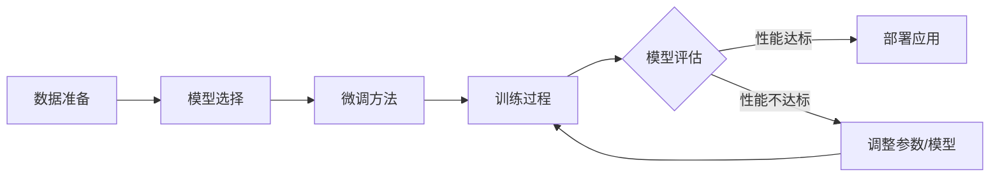

# 大语言模型原理与工程实践：大语言模型微调的探索与展望

作者：禅与计算机程序设计艺术

## 1. 背景介绍

### 1.1 大语言模型的兴起

近年来，深度学习技术飞速发展，推动了自然语言处理（NLP）领域的巨大进步。其中，大语言模型（Large Language Model, LLM）作为一种新兴的技术方向，凭借其强大的文本生成能力和语义理解能力，迅速成为人工智能领域的热门研究方向，并在机器翻译、文本摘要、问答系统、代码生成等领域展现出广阔的应用前景。

### 1.2  微调：释放大语言模型潜力的关键

尽管预训练的大语言模型在许多任务上表现出色，但它们通常缺乏特定领域或任务的专业知识。为了使大语言模型更好地适应特定任务，微调（Fine-tuning）应运而生，成为释放大语言模型潜力的关键技术。

### 1.3 本文目标：深入探讨大语言模型微调

本文旨在深入探讨大语言模型微调的原理、方法和应用，帮助读者理解微调的核心概念，掌握微调的实际操作步骤，并展望大语言模型微调的未来发展趋势和挑战。

## 2. 核心概念与联系

### 2.1 预训练与微调

*   **预训练（Pre-training）**：利用大规模无标注数据，训练一个具有通用语言表示能力的模型。
*   **微调（Fine-tuning）**：在预训练模型的基础上，使用特定任务的标注数据进行训练，调整模型参数，使其更适应目标任务。

### 2.2 迁移学习

微调是迁移学习（Transfer Learning）的一种形式，其核心思想是将从源任务（Source Task）学习到的知识迁移到目标任务（Target Task）。在大语言模型微调中，预训练阶段可以看作是源任务，而微调阶段则是目标任务。

### 2.3  参数高效微调

参数高效微调（Parameter-Efficient Fine-tuning）旨在减少微调过程中需要更新的参数数量，从而降低计算成本和内存消耗。常见的参数高效微调方法包括：

*   **冻结部分参数**：只微调模型的部分层或参数，例如只微调模型的最后一层。
*   **添加适配器**：在预训练模型的基础上添加一些新的参数，例如在模型的每一层添加一个适配器层。
*   **Prompt Engineering**：通过设计合适的输入提示，引导模型生成符合预期结果的输出。

## 3. 核心算法原理具体操作步骤

### 3.1 数据准备

*   **数据收集**：收集与目标任务相关的标注数据。
*   **数据清洗**：对数据进行清洗，去除噪声数据，例如重复数据、错误数据等。
*   **数据标注**：对数据进行标注，例如对文本进行分类、对句子进行情感分析等。

### 3.2 模型选择

*   选择合适的预训练语言模型，例如 BERT、GPT-3、RoBERTa 等。
*   根据目标任务选择合适的模型结构，例如对于文本分类任务，可以选择使用 BERT 模型的 [CLS] token 对应的隐藏状态作为文本的表示。

### 3.3  微调方法

*   **全参数微调**：微调模型的所有参数。
*   **参数高效微调**：只微调模型的部分参数或添加少量新的参数。

### 3.4 训练过程

*   **定义损失函数**：根据目标任务定义合适的损失函数，例如对于文本分类任务，可以使用交叉熵损失函数。
*   **选择优化器**：选择合适的优化器，例如 Adam、SGD 等。
*   **设置训练参数**：设置训练参数，例如学习率、批大小、训练轮数等。

### 3.5 模型评估

*   **选择评估指标**：根据目标任务选择合适的评估指标，例如对于文本分类任务，可以使用准确率、精确率、召回率等指标。
*   **划分数据集**：将数据集划分为训练集、验证集和测试集。
*   **评估模型性能**：使用测试集评估模型的性能。

## 4. 数学模型和公式详细讲解举例说明

### 4.1 损失函数

损失函数用于衡量模型预测值与真实值之间的差距。在大语言模型微调中，常用的损失函数包括：

*   **交叉熵损失函数（Cross-Entropy Loss）**：用于分类任务，其公式为：

$$
L = -\frac{1}{N} \sum_{i=1}^{N} \sum_{j=1}^{C} y_{ij} \log(p_{ij})
$$

其中，$N$ 表示样本数量，$C$ 表示类别数量，$y_{ij}$ 表示第 $i$ 个样本属于第 $j$ 个类别的真实标签，$p_{ij}$ 表示模型预测第 $i$ 个样本属于第 $j$ 个类别的概率。

*   **均方误差损失函数（Mean Squared Error Loss）**：用于回归任务，其公式为：

$$
L = \frac{1}{N} \sum_{i=1}^{N} (y_i - \hat{y}_i)^2
$$

其中，$N$ 表示样本数量，$y_i$ 表示第 $i$ 个样本的真实值，$\hat{y}_i$ 表示模型预测第 $i$ 个样本的值。

### 4.2 优化器

优化器用于更新模型参数，常用的优化器包括：

*   **随机梯度下降（Stochastic Gradient Descent, SGD）**：每次迭代只使用一个样本或一小批样本来更新模型参数。
*   **Adam（Adaptive Moment Estimation）**：一种自适应学习率的优化算法，可以根据参数的历史梯度信息动态调整学习率。

### 4.3  举例说明

假设我们使用 BERT 模型对文本进行情感分类，目标是将文本分为正面、负面和中性三类。我们可以使用交叉熵损失函数作为损失函数，使用 Adam 优化器更新模型参数。

## 5. 项目实践：代码实例和详细解释说明

### 5.1 使用 Transformers 库微调 BERT 模型

```python
from transformers import BertForSequenceClassification, Trainer, TrainingArguments

# 加载预训练的 BERT 模型
model_name = "bert-base-uncased"
model = BertForSequenceClassification.from_pretrained(model_name, num_labels=3)

# 定义训练参数
training_args = TrainingArguments(
    output_dir="./results",
    num_train_epochs=3,
    per_device_train_batch_size=16,
    per_device_eval_batch_size=64,
    warmup_steps=500,
    weight_decay=0.01,
    logging_dir="./logs",
)

# 创建 Trainer 对象
trainer = Trainer(
    model=model,
    args=training_args,
    train_dataset=train_dataset,
    eval_dataset=eval_dataset,
)

# 开始训练
trainer.train()
```

### 5.2 代码解释

*   首先，我们使用 `transformers` 库加载预训练的 BERT 模型，并指定类别数量为 3。
*   然后，我们定义训练参数，包括训练轮数、批大小、学习率等。
*   接着，我们创建 `Trainer` 对象，并将模型、训练参数、训练数据集和验证数据集传递给它。
*   最后，我们调用 `trainer.train()` 方法开始训练模型。

## 6. 实际应用场景

大语言模型微调在许多领域都有广泛的应用，例如：

*   **文本分类**：例如垃圾邮件检测、情感分析、新闻分类等。
*   **问答系统**：例如基于知识库的问答系统、基于文本的问答系统等。
*   **机器翻译**：例如将一种语言翻译成另一种语言。
*   **文本摘要**：例如从一篇长文本中提取关键信息。
*   **代码生成**：例如根据自然语言描述生成代码。

## 7. 工具和资源推荐

*   **Transformers**：Hugging Face 开发的开源库，提供了各种预训练语言模型和微调工具。
*   **OpenAI API**：OpenAI 提供的 API，可以访问 GPT-3 等大型语言模型。
*   **Paperswithcode**：提供了各种机器学习任务的最新研究成果和代码实现。

## 8. 总结：未来发展趋势与挑战

### 8.1 未来发展趋势

*   **更大规模的模型**：随着计算能力的提升，未来将会出现更大规模的预训练语言模型，例如 GPT-4、Megatron-Turing NLG 等。
*   **更强大的微调方法**：研究人员将继续探索更强大的微调方法，例如更有效的参数高效微调方法、更鲁棒的微调方法等。
*   **更广泛的应用场景**：大语言模型微调将会应用于更广泛的领域，例如医疗、金融、教育等。

### 8.2 面临挑战

*   **计算成本高**：大语言模型的训练和微调需要大量的计算资源，这对于许多研究者和开发者来说是一个挑战。
*   **数据偏见**：预训练语言模型通常是在大规模文本数据上训练的，这些数据可能存在偏见，导致模型在某些任务上表现不佳。
*   **可解释性差**：大语言模型的决策过程难以解释，这限制了其在某些领域的应用。

## 9. 附录：常见问题与解答

### 9.1  什么是过拟合？如何避免过拟合？

过拟合是指模型在训练数据上表现很好，但在测试数据上表现很差的现象。为了避免过拟合，可以采取以下措施：

*   使用更多的数据进行训练。
*   使用正则化技术，例如 L1 正则化、L2 正则化等。
*   使用 Dropout 技术。
*   使用早停法，即在验证集上的性能开始下降时停止训练。

### 9.2  什么是 Prompt Engineering？

Prompt Engineering 是一种通过设计合适的输入提示，引导模型生成符合预期结果的输出的技术。例如，在使用 GPT-3 生成文本时，可以通过在输入提示中添加一些关键词或句子，来控制模型生成的文本内容。


## 10.  大语言模型微调流程图


