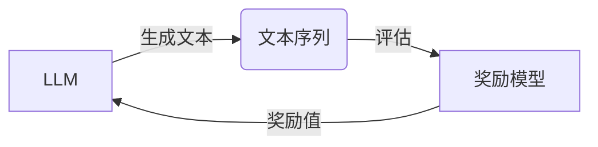

# 大语言模型原理与工程实践：奖励模型的训练

作者：禅与计算机程序设计艺术

## 1. 背景介绍

### 1.1 大语言模型的崛起

近年来，随着深度学习技术的飞速发展，大语言模型（Large Language Models, LLMs）逐渐走进了大众的视野。从 GPT-3 到 ChatGPT，这些模型展现出了惊人的语言理解和生成能力，在文本创作、代码生成、机器翻译等领域取得了突破性进展。

### 1.2 奖励模型的重要性

然而，训练一个高质量的 LLM 并非易事。传统的基于最大似然估计的训练方法往往会导致模型生成的内容缺乏逻辑性、一致性和创造性。为了解决这个问题，研究者们引入了强化学习中的奖励模型（Reward Model, RM）来指导 LLMs 的训练。

奖励模型的目标是学习一个函数，该函数可以对 LLM 生成的文本序列进行评估，并给出相应的奖励值。通过将奖励值反馈给 LLM，可以引导模型生成更加符合人类预期的高质量文本。

## 2. 核心概念与联系

### 2.1 强化学习与奖励函数

强化学习是一种机器学习范式，其核心思想是通过与环境交互来学习最优策略。在 LLM 的训练过程中，模型本身可以被视为一个智能体（Agent），它与环境（即文本数据）进行交互，并根据环境的反馈（即奖励值）来调整自身的参数。

奖励函数是强化学习中的一个重要概念，它定义了智能体在不同状态下采取不同动作所获得的奖励值。在 LLM 的训练中，奖励函数通常由人工标注或根据特定任务目标自动生成。

### 2.2 奖励模型的类型

根据训练方式的不同，奖励模型可以分为以下几种类型：

* **人工标注奖励模型:**  由人工对 LLM 生成的文本进行评分，并将其作为奖励值。
* **基于规则的奖励模型:**  根据预先定义的规则来评估文本质量，并生成相应的奖励值。
* **基于学习的奖励模型:**  使用机器学习算法从数据中学习奖励函数。

### 2.3 奖励模型与 LLM 的关系

奖励模型与 LLM 之间的关系可以用下图来表示：



LLM 生成文本序列后，奖励模型会对该序列进行评估，并给出相应的奖励值。LLM 会根据奖励值来更新自身的参数，从而生成更加符合人类预期的文本。

## 3. 核心算法原理具体操作步骤

### 3.1 基于人类反馈的强化学习 (RLHF)

目前，最常用的训练奖励模型的方法是基于人类反馈的强化学习 (Reinforcement Learning from Human Feedback, RLHF)。RLHF 的核心思想是利用人类的偏好来训练奖励模型，然后使用该模型来指导 LLM 的训练。

RLHF 的具体操作步骤如下:

1. **收集数据:**  收集人类对 LLM 生成文本的偏好数据，例如 pairwise comparison 数据 (比较两个文本哪个更好) 或 Likert scale 数据 (对文本进行 1-5 分的评分)。

2. **训练奖励模型:**  使用收集到的数据训练一个奖励模型，该模型可以预测人类对不同文本的偏好。

3. **训练 LLM:**  使用训练好的奖励模型作为强化学习中的奖励函数，对 LLM 进行微调。

### 3.2 训练奖励模型的算法

训练奖励模型常用的算法包括：

* **线性回归:**  将文本特征表示为向量，并使用线性回归模型来预测奖励值。
* **支持向量机 (SVM):**  使用核函数将文本特征映射到高维空间，并在该空间中寻找最优分类超平面。
* **神经网络:**  使用多层神经网络来学习文本特征与奖励值之间的复杂映射关系。

### 3.3 优化奖励模型的技巧

为了提高奖励模型的性能，可以采用以下技巧：

* **数据增强:**  通过对原始数据进行增强，例如 paraphrasing、back-translation 等，可以扩充训练数据集，提高模型的泛化能力。
* **正则化:**  通过添加正则化项，例如 L1/L2 正则化，可以防止模型过拟合，提高模型的泛化能力。
* **集成学习:**  通过组合多个不同的奖励模型，可以提高预测的准确性和鲁棒性。

## 4. 数学模型和公式详细讲解举例说明

### 4.1 线性回归模型

线性回归模型是最简单的奖励模型之一，它假设奖励值与文本特征之间存在线性关系。其数学模型如下：

$$
y = w^T x + b
$$

其中，$y$ 表示奖励值，$x$ 表示文本特征向量，$w$ 表示权重向量，$b$ 表示偏置项。

**举例说明:**

假设我们想要训练一个奖励模型来评估机器翻译结果的质量。我们可以使用 BLEU score 作为奖励值，并使用以下特征来表示翻译结果：

*  翻译结果的长度
*  翻译结果中包含的词数
*  翻译结果与参考译文之间的词重叠度

我们可以使用线性回归模型来学习这些特征与 BLEU score 之间的线性关系。

### 4.2 支持向量机 (SVM)

支持向量机 (SVM) 是一种常用的分类算法，它可以用于训练二分类或多分类奖励模型。SVM 的目标是找到一个最优分类超平面，该超平面可以最大化不同类别样本之间的间隔。

**举例说明:**

假设我们想要训练一个奖励模型来判断一段文本是否属于正面情绪。我们可以使用人工标注的数据来训练一个 SVM 模型，该模型可以将文本分为正面情绪和非正面情绪两类。

### 4.3 神经网络模型

神经网络模型可以使用多层神经元来学习文本特征与奖励值之间的复杂映射关系。常用的神经网络模型包括：

*  多层感知机 (MLP)
*  卷积神经网络 (CNN)
*  循环神经网络 (RNN)

**举例说明:**

假设我们想要训练一个奖励模型来评估对话系统的回复质量。我们可以使用人工标注的数据来训练一个基于 RNN 的奖励模型，该模型可以学习对话历史和当前回复之间的语义关系，并预测回复的质量得分。

## 5. 项目实践：代码实例和详细解释说明

### 5.1 使用 Transformers 库训练奖励模型

```python
from transformers import AutoModelForSequenceClassification, Trainer, TrainingArguments

# 加载预训练模型
model_name = "bert-base-uncased"
model = AutoModelForSequenceClassification.from_pretrained(model_name, num_labels=1)

# 定义训练参数
training_args = TrainingArguments(
    output_dir="./results",
    num_train_epochs=3,
    per_device_train_batch_size=8,
    per_device_eval_batch_size=8,
    learning_rate=2e-5,
    evaluation_strategy="epoch",
)

# 创建 Trainer 对象
trainer = Trainer(
    model=model,
    args=training_args,
    train_dataset=train_dataset,
    eval_dataset=eval_dataset,
)

# 开始训练
trainer.train()
```

### 5.2 使用 PPO 算法微调 LLM

```python
from transformers import AutoModelForCausalLM, PPOConfig, PPOTrainer

# 加载预训练模型
model_name = "gpt2"
model = AutoModelForCausalLM.from_pretrained(model_name)

# 定义 PPO 配置
ppo_config = PPOConfig(
    learning_rate=1e-5,
    ppo_epochs=4,
    batch_size=16,
)

# 创建 PPOTrainer 对象
trainer = PPOTrainer(
    model=model,
    args=ppo_config,
    reward_model=reward_model,
    tokenizer=tokenizer,
)

# 开始微调
trainer.train()
```

## 6. 实际应用场景

### 6.1 对话系统

奖励模型可以用于训练更加自然、流畅、且符合人类预期的对话系统。

### 6.2 机器翻译

奖励模型可以用于评估机器翻译结果的质量，并指导翻译模型的训练，从而提高翻译质量。

### 6.3 文本摘要

奖励模型可以用于评估文本摘要的质量，并指导摘要模型的训练，从而生成更加简洁、准确的摘要。

## 7. 总结：未来发展趋势与挑战

### 7.1 未来发展趋势

*  **更加高效的奖励模型训练方法:**  研究更加高效的奖励模型训练方法，例如使用更少的人工标注数据或使用无监督/半监督学习方法。
*  **更加精准的奖励函数设计:**  设计更加精准的奖励函数，以更好地捕捉人类的偏好和价值观。
*  **更加广泛的应用领域:**  将奖励模型应用于更加广泛的领域，例如代码生成、图像生成、视频生成等。

### 7.2 面临的挑战

*  **数据偏差:**  训练数据中可能存在偏差，导致奖励模型学习到不准确或不公平的偏好。
*  **可解释性:**  奖励模型的决策过程通常难以解释，这限制了其在一些安全敏感领域的应用。
*  **泛化能力:**  奖励模型在训练数据之外的泛化能力仍然有限，需要进一步提升。

## 8. 附录：常见问题与解答

### 8.1 什么是奖励模型？

奖励模型是一种用于评估 LLM 生成文本质量的模型。它可以学习一个函数，该函数可以对文本序列进行评估，并给出相应的奖励值。

### 8.2 如何训练奖励模型？

训练奖励模型常用的方法是基于人类反馈的强化学习 (RLHF)。

### 8.3 奖励模型有哪些应用场景？

奖励模型可以应用于对话系统、机器翻译、文本摘要等领域。
