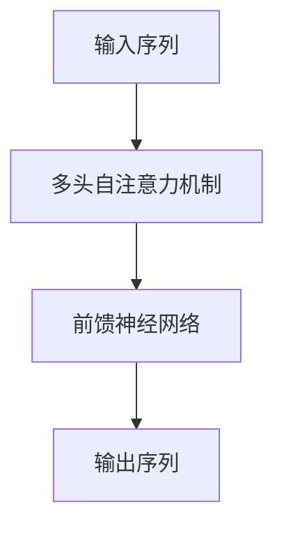

# 大语言模型原理基础与前沿 蒸馏

作者：禅与计算机程序设计艺术

## 1. 背景介绍

### 1.1 大语言模型的兴起

大语言模型（Large Language Models, LLMs）在过去的几年中取得了显著的进展，成为了自然语言处理（NLP）领域的焦点。随着深度学习技术的发展，特别是基于Transformer架构的模型如BERT、GPT等的出现，使得语言模型在理解和生成自然语言文本方面达到了前所未有的高度。

### 1.2 蒸馏技术的引入

然而，大语言模型往往面临着模型庞大、计算资源消耗巨大等问题。为了解决这些问题，模型蒸馏（Model Distillation）技术应运而生。蒸馏技术通过将大模型的知识传递给较小的模型，从而在保持性能的前提下大幅度减少模型的大小和计算资源的需求。

### 1.3 文章目的

本篇文章旨在深入探讨大语言模型的基本原理与前沿技术，特别是蒸馏技术的应用。我们将详细介绍大语言模型的核心概念、算法原理、数学模型、实际应用场景，并提供具体的代码实例和工具资源推荐，最后展望未来的发展趋势与挑战。

## 2. 核心概念与联系

### 2.1 大语言模型的基本概念

大语言模型是一种通过大量文本数据训练得到的深度学习模型，能够理解和生成自然语言。它们通常基于Transformer架构，利用自注意力机制来捕捉文本中的长距离依赖关系。

### 2.2 Transformer架构

Transformer是大语言模型的核心架构，其主要组件包括多头自注意力机制和前馈神经网络。自注意力机制使得模型能够关注输入序列中的不同位置，从而更好地理解上下文信息。



### 2.3 模型蒸馏的基本概念

模型蒸馏是一种知识迁移技术，通过将大模型（教师模型）的知识传递给较小的模型（学生模型），从而在保持性能的前提下减少模型的大小和计算资源的需求。蒸馏过程通常包括教师模型的训练、知识提取和学生模型的训练三个步骤。

### 2.4 大语言模型与蒸馏技术的联系

大语言模型和蒸馏技术密切相关。蒸馏技术可以有效地解决大语言模型在实际应用中的资源消耗问题，使得这些模型能够在更广泛的场景中应用。

## 3. 核心算法原理具体操作步骤

### 3.1 大语言模型的训练过程

#### 3.1.1 数据预处理

在训练大语言模型之前，需要对大量的文本数据进行预处理，包括文本清洗、分词、去停用词等步骤。

#### 3.1.2 模型架构设计

选择合适的模型架构是训练大语言模型的关键。Transformer架构由于其强大的表现力和并行计算能力，成为了大多数大语言模型的首选。

#### 3.1.3 模型训练

使用预处理后的数据对模型进行训练。训练过程通常采用自监督学习的方法，如掩码语言模型（Masked Language Model, MLM）或自回归模型（Autoregressive Model）。

### 3.2 模型蒸馏的具体步骤

#### 3.2.1 教师模型的训练

首先，需要训练一个性能优异的大模型作为教师模型。教师模型通常具有较高的准确性和较强的表现力。

#### 3.2.2 知识提取

从教师模型中提取知识，这些知识可以是中间层的表示、输出的概率分布等。

#### 3.2.3 学生模型的训练

利用从教师模型中提取的知识训练一个较小的学生模型。训练过程中，学生模型需要尽量模仿教师模型的行为。

## 4. 数学模型和公式详细讲解举例说明

### 4.1 Transformer的数学模型

Transformer模型的核心是自注意力机制，其数学表示如下：

$$
\text{Attention}(Q, K, V) = \text{softmax}\left(\frac{QK^T}{\sqrt{d_k}}\right)V
$$

其中，$Q$、$K$、$V$分别表示查询（Query）、键（Key）和值（Value）矩阵，$d_k$表示键向量的维度。

### 4.2 模型蒸馏的数学公式

模型蒸馏的核心思想是通过最小化学生模型输出与教师模型输出之间的差异来训练学生模型。其损失函数通常包括两个部分：传统的交叉熵损失和蒸馏损失。

$$
L = \alpha L_{\text{CE}}(y, \hat{y}) + (1 - \alpha) L_{\text{KD}}(s, t)
$$

其中，$L_{\text{CE}}$表示交叉熵损失，$L_{\text{KD}}$表示蒸馏损失，$\alpha$是一个权重系数，$y$是真实标签，$\hat{y}$是学生模型的预测，$s$和$t$分别是学生模型和教师模型的输出。

## 5. 项目实践：代码实例和详细解释说明

### 5.1 大语言模型的训练代码示例

以下是一个基于PyTorch的简单大语言模型训练代码示例：

```python
import torch
import torch.nn as nn
import torch.optim as optim
from transformers import BertTokenizer, BertModel

# 加载预训练的BERT模型和分词器
tokenizer = BertTokenizer.from_pretrained('bert-base-uncased')
model = BertModel.from_pretrained('bert-base-uncased')

# 定义训练数据
texts = ["Hello, how are you?", "I am fine, thank you."]
inputs = tokenizer(texts, return_tensors='pt', padding=True, truncation=True)

# 定义损失函数和优化器
criterion = nn.CrossEntropyLoss()
optimizer = optim.Adam(model.parameters(), lr=1e-5)

# 训练模型
model.train()
for epoch in range(10):
    optimizer.zero_grad()
    outputs = model(**inputs)
    loss = criterion(outputs.logits, torch.tensor([1, 0]))
    loss.backward()
    optimizer.step()
    print(f"Epoch {epoch}, Loss: {loss.item()}")
```

### 5.2 模型蒸馏的代码示例

以下是一个基于PyTorch的简单模型蒸馏代码示例：

```python
import torch
import torch.nn as nn
import torch.optim as optim
from transformers import BertTokenizer, BertModel

# 加载预训练的教师模型和学生模型
teacher_model = BertModel.from_pretrained('bert-large-uncased')
student_model = BertModel.from_pretrained('bert-base-uncased')

# 定义蒸馏损失函数
class DistillationLoss(nn.Module):
    def __init__(self, temperature=2.0):
        super(DistillationLoss, self).__init__()
        self.temperature = temperature

    def forward(self, student_logits, teacher_logits, labels):
        soft_teacher_probs = torch.softmax(teacher_logits / self.temperature, dim=-1)
        soft_student_probs = torch.softmax(student_logits / self.temperature, dim=-1)
        distillation_loss = nn.KLDivLoss()(soft_student_probs.log(), soft_teacher_probs)
        classification_loss = nn.CrossEntropyLoss()(student_logits, labels)
        return distillation_loss + classification_loss

# 定义训练数据
texts = ["Hello, how are you?", "I am fine, thank you."]
inputs = tokenizer(texts, return_tensors='pt', padding=True, truncation=True)
labels = torch.tensor([1, 0])

# 定义优化器
optimizer = optim.Adam(student_model.parameters(), lr=1e-5)

# 训练学生模型
student_model.train()
teacher_model.eval()
for epoch in range(10):
    optimizer.zero_grad()
    with torch.no_grad():
        teacher_outputs = teacher_model(**inputs)
    student_outputs = student_model(**inputs)
    loss = DistillationLoss()(student_outputs.logits, teacher_outputs.logits, labels)
    loss.backward()
    optimizer.step()
    print(f"Epoch {epoch}, Loss: {loss.item()}")
```

## 6. 实际应用场景

### 6.1 自然语言理解

大语言模型在自然语言理解任务中表现出色，如文本分类、情感分析、命名实体识别等。通过蒸馏技术，可以将这些模型应用于资源受限的设备上，如移动设备。

### 6.2 自动文本生成

大语言模型在自动文本生成任务中同样表现优异，如机器翻译、对话系统、文本摘要等。通过蒸馏技术