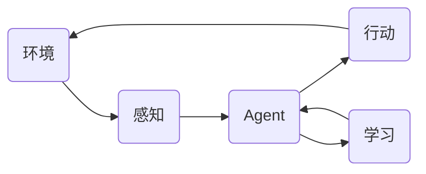
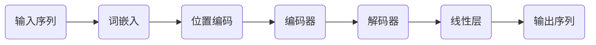

# 大语言模型应用指南：自主Agent系统案例分析（二）

作者：禅与计算机程序设计艺术

## 1. 背景介绍

### 1.1 自主Agent系统概述

在人工智能领域，自主Agent系统 (Autonomous Agent System) 指的是能够在特定环境中独立运作，自主感知、决策和行动的智能体。近年来，随着深度学习、强化学习等技术的快速发展，自主Agent系统在各个领域展现出巨大的应用潜力，例如：

* **游戏AI：**  AlphaGo、OpenAI Five 等游戏AI的成功，证明了自主Agent系统在复杂游戏环境中能够超越人类玩家。
* **机器人控制：**  自主导航、物体抓取等机器人应用，需要Agent能够自主地感知环境、规划路径并执行动作。
* **金融交易：**  自主交易系统能够根据市场行情变化，自动进行股票、期货等金融产品的交易。
* **智能客服：**  自主客服系统能够理解用户的自然语言，并根据用户需求提供个性化的服务。

### 1.2 大语言模型与自主Agent系统

大语言模型 (Large Language Model, LLM) 是指参数量巨大、训练数据规模庞大的神经网络模型，例如 GPT-3、BERT 等。LLM 具备强大的语言理解和生成能力，能够完成各种自然语言处理任务，例如：

* **文本生成：**  生成文章、诗歌、代码等各种类型的文本。
* **机器翻译：**  将一种语言的文本翻译成另一种语言。
* **问答系统：**  回答用户提出的各种问题。
* **对话系统：**  与用户进行自然流畅的对话。

将 LLM 应用于自主Agent系统，可以显著提升 Agent 的智能水平。LLM 可以作为 Agent 的“大脑”，帮助 Agent 理解环境、制定策略、生成行动方案。

### 1.3 本文目标

本文将深入探讨如何利用大语言模型构建自主Agent系统，并通过具体案例分析，阐述 LLM 在 Agent 系统中的应用方法和优势。

## 2. 核心概念与联系

### 2.1  自主Agent系统架构

一个典型的自主Agent系统架构如下图所示：



* **环境 (Environment):**  Agent 所处的外部环境，可以是物理世界，也可以是虚拟世界。
* **感知 (Perception):**  Agent 通过传感器感知环境信息，例如图像、声音、文本等。
* **Agent:**  自主决策和行动的智能体。
* **行动 (Action):**  Agent 对环境做出的改变，例如移动、操作物体、发送信息等。
* **学习 (Learning):**  Agent 通过与环境交互，不断学习和优化自身的策略。

### 2.2  LLM 在自主Agent系统中的角色

LLM 可以扮演自主Agent系统中的多个角色：

* **环境模型 (Environment Model):** LLM 可以学习环境的动态变化规律，预测环境的未来状态，为 Agent 提供决策依据。
* **策略模型 (Policy Model):** LLM 可以根据环境状态和目标，生成 Agent 的行动方案。
* **价值模型 (Value Model):** LLM 可以评估不同行动方案的价值，帮助 Agent 选择最优策略。
* **语言接口 (Language Interface):** LLM 可以作为 Agent 与用户交互的桥梁，使用自然语言进行沟通。

### 2.3  LLM 与其他Agent技术的结合

LLM 可以与其他 Agent 技术结合，构建更加强大的自主Agent系统：

* **强化学习 (Reinforcement Learning):**  LLM 可以作为强化学习的策略网络或价值网络，利用强化学习算法优化 Agent 的行为策略。
* **模仿学习 (Imitation Learning):**  LLM 可以通过观察人类专家的行为，学习如何完成特定任务。
* **规划 (Planning):**  LLM 可以结合符号推理和逻辑推理，生成复杂任务的行动计划。

## 3. 核心算法原理具体操作步骤

### 3.1 基于 LLM 的环境模型构建

构建基于 LLM 的环境模型，通常采用序列预测的方法。将历史环境状态作为输入序列，训练 LLM 预测未来的环境状态。例如，可以使用 Transformer 模型预测未来一段时间内的股票价格走势。

**具体操作步骤：**

1. 收集历史环境状态数据，例如股票价格、交易量、新闻事件等。
2. 将数据预处理成 LLM 可以处理的格式，例如将时间序列数据转换成固定长度的向量序列。
3. 使用历史数据训练 LLM 模型，预测未来的环境状态。
4. 使用预测结果评估模型性能，并根据需要调整模型参数或训练数据。

### 3.2 基于 LLM 的策略模型构建

构建基于 LLM 的策略模型，通常采用文本生成的方法。将当前环境状态和目标作为输入，训练 LLM 生成相应的行动方案。例如，可以使用 GPT-3 模型生成游戏角色的下一步行动指令。

**具体操作步骤：**

1. 收集 Agent 与环境交互的数据，例如游戏记录、对话记录等。
2. 将数据预处理成 LLM 可以处理的格式，例如将游戏状态和行动指令转换成文本序列。
3. 使用历史数据训练 LLM 模型，生成符合目标的行动方案。
4. 使用模拟环境或真实环境评估模型性能，并根据需要调整模型参数或训练数据。

## 4. 数学模型和公式详细讲解举例说明

### 4.1 Transformer 模型

Transformer 模型是一种基于自注意力机制的神经网络模型，在自然语言处理领域取得了巨大成功。其核心思想是利用自注意力机制捕捉输入序列中不同位置之间的依赖关系。

**自注意力机制:**

$$
\text{Attention}(Q, K, V) = \text{softmax}(\frac{QK^T}{\sqrt{d_k}})V
$$

其中：

* $Q$：查询矩阵，表示当前词的语义信息。
* $K$：键矩阵，表示所有词的语义信息。
* $V$：值矩阵，表示所有词的上下文信息。
* $d_k$：键矩阵的维度。

**Transformer 模型架构:**



### 4.2 强化学习

强化学习是一种机器学习方法，Agent 通过与环境交互，学习如何最大化累积奖励。

**马尔可夫决策过程 (Markov Decision Process, MDP):**

MDP 是强化学习的基本数学模型，可以用一个五元组表示：$(S, A, P, R, \gamma)$，其中：

* $S$：状态空间，表示环境所有可能的状态。
* $A$：行动空间，表示 Agent 所有可能的行动。
* $P$：状态转移概率函数，表示在状态 $s$ 下采取行动 $a$ 后转移到状态 $s'$ 的概率。
* $R$：奖励函数，表示在状态 $s$ 下采取行动 $a$ 后获得的奖励。
* $\gamma$：折扣因子，表示未来奖励的价值。

**Q-learning 算法:**

Q-learning 是一种常用的强化学习算法，其目标是学习一个状态-行动价值函数 (Q-function)，表示在状态 $s$ 下采取行动 $a$ 的长期价值。

**Q-function 更新公式:**

$$
Q(s_t, a_t) \leftarrow Q(s_t, a_t) + \alpha [r_{t+1} + \gamma \max_{a} Q(s_{t+1}, a) - Q(s_t, a_t)]
$$

其中：

* $s_t$：当前状态。
* $a_t$：当前行动。
* $r_{t+1}$：采取行动 $a_t$ 后获得的奖励。
* $s_{t+1}$：采取行动 $a_t$ 后转移到的状态。
* $\alpha$：学习率。

## 5. 项目实践：代码实例和详细解释说明

### 5.1  基于 LLM 的游戏 AI

本节将以一个简单的游戏为例，演示如何使用 LLM 构建游戏 AI。

**游戏规则：**

* 游戏在一个 10x10 的网格世界中进行。
* Agent 控制一个角色，目标是收集地图上的所有金币。
* 地图上还有一些障碍物，Agent 不能穿过障碍物。

**代码实例 (Python):**

```python
import random

import torch
from transformers import GPT2Tokenizer, GPT2LMHeadModel

# 游戏环境
class GameEnv:
    def __init__(self):
        self.grid_size = 10
        self.agent_pos = (0, 0)
        self.coins = [(random.randint(0, self.grid_size - 1), random.randint(0, self.grid_size - 1)) for _ in range(10)]
        self.obstacles = [(random.randint(0, self.grid_size - 1), random.randint(0, self.grid_size - 1)) for _ in range(10)]

    def reset(self):
        self.agent_pos = (0, 0)
        return self.get_state()

    def step(self, action):
        x, y = self.agent_pos
        if action == "up":
            y = max(0, y - 1)
        elif action == "down":
            y = min(self.grid_size - 1, y + 1)
        elif action == "left":
            x = max(0, x - 1)
        elif action == "right":
            x = min(self.grid_size - 1, x + 1)
        self.agent_pos = (x, y)
        return self.get_state(), self.get_reward()

    def get_state(self):
        state = ""
        for y in range(self.grid_size):
            for x in range(self.grid_size):
                if (x, y) == self.agent_pos:
                    state += "A"
                elif (x, y) in self.coins:
                    state += "C"
                elif (x, y) in self.obstacles:
                    state += "O"
                else:
                    state += "."
            state += "\n"
        return state

    def get_reward(self):
        if self.agent_pos in self.coins:
            self.coins.remove(self.agent_pos)
            return 10
        return -1

# LLM 模型
tokenizer = GPT2Tokenizer.from_pretrained("gpt2")
model = GPT2LMHeadModel.from_pretrained("gpt2")

# 训练 LLM 模型
def train(env, model, tokenizer, episodes=1000):
    optimizer = torch.optim.Adam(model.parameters(), lr=1e-5)
    for episode in range(episodes):
        state = env.reset()
        total_reward = 0
        done = False
        while not done:
            # 使用 LLM 生成行动方案
            input_text = f"Current state:\n{state}\nAction:"
            input_ids = tokenizer.encode(input_text, return_tensors="pt")
            outputs = model.generate(input_ids, max_length=len(input_text) + 10)
            action = tokenizer.decode(outputs[0], skip_special_tokens=True)[len(input_text):].strip()

            # 执行行动并获取奖励
            next_state, reward = env.step(action)
            total_reward += reward

            # 计算损失函数并更新模型参数
            loss = compute_loss(state, action, reward, next_state, model, tokenizer)
            optimizer.zero_grad()
            loss.backward()
            optimizer.step()

            state = next_state
            if len(env.coins) == 0:
                done = True

        print(f"Episode {episode + 1}, Total reward: {total_reward}")

# 计算损失函数
def compute_loss(state, action, reward, next_state, model, tokenizer):
    # TODO: 实现损失函数计算逻辑

# 测试 LLM 模型
def test(env, model, tokenizer):
    state = env.reset()
    total_reward = 0
    done = False
    while not done:
        # 使用 LLM 生成行动方案
        input_text = f"Current state:\n{state}\nAction:"
        input_ids = tokenizer.encode(input_text, return_tensors="pt")
        outputs = model.generate(input_ids, max_length=len(input_text) + 10)
        action = tokenizer.decode(outputs[0], skip_special_tokens=True)[len(input_text):].strip()

        # 执行行动并获取奖励
        next_state, reward = env.step(action)
        total_reward += reward

        state = next_state
        if len(env.coins) == 0:
            done = True

    print(f"Total reward: {total_reward}")

# 创建游戏环境
env = GameEnv()

# 训练 LLM 模型
train(env, model, tokenizer)

# 测试 LLM 模型
test(env, model, tokenizer)
```

**代码解释：**

1.  **游戏环境：**  `GameEnv` 类模拟了游戏的环境，包括地图、Agent、金币和障碍物等元素。
2.  **LLM 模型：**  使用预训练的 GPT-2 模型作为 Agent 的策略模型。
3.  **训练 LLM 模型：**  `train()` 函数使用强化学习算法训练 LLM 模型，目标是最大化 Agent 在游戏中的累积奖励。
4.  **测试 LLM 模型：**  `test()` 函数测试训练好的 LLM 模型在游戏中的性能。

## 6. 实际应用场景

### 6.1 游戏 AI

* **游戏角色控制：**  控制游戏角色的行为，例如移动、攻击、躲避等。
* **游戏剧情生成：**  根据玩家的选择和行为，动态生成游戏剧情。
* **游戏 NPC 交互：**  创建更智能、更自然的 NPC，与玩家进行互动。

### 6.2  机器人控制

* **自主导航：**  控制机器人在复杂环境中自主导航，例如避障、路径规划等。
* **物体抓取：**  控制机器人识别和抓取不同形状、大小和材质的物体。
* **人机协作：**  与人类工人协同完成复杂的任务，例如装配、搬运等。

### 6.3  金融交易

* **量化交易：**  根据市场行情变化，自动进行股票、期货等金融产品的交易。
* **风险控制：**  识别和评估金融市场中的风险，制定相应的风险控制策略。
* **投资组合优化：**  根据投资者的风险偏好和收益目标，优化投资组合配置。

### 6.4  智能客服

* **自动问答：**  回答用户提出的各种问题，提供快速、准确的答案。
* **对话系统：**  与用户进行自然流畅的对话，提供个性化的服务。
* **情感分析：**  识别用户的情感状态，提供更贴心的服务。

## 7. 工具和资源推荐

### 7.1 大语言模型

* **GPT-3 (Generative Pre-trained Transformer 3):**  由 OpenAI 开发，是目前最强大的语言模型之一。
* **BERT (Bidirectional Encoder Representations from Transformers):**  由 Google 开发，在各种自然语言处理任务中取得了很好的效果。
* **XLNet (Generalized Autoregressive Pretraining for Language Understanding):**  由 CMU 和 Google 开发，是一种广义自回归预训练模型。

### 7.2 强化学习框架

* **TensorFlow Agents:**  由 Google 开发，是一个用于构建和训练 Agent 的 TensorFlow 库。
* **Stable Baselines3:**  是一个基于 PyTorch 的强化学习库，提供了各种强化学习算法的实现。
* **Ray RLlib:**  是一个用于分布式强化学习的开源库。

### 7.3  其他资源

* **Hugging Face Transformers:**  提供各种预训练的语言模型和代码示例。
* **OpenAI Gym:**  提供各种强化学习环境，用于测试和比较不同的强化学习算法。

## 8. 总结：未来发展趋势与挑战

### 8.1 未来发展趋势

* **更大、更强的 LLM:**  随着计算能力的提升和训练数据的增多，LLM 的规模和性能将不断提升。
* **多模态 LLM:**  将文本、图像、音频等多种模态信息融合到 LLM 中，构建更强大的多模态理解和生成能力。
* **个性化 LLM:**  根据用户的个性化需求，定制 LLM 的参数和功能。

### 8.2  挑战

* **数据效率：**  LLM 的训练需要大量的标注数据，如何提高数据效率是一个重要挑战。
* **可解释性：**  LLM 的决策过程通常难以解释，如何提高 LLM 的可解释性是一个重要挑战。
* **安全性：**  LLM 可能会被用于生成虚假信息或进行恶意攻击，如何确保 LLM 的安全性是一个重要挑战。


## 9. 附录：常见问题与解答

### 9.1  如何选择合适的 LLM？

选择 LLM 时，需要考虑以下因素：

* **任务类型：**  不同的 LLM 适用于不同的任务类型，例如 GPT