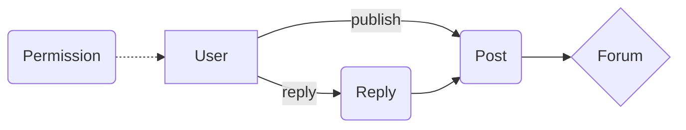

# 学校学生论坛的设计与实现

作者：禅与计算机程序设计艺术

## 1. 背景介绍

### 1.1 学生论坛的意义

在现代校园生活中,学生论坛扮演着越来越重要的角色。它不仅是学生交流思想、分享知识的平台,更是培养学生表达能力、锻炼逻辑思维的有效途径。一个设计良好、功能完备的学生论坛系统,将极大地促进校园文化的建设和发展。

### 1.2 论坛系统的技术发展

伴随互联网技术的飞速发展,Web应用的复杂度不断提高,对论坛系统的性能和可扩展性也提出了更高的要求。传统的PHP、JSP等服务器端渲染技术逐渐被前后端分离的架构所取代。而以React、Vue为代表的现代前端框架,以及Node.js、Go等高性能后端语言,正在成为构建大型Web应用的主流技术选型。

### 1.3 本文的主要内容  

本文将围绕"学校学生论坛"这一主题,详细探讨该系统的需求分析、架构设计、核心算法、数据建模以及实际开发等各个环节。力求为读者呈现一套科学完整的论坛系统设计与实现方案,为同类系统的开发提供可资借鉴的经验。

## 2. 核心概念与联系

### 2.1 论坛的核心概念

- 用户(User):论坛的参与者,可以发帖、回帖、点赞等。
- 帖子(Post):用户在论坛发表的内容,可以是提问、分享等。
- 回复(Reply):用户对帖子或其他回复进行评论。
- 版块(Forum):论坛的子板块,按主题分类。
- 权限(Permission):不同用户对论坛的操作权限,如管理员、普通用户等。

### 2.2 核心概念之间的关系



由图可见,用户可以发表帖子和回复,帖子从属于特定版块,回复针对帖子或其他回复。用户的操作受权限系统控制。

## 3. 核心算法原理与具体步骤

### 3.1 帖子排序算法

为了让优质帖子脱颖而出,论坛常采用一定的排序算法。以下是一种简单有效的基于时间和评分的加权算序算法:

```
score = (p + 1) / (t + 2)^G

- p:帖子的点赞数(可正可负)
- t:帖子的发布时间,单位为小时 
- G:时间衰减因子,常取1.5~2
```

算法核心步骤:
1. 获取帖子的点赞数p和发布时间t
2. 根据公式计算帖子得分score 
3. 按score倒序排列帖子

该算法的特点是既考虑了帖子的"热度",也考虑了时效性。让新帖和高分帖都有均等的展示机会。G值决定了时间衰减速度,可根据实际情况调整。

## 4. 数学模型和公式详解

### 4.1 用户活跃度模型

为了量化用户在论坛的活跃程度,我们可以构建如下的数学模型:

$$
Activity = \sum_{i=0}^{n} W_i C_i
$$

其中:
- $Activity$:用户的综合活跃度
- $n$:考察的操作类型数
- $W_i$:操作类型 $i$ 的权重
- $C_i$:操作类型 $i$ 的次数

举例说明:假设我们考虑三种操作:发帖(权重0.5)、回复(权重0.3)、点赞(权重0.2)。某用户发帖10次,回复20次,点赞50次,则其活跃度为:

$$
Activity = 0.5 \times 10 + 0.3 \times 20 + 0.2 \times 50 = 21
$$

活跃度模型让用户的行为可量化,便于进行排名、奖惩等后续操作,也为用户画像、社交推荐等高级功能奠定了数据基础。

## 5. 项目实践:代码实例和详解

### 5.1 基于React的帖子组件

在前端,我们使用React构建帖子(Post)展示组件:

```jsx
import React from 'react';

function Post({post}) {
  return (
    <div className="post">
      <h3>{post.title}</h3>
      <div>{post.content}</div>
      <div>
        <span>{post.author}</span>
        <span>{post.publishTime}</span>
      </div>
      <button>点赞({post.ups})</button>
    </div>
  );
}

export default Post;
```

该组件接收一个post对象作为props,展示帖子的标题、正文、作者、发布时间等信息。点赞按钮显示当前点赞数。

在父组件中,我们可以这样使用Post组件:

```jsx
<Post post={
  title: "学习React的建议",
  content: "React是目前最流行的前端框架之一,学习React的过程中多看官方文档,多动手实践是很重要的...",
  author: "张三",
  publishTime: "2023-05-01 12:34",
  ups: 10
}/>
```

这样一个基本的帖子展示组件就完成了。实际项目中,我们还需要考虑样式、交互、状态管理、从服务器获取数据等诸多方面,但组件化封装的思路是一致的。

## 6. 实际应用场景

学校学生论坛可应用于以下场景:

- 学习交流:同学之间相互解答问题,交流学习心得。
- 信息发布:学校和学生组织可以发布公告、活动信息等。
- 二手交易:同学之间可以在论坛发布买卖二手物品的信息。
- 失物招领:在论坛发布失物招领信息,失主与拾得者可以进行联系。

除了校园内部,学生论坛还可以扩展到更广泛的群体,促进校际交流,让更多的学生受益。

一些知名的学生论坛如北邮人论坛、水木社区等,已经成为学校的一张名片,为学校增添了独特的文化魅力。

## 7. 工具和资源推荐

### 7.1 开发工具

- VS Code:功能强大、插件丰富的编辑器
- WebStorm:专为Web开发定制的IDE
- Postman:API测试工具

### 7.2 前端框架

- React:Facebook出品,生态圈庞大 
- Vue:上手简单,性能出众

### 7.3 后端框架

- Express:Node.js社区最流行的Web框架
- Koa:Express原班人马打造的下一代框架
- GIN:Go语言的HTTP框架,性能卓越

### 7.4 学习资源

- MDN:官网:权威的Web技术文档
- 掘金:国内优质的技术社区 
- GitHub:全球最大的开源社区

选择合适的工具,利用优质资源,将极大提升项目的开发效率和质量。

## 8. 总结:未来发展与挑战

学校学生论坛经过近二十年的发展,已经从单纯的BBS系统,发展成了融社交、知识分享、工具服务为一体的综合性平台。展望未来,学生论坛还需在以下方面继续发力:

- 智能化:借助大数据、人工智能技术,为用户提供个性化的内容推荐和交互体验。
- 移动化:加强移动客户端建设,适应手机已成大学生主要上网工具的趋势。
- 信息安全:严格遵循学校网络管理规定,加强用户隐私保护,提高论坛安全性。
- 商业化:在坚持公益属性的同时,适度探索商业变现模式,如广告、社团合作等。

总之,学生论坛要立足校园,放眼未来,在传承优秀校园文化的同时,紧跟时代发展的脚步,不断改进创新,为莘莘学子营造一个温暖、 纯净、进步的网上家园。

## 9. 附录:常见问题解答

### 9.1 如何提高论坛的用户活跃度?

- 办好迎新、毕业等校园热点话题讨论
- 开展有奖征文、摄影大赛等活动
- 邀请校内外名人开设专栏
- 优化论坛的界面设计与互动体验

### 9.2 如何处理论坛中的不良信息?

- 建立健全的论坛管理制度
- 招募学生志愿者担任版主
- 完善内容审核机制,对违规内容及时处理
- 开设举报专区,鼓励用户参与维护论坛秩序

### 9.3 怎样增强学生论坛的技术创新?

- 成立论坛技术团队,吸纳优秀的学生开发者
- 定期开展技术培训和交流活动
- 积极尝试新的架构、算法和开发模式
- 鼓励开源,让更多开发者参与进来

论坛的建设和发展离不开广大师生的共同努力,只有不断 "众神狂欢",才能让这片网络园地焕发出更加绚丽的光彩!