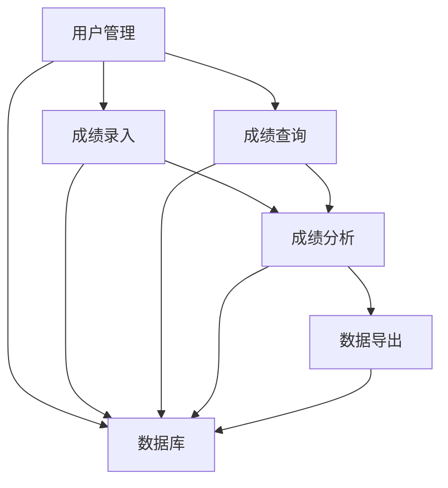

# 学生成绩信息管理系统详细设计与具体代码实现

作者：禅与计算机程序设计艺术

## 1. 背景介绍

### 1.1 教育信息化的背景
随着信息技术的飞速发展，教育领域也逐渐向信息化、智能化方向迈进。传统的学生成绩管理方式往往依赖于纸质记录和手工统计，不仅效率低下，还容易出现错误。为了提高管理效率和数据准确性，学生成绩信息管理系统应运而生。

### 1.2 学生成绩管理的重要性
学生成绩是衡量教学质量和学生学习效果的重要指标。科学、准确地管理学生成绩信息，不仅有助于教师及时了解学生的学习情况，进行有针对性的教学调整，还能为学生和家长提供透明、及时的成绩反馈。

### 1.3 现有系统的不足
现有的学生成绩管理系统大多存在以下问题：
1. **数据输入繁琐**：需要手动输入大量成绩数据，易出错。
2. **数据处理效率低**：无法快速处理和分析大量成绩数据。
3. **数据安全性差**：成绩信息容易泄露，缺乏有效的安全保障。
4. **用户体验不佳**：界面设计不友好，操作复杂。

## 2. 核心概念与联系

### 2.1 系统架构概述
学生成绩信息管理系统主要包括前端、后端和数据库三部分。前端负责用户交互，后端负责业务逻辑处理，数据库负责数据存储和管理。

### 2.2 主要功能模块
系统主要功能模块包括：
1. **用户管理**：包括教师、学生和管理员的注册、登录、权限管理等。
2. **成绩录入**：教师可以方便地录入学生成绩。
3. **成绩查询**：学生和家长可以查询到学生的成绩信息。
4. **成绩分析**：提供多维度的成绩分析报表，帮助教师和学校管理者进行教学评估。
5. **数据导出**：支持将成绩数据导出为Excel或PDF格式，便于存档和分享。

### 2.3 技术选型
系统开发过程中涉及的主要技术包括：
1. **前端技术**：HTML、CSS、JavaScript、React.js
2. **后端技术**：Node.js、Express.js
3. **数据库**：MySQL
4. **安全技术**：JWT（JSON Web Token）认证、数据加密

### 2.4 各模块之间的联系



## 3. 核心算法原理具体操作步骤

### 3.1 用户认证与权限管理
用户认证采用JWT技术，确保用户身份的唯一性和安全性。权限管理通过角色分配实现，不同角色具有不同的操作权限。

### 3.2 成绩录入与校验
成绩录入时，系统会对输入的数据进行格式校验和逻辑校验，确保数据的准确性。例如，成绩必须在0-100之间，且不能出现空值。

### 3.3 成绩查询与展示
成绩查询模块根据用户角色展示不同的数据。学生和家长只能查看自己的成绩，教师可以查看所授课程的所有学生成绩，管理员可以查看所有成绩数据。

### 3.4 成绩分析与报表生成
成绩分析模块利用统计学原理，生成多维度的分析报表，包括班级平均分、最高分、最低分、标准差等。

### 3.5 数据导出功能
数据导出功能支持将成绩数据导出为Excel或PDF格式，便于存档和分享。导出时，系统会对数据进行格式化处理，确保导出的文件美观、易读。

## 4. 数学模型和公式详细讲解举例说明

### 4.1 成绩统计模型

#### 4.1.1 平均分计算
平均分是衡量一个班级或一个学生整体成绩水平的重要指标。其计算公式为：
$$
\text{平均分} = \frac{\sum_{i=1}^{n} x_i}{n}
$$
其中，$x_i$表示第$i$个学生的成绩，$n$表示学生总数。

#### 4.1.2 标准差计算
标准差用于衡量成绩的离散程度，反映成绩的波动情况。其计算公式为：
$$
\sigma = \sqrt{\frac{\sum_{i=1}^{n} (x_i - \mu)^2}{n}}
$$
其中，$\mu$表示平均分，$x_i$表示第$i$个学生的成绩，$n$表示学生总数。

### 4.2 成绩分布模型
成绩分布模型用于分析成绩的分布情况，常用的有正态分布模型。其概率密度函数为：
$$
f(x) = \frac{1}{\sigma \sqrt{2\pi}} e^{-\frac{(x - \mu)^2}{2\sigma^2}}
$$
其中，$\mu$表示平均分，$\sigma$表示标准差，$x$表示成绩。

## 5. 项目实践：代码实例和详细解释说明

### 5.1 前端代码示例

#### 5.1.1 用户登录界面

```javascript
import React, { useState } from 'react';
import axios from 'axios';

const Login = () => {
  const [username, setUsername] = useState('');
  const [password, setPassword] = useState('');

  const handleLogin = async () => {
    try {
      const response = await axios.post('/api/login', { username, password });
      localStorage.setItem('token', response.data.token);
      alert('登录成功');
    } catch (error) {
      alert('登录失败');
    }
  };

  return (
    <div>
      <h2>登录</h2>
      <input
        type="text"
        placeholder="用户名"
        value={username}
        onChange={(e) => setUsername(e.target.value)}
      />
      <input
        type="password"
        placeholder="密码"
        value={password}
        onChange={(e) => setPassword(e.target.value)}
      />
      <button onClick={handleLogin}>登录</button>
    </div>
  );
};

export default Login;
```

### 5.2 后端代码示例

#### 5.2.1 用户认证接口

```javascript
const express = require('express');
const jwt = require('jsonwebtoken');
const bcrypt = require('bcrypt');
const User = require('../models/User');

const router = express.Router();

router.post('/login', async (req, res) => {
  const { username, password } = req.body;
  const user = await User.findOne({ username });

  if (!user) {
    return res.status(400).send('用户不存在');
  }

  const isPasswordValid = await bcrypt.compare(password, user.password);
  if (!isPasswordValid) {
    return res.status(400).send('密码错误');
  }

  const token = jwt.sign({ userId: user._id }, 'secret_key', { expiresIn: '1h' });
  res.send({ token });
});

module.exports = router;
```

### 5.3 数据库设计

```sql
CREATE TABLE users (
  id INT AUTO_INCREMENT PRIMARY KEY,
  username VARCHAR(255) NOT NULL,
  password VARCHAR(255) NOT NULL,
  role VARCHAR(50) NOT NULL
);

CREATE TABLE grades (
  id INT AUTO_INCREMENT PRIMARY KEY,
  student_id INT NOT NULL,
  course_id INT NOT NULL,
  grade FLOAT NOT NULL,
  FOREIGN KEY (student_id) REFERENCES users(id),
  FOREIGN KEY (course_id) REFERENCES courses(id)
);

CREATE TABLE courses (
  id INT AUTO_INCREMENT PRIMARY KEY,
  name VARCHAR(255) NOT NULL,
  teacher_id INT NOT NULL,
  FOREIGN KEY (teacher_id) REFERENCES users(id)
);
```

## 6. 实际应用场景

### 6.1 学校管理
学校管理者可以通过系统方便地管理全校学生的成绩信息，生成各种统计报表，进行教学质量评估和改进。

### 6.2 教师教学
教师可以通过系统方便地录入和查询学生成绩，进行成绩分析，发现学生的学习问题，进行有针对性的教学调整。

### 6.3 学生和家长
学生和家长可以通过系统随时查询学生的成绩信息，了解学生的学习情况，进行学习规划和调整。

## 7. 工具和资源推荐

### 7.1 开发工具
1. **Visual Studio Code**：功能强大的代码编辑器，支持多种编程语言和插件。
2. **Postman**：API开发和测试工具，方便进行接口调试。
3. **MySQL Workbench**：数据库设计和管理工具，支持可视化操作。

### 7.2 学习资源
1