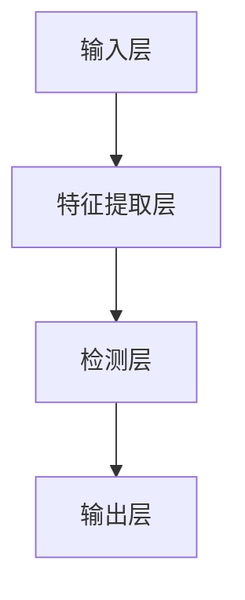

# 安全防御:YOLOv8对抗恶意攻击的防御之策

作者：禅与计算机程序设计艺术

## 1. 背景介绍

### 1.1 YOLOv8简介

YOLO（You Only Look Once）是一种实时目标检测系统，自其首次发布以来，已经成为计算机视觉领域的一个重要工具。YOLOv8是其最新版本，具有更高的精度和更快的速度，广泛应用于自动驾驶、安防监控和智能家居等领域。

### 1.2 恶意攻击的威胁

在现代信息社会中，恶意攻击已成为一个严重的威胁。攻击者利用各种手段对目标系统进行干扰、破坏，甚至窃取敏感信息。对于YOLOv8这样的重要系统，防御恶意攻击尤为重要。

### 1.3 文章目的

本文旨在探讨如何利用YOLOv8对抗恶意攻击，提供实用的防御策略和技术方法，帮助开发者和研究人员提升系统的安全性。

## 2. 核心概念与联系

### 2.1 YOLOv8的工作原理

YOLOv8通过单次前向传播同时预测多个目标的类别和位置。其核心思想是将图像划分为多个网格，每个网格负责检测一个或多个目标。YOLOv8的网络结构包括特征提取、目标检测和分类三个主要部分。

### 2.2 恶意攻击类型

恶意攻击主要分为以下几类：

1. **对抗样本攻击**：通过添加细微扰动使模型产生错误预测。
2. **数据中毒攻击**：在训练数据中插入恶意样本，导致模型训练失败。
3. **模型窃取攻击**：通过查询模型获取其内部信息，从而复制或破坏模型。

### 2.3 YOLOv8与恶意攻击的联系

YOLOv8作为一种目标检测系统，其核心算法和模型结构容易受到上述恶意攻击的影响。因此，研究如何防御这些攻击至关重要。

## 3. 核心算法原理具体操作步骤

### 3.1 YOLOv8的网络结构

YOLOv8的网络结构包括以下几个部分：

1. **输入层**：接收输入图像。
2. **特征提取层**：利用卷积神经网络（CNN）提取图像特征。
3. **检测层**：在特征图上预测目标的类别和位置。
4. **输出层**：输出最终的检测结果。



### 3.2 YOLOv8的损失函数

YOLOv8的损失函数包括三部分：

1. **分类损失**：衡量预测类别与真实类别之间的差异。
2. **定位损失**：衡量预测框与真实框之间的差异。
3. **置信度损失**：衡量预测目标存在的置信度与真实置信度之间的差异。

### 3.3 YOLOv8的训练过程

YOLOv8的训练过程包括以下步骤：

1. **数据准备**：收集并标注训练数据。
2. **模型初始化**：初始化网络权重。
3. **前向传播**：将输入图像通过网络，计算预测结果。
4. **损失计算**：根据预测结果和真实标签计算损失。
5. **反向传播**：根据损失更新网络权重。
6. **模型评估**：在验证集上评估模型性能。

## 4. 数学模型和公式详细讲解举例说明

### 4.1 YOLOv8的损失函数公式

YOLOv8的损失函数可以表示为：

$$
L = \sum_{i=0}^{S^2} \sum_{j=0}^{B} L_{coord} + L_{conf} + L_{class}
$$

其中，$L_{coord}$ 是定位损失，$L_{conf}$ 是置信度损失，$L_{class}$ 是分类损失。

### 4.2 定位损失

定位损失衡量预测框与真实框之间的差异，公式为：

$$
L_{coord} = \lambda_{coord} \sum_{i=0}^{S^2} \sum_{j=0}^{B} \mathbb{1}_{ij}^{obj} [(x_i - \hat{x}_i)^2 + (y_i - \hat{y}_i)^2 + (\sqrt{w_i} - \sqrt{\hat{w}_i})^2 + (\sqrt{h_i} - \sqrt{\hat{h}_i})^2]
$$

### 4.3 置信度损失

置信度损失衡量预测目标存在的置信度与真实置信度之间的差异，公式为：

$$
L_{conf} = \sum_{i=0}^{S^2} \sum_{j=0}^{B} \mathbb{1}_{ij}^{obj} (C_i - \hat{C}_i)^2 + \lambda_{noobj} \sum_{i=0}^{S^2} \sum_{j=0}^{B} \mathbb{1}_{ij}^{noobj} (C_i - \hat{C}_i)^2
$$

### 4.4 分类损失

分类损失衡量预测类别与真实类别之间的差异，公式为：

$$
L_{class} = \sum_{i=0}^{S^2} \mathbb{1}_{i}^{obj} \sum_{c \in classes} (p_i(c) - \hat{p}_i(c))^2
$$

### 4.5 举例说明

假设我们有一张包含多个目标的图像，YOLOv8将其划分为 $S \times S$ 个网格，每个网格预测 $B$ 个边界框及其置信度和类别。通过计算上述损失函数，我们可以优化模型，使其在目标检测任务中表现更好。

## 5. 项目实践：代码实例和详细解释说明

### 5.1 环境搭建

首先，我们需要搭建YOLOv8的运行环境。可以使用以下命令安装所需的依赖库：

```bash
pip install torch torchvision
pip install yolo-v8
```

### 5.2 数据准备

我们需要准备训练数据，并按照YOLOv8的要求进行标注。假设我们有一个包含猫狗图片的数据集，可以使用以下代码进行数据预处理：

```python
import os
import cv2
import numpy as np

def preprocess_data(data_dir, output_dir):
    for file_name in os.listdir(data_dir):
        img_path = os.path.join(data_dir, file_name)
        img = cv2.imread(img_path)
        img_resized = cv2.resize(img, (416, 416))
        output_path = os.path.join(output_dir, file_name)
        cv2.imwrite(output_path, img_resized)

preprocess_data('data/raw', 'data/preprocessed')
```

### 5.3 模型训练

使用YOLOv8进行模型训练，可以参考以下代码：

```python
import torch
from yolo_v8 import YOLOv8

# 初始化模型
model = YOLOv8(num_classes=2)

# 加载数据
train_data = 'data/preprocessed/train'
val_data = 'data/preprocessed/val'

# 训练模型
model.train(train_data, val_data, epochs=50, batch_size=16, learning_rate=0.001)
```

### 5.4 模型评估

在验证集上评估模型性能：

```python
results = model.evaluate(val_data)
print(f"Validation Accuracy: {results['accuracy']}")
print(f"Validation Loss: {results['loss']}")
```

### 5.5 模型推理

使用训练好的模型进行目标检测：

```python
test_img = cv2.imread('data/test/cat_dog.jpg')
predictions = model.predict(test_img)

for pred in predictions:
    x, y, w, h = pred['bbox']
    label = pred['label']
    confidence = pred['confidence']
    cv2.rectangle(test_img, (x, y), (x+w, y+h), (0, 255, 0), 2)
    cv2.putText(test_img, f"{label}: {confidence:.2f}", (x, y-10), cv2.FONT_HERSHEY_SIMPLEX, 0.5, (0, 255, 0), 2)

cv2.imshow('Predictions', test_img)
cv2.waitKey(0)
cv2.destroyAllWindows()
```

## 6. 实际应用场景

### 6.1 自动驾驶

在自动驾驶领域，YOLOv8可以用于检测道路上的行人、车辆和交通标志，从而提高驾驶安全性。然而，自动驾驶系统也容易受到对抗样本攻击，攻击者可以通过在路标上添加细微扰动使模型产生错误