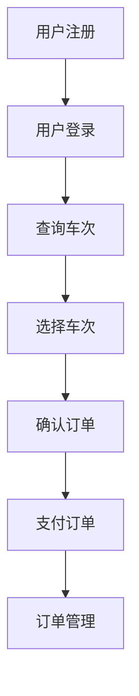

# 客运售票系统详细设计与具体代码实现

作者：禅与计算机程序设计艺术

## 1. 背景介绍

### 1.1 行业背景

客运售票系统是交通运输行业的重要组成部分。随着信息技术的快速发展，传统的人工售票方式逐渐被电子售票系统所取代。这不仅提高了售票效率，还大大降低了人为错误的发生率。现代客运售票系统集成了多种功能，如在线购票、实时查询、票务管理等，极大地提升了用户体验和运营效率。

### 1.2 项目背景

本项目旨在设计并实现一个功能完善的客运售票系统。系统将涵盖从用户注册、登录、查询车次、购票、支付到订单管理的完整流程。通过本项目，我们希望为读者提供一个详细的设计思路和具体的代码实现，以帮助他们在实际项目中灵活应用。

### 1.3 目标与意义

设计和实现一个客运售票系统，不仅能帮助初学者理解系统设计的基本原理，还能为有经验的开发者提供一个参考框架。通过本项目，读者将学会如何设计系统架构、选择合适的技术栈、编写高效的代码以及进行系统测试和优化。

## 2. 核心概念与联系

### 2.1 系统架构

客运售票系统的架构可以分为前端、后端和数据库三个主要部分。

- **前端**：负责用户界面的展示和交互，通常使用HTML、CSS和JavaScript等技术。
- **后端**：处理业务逻辑和数据管理，常用的技术包括Java、Python、Node.js等。
- **数据库**：存储系统中的各种数据，如用户信息、车次信息、订单信息等，常用的数据库有MySQL、PostgreSQL等。

### 2.2 模块划分

为了便于开发和维护，系统通常会被划分为多个模块，每个模块负责特定的功能。

- **用户管理模块**：负责用户的注册、登录、信息修改等功能。
- **车次管理模块**：负责车次信息的添加、修改、删除和查询。
- **订单管理模块**：负责订单的生成、支付、取消和查询。
- **支付模块**：集成各种支付方式，如支付宝、微信支付等。

### 2.3 技术选型

根据项目需求和技术团队的熟悉程度，我们选择以下技术栈：

- **前端**：React.js
- **后端**：Spring Boot
- **数据库**：MySQL
- **支付集成**：支付宝、微信支付

### 2.4 系统流程图

以下是系统的整体流程图，展示了用户从注册登录到购票支付的完整流程。



## 3. 核心算法原理具体操作步骤

### 3.1 用户注册与登录

用户注册和登录是任何系统的基础功能。用户注册时，需要提供基本信息，如用户名、密码、邮箱等。系统会对这些信息进行验证，并将其存储在数据库中。用户登录时，系统会验证其提供的用户名和密码是否匹配数据库中的记录。

### 3.2 车次查询与选择

车次查询功能允许用户根据出发地、目的地和日期等条件查询可用车次。系统会根据用户输入的条件，从数据库中检索符合条件的车次信息，并将结果展示给用户。

### 3.3 订单生成与支付

当用户选择了某个车次后，系统会生成一个订单。订单包含用户信息、车次信息和票价等。用户确认订单后，系统会引导用户进行支付。支付成功后，系统会更新订单状态，并向用户发送确认信息。

### 3.4 数据库设计

数据库设计是系统设计的关键环节。我们需要设计合理的数据库表结构，以确保数据的完整性和一致性。

- **用户表**：存储用户的基本信息，如用户名、密码、邮箱等。
- **车次表**：存储车次的基本信息，如车次号、出发地、目的地、出发时间等。
- **订单表**：存储订单的基本信息，如订单号、用户ID、车次ID、订单状态等。

## 4. 数学模型和公式详细讲解举例说明

### 4.1 购票数量与车次容量的匹配

在购票过程中，我们需要确保车次的剩余座位数量能够满足用户的购票需求。假设车次的总座位数为 $C$，已售出的座位数为 $S$，用户的购票数量为 $N$，则需要满足以下条件：

$$
C - S \geq N
$$

如果上述条件成立，则可以进行购票操作，否则需要提示用户座位不足。

### 4.2 票价计算

票价计算是订单生成中的重要环节。假设基础票价为 $P$，根据用户选择的车次和座位类型，系统可以应用不同的折扣或附加费用。最终票价 $F$ 可以表示为：

$$
F = P \times (1 - \text{折扣}) + \text{附加费用}
$$

### 4.3 支付金额验证

在支付过程中，系统需要验证用户支付的金额是否正确。假设订单的总金额为 $T$，用户支付的金额为 $A$，则需要满足以下条件：

$$
A \geq T
$$

如果上述条件成立，则支付成功，否则需要提示用户支付金额不足。

## 5. 项目实践：代码实例和详细解释说明

### 5.1 用户注册与登录

以下是用户注册和登录功能的代码实现。

```java
// 用户注册
@PostMapping("/register")
public ResponseEntity<?> registerUser(@RequestBody User user) {
    // 验证用户信息
    if (userService.existsByUsername(user.getUsername())) {
        return ResponseEntity.badRequest().body("用户名已存在");
    }
    // 保存用户信息
    userService.saveUser(user);
    return ResponseEntity.ok("注册成功");
}

// 用户登录
@PostMapping("/login")
public ResponseEntity<?> loginUser(@RequestBody LoginRequest loginRequest) {
    // 验证用户名和密码
    User user = userService.findByUsernameAndPassword(loginRequest.getUsername(), loginRequest.getPassword());
    if (user == null) {
        return ResponseEntity.badRequest().body("用户名或密码错误");
    }
    // 返回登录成功信息
    return ResponseEntity.ok("登录成功");
}
```

### 5.2 车次查询与选择

以下是车次查询和选择功能的代码实现。

```java
// 查询车次
@GetMapping("/trains")
public ResponseEntity<?> searchTrains(@RequestParam String from, @RequestParam String to, @RequestParam String date) {
    // 检索符合条件的车次
    List<Train> trains = trainService.findTrains(from, to, date);
    return ResponseEntity.ok(trains);
}

// 选择车次
@PostMapping("/selectTrain")
public ResponseEntity<?> selectTrain(@RequestBody TrainSelectionRequest request) {
    // 验证车次和座位数量
    Train train = trainService.findById(request.getTrainId());
    if (train.getAvailableSeats() < request.getSeatCount()) {
        return ResponseEntity.badRequest().body("座位不足");
    }
    // 返回选择成功信息
    return ResponseEntity.ok("选择成功");
}
```

### 5.3 订单生成与支付

以下是订单生成和支付功能的代码实现。

```java
// 生成订单
@PostMapping("/createOrder")
public ResponseEntity<?> createOrder(@RequestBody OrderRequest orderRequest) {
    // 验证车次和座位数量
    Train train = trainService.findById(orderRequest.getTrainId());
    if (train.getAvailableSeats() < orderRequest.getSeatCount()) {
        return ResponseEntity.badRequest().body("座位不足");
    }
    // 生成订单
    Order order = orderService.createOrder(orderRequest);
    return ResponseEntity.ok(order);
}

// 支付订单
@PostMapping("/payOrder")
public ResponseEntity<?> payOrder(@RequestBody PaymentRequest paymentRequest) {
    // 验证支付金额
    Order order = orderService.findById(paymentRequest.getOrderId());
    if (paymentRequest.getAmount() < order.getTotalAmount()) {
        return ResponseEntity.badRequest().body("支付金额不足");
    }
    // 更新订单状态
    orderService.updateOrderStatus(order.getId(), "已支付");
    return ResponseEntity.ok("支付成功");
}
```

## 6. 实际应用场景

### 6.1 在线购票

用户可以通过PC端或移动端访问客运售票系统，进行车次查询和在线购票。系统提供实时的车次信息和座位情况，用户可以方便地选择合适