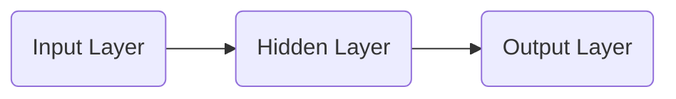

## 1. 背景介绍

### 1.1 什么是嵌入？

在机器学习和自然语言处理领域，我们常常需要将非结构化的数据，例如文本、图像、音频等，转换成计算机能够理解和处理的数值表示形式。**嵌入（Embedding）**就是一种将离散型变量（如单词、句子、用户ID）映射到连续向量空间的技术。通俗地说，嵌入就是将一个对象表示成一个低维稠密向量的过程，这个向量包含了该对象的关键信息。

### 1.2 嵌入的意义

嵌入的出现，为机器学习和数据挖掘领域带来了革命性的变化：

- **克服数据稀疏性问题:**  传统的独热编码方式，会产生高维稀疏向量，难以有效地进行计算和建模。嵌入可以将高维稀疏数据映射到低维稠密向量空间，有效解决了数据稀疏性问题。
- **捕捉语义信息:**  嵌入可以捕捉到数据之间的潜在语义关系，例如，"国王" 和 "王后" 的嵌入向量在向量空间中距离很近，而 "苹果" 和 "汽车" 的嵌入向量则相距较远。
- **提升模型性能:**  使用嵌入作为模型的输入，可以有效提升模型的性能，例如在自然语言处理任务中，使用词嵌入可以显著提升文本分类、情感分析等任务的准确率。

### 1.3 嵌入的发展历程

嵌入技术的发展经历了漫长的过程，从早期的线性降维方法，到基于神经网络的非线性降维方法，再到如今基于深度学习的预训练模型，嵌入技术不断发展进步，并在各个领域取得了巨大的成功。

## 2. 核心概念与联系

### 2.1 词嵌入

词嵌入是自然语言处理领域最常用的嵌入技术之一，它将词汇表中的每个单词映射到一个低维向量空间中的一个点。常见的词嵌入模型包括：

- **Word2Vec:**  一种基于预测模型的词嵌入方法，通过预测目标词的上下文词，来学习词向量。
- **GloVe:**  一种基于全局共现矩阵的词嵌入方法，利用词语在语料库中的共现信息来学习词向量。
- **FastText:**  一种基于字符级别的词嵌入方法，可以学习到未登录词的词向量。

### 2.2 图嵌入

图嵌入是将图结构数据映射到低维向量空间的技术，它可以捕捉到图中节点之间的拓扑结构信息。常见的图嵌入模型包括：

- **DeepWalk:**  一种基于随机游走的图嵌入方法，通过模拟节点在图上的随机游走路径，来学习节点的表示向量。
- **Node2Vec:**  一种改进的随机游走方法，可以控制随机游走的偏置，从而学习到更丰富的节点表示。
- **GraphSAGE:**  一种基于图卷积神经网络的图嵌入方法，可以有效地学习到大规模图数据的节点表示。

### 2.3 嵌入之间的联系

词嵌入、图嵌入等不同的嵌入技术，本质上都是将离散型数据映射到连续向量空间，它们之间存在着密切的联系。例如，可以使用词嵌入技术来初始化图嵌入模型，也可以使用图嵌入技术来学习文本数据的表示。

## 3. 核心算法原理具体操作步骤

本节以 Word2Vec 中的 Skip-gram 模型为例，详细介绍嵌入的算法原理和具体操作步骤。

### 3.1 Skip-gram 模型结构

Skip-gram 模型是一种基于预测模型的词嵌入方法，其核心思想是：给定一个目标词，预测其上下文词出现的概率。模型结构如下图所示：



- **输入层:**  目标词的 one-hot 编码向量。
- **隐藏层:**  一个线性层，将 one-hot 编码向量映射到低维向量空间。
- **输出层:**  一个 softmax 层，输出每个词作为目标词上下文词的概率。

### 3.2 模型训练过程

1. **数据准备:**  将语料库切分成多个训练样本，每个样本包含一个目标词和其上下文词。
2. **模型初始化:**  随机初始化隐藏层的权重矩阵。
3. **前向传播:**  将目标词的 one-hot 编码向量输入模型，计算输出层每个词的概率。
4. **计算损失函数:**  使用交叉熵损失函数，计算模型预测概率与真实概率之间的差异。
5. **反向传播:**  根据损失函数的梯度，更新模型参数。
6. **重复步骤 3-5，直到模型收敛。**

### 3.3 词向量获取

模型训练完成后，隐藏层的权重矩阵就是我们需要的词向量矩阵。每一行代表一个词的词向量。

## 4. 数学模型和公式详细讲解举例说明

### 4.1 Skip-gram 模型目标函数

Skip-gram 模型的目标函数是最大化所有训练样本的对数似然函数：

$$
J(\theta) = \frac{1}{T} \sum_{t=1}^{T} \sum_{-c \le j \le c, j \ne 0} \log p(w_{t+j} | w_t; \theta)
$$

其中：

- $T$ 是训练样本的个数。
- $c$ 是上下文窗口的大小。
- $w_t$ 是第 $t$ 个目标词。
- $p(w_{t+j} | w_t; \theta)$ 是模型预测 $w_{t+j}$ 作为 $w_t$ 的上下文词的概率。
- $\theta$ 是模型的参数，包括隐藏层的权重矩阵。

### 4.2 Softmax 函数

模型使用 softmax 函数来计算输出层每个词的概率：

$$
p(w_o | w_i) = \frac{\exp(v_{w_o}^\top v_{w_i})}{\sum_{w=1}^{W} \exp(v_w^\top v_{w_i})}
$$

其中：

- $w_i$ 是目标词。
- $w_o$ 是输出词。
- $v_{w_i}$ 是目标词的词向量。
- $v_{w_o}$ 是输出词的词向量。
- $W$ 是词汇表的大小。

### 4.3 举例说明

假设我们有一个训练样本，目标词是 "the"，上下文窗口大小为 2，上下文词为 "quick" 和 "brown"。模型的目标是最大化以下对数似然函数：

$$
\log p(quick | the) + \log p(brown | the)
$$

模型会根据目标词 "the" 的词向量，计算 "quick" 和 "brown" 作为其上下文词的概率，并最大化这两个概率的对数之和。

## 5. 项目实践：代码实例和详细解释说明

本节将使用 Python 和 Gensim 库，演示如何训练一个简单的词嵌入模型。

### 5.1 安装 Gensim 库

```python
pip install gensim
```

### 5.2 准备语料库

```python
# 定义语料库
corpus = [
    "this is the first sentence",
    "this is the second sentence",
    "each sentence is different"
]

# 将语料库转换成单词列表
sentences = [sentence.split() for sentence in corpus]
```

### 5.3 训练 Word2Vec 模型

```python
from gensim.models import Word2Vec

# 创建 Word2Vec 模型
model = Word2Vec(sentences, size=100, window=2, min_count=1)

# 保存模型
model.save("word2vec.model")
```

- `size`: 词向量的维度。
- `window`: 上下文窗口的大小。
- `min_count`: 忽略出现次数小于 `min_count` 的单词。

### 5.4 加载模型并获取词向量

```python
# 加载模型
model = Word2Vec.load("word2vec.model")

# 获取单词 "sentence" 的词向量
vector = model.wv["sentence"]

# 打印词向量
print(vector)
```

## 6. 实际应用场景

嵌入技术在各个领域都有着广泛的应用，以下列举一些常见的应用场景：

### 6.1 自然语言处理

- **文本分类:** 将文本转换成向量表示，然后使用分类算法进行分类。
- **情感分析:**  分析文本的情感倾向，例如正面、负面或中性。
- **机器翻译:** 将一种语言的文本翻译成另一种语言的文本。
- **问答系统:**  根据用户的问题，从知识库中检索相关答案。

### 6.2 推荐系统

- **商品推荐:** 根据用户的历史行为，推荐用户可能感兴趣的商品。
- **好友推荐:** 根据用户的社交关系，推荐用户可能认识的人。
- **新闻推荐:** 根据用户的兴趣爱好，推荐用户可能感兴趣的新闻。

### 6.3  计算机视觉

- **图像分类:** 将图像转换成向量表示，然后使用分类算法进行分类。
- **目标检测:**  识别图像中的目标物体，并标注出其位置。
- **图像检索:**  根据用户提供的查询图像，检索相似的图像。

## 7. 总结：未来发展趋势与挑战

### 7.1 未来发展趋势

- **更强大的预训练模型:**  随着算力的提升和数据的积累，将会出现更大规模、更强大的预训练模型，例如 GPT-4、Megatron-Turing NLG 等。
- **多模态嵌入:**  将不同模态的数据，例如文本、图像、音频等，映射到同一个向量空间，实现跨模态的语义理解。
- **动态嵌入:**  传统的嵌入技术都是静态的，未来将会出现更多动态的嵌入技术，可以根据数据的变化动态地调整嵌入向量。

### 7.2 面临的挑战

- **可解释性:**  嵌入技术通常是一个黑盒模型，难以解释其工作原理。
- **公平性:**  嵌入技术可能会放大数据中的偏见，导致模型产生不公平的结果。
- **隐私保护:**  嵌入技术可能会泄露用户的隐私信息。

## 8. 附录：常见问题与解答

### 8.1  什么是维度诅咒？

维度诅咒是指在高维空间中，数据的稀疏性会急剧增加，导致模型的性能下降。嵌入技术可以将数据映射到低维空间，有效地缓解维度诅咒问题。

### 8.2  如何选择合适的嵌入维度？

嵌入维度的选择通常是一个经验性的问题，需要根据具体的任务和数据集进行调整。一般来说，维度越高，模型的表达能力越强，但也更容易过拟合。

### 8.3  如何评估嵌入的质量？

可以使用一些指标来评估嵌入的质量，例如：

- **Intrinsic Evaluation:**  评估嵌入在特定任务上的性能，例如词语相似度计算、文本分类等。
- **Extrinsic Evaluation:**  评估嵌入在实际应用中的性能，例如推荐系统、机器翻译等。