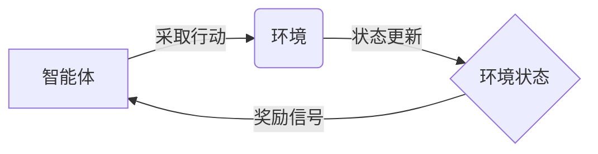

##  1. 背景介绍

### 1.1 什么是强化学习？

强化学习（Reinforcement Learning, RL）是机器学习的一个重要分支，它关注的是智能体（Agent）如何在环境中通过与环境交互来学习最优的行为策略。与其他机器学习方法不同，强化学习并不依赖于预先标注的数据，而是通过试错的方式来学习。

想象一下，你正在训练一只小狗学习坐下。你不会给它看成千上万张“坐下”的照片，而是会给它一些指令，比如“坐下”，如果它照做了，就给它一些奖励，比如一块饼干；如果它没有照做，就给它一些惩罚，比如不理它。久而久之，小狗就会明白“坐下”这个指令是什么意思，并且会为了得到奖励而执行这个指令。

强化学习的过程与训练小狗的过程非常相似。智能体就像小狗，它会根据环境的反馈来调整自己的行为，以获得最大的累积奖励。

### 1.2 强化学习的发展历史

强化学习的概念最早可以追溯到巴甫洛夫的条件反射实验。在实验中，巴甫洛夫发现，如果每次在给狗喂食之前都摇铃铛，那么狗就会将铃声与食物联系起来，即使没有食物，听到铃声也会流口水。

20世纪50年代，Richard Bellman提出了动态规划（Dynamic Programming, DP）算法，为解决序贯决策问题奠定了基础。动态规划是一种通过将复杂问题分解成更小的子问题来求解的方法，它可以用来解决很多强化学习问题。

20世纪80年代，Watkins提出了Q学习（Q-learning）算法，这是一种不需要知道环境模型的强化学习算法，它可以用来解决很多实际问题。

近年来，随着深度学习的兴起，深度强化学习（Deep Reinforcement Learning, DRL）成为了研究热点。深度强化学习将深度学习和强化学习结合起来，利用深度神经网络来逼近价值函数或策略函数，在很多复杂任务上取得了突破性进展。

### 1.3 强化学习的应用领域

强化学习已经在很多领域取得了成功，例如：

* **游戏**: AlphaGo、AlphaZero等人工智能程序在围棋、象棋等游戏上战胜了人类顶尖选手，这些程序都是基于强化学习开发的。
* **机器人控制**: 强化学习可以用来控制机器人的运动，例如让机器人学习如何抓取物体、如何行走等。
* **推荐系统**: 强化学习可以用来构建个性化推荐系统，例如根据用户的历史行为来推荐商品或内容。
* **金融交易**: 强化学习可以用来开发自动交易系统，例如根据市场行情来决定买卖股票。

## 2. 核心概念与联系

### 2.1 智能体与环境

强化学习系统主要由两个核心部分组成：**智能体（Agent）**和**环境（Environment）**。

* **智能体**是学习和决策的主体，它可以感知环境的状态，并根据环境的反馈来采取行动。
* **环境**是智能体所处的外部世界，它会根据智能体的行动做出相应的响应，并给出奖励或惩罚。

智能体和环境之间的交互是一个循环的过程，如下图所示：



### 2.2 状态、动作和奖励

* **状态（State）**是指环境在某一时刻的具体情况，它包含了所有能够影响环境未来演变的信息。例如，在围棋游戏中，状态就是指当前棋盘上的局势。
* **动作（Action）**是指智能体在某一状态下可以采取的操作。例如，在围棋游戏中，动作就是指在棋盘上的某个位置落子。
* **奖励（Reward）**是指环境在智能体采取某个动作后给出的反馈信号，它可以是正的，也可以是负的。例如，在围棋游戏中，如果智能体落子后赢得了比赛，就会得到正奖励；如果输掉了比赛，就会得到负奖励。

### 2.3 策略、价值函数和模型

* **策略（Policy）**是指智能体在每个状态下应该采取哪个动作的规则，它可以是一个函数，也可以是一个查找表。
* **价值函数（Value Function）**是指从某个状态开始，按照某个策略执行，所能获得的累积奖励的期望值。价值函数可以用来评估一个策略的好坏。
* **模型（Model）**是指对环境的模拟，它可以用来预测环境在未来会发生什么变化。

### 2.4 探索与利用

在强化学习中，智能体面临着一个重要的困境：**探索（Exploration）**和**利用（Exploitation）**。

* **探索**是指尝试不同的动作，以发现环境中可能存在的更好的策略。
* **利用**是指根据已有的经验，选择当前认为最好的动作，以最大化累积奖励。

探索和利用之间需要进行权衡。如果一味地探索，可能会错过很多利用已有经验的机会；如果一味地利用，可能会陷入局部最优解，无法找到全局最优策略。

## 3. 核心算法原理具体操作步骤

强化学习算法有很多种，这里介绍几种常见的算法：

### 3.1 Q学习（Q-learning）

Q学习是一种基于价值函数的强化学习算法，它不需要知道环境模型，可以直接从经验中学习。

**算法步骤：**

1. 初始化Q表，Q(s, a)表示在状态s下采取动作a的价值。
2. 循环遍历每一个episode：
    * 初始化状态s
    * 循环直到s为终止状态：
        * 根据当前策略选择动作a，例如使用ε-greedy策略
        * 执行动作a，得到奖励r和下一个状态s'
        * 更新Q(s, a)：
            $$Q(s, a) \leftarrow Q(s, a) + \alpha [r + \gamma \max_{a'} Q(s', a') - Q(s, a)]$$
        * 更新状态s = s'
3. 返回学习到的Q表

**参数说明：**

* $\alpha$是学习率，控制每次更新的幅度。
* $\gamma$是折扣因子，控制未来奖励的权重。
* $\max_{a'} Q(s', a')$表示在下一个状态s'下，所有可选动作中价值最大的动作的价值。

### 3.2 SARSA

SARSA算法与Q学习算法非常相似，也是一种基于价值函数的强化学习算法。

**算法步骤：**

1. 初始化Q表，Q(s, a)表示在状态s下采取动作a的价值。
2. 循环遍历每一个episode：
    * 初始化状态s
    * 根据当前策略选择动作a，例如使用ε-greedy策略
    * 循环直到s为终止状态：
        * 执行动作a，得到奖励r和下一个状态s'
        * 根据当前策略选择下一个动作a'
        * 更新Q(s, a)：
            $$Q(s, a) \leftarrow Q(s, a) + \alpha [r + \gamma Q(s', a') - Q(s, a)]$$
        * 更新状态s = s', a = a'
3. 返回学习到的Q表

**与Q学习算法的区别：**

SARSA算法在更新Q值时，使用的是下一个状态s'下**实际采取的动作a'**的价值，而Q学习算法使用的是下一个状态s'下**所有可选动作中价值最大的动作**的价值。

### 3.3 Deep Q Network (DQN)

DQN算法是深度强化学习的开山之作，它使用深度神经网络来逼近Q值函数。

**算法步骤：**

1. 初始化Q网络Q(s, a; θ)，θ是网络参数。
2. 初始化目标Q网络Q'(s, a; θ')，θ' = θ。
3. 循环遍历每一个episode：
    * 初始化状态s
    * 循环直到s为终止状态：
        * 根据当前策略选择动作a，例如使用ε-greedy策略
        * 执行动作a，得到奖励r和下一个状态s'
        * 将经验(s, a, r, s')存储到经验回放池中
        * 从经验回放池中随机抽取一批经验(s<sub>j</sub>, a<sub>j</sub>, r<sub>j</sub>, s'<sub>j</sub>)
        * 计算目标Q值：
            $$y<sub>j</sub> = r<sub>j</sub> + \gamma \max_{a'} Q'(s'<sub>j</sub>, a'; θ')$$
        * 使用梯度下降法更新Q网络参数θ，最小化损失函数：
            $$L = \frac{1}{N} \sum_{j=1}^{N} (y<sub>j</sub> - Q(s<sub>j</sub>, a<sub>j</sub>; θ))^2$$
        * 每隔一段时间，将Q网络参数θ复制到目标Q网络参数θ'中
4. 返回学习到的Q网络

**关键技术：**

* **经验回放（Experience Replay）**: 将经验存储起来，然后随机抽取进行训练，可以打破数据之间的相关性，提高训练效率。
* **目标网络（Target Network）**: 使用一个独立的目标网络来计算目标Q值，可以提高算法的稳定性。

## 4. 数学模型和公式详细讲解举例说明

### 4.1 马尔可夫决策过程 (Markov Decision Process, MDP)

马尔可夫决策过程是强化学习的数学基础，它可以用来描述强化学习问题。

一个马尔可夫决策过程可以由一个五元组(S, A, P, R, γ)来描述：

* **S**: 状态空间，表示所有可能的状态的集合。
* **A**: 动作空间，表示所有可能的动作的集合。
* **P**: 状态转移概率矩阵，P(s'|s, a)表示在状态s下采取动作a后转移到状态s'的概率。
* **R**: 奖励函数，R(s, a)表示在状态s下采取动作a后获得的奖励。
* **γ**: 折扣因子，控制未来奖励的权重。

### 4.2 贝尔曼方程 (Bellman Equation)

贝尔曼方程是强化学习中最重要的公式之一，它描述了价值函数和策略之间的关系。

**状态价值函数 (State Value Function):**

$$V^{\pi}(s) = E_{\pi}[G_t | S_t = s]$$

其中：

* $V^{\pi}(s)$表示在状态s下，按照策略π执行所能获得的累积奖励的期望值。
* $G_t$表示从时刻t开始的累积奖励，$G_t = R_{t+1} + \gamma R_{t+2} + ... + \gamma^{T-t-1} R_T$，T是终止时刻。
* $E_{\pi}[.]$表示在策略π下的期望。

**动作价值函数 (Action Value Function):**

$$Q^{\pi}(s, a) = E_{\pi}[G_t | S_t = s, A_t = a]$$

其中：

* $Q^{\pi}(s, a)$表示在状态s下采取动作a，然后按照策略π执行所能获得的累积奖励的期望值。

**贝尔曼方程：**

$$V^{\pi}(s) = \sum_{a \in A} \pi(a|s) \sum_{s' \in S} P(s'|s, a)[R(s, a) + \gamma V^{\pi}(s')]$$

$$Q^{\pi}(s, a) = \sum_{s' \in S} P(s'|s, a)[R(s, a) + \gamma \sum_{a' \in A} \pi(a'|s') Q^{\pi}(s', a')]$$

### 4.3 举例说明

假设有一个迷宫环境，如下图所示：

```
+---+---+---+---+
| S |   |   | G |
+---+---+---+---+
|   | X |   | X |
+---+---+---+---+
```

其中：

* S表示起点。
* G表示终点。
* X表示障碍物。

智能体可以采取的动作有：上、下、左、右。

奖励函数为：

* 到达终点G，获得奖励100。
* 撞到障碍物X，获得奖励-10。
* 其他情况，获得奖励0。

折扣因子γ=0.9。

**使用Q学习算法求解该问题：**

1. 初始化Q表，所有Q值初始化为0。
2. 循环遍历每一个episode：
    * 初始化状态s为起点S。
    * 循环直到s为终点G：
        * 根据当前策略选择动作a，例如使用ε-greedy策略。
        * 执行动作a，得到奖励r和下一个状态s'。
        * 更新Q(s, a)：
            $$Q(s, a) \leftarrow Q(s, a) + \alpha [r + \gamma \max_{a'} Q(s', a') - Q(s, a)]$$
        * 更新状态s = s'。
3. 返回学习到的Q表。

经过多次迭代后，Q表会收敛到一个最优策略，例如：

```
+---+---+---+---+
| 0 | 1 | 2 | 3 |
+---+---+---+---+
| 4 | X | 5 | X |
+---+---+---+---+

Q(0, 上) = 0
Q(0, 下) = 81
Q(0, 左) = 0
Q(0, 右) = 90

Q(1, 上) = 72.9
Q(1, 下) = 90
Q(1, 左) = 0
Q(1, 右) = 99

...
```

## 5. 项目实践：代码实例和详细解释说明

### 5.1 使用Q学习算法解决迷宫问题

```python
import numpy as np

# 定义环境
class Maze:
    def __init__(self):
        self.action_space = ['u', 'd', 'l', 'r']
        self.n_actions = len(self.action_space)
        self.n_states = 9
        self.state = 0

    def reset(self):
        self.state = 0
        return self.state

    def step(self, action):
        if action == 'u':
            self.state -= 3
        elif action == 'd':
            self.state += 3
        elif action == 'l':
            self.state -= 1
        elif action == 'r':
            self.state += 1

        if self.state == 8:
            reward = 100
            done = True
        elif self.state in [4, 7]:
            reward = -10
            done = False
        else:
            reward = 0
            done = False

        return self.state, reward, done

# 定义Q学习算法
class QLearning:
    def __init__(self, n_states, n_actions, lr=0.1, gamma=0.9, epsilon=0.1):
        self.n_states = n_states
        self.n_actions = n_actions
        self.lr = lr
        self.gamma = gamma
        self.epsilon = epsilon
        self.q_table = np.zeros((self.n_states, self.n_actions))

    def choose_action(self, state):
        if np.random.uniform() < self.epsilon:
            action = np.random.choice(self.n_actions)
        else:
            action = np.argmax(self.q_table[state, :])
        return action

    def learn(self, state, action, reward, next_state):
        q_predict = self.q_table[state, action]
        q_target = reward + self.gamma * np.max(self.q_table[next_state, :])
        self.q_table[state, action] += self.lr * (q_target - q_predict)

# 训练模型
def train():
    env = Maze()
    RL = QLearning(env.n_states, env.n_actions)

    for episode in range(1000):
        state = env.reset()
        while True:
            action = RL.choose_action(state)
            next_state, reward, done = env.step(env.action_space[action])
            RL.learn(state, action, reward, next_state)
            state = next_state
            if done:
                break

    return RL

# 测试模型
def test(RL):
    env = Maze()
    state = env.reset()
    while True:
        action = RL.choose_action(state)
        next_state, reward, done = env.step(env.action_space[action])
        state = next_state
        print(state)
        if done:
            break

# 训练并测试模型
RL = train()
test(RL)
```

### 5.2 代码解释

* **环境定义**: `Maze`类定义了迷宫环境，包括状态空间、动作空间、奖励函数等。
* **Q学习算法**: `QLearning`类定义了Q学习算法，包括Q表、动作选择策略、学习方法等。
* **训练**: `train`函数训练Q学习模型，并返回训练好的模型。
* **测试**: `test`函数测试训练好的模型，打印出智能体在迷宫中的行走路径。

## 6. 实际应用场景

### 6.1 游戏

* **AlphaGo**: AlphaGo是DeepMind开发的一款围棋人工智能程序，它使用深度强化学习算法，在2016年战胜了围棋世界冠军李世石。
* **OpenAI Five