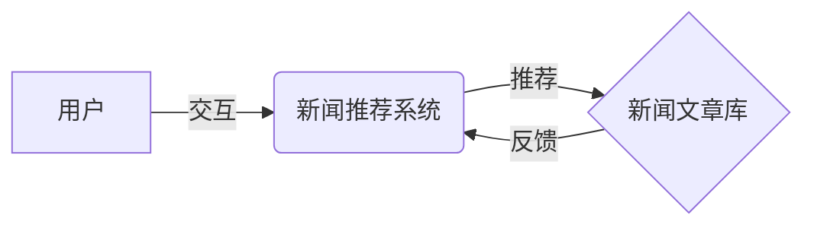

# 强化学习：在新闻推荐中的应用

作者：禅与计算机程序设计艺术

## 1. 背景介绍

### 1.1 新闻推荐的挑战

在信息爆炸的时代，人们每天都被海量的新闻资讯所包围。如何从海量信息中快速准确地筛选出用户感兴趣的内容，成为新闻推荐系统面临的巨大挑战。传统的新闻推荐算法，如基于内容的推荐、协同过滤推荐等，往往存在以下局限性：

* **冷启动问题:** 对于新用户或新文章，由于缺乏历史行为数据，难以进行准确推荐。
* **数据稀疏性问题:** 用户与文章之间的交互数据通常非常稀疏，导致推荐模型难以学习到用户兴趣的全面表示。
* **信息茧房效应:** 传统推荐算法容易过度依赖用户历史行为数据，导致推荐结果趋同，限制了用户对新内容的探索。

### 1.2 强化学习的优势

近年来，强化学习作为一种新兴的机器学习方法，在解决复杂决策问题方面展现出巨大潜力。相较于传统推荐算法，强化学习在新闻推荐领域具有以下优势：

* **能够处理动态环境:** 强化学习可以根据用户实时反馈动态调整推荐策略，从而更好地适应用户兴趣的变化。
* **能够解决延迟奖励问题:** 新闻推荐场景中，用户的反馈往往具有一定的延迟性，强化学习可以有效地处理这种延迟奖励问题。
* **能够探索用户潜在兴趣:** 强化学习可以通过试错的方式探索用户潜在兴趣，从而突破信息茧房的限制。

## 2. 核心概念与联系

### 2.1 强化学习的基本概念

强化学习是一种通过与环境交互学习最优策略的机器学习方法。它包含以下核心要素：

* **智能体 (Agent):**  执行动作并与环境交互的学习主体，例如推荐系统。
* **环境 (Environment):** 智能体所处的外部环境，例如用户的新闻阅读平台。
* **状态 (State):** 描述环境当前状况的信息，例如用户的历史浏览记录、当前时间等。
* **动作 (Action):** 智能体在当前状态下可以采取的操作，例如推荐某篇新闻文章。
* **奖励 (Reward):** 环境对智能体动作的反馈，例如用户点击、阅读时长等。
* **策略 (Policy):** 智能体根据当前状态选择动作的规则，例如根据用户历史行为和当前文章特征预测用户点击概率。

强化学习的目标是找到一个最优策略，使得智能体在与环境交互过程中获得最大的累积奖励。

### 2.2 新闻推荐中的强化学习框架

在新闻推荐场景中，可以将用户、新闻推荐系统和新闻文章库分别视为智能体、环境和状态空间。强化学习的目标是学习一个推荐策略，根据用户的历史行为和当前状态，从新闻文章库中选择最有可能被用户点击的文章进行推荐，从而最大化用户的长期累积奖励，例如点击率、阅读时长等。



## 3. 核心算法原理具体操作步骤

### 3.1 基于价值的强化学习算法

基于价值的强化学习算法主要包括Q-learning、SARSA等。这类算法通过学习状态-动作价值函数 (Q函数) 来评估每个状态下采取不同动作的长期价值，并根据Q函数选择最优动作。

以Q-learning为例，其核心更新公式如下：

$$ Q(s_t,a_t) \leftarrow Q(s_t,a_t) + \alpha [r_{t+1} + \gamma \max_{a} Q(s_{t+1}, a) - Q(s_t,a_t)] $$

其中：

* $Q(s_t,a_t)$ 表示在状态 $s_t$ 下采取动作 $a_t$ 的价值。
* $r_{t+1}$ 表示在状态 $s_t$ 下采取动作 $a_t$ 后获得的即时奖励。
* $s_{t+1}$ 表示在状态 $s_t$ 下采取动作 $a_t$ 后转移到的下一个状态。
* $\alpha$ 为学习率，控制算法更新速度。
* $\gamma$ 为折扣因子，用于平衡当前奖励和未来奖励的重要性。

### 3.2 基于策略的强化学习算法

基于策略的强化学习算法直接学习参数化的策略函数，例如深度神经网络，并通过梯度下降等方法优化策略参数，使得智能体在与环境交互过程中获得的累积奖励最大化。

常用的基于策略的强化学习算法包括 REINFORCE、A2C、PPO 等。

### 3.3 强化学习在新闻推荐中的应用步骤

将强化学习应用于新闻推荐，通常需要经历以下步骤：

1. **数据预处理:** 对用户历史行为数据、新闻文章内容等进行清洗、转换和特征提取。
2. **环境构建:** 构建模拟真实用户行为的仿真环境，或使用线上 A/B 测试平台进行实验。
3. **模型选择与训练:** 选择合适的强化学习算法，并使用历史数据或仿真环境进行模型训练。
4. **策略评估与优化:** 使用线上 A/B 测试平台评估推荐策略的效果，并根据评估结果对模型进行优化。
5. **模型部署与监控:** 将训练好的模型部署到线上环境，并实时监控模型的性能指标。

## 4. 数学模型和公式详细讲解举例说明

### 4.1 基于多臂老虎机的新闻推荐

多臂老虎机问题是强化学习中的经典问题，可以用于模拟新闻推荐场景中的探索与利用困境。

假设有 K 个新闻文章，每个文章的点击率未知。用户每次只能看到一个文章，并可以选择点击或不点击。目标是设计一个推荐策略，使得用户在有限的时间内获得最多的点击次数。

可以使用 $\epsilon$-greedy 算法来解决多臂老虎机问题。该算法以 $\epsilon$ 的概率随机选择一个文章进行推荐，以 $1-\epsilon$ 的概率选择当前点击率最高的文章进行推荐。

### 4.2 基于深度强化学习的新闻推荐

深度强化学习将深度学习与强化学习相结合，可以处理更加复杂的新闻推荐场景。

例如，可以使用深度 Q 网络 (DQN) 来学习用户状态和文章特征到点击概率的映射关系。DQN 使用深度神经网络来逼近 Q 函数，并使用经验回放机制来提高样本利用率。

## 5. 项目实践：代码实例和详细解释说明

### 5.1 基于Python和TensorFlow的DQN新闻推荐

以下是一个使用 Python 和 TensorFlow 实现 DQN 新闻推荐的简单示例：

```python
import tensorflow as tf

# 定义 DQN 网络结构
class DQN(tf.keras.Model):
    def __init__(self, state_size, action_size):
        super(DQN, self).__init__()
        self.fc1 = tf.keras.layers.Dense(64, activation='relu')
        self.fc2 = tf.keras.layers.Dense(64, activation='relu')
        self.fc3 = tf.keras.layers.Dense(action_size)

    def call(self, state):
        x = self.fc1(state)
        x = self.fc2(x)
        return self.fc3(x)

# 定义经验回放缓冲区
class ReplayBuffer:
    def __init__(self, capacity):
        self.buffer = collections.deque(maxlen=capacity)

    def push(self, experience):
        self.buffer.append(experience)

    def sample(self, batch_size):
        # ...

# 定义 DQN 智能体
class DQNAgent:
    def __init__(self, state_size, action_size):
        self.state_size = state_size
        self.action_size = action_size
        self.memory = ReplayBuffer(10000)
        self.gamma = 0.95
        self.epsilon = 1.0
        self.epsilon_min = 0.01
        self.epsilon_decay = 0.995
        self.learning_rate = 0.001
        self.model = DQN(state_size, action_size)
        self.target_model = DQN(state_size, action_size)
        self.optimizer = tf.keras.optimizers.Adam(learning_rate=self.learning_rate)

    def act(self, state):
        # ...

    def learn(self):
        # ...

# 初始化 DQN 智能体
agent = DQNAgent(state_size, action_size)

# 训练 DQN 模型
for episode in range(num_episodes):
    # ...

# 测试 DQN 模型
# ...
```

### 5.2 代码解释

* **DQN 网络结构:** 使用三层全连接神经网络来逼近 Q 函数。
* **经验回放缓冲区:** 存储智能体与环境交互的经验数据，用于训练 DQN 模型。
* **DQN 智能体:** 实现 DQN 算法的核心逻辑，包括动作选择、经验存储、模型训练等。
* **训练过程:** 在每个 episode 中，智能体与环境交互，并将交互数据存储到经验回放缓冲区中。然后，从缓冲区中随机抽取一批数据，用于训练 DQN 模型。
* **测试过程:** 使用训练好的 DQN 模型对新的用户状态进行预测，并推荐点击概率最高的文章。

## 6. 实际应用场景

### 6.1 新闻客户端

强化学习可以应用于各种新闻客户端，例如今日头条、腾讯新闻等，为用户提供更加个性化、精准的新闻推荐服务。

### 6.2 电商平台

强化学习可以应用于电商平台的商品推荐，根据用户的浏览、收藏、购买等行为，推荐用户最可能购买的商品。

### 6.3 社交媒体

强化学习可以应用于社交媒体的内容推荐，根据用户的关注、点赞、评论等行为，推荐用户最感兴趣的内容。

## 7. 总结：未来发展趋势与挑战

### 7.1 未来发展趋势

* **更加精准的个性化推荐:** 随着强化学习算法的不断发展，以及用户数据的不断积累，未来新闻推荐将会更加精准和个性化。
* **多模态融合:** 未来新闻推荐将会融合文本、图片、视频等多模态信息，为用户提供更加丰富和生动的阅读体验。
* **跨平台推荐:** 未来新闻推荐将会突破平台限制，实现跨平台的用户兴趣理解和内容推荐。

### 7.2 面临的挑战

* **数据隐私保护:** 强化学习需要收集大量的用户行为数据，如何保护用户隐私是一个重要的挑战。
* **模型可解释性:** 强化学习模型通常是一个黑盒，如何解释模型的推荐结果是一个挑战。
* **冷启动问题:** 对于新用户或新文章，强化学习仍然面临冷启动问题的挑战。

## 8. 附录：常见问题与解答

### 8.1 强化学习与监督学习的区别是什么？

监督学习是从带有标签的数据中学习，而强化学习是从与环境的交互中学习。

### 8.2 强化学习有哪些应用领域？

强化学习的应用领域非常广泛，包括游戏、机器人、自动驾驶、金融等。

### 8.3 如何评估强化学习模型的性能？

常用的强化学习模型评估指标包括累积奖励、平均奖励、点击率、转化率等。
