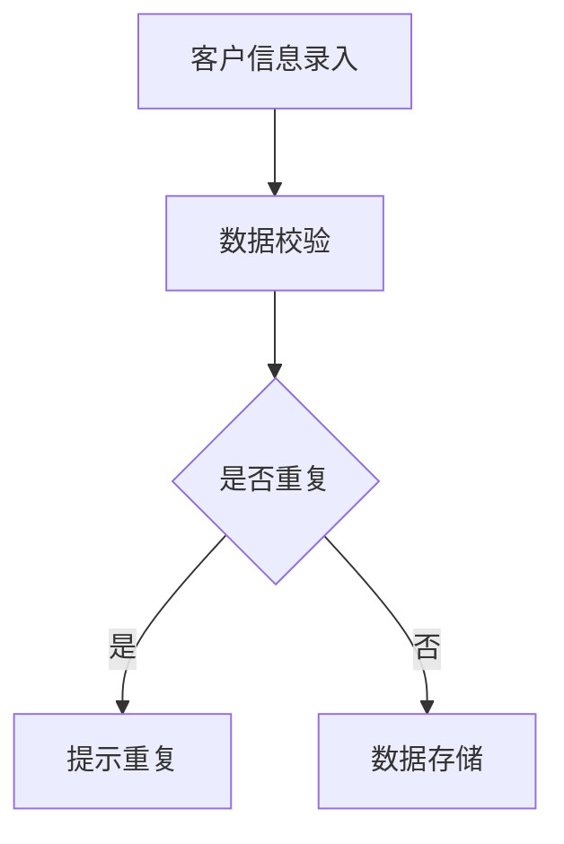
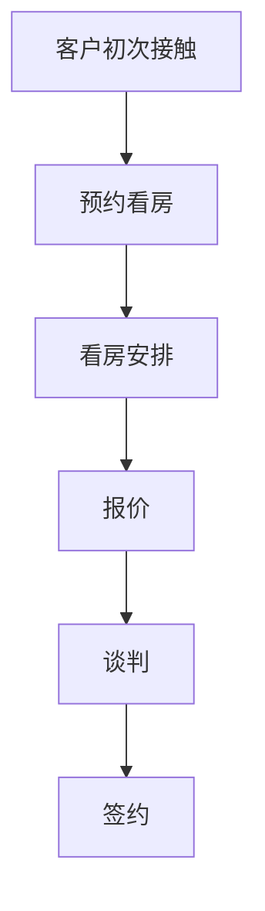
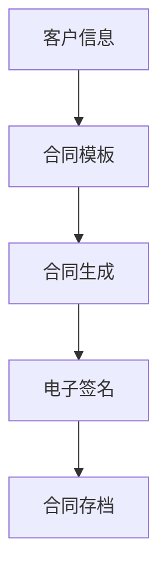
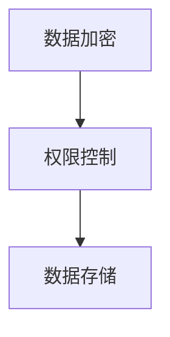

# 房地产销售(售楼)管理系统详细设计与具体代码实现

作者：禅与计算机程序设计艺术

## 1. 背景介绍

### 1.1 行业现状与挑战

房地产行业是一个资本密集型和人力密集型的行业，涉及到大量的销售、客户管理和合同管理等复杂的业务流程。随着科技的发展，数字化转型成为了房地产行业的必然选择。售楼管理系统的出现，旨在提高销售效率、优化客户管理流程，并提供更好的用户体验。然而，开发一个高效、可靠的售楼管理系统并非易事，需要深入理解业务逻辑和技术实现。

### 1.2 项目目标

本项目的目标是设计并实现一个高效的房地产销售管理系统，涵盖从客户信息管理、销售流程跟踪到合同管理的完整功能。系统应具备以下特点：
- 高效的数据处理能力
- 友好的用户界面
- 安全的数据存储和传输
- 灵活的扩展性和可维护性

## 2. 核心概念与联系

### 2.1 客户管理

客户管理是售楼管理系统的核心模块之一，主要包括客户信息的录入、更新和查询。客户信息包括客户的基本信息（如姓名、联系方式）、购房意向、跟进记录等。

### 2.2 销售流程管理

销售流程管理模块负责跟踪客户从初次接触到最终签约的全过程。包括客户预约、看房安排、报价、谈判、签约等环节。

### 2.3 合同管理

合同管理模块负责生成、存储和管理销售合同。合同的生成需要根据客户的购房信息和销售政策进行动态生成，并支持电子签名和存档。

### 2.4 数据安全与权限管理

数据安全与权限管理是系统设计中的重要考量，确保客户信息和合同数据的安全存储和传输，并通过权限控制防止未经授权的访问。

## 3. 核心算法原理具体操作步骤

### 3.1 客户信息录入与更新

客户信息录入与更新是系统的基础功能，主要包括数据校验、重复检测和数据存储。



### 3.2 销售流程跟踪

销售流程跟踪需要设计状态机来管理客户的不同状态，并根据状态变化触发相应的业务逻辑。



### 3.3 合同生成与管理

合同生成需要动态填充合同模板，并支持电子签名和存档。



### 3.4 数据安全与权限控制

数据安全与权限控制通过加密存储和基于角色的权限控制实现。



## 4. 数学模型和公式详细讲解举例说明

### 4.1 数据校验模型

数据校验是确保系统数据质量的重要环节。我们可以使用正则表达式和数据完整性约束来实现数据校验。

#### 4.1.1 正则表达式

假设我们需要校验客户的邮箱地址，可以使用如下的正则表达式：

$$
\text{EmailPattern} = \text{^[a-zA-Z0-9._%+-]+@[a-zA-Z0-9.-]+\.[a-zA-Z]{2,4}$}
$$

### 4.2 状态机模型

销售流程的管理可以使用有限状态机（FSM）来描述客户在不同阶段的状态转换。

#### 4.2.1 状态转移矩阵

假设系统中有以下状态：初次接触（S1）、预约看房（S2）、看房安排（S3）、报价（S4）、谈判（S5）、签约（S6），则状态转移矩阵可以表示为：

$$
\mathbf{T} = \begin{pmatrix}
0 & 1 & 0 & 0 & 0 & 0 \\
0 & 0 & 1 & 0 & 0 & 0 \\
0 & 0 & 0 & 1 & 0 & 0 \\
0 & 0 & 0 & 0 & 1 & 0 \\
0 & 0 & 0 & 0 & 0 & 1 \\
0 & 0 & 0 & 0 & 0 & 0 \\
\end{pmatrix}
$$

## 5. 项目实践：代码实例和详细解释说明

### 5.1 客户信息管理模块

以下是客户信息管理模块的代码示例：

```python
# 客户信息管理模块
class Customer:
    def __init__(self, name, contact, intention):
        self.name = name
        self.contact = contact
        self.intention = intention
        self.follow_ups = []

    def add_follow_up(self, follow_up):
        self.follow_ups.append(follow_up)

    def update_contact(self, new_contact):
        self.contact = new_contact

    def __str__(self):
        return f"Customer(name={self.name}, contact={self.contact}, intention={self.intention})"

# 数据校验
import re

def validate_email(email):
    pattern = r'^[a-zA-Z0-9._%+-]+@[a-zA-Z0-9.-]+\.[a-zA-Z]{2,4}$'
    return re.match(pattern, email) is not None

# 示例
customer = Customer("张三", "zhangsan@example.com", "购买三居室")
print(customer)
```

### 5.2 销售流程管理模块

以下是销售流程管理模块的代码示例：

```python
# 销售流程管理模块
class SalesProcess:
    def __init__(self, customer):
        self.customer = customer
        self.state = "初次接触"

    def next_state(self):
        state_transitions = {
            "初次接触": "预约看房",
            "预约看房": "看房安排",
            "看房安排": "报价",
            "报价": "谈判",
            "谈判": "签约"
        }
        if self.state in state_transitions:
            self.state = state_transitions[self.state]
        else:
            raise Exception("无效的状态转换")

    def __str__(self):
        return f"SalesProcess(customer={self.customer.name}, state={self.state})"

# 示例
sales_process = SalesProcess(customer)
print(sales_process)
sales_process.next_state()
print(sales_process)
```

### 5.3 合同管理模块

以下是合同管理模块的代码示例：

```python
# 合同管理模块
class Contract:
    def __init__(self, customer, template):
        self.customer = customer
        self.template = template
        self.contract = self.generate_contract()

    def generate_contract(self):
        return self.template.format(customer=self.customer.name, contact=self.customer.contact)

    def sign_contract(self):
        self.signed = True

    def __str__(self):
        return f"Contract(customer={self.customer.name}, signed={self.signed})"

# 示例
template = "合同模板: 客户 {customer}, 联系方式 {contact}"
contract = Contract(customer, template)
print(contract)
contract.sign_contract()
print(contract)
```

## 6. 实际应用场景

### 6.1 房地产公司销售管理

房地产公司可以使用该系统进行客户信息管理、销售流程跟踪和合同管理，提高销售效率和客户满意度。

### 6.2 中介公司业务管理

中介公司可以使用该系统管理房源信息、客户信息和交易流程，实现业务的数字化和智能化管理。

### 6.3 物业管理公司客户服务

物业管理公司可以使用该系统管理业主信息、服务请求和合同，提升服务质量和管理效率。

## 7. 工具和资源推荐

### 7.1 开发工具

- **IDE**: PyCharm、Visual Studio Code
- **版本控制**: Git
- **项目管理**: Jira、Trello

### 7.2 技术栈

- **前端**: React、Vue.js
- **后端**: Django、Flask
- **数据库**: PostgreSQL、MySQL
- **部署**: Docker、Kubernetes

### 7.3 学习资源

- **书籍**: 《Python编程：从入门到实践》、《Flask Web开发：基于Python的Web应用开发实战》
- **在线课程**: Coursera、Ud