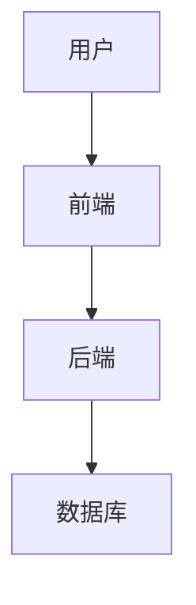

# 手机销售管理系统详细设计与具体代码实现

作者：禅与计算机程序设计艺术

## 1.背景介绍

### 1.1 手机销售市场的现状

近年来，手机市场的竞争日趋激烈，手机销售管理系统作为企业信息化管理的重要组成部分，显得尤为重要。一个高效的销售管理系统可以帮助企业实现销售数据的实时监控、库存管理、客户关系管理等功能，从而提升企业的运营效率和市场竞争力。

### 1.2 设计手机销售管理系统的必要性

随着智能手机的普及，手机销售渠道也变得多样化，线上线下的融合使得销售管理变得更加复杂。传统的手工管理方式已经无法满足现代企业的需求，因此设计一个高效、智能的手机销售管理系统变得尤为重要。该系统不仅可以提高销售效率，还能为管理层提供决策支持。

### 1.3 文章的目的和结构

本文旨在详细介绍一个手机销售管理系统的设计与实现过程。文章将从系统的核心概念、算法原理、数学模型、项目实践、实际应用场景、工具和资源推荐等多个方面进行详细阐述，以期为读者提供一个全面的技术指导。

## 2.核心概念与联系

### 2.1 系统架构概述

手机销售管理系统的架构通常包括前端、后端和数据库三部分。前端负责用户界面的展示和交互，后端负责业务逻辑的处理，数据库负责数据的存储和管理。系统的整体架构如下图所示：



### 2.2 主要功能模块

系统主要包括以下功能模块：

- **用户管理模块**：负责用户的注册、登录、权限管理等功能。
- **商品管理模块**：负责商品的添加、修改、删除、查询等功能。
- **订单管理模块**：负责订单的生成、修改、删除、查询等功能。
- **库存管理模块**：负责库存的实时监控、预警等功能。
- **报表管理模块**：负责生成各种销售报表，为管理层提供决策支持。

### 2.3 功能模块之间的联系

各功能模块之间通过接口进行通信，具体联系如下图所示：


## 3.核心算法原理具体操作步骤

### 3.1 用户管理模块

用户管理模块主要包括用户注册、登录、权限管理等功能。其核心算法如下：

1. **用户注册**：用户提交注册信息，系统验证信息的有效性，成功后将用户信息存储到数据库。
2. **用户登录**：用户提交登录信息，系统验证用户名和密码的正确性，成功后生成会话信息。
3. **权限管理**：根据用户的角色分配不同的权限，确保系统的安全性。

### 3.2 商品管理模块

商品管理模块主要包括商品的添加、修改、删除、查询等功能。其核心算法如下：

1. **商品添加**：用户提交商品信息，系统验证信息的有效性，成功后将商品信息存储到数据库。
2. **商品修改**：用户提交修改后的商品信息，系统验证信息的有效性，成功后更新数据库中的商品信息。
3. **商品删除**：用户提交删除请求，系统验证请求的合法性，成功后从数据库中删除商品信息。
4. **商品查询**：用户提交查询请求，系统从数据库中检索相关商品信息并返回给用户。

### 3.3 订单管理模块

订单管理模块主要包括订单的生成、修改、删除、查询等功能。其核心算法如下：

1. **订单生成**：用户提交订单信息，系统验证信息的有效性，成功后将订单信息存储到数据库。
2. **订单修改**：用户提交修改后的订单信息，系统验证信息的有效性，成功后更新数据库中的订单信息。
3. **订单删除**：用户提交删除请求，系统验证请求的合法性，成功后从数据库中删除订单信息。
4. **订单查询**：用户提交查询请求，系统从数据库中检索相关订单信息并返回给用户。

### 3.4 库存管理模块

库存管理模块主要包括库存的实时监控、预警等功能。其核心算法如下：

1. **库存监控**：系统实时监控库存变化，确保库存信息的准确性。
2. **库存预警**：当库存低于预设值时，系统自动发出预警通知，提醒用户补货。

### 3.5 报表管理模块

报表管理模块主要包括生成各种销售报表，为管理层提供决策支持。其核心算法如下：

1. **数据汇总**：系统从数据库中提取相关数据，进行汇总和统计。
2. **报表生成**：根据汇总数据生成各种销售报表，供管理层查看和分析。

## 4.数学模型和公式详细讲解举例说明

### 4.1 库存管理中的数学模型

在库存管理中，我们常用的一个数学模型是经济订货量（EOQ）模型。EOQ模型用于确定最佳的订货量，使得总成本最小。其公式如下：

$$
EOQ = \sqrt{\frac{2DS}{H}}
$$

其中：
- $D$ 是年需求量
- $S$ 是每次订货的固定成本
- $H$ 是单位库存的年持有成本

### 4.2 销售预测中的数学模型

在销售预测中，我们常用的一个数学模型是线性回归模型。线性回归模型用于预测未来的销售量，其公式如下：

$$
y = \beta_0 + \beta_1x
$$

其中：
- $y$ 是预测的销售量
- $\beta_0$ 是截距
- $\beta_1$ 是斜率
- $x$ 是自变量（例如时间）

### 4.3 实例说明

假设某手机销售公司年需求量为10000台，每次订货的固定成本为50元，单位库存的年持有成本为2元。根据EOQ模型，我们可以计算出最佳的订货量：

$$
EOQ = \sqrt{\frac{2 \times 10000 \times 50}{2}} = \sqrt{500000} \approx 707
$$

这意味着，每次订货707台手机是最经济的选择。

## 5.项目实践：代码实例和详细解释说明

### 5.1 系统架构设计

在项目实践中，我们首先需要设计系统的整体架构。本文采用前后端分离的架构，前端使用Vue.js，后端使用Spring Boot，数据库使用MySQL。

### 5.2 前端代码实例

以下是一个简单的Vue.js组件，用于展示商品列表：

```javascript
<template>
  <div>
    <h1>商品列表</h1>
    <ul>
      <li v-for="product in products" :key="product.id">
        {{ product.name }} - {{ product.price }}元
      </li>
    </ul>
  </div>
</template>

<script>
export default {
  data() {
    return {
      products: []
    };
  },
  created() {
    this.fetchProducts();
  },
  methods: {
    fetchProducts() {
      fetch('http://localhost:8080/api/products')
        .then(response => response.json())
        .then(data => {
          this.products = data;
        });
    }
  }
};
</script>
```

### 5.3 后端代码实例

以下是一个简单的Spring Boot控制器，用于处理商品相关的请求：

```java
@RestController
@RequestMapping("/api/products")
public class ProductController {

    @Autowired
    private ProductService productService;

    @GetMapping
    public List<Product> getAllProducts() {
        return productService.getAllProducts();
    }

    @PostMapping
    public Product addProduct(@RequestBody Product product) {
        return productService.addProduct(product);
    }

    @PutMapping("/{id}")
    public Product updateProduct(@PathVariable Long id, @RequestBody Product product) {
        return productService.updateProduct(id, product);
    }

    @DeleteMapping("/{id}")
    public void deleteProduct(@PathVariable Long id) {
        productService.deleteProduct(id);
    }
}
```

### 5.4 数据库设计

以下是商品表的设计：

```sql
CREATE TABLE product (
    id BIGINT AUTO_INCREMENT PRIMARY KEY,
    name VARCHAR(255) NOT NULL,
    price DECIMAL(10, 2) NOT NULL,
    stock INT NOT NULL
);
```

## 6.实际应用场景

### 6.1 线上销售

在电子商务平台上，手机销售管理系统可以实现商品的在线展示、订单的在线生成和支付、库存的实时更新等功能，提高销售效率。

### 6.2 线