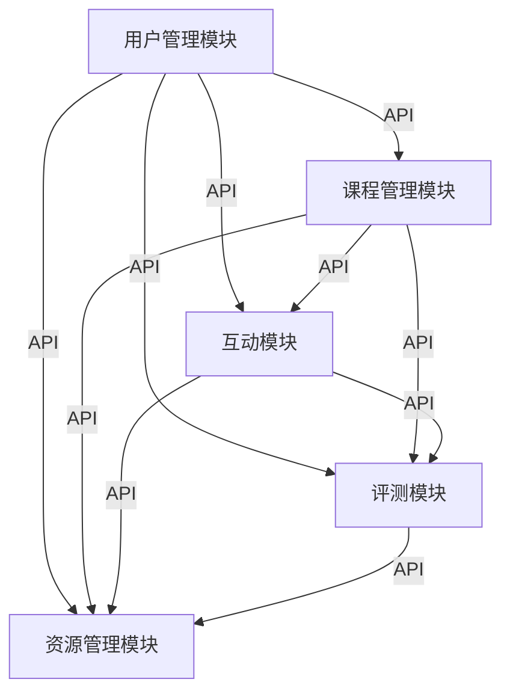

# 教学互动系统详细设计与具体代码实现

作者：禅与计算机程序设计艺术

## 1. 背景介绍

### 1.1 教学互动系统的定义

教学互动系统是一种通过互联网技术实现师生互动、资源共享、在线评测等功能的综合性平台。它不仅能够支持传统的课堂教学，还可以实现远程教育、混合式教学等多种教学模式。

### 1.2 现有教学互动系统的不足

尽管市场上已有多种教学互动系统，但大多数系统存在以下不足：

- 功能单一，难以满足不同教学模式的需求。
- 用户体验差，操作复杂，学习成本高。
- 数据孤岛现象严重，难以实现数据的互通和共享。

### 1.3 本文的目标

本文旨在详细介绍一个功能全面、用户体验友好、数据互通性强的教学互动系统的设计与实现。通过本文，读者将了解该系统的核心概念、算法原理、数学模型、实际应用场景、工具和资源推荐，以及未来发展趋势和挑战。

## 2. 核心概念与联系

### 2.1 教学互动系统的基本架构

教学互动系统通常由以下几个核心模块组成：

- **用户管理模块**：实现用户的注册、登录、权限管理等功能。
- **课程管理模块**：支持课程的创建、编辑、删除、查询等操作。
- **互动模块**：提供师生互动的功能，如在线讨论、实时问答、作业提交等。
- **评测模块**：实现在线测试、自动评分、成绩查询等功能。
- **资源管理模块**：支持教学资源的上传、下载、共享等操作。

### 2.2 各模块之间的联系

各模块之间通过API进行通信，数据通过数据库进行存储和管理。以下是各模块之间的联系图：



## 3. 核心算法原理具体操作步骤

### 3.1 用户管理模块

用户管理模块的核心算法包括用户注册、登录、权限管理等。以下是用户注册的具体操作步骤：

1. 用户填写注册信息（用户名、密码、邮箱等）。
2. 系统验证用户填写的信息是否合法。
3. 系统生成唯一的用户ID，并将用户信息存储到数据库中。
4. 系统向用户发送确认邮件，用户点击邮件中的链接完成注册。

### 3.2 课程管理模块

课程管理模块的核心算法包括课程的创建、编辑、删除、查询等。以下是课程创建的具体操作步骤：

1. 教师填写课程信息（课程名称、课程描述、课程封面等）。
2. 系统验证课程信息是否合法。
3. 系统生成唯一的课程ID，并将课程信息存储到数据库中。
4. 教师可以在课程中添加章节、课件、作业等内容。

### 3.3 互动模块

互动模块的核心算法包括在线讨论、实时问答、作业提交等。以下是在线讨论的具体操作步骤：

1. 学生在课程讨论区发布讨论主题。
2. 系统将讨论主题存储到数据库中，并通知所有课程成员。
3. 其他学生和教师可以回复讨论主题，系统将回复存储到数据库中。
4. 系统实时更新讨论区，显示最新的讨论内容。

### 3.4 评测模块

评测模块的核心算法包括在线测试、自动评分、成绩查询等。以下是在线测试的具体操作步骤：

1. 教师创建测试题目，设置题型、分值、时间等信息。
2. 学生在规定时间内完成测试，系统将学生的答案存储到数据库中。
3. 系统根据预设的评分规则自动评分，并将成绩存储到数据库中。
4. 学生可以在成绩查询页面查看自己的测试成绩。

### 3.5 资源管理模块

资源管理模块的核心算法包括教学资源的上传、下载、共享等。以下是资源上传的具体操作步骤：

1. 教师在课程资源页面上传教学资源（课件、视频、文档等）。
2. 系统验证资源文件的格式和大小是否合法。
3. 系统将资源文件存储到服务器，并生成唯一的资源ID。
4. 教师可以在课程中引用上传的资源，学生可以下载和查看资源。

## 4. 数学模型和公式详细讲解举例说明

### 4.1 用户行为分析模型

为了提升用户体验，我们需要对用户的行为进行分析。常用的用户行为分析模型有马尔科夫链模型。

假设用户在系统中的行为状态为 $S = \{s_1, s_2, \ldots, s_n\}$，每个状态表示一种行为，如登录、浏览课程、提交作业等。用户在不同状态之间的转移概率为 $P = \{p_{ij}\}$，其中 $p_{ij}$ 表示用户从状态 $s_i$ 转移到状态 $s_j$ 的概率。

马尔科夫链模型的转移矩阵为：

$$
P = \begin{pmatrix}
p_{11} & p_{12} & \cdots & p_{1n} \\
p_{21} & p_{22} & \cdots & p_{2n} \\
\vdots & \vdots & \ddots & \vdots \\
p_{n1} & p_{n2} & \cdots & p_{nn}
\end{pmatrix}
$$

通过分析转移矩阵，可以预测用户的行为轨迹，进而优化系统设计，提高用户体验。

### 4.2 评测评分模型

评测模块中的评分模型通常采用加权评分模型。假设测试包含 $n$ 道题目，每道题目的分值为 $w_i$，学生的得分为 $s_i$，则总得分为：

$$
S = \sum_{i=1}^n w_i \cdot s_i
$$

其中，$w_i$ 为题目 $i$ 的权重，$s_i$ 为学生在题目 $i$ 上的得分。

### 4.3 数据库设计模型

数据库设计是教学互动系统的重要组成部分。以下是用户管理模块的数据库设计模型：

```sql
CREATE TABLE users (
    user_id INT PRIMARY KEY AUTO_INCREMENT,
    username VARCHAR(50) NOT NULL,
    password VARCHAR(50) NOT NULL,
    email VARCHAR(50) NOT NULL,
    role ENUM('student', 'teacher', 'admin') NOT NULL,
    created_at TIMESTAMP DEFAULT CURRENT_TIMESTAMP
);
```

## 5. 项目实践：代码实例和详细解释说明

### 5.1 用户管理模块代码实例

以下是用户注册功能的代码实现：

```python
from flask import Flask, request, jsonify
from werkzeug.security import generate_password_hash
import sqlite3

app = Flask(__name__)

def create_user(username, password, email):
    conn = sqlite3.connect('database.db')
    cursor = conn.cursor()
    hashed_password = generate_password_hash(password)
    cursor.execute('''
        INSERT INTO users (username, password, email) VALUES (?, ?, ?)
    ''', (username, hashed_password, email))
    conn.commit()
    conn.close()

@app.route('/register', methods=['POST'])
def register():
    data = request.get_json()
    username = data['username']
    password = data['password']
    email = data['email']
    create_user(username, password, email)
    return jsonify({'message': 'User registered successfully!'})

if __name__ == '__main__':
    app.run(debug=True)
```

### 5.2 课程管理模块代码实例

以下是课程创建功能的代码实现：

```python
from flask import Flask, request, jsonify
import sqlite3

app = Flask(__name__)

def create_course(course_name, course_description, course_cover):
    conn = sqlite3.connect('database.db')
    cursor = conn.cursor()
    cursor.execute('''
        INSERT INTO courses (course_name, course_description, course_cover) VALUES (?, ?, ?)
    ''', (course_name, course_description, course_cover))
    conn.commit()
    conn.close()

@app.route('/create_course', methods=['POST'])
def create_course_endpoint():
    data = request.get_json()
    course_name = data['course_name']
    course_description = data['course_description']
    course_cover = data['course_cover']
    create_course(course_name, course_description, course_cover)
    return jsonify({'message': 'Course created successfully!'})

if __name__ == '__main__':
    app.run(debug=True)
```

### 5.3 互动模块代码实例

以下是在线讨论功能的代码实现：

```python
from flask import Flask, request, jsonify
import sqlite3

app = Flask(__name__)

def create_discussion(course_id, user_id, title, content):
    conn = sqlite3.connect('database.db')
   