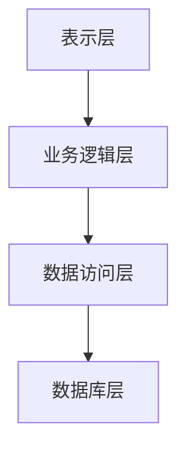
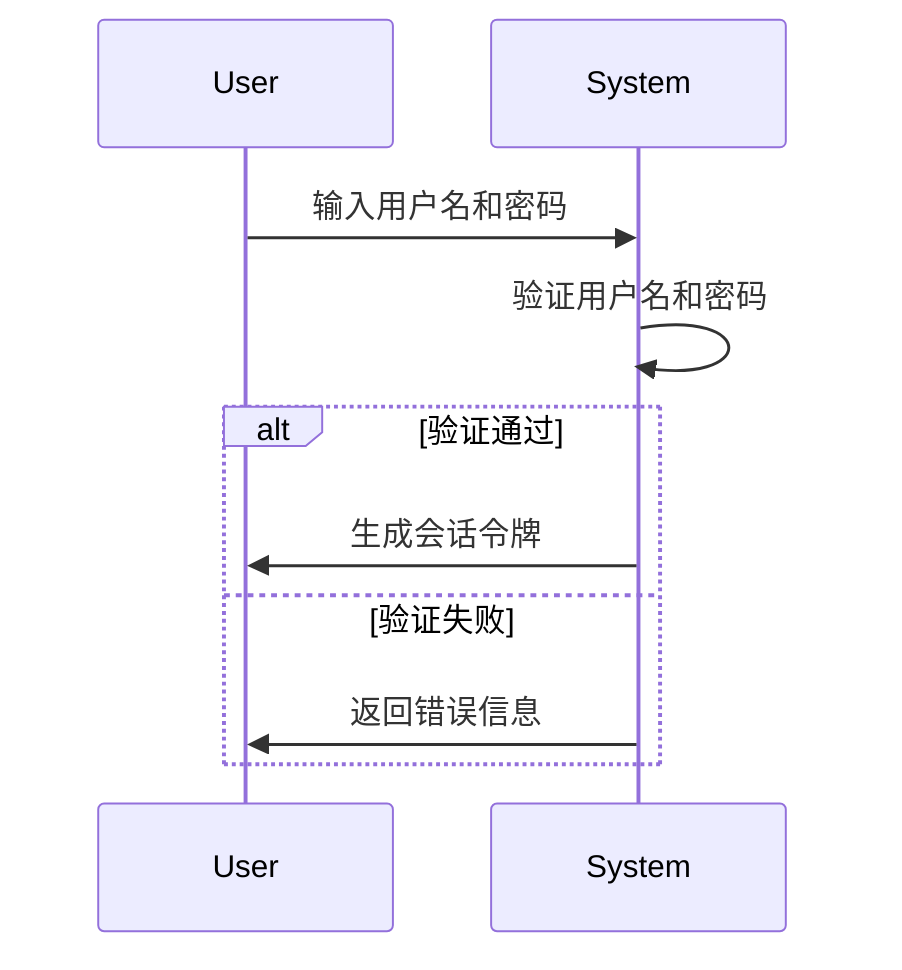
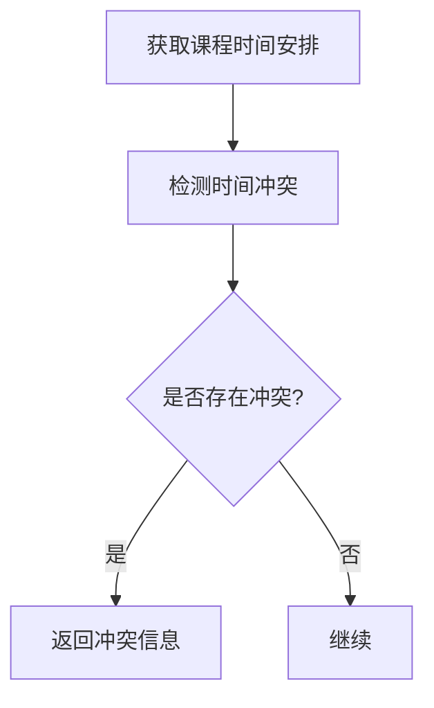

# 教学信息管理系统详细设计与具体代码实现

作者：禅与计算机程序设计艺术

## 1. 背景介绍

### 1.1 教学信息管理系统的必要性

在现代教育中，教学信息管理系统（TIMS）已成为不可或缺的工具。它不仅能提高教学效率，还能优化资源配置，提升学生的学习体验。随着信息技术的发展，传统的教学管理方式逐渐被电子化、信息化的系统所取代。TIMS的主要功能包括课程管理、学生信息管理、教师信息管理、成绩管理等。

### 1.2 现有系统的局限性

许多学校仍在使用传统的管理系统，这些系统通常存在以下问题：
- 数据分散，难以集中管理
- 手工操作多，容易出错
- 缺乏实时数据分析功能
- 用户体验差，操作复杂

### 1.3 本文目标

本文旨在详细介绍一个教学信息管理系统的设计与实现过程。通过具体的代码实例和详细的解释说明，帮助读者理解TIMS的核心概念、算法原理、数学模型和实际应用场景，并提供一些工具和资源推荐。

## 2. 核心概念与联系

### 2.1 系统架构

TIMS的系统架构通常采用分层设计，包括以下几个层次：

- **表示层**：负责用户界面的展示和用户交互
- **业务逻辑层**：处理业务逻辑和规则
- **数据访问层**：负责数据的存储和检索
- **数据库层**：存储系统的所有数据



### 2.2 核心模块

TIMS的核心模块包括：

- **用户管理**：管理学生、教师和管理员的基本信息和权限
- **课程管理**：管理课程的基本信息、课程安排和课程资源
- **成绩管理**：管理学生的成绩信息，生成成绩报告
- **资源管理**：管理教学资源，如教材、课件等

### 2.3 数据模型

TIMS的数据模型主要包括以下几个实体：

- **用户（User）**：包括学生、教师和管理员
- **课程（Course）**：包括课程基本信息、课程安排等
- **成绩（Grade）**：包括学生的成绩信息
- **资源（Resource）**：包括教材、课件等

## 3. 核心算法原理具体操作步骤

### 3.1 用户认证与授权

用户认证是系统安全的基础。常用的用户认证方法包括用户名密码认证、OAuth认证等。用户授权则是指用户在系统中的权限管理。

#### 3.1.1 用户认证流程

用户认证的基本流程如下：

1. 用户输入用户名和密码
2. 系统验证用户名和密码
3. 如果验证通过，生成会话令牌
4. 用户使用会话令牌访问系统资源



#### 3.1.2 用户授权机制

用户授权机制通常采用基于角色的访问控制（RBAC）模型。RBAC模型的基本思想是将权限赋予角色，再将角色分配给用户。

### 3.2 数据存储与检索

数据存储与检索是TIMS的核心功能之一。常用的数据库管理系统（DBMS）包括关系型数据库（如MySQL、PostgreSQL）和非关系型数据库（如MongoDB）。

#### 3.2.1 数据库设计

数据库设计的基本步骤如下：

1. 确定系统的主要实体和关系
2. 设计实体的属性和主键
3. 设计实体之间的关系
4. 创建数据库表

#### 3.2.2 数据检索

数据检索通常使用SQL语言。常用的SQL查询包括SELECT、INSERT、UPDATE、DELETE等。

### 3.3 成绩管理算法

成绩管理是TIMS的重要功能之一。成绩管理算法包括成绩录入、成绩计算、成绩查询等。

#### 3.3.1 成绩录入

成绩录入的基本流程如下：

1. 教师输入学生的成绩
2. 系统验证成绩的合法性
3. 将成绩保存到数据库

#### 3.3.2 成绩计算

成绩计算通常包括加权平均、总分计算等。假设某学生的成绩为 $G_1, G_2, \ldots, G_n$，对应的权重为 $w_1, w_2, \ldots, w_n$，则总成绩 $G$ 的计算公式为：

$$
G = \frac{\sum_{i=1}^{n} w_i G_i}{\sum_{i=1}^{n} w_i}
```

### 3.4 课程管理算法

课程管理包括课程安排、课程查询等。课程安排的基本算法包括课程冲突检测、课程时间安排等。

#### 3.4.1 课程冲突检测

课程冲突检测的基本算法如下：

1. 获取所有课程的时间安排
2. 检测是否存在时间冲突
3. 如果存在冲突，返回冲突信息



#### 3.4.2 课程时间安排

课程时间安排的基本算法如下：

1. 获取所有课程的时间需求
2. 根据时间需求和教室资源，安排课程时间

## 4. 数学模型和公式详细讲解举例说明

### 4.1 用户认证模型

用户认证模型通常采用基于哈希函数的密码存储和验证方法。假设用户的密码为 $P$，则存储在数据库中的哈希值 $H$ 的计算公式为：

$$
H = \text{hash}(P)
$$

验证用户密码的基本步骤如下：

1. 用户输入密码 $P'$
2. 计算输入密码的哈希值 $H' = \text{hash}(P')$
3. 比较 $H'$ 和存储的哈希值 $H$，如果相等，则验证通过

### 4.2 成绩计算模型

假设某学生的成绩为 $G_1, G_2, \ldots, G_n$，对应的权重为 $w_1, w_2, \ldots, w_n$，则总成绩 $G$ 的计算公式为：

$$
G = \frac{\sum_{i=1}^{n} w_i G_i}{\sum_{i=1}^{n} w_i}
$$

### 4.3 课程安排模型

课程安排问题可以抽象为一个优化问题。假设有 $n$ 门课程，每门课程的时间需求为 $T_i$，教室资源为 $R_j$，则课程安排的目标是找到一个最优的安排方案，使得所有课程的时间需求都能得到满足。

## 5. 项目实践：代码实例和详细解释说明

### 5.1 用户认证代码实例

以下是一个简单的用户认证代码实例，使用Python和Flask框架实现：

```python
from flask import Flask, request, jsonify
import hashlib

app = Flask(__name__)
users = {}

def hash_password(password):
    return hashlib.sha256(password.encode()).hexdigest()

@app.route('/register', methods=['POST'])
def register():
    username = request.json['username']
    password = request.json['password']
    if username in users:
        return jsonify({'message': 'User already exists'}), 400
    users[username] = hash_password(password)
    return jsonify({'message': 'User registered successfully'}), 201

@app.route('/login', methods=['POST'])
def login():
    username = request.json['username']
    password = request.json['password']
    if username not in users or users[username] != hash_password(password):
        return jsonify({'message': 'Invalid credentials'}), 401
    return jsonify({'message': 'Login successful'}), 200

if __name__ == '__main__':
    app.run(debug=True)
```

### 5.2 成绩管理代码实例

以下是一个简单的成绩管理代码实例，使用Python和SQLite数据库实现：

```python
import sqlite3

# 创建数据库连接
conn = sqlite3.connect('grades.db')
c = conn.cursor()

# 创建成绩表
c.execute('''CREATE TABLE IF NOT EXISTS grades
             (student_id INTEGER, course_id INTEGER, grade REAL)''')

# 插入成绩
def insert_grade(student_id, course_id, grade):
    c.execute("INSERT INTO grades (student_id, course_id, grade) VALUES (?, ?, ?)",
              (